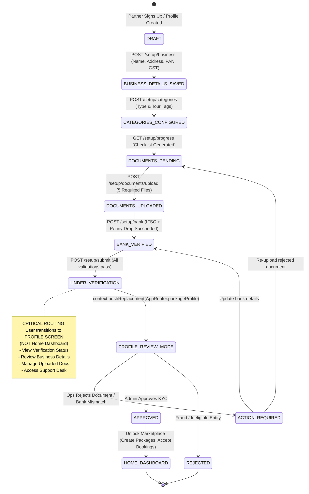
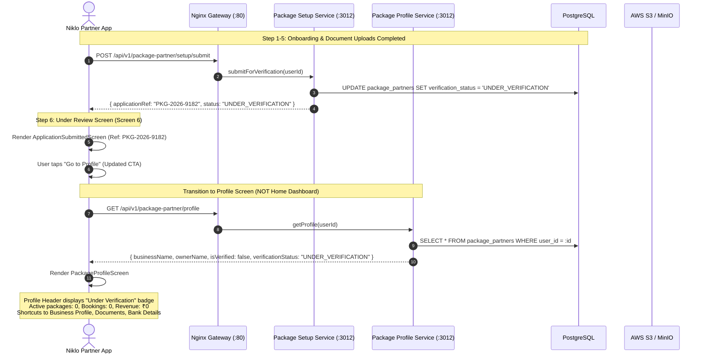

# 📦 Senior Architect & Product Design Production Audit: Package Partner — Full Lifecycle (v5.1)

**Document Version:** 5.1 (Full Audit: Onboarding → Business Profile → Documents → Bank → Home → Packages → Bookings → Earnings → Profile + OTP Feature)  
**Audited By:** Senior Principal System Architect & Lead Product Designer  
**Target Audience:** Backend Engineering Team, Mobile Tech Leads, DevOps & Security Engineers  
**Date:** September 2026 — Full Cross-System Verification  
**Audited Core Components:**
1. **Frontend Mobile App:** `niklo-partner/lib/features/package_partner/`
   - Setup & Onboarding: `setup/presentation/screens/` (6 screens), `setup/data/repositories/`, `setup/data/models/`
   - Home Dashboard: `home/presentation/screens/package_home.dart`, `home/data/repositories/`, `home/data/models/`
   - Profile & Account: `profile/presentation/screens/` (4 screens), `profile/data/repositories/`, `profile/data/models/`
   - Package Creation Wizard: `packages/presentation/screens/` (10 screens), `packages/data/repositories/package_catalog_repository.dart`, `packages/data/providers/package_creation_state.dart`
   - Bookings: `bookings/presentation/screens/` (4 screens), `bookings/data/repositories/package_bookings_repository.dart`
   - Earnings: `earnings/presentation/screens/` (2 screens), `earnings/data/repositories/package_earnings_repository.dart`
2. **Backend Microservice:** `niklo-main/package-service` (Port 3012)
   - Setup Module: `setup/setup.controller.ts`, `setup/setup.service.ts`
   - Home Dashboard Module: `home/home-dashboard.controller.ts`, `home/home-dashboard.service.ts`
   - Profile Module: `profile/profile.controller.ts`, `profile/profile.service.ts`
   - Package Catalog Module: `partner/packages/packages-partner.controller.ts`, `partner/packages/packages-partner.service.ts`
   - Bookings Module: `partner/bookings/bookings-partner.controller.ts`, `partner/bookings/bookings-partner.service.ts`
   - Earnings Module: `partner/earnings/earnings.controller.ts`, `partner/earnings/earnings.service.ts`
3. **Gateway & Routing:** `niklo-main/nginx.conf`, `api_client.dart`, `ApiHosts`, `app_router.dart`
4. **Data & Storage Layer:** TypeORM Entities (`PackagePartner`, `PackagePartnerDocument`, `PackagePartnerBank`, `PackagePartnerCategory`, `PackageBooking`, `PackageBookingTraveler`, `PackageBookingCancellation`, `PackageSettlement`, `PackageWithdrawalRequest`, `HolidayPackage`, `PackageDeparture`, `PackageGalleryMedia`, `PackageItineraryDay`, `PackageInclusion`, `SupportTicket`, `SetupOtp` [NEW])

---

## 0. Developer Prerequisite Checklist — Before Writing Any Code

> ⚠️ **Read this first.** Many of the 109 gaps in this report CANNOT be fixed without these external services and credentials being set up in the environment. Backend developers must ensure all items below are ready **before** starting Phase 1 sprint work.

### 0.1 Cloud Storage — AWS S3 (REQUIRED for 6+ Critical Fixes)

| Item | Status | Used By |
|---|---|---|
| `AWS_ACCESS_KEY_ID` | ❌ Add to `.env` | Document upload, Media upload, Voucher PDFs, Tax Invoices |
| `AWS_SECRET_ACCESS_KEY` | ❌ Add to `.env` | Same |
| `AWS_REGION` | ❌ Add to `.env` (e.g. `ap-south-1`) | Same |
| `S3_BUCKET_NAME` | ❌ Add to `.env` (e.g. `niklo-partner-uploads`) | Same |
| S3 Bucket CORS policy | ❌ Configure to allow upload from partner app | File upload from Flutter |
| S3 Bucket folders structure | ❌ Create: `/documents/`, `/media/`, `/vouchers/`, `/invoices/` | File organization |

```typescript
// Install: npm install @aws-sdk/client-s3 @aws-sdk/s3-request-presigner
import { S3Client, PutObjectCommand } from '@aws-sdk/client-s3';
const s3 = new S3Client({ region: process.env.AWS_REGION });
```

---

### 0.2 SMS Gateway (REQUIRED for Bank OTP + Phone OTP Fixes)

Choose **one** provider and set up credentials:

| Provider | Env Variables Needed | Notes |
|---|---|---|
| **MSG91** (Recommended for India) | `MSG91_API_KEY`, `MSG91_SENDER_ID`, `MSG91_OTP_TEMPLATE_ID` | Best for Indian numbers; DLT registration required |
| **Twilio** | `TWILIO_ACCOUNT_SID`, `TWILIO_AUTH_TOKEN`, `TWILIO_PHONE_NUMBER` | International; higher cost per SMS |

```
DLT Registration (mandatory for India SMS):
→ Register entity + OTP template with TRAI via MSG91/Twilio portal
→ Template: "Your Niklo verification OTP is {#var#}. Valid for 10 minutes."
```

---

### 0.3 Email Service (REQUIRED for Email OTP Fix)

| Provider | Env Variables Needed |
|---|---|
| **SendGrid** | `SENDGRID_API_KEY`, `SENDGRID_FROM_EMAIL` |
| **AWS SES** | Uses AWS credentials above + `SES_FROM_EMAIL` |

```
Email Template needed: "otp-verification"
Subject: "Niklo Partner Verification Code"
Body: "Your OTP is {otp}. Valid for 10 minutes. Do not share."
```

---

### 0.4 Payment Gateway (REQUIRED for Bank Penny-Drop + IFSC Lookup)

| Feature | Provider | Env Variables |
|---|---|---|
| **Penny-drop verification** | Razorpay or Cashfree | `RAZORPAY_KEY_ID`, `RAZORPAY_KEY_SECRET` |
| **IFSC code lookup** | Razorpay IFSC API (free) | No key required — `https://ifsc.razorpay.com/{IFSC}` |

```typescript
// Penny drop (Razorpay FundAccount Validation):
POST https://api.razorpay.com/v1/fund_accounts/validations
// IFSC lookup (free):
GET https://ifsc.razorpay.com/HDFC0000003
```

---

### 0.5 Encryption Keys (REQUIRED for Bank Account Security Fix)

| Item | Format | Notes |
|---|---|---|
| `BANK_ENCRYPTION_KEY` | 64-char hex (32 bytes) | Generate: `openssl rand -hex 32` |

```bash
# Generate and add to .env:
BANK_ENCRYPTION_KEY=<output of: openssl rand -hex 32>
```

> ⚠️ **CRITICAL:** This key must be stored in a secrets manager (AWS Secrets Manager / HashiCorp Vault) — **NOT** committed to `.env` files in the Git repo.

---

### 0.6 Database Migrations (REQUIRED before any new entity goes live)

New entities and columns that need TypeORM migrations:

```bash
# Run after adding new entities / columns:
npx typeorm migration:generate -n AddOtpVerificationSystem
npx typeorm migration:generate -n AddPhoneEmailVerifiedToPartner
npx typeorm migration:generate -n AddSettlementAndWithdrawalTables
npx typeorm migration:generate -n AddCompletedAtToBookings
```

New columns to add to `package_partners` table:
- `phone_verified BOOLEAN DEFAULT FALSE`
- `email_verified BOOLEAN DEFAULT FALSE`
- `avatar_url VARCHAR(500)`
- `trade_name VARCHAR(255)`
- `owner_name VARCHAR(255)`
- `gst_number VARCHAR(20)`
- `pan_number VARCHAR(20)`
- `push_notifications_enabled BOOLEAN DEFAULT TRUE`
- `email_digest_enabled BOOLEAN DEFAULT FALSE`
- `average_rating DECIMAL(3,2) DEFAULT 0`

New tables to create:
- `setup_otps` (Section 14.4.3)
- `package_settlements` (if not exists)
- `package_withdrawal_requests` (if not exists)

---

┌─────────────────────────────────────────────────────────────────────────────┐
│ PHASE 1 — Critical Security, Onboarding Unblockers & Data Integrity (Wk 1-2) │
│ Fix these immediately so partners can onboard without 100% API crashes     │
├─────────────────────────────────────────────────────────────────────────────┤
│ 1. GAP-PKG-01        Replace plaintext bank string with AES-256-GCM         │
│ 2. GAP-PKG-02/30     Integrate S3 multipart upload for documents & media   │
│ 3. GAP-PKG-03        Add `confirmAccountNumber` to BankDetailsRequest DTO   │
│ 4. GAP-PKG-04        Align bank field names (accountName, ifscCode)         │
│ 5. GAP-PKG-05        Fix `saveCategories` payload key (`tourCategories`)    │
│ 6. GAP-PKG-06        Wire Screen 1 Continue button to Category/Type API     │
│ 7. GAP-PKG-07        Convert Screen 6 (Under Review) to dynamic StatefulWidget│
│ 8. GAP-PKG-29        Redirect Under Review CTA to Profile (`packageProfile`) │
│ 9. GAP-PKG-31/32     Fix Itinerary payload key (`days`) & delete old rows   │
│ 10. GAP-PRF-07/08/09 Bank OTP real SMS + AES-256 + Penny-drop verification  │
│ 11. GAP-PRF-02       Fix `getProfile()` response key alignment to DTO       │
│ 12. GAP-PRF-03/04    Fix `isVerified` default & zero-neutral stats defaults │
│ 13. GAP-BKG-03/04    Remove silent `return true` on accept/decline/cancel   │
└─────────────────────────────────────────────────────────────────────────────┘

┌─────────────────────────────────────────────────────────────────────────────┐
│ PHASE 2 — Real Data Analytics, Home & Bookings Engine (Week 3-4)            │
├─────────────────────────────────────────────────────────────────────────────┤
│ 1. GAP-PKG-21/24     Remove hardcoded ₹1.5L from Home & default to zero     │
│ 2. GAP-PKG-22        Replace dummy chart data with dynamic DB aggregation   │
│ 3. GAP-PKG-25        Fix `partnerProfileId` query (resolve UUID crash)      │
│ 4. GAP-ERN-01        Replace hardcoded ₹1.5L earnings in Earnings Module    │
│ 5. GAP-ERN-02        Replace hardcoded earnings chart with booking queries  │
│ 6. GAP-ERN-04/05     Align earnings response keys to Flutter DTO            │
│ 7. GAP-ERN-07        Auto-create settlement record on `completeBooking()`   │
│ 8. GAP-BKG-02        Return paginated bookings envelope from backend        │
│ 9. GAP-BKG-08        Fix PENDING_ACCEPTANCE status + booking ref mismatch   │
│ 10. GAP-BKG-13       JOIN HolidayPackage in `getBooking()`                  │
│ 11. GAP-PKG-35/36    Implement real `updateAvailabilitySlots` & remove stubs│
└─────────────────────────────────────────────────────────────────────────────┘

┌─────────────────────────────────────────────────────────────────────────────┐
│ PHASE 3 — Feature Completeness & Regulatory Compliance (Week 5-6)           │
├─────────────────────────────────────────────────────────────────────────────┤
│ 1. Section 14        Email + Phone OTP verification during setup (NEW)      │
│ 2. GAP-BKG-01        Real PDF voucher generation (PDFKit/Puppeteer + S3)    │
│ 3. GAP-ERN-03        Real GST tax invoice generation + S3 signed URL        │
│ 4. GAP-BKG-10        Policy-based cancellation refund calculation           │
│ 5. GAP-ERN-08/09     Withdrawal guards (min amount + duplicate block)       │
│ 6. GAP-PRF-11        Fix notification toggle to persist to DB               │
│ 7. GAP-PRF-18        Create standalone ProfileDocumentScreen               │
│ 8. GAP-PRF-05/06     S3 upload for profile KYC document renewal             │
└─────────────────────────────────────────────────────────────────────────────┘

┌─────────────────────────────────────────────────────────────────────────────┐
│ PHASE 4 — UX Polish, Filters, Navigation & Edge Cases (Week 7+)             │
├─────────────────────────────────────────────────────────────────────────────┤
│ 1. GAP-PRF-12        Pre-populate all Business Profile fields               │
│ 2. GAP-PRF-13        Logo upload with image_picker + S3                     │
│ 3. GAP-BKG-05/06     Pass status filter to API; default to "New" tab        │
│ 4. GAP-BKG-07        Implement booking filter modal                         │
│ 5. GAP-PRF-24        Proper logout with SecureStorage wipe                  │
│ 6. GAP-PKG-40/41     Batch photo upload multipart + explicit cover flag     │
│ 7. GAP-PKG-42        Back-navigation discard guard & autosave draft         │
│ 8. All remaining 🟡 Medium gaps per module                                  │
└─────────────────────────────────────────────────────────────────────────────┘
```

---


## 1. Executive Summary & Production Readiness Assessment

An end-to-end architectural, security, and product design review was conducted across the **Niklo Partner Package Platform**, auditing the complete partner lifecycle:
1. **Onboarding & Registration Journey:** Screens 1 through 6 (`setup/presentation/screens/`).
2. **Post-Submission State & Redirection:** Under Review screen (`package_application_submitted_screen.dart`) routing to Profile.
3. **Home Dashboard & Analytics:** `PackageHomeScreen` and backend `HomeDashboardService`.
4. **Package Creation Wizard & Management:** 7-step wizard, catalog management, media upload, and departures.
5. **Bookings Lifecycle:** New, confirmed, completed, and cancelled bookings, accept/decline flows, and voucher PDF generation.
6. **Earnings, Settlements & Payouts:** Real revenue aggregation, GST tax invoice generation, and withdrawal requests.
7. **Partner Profile & Account:** Business profile, KYC document upload/renewal, bank account settings, and support tickets.
8. **Client Feature Request:** Email & Phone OTP Verification during onboarding (Section 14).

### Overall Production Readiness: 🔴 **NOT PRODUCTION READY (Score: 28 / 100)** — v5.1 Full Audit

```
┌──────────────────────────────────────────────────────────────────────────────────────┐
│             READINESS SCORE BREAKDOWN (PACKAGE PARTNER v5.1 — Full Lifecycle)        │
├────────────────────────────────────────┬────────┬──────────────────────────────────────┤
│ Dimension                              │ Score  │ Status & Primary Risks               │
├────────────────────────────────────────┼────────┼──────────────────────────────────────┤
│ Gateway & Network Routing              │ 50/100 │ 🟡 Route exists; payload caps apply  │
│ Onboarding & Setup Connectivity        │ 35/100 │ 🔴 Field mismatches; Screen 1 no API │
│ Data Flow & Schema Integrity           │ 25/100 │ 🔴 Categories wiped; Bank save 400   │
│ Security & Regulatory (RBI / PCI-DSS)  │ 20/100 │ 🔴 Plaintext bank; fake file URLs    │
│ UX State & Resume Lifecycle            │ 30/100 │ 🔴 Wrong post-submit route; no resume│
│ Home Dashboard & Data Fidelity         │ 25/100 │ 🔴 Hardcoded Rs.1.5L; 5 fake pkgs   │
│ Package Creation Wizard (7 Steps)      │ 30/100 │ 🔴 Media mock URL; itinerary bug     │
│ Package Listing & Management           │ 40/100 │ 🟠 Local cache overrides server data │
│ Availability Calendar Management       │ 20/100 │ 🔴 100% hardcoded; slot saves stubs  │
│ Bookings Lifecycle & Actions           │ 25/100 │ 🔴 Silent return true on accept/decline│
│ Earnings & Financial Settlement        │ 20/100 │ 🔴 Hardcoded ₹1.5L; mock settlements  │
│ Profile, KYC & Document Renewal        │ 30/100 │ 🔴 Dummy "Rahul Sharma"; fake S3 URLs│
│ Code Quality & Error Handling          │ 35/100 │ 🔴 Silent catch(_) swallows all err  │
└────────────────────────────────────────┴────────┴──────────────────────────────────────┘
```

### Critical Architectural & UX Insights:

1. **Under Review Screen Routes to Wrong Destination:**
   When partners submit their onboarding application and land on Screen 6 (`PackageApplicationSubmittedScreen`), tapping the CTA button currently routes them to `AppRouter.packagePartnerHome` (`PackageHomeScreen`). **This is a major product flaw:** an unverified partner whose account is `UNDER_VERIFICATION` has no active packages, cannot accept bookings, and cannot process payouts. Routing them to the active marketplace dashboard causes severe confusion. Instead, **they must be routed to the Profile Screen (`AppRouter.packageProfile`)**, where they can monitor verification status, view their submitted business profile, check uploaded KYC documents, inspect bank account details, or contact Help & Support.
2. **Severe Demo / Hardcoded Data in Home Dashboard & Earnings:**
   Both the backend `HomeDashboardService`, `EarningsService`, and the Flutter client models are flooded with hardcoded demo data:
   - Backend `home-dashboard.service.ts` hardcodes `todayEarnings: 25000` (₹25,000), `thisWeekEarnings: 150000` (₹1,50,000), and `activePackages: 5`.
   - Backend `earnings.service.ts` hardcodes `totalEarnings: 150000`, `pendingSettlement: 35000`, and static weekly chart data.
   - Client model `DashboardStatsDto.fromJson` falls back to `₹1,84,500` monthly revenue, `28` monthly bookings, and `4.9 ★` rating with `98 reviews`! A brand-new partner under review opens the app and is told they have earned ₹1.5+ Lakhs!
3. **Profile Screen Falls Back to Dummy Identity ("Rahul Sharma"):**
   Because `ProfileService.getProfile` on the backend omits `tradeName`, `ownerName`, `isVerified`, `stats`, and `settings`, the Flutter client falls back to the hardcoded default: `"Rahul Sharma"` of `"Wanderlust Tours & Travels Pvt Ltd"` with `isVerified: true`. Real partner identity is completely masked by mock placeholders.
4. **Bank Account Details Are Never Saved (100% Failure Rate):**
   Flutter fails to send `confirmAccountNumber` in `BankDetailsRequest.toJson()`. The backend strictly enforces `dto.accountNumber !== dto.confirmAccountNumber` and throws `400 Bad Request` on every submission. The repository catches the error silently, injects a mock response, and advances the partner.
5. **Severe Security & Compliance Violations (RBI & PCI-DSS):**
   The backend "encrypts" bank account numbers via `'ENCRYPTED_' + dto.accountNumber` (plain-text string concatenation). Document uploads bypass cloud storage (S3/GCS) and store a fabricated URL (`https://storage.niklo.com/...`), meaning uploaded partner KYC documents are lost permanently in memory.

---

## 2. Senior Designer & Architect Defect Matrix

The following defect matrix lists the foundational **46** identified production gaps across onboarding, home dashboard, setup, security, and the package creation wizard. 

Subsequent sections detail module-specific defect matrices and code fixes:
- **Section 8:** Package Creation Wizard (GAP-PKG-29 to GAP-PKG-46)
- **Section 9:** Bookings Module (GAP-BKG-01 to GAP-BKG-15 — 15 defects)
- **Section 10:** Earnings Module (GAP-ERN-01 to GAP-ERN-13 — 13 defects)
- **Section 12:** Profile & KYC Module (GAP-PRF-01 to GAP-PRF-24 — 24 defects)
- **Section 14:** Client Feature Request — Email & Phone OTP Verification (1 new core feature)
- **Section 13:** Final Grand Total — **109 Production Gaps + 1 New Client Feature**

| ID | Domain | Severity | Issue Summary | Production Impact | Verdict |
|---|---|---|---|---|---|
| **GAP-PKG-01** | **Security / Compliance** | 🔴 Critical | Plaintext bank account storage (`'ENCRYPTED_' + num`) in `setup.service.ts:247` | Direct violation of RBI guidelines & PCI-DSS; severe regulatory penalty | **Must Implement AES-256-GCM encryption** |
| **GAP-PKG-02** | **Infrastructure / Storage** | 🔴 Critical | Document upload generates fake URL without saving file buffer to S3/GCS (`setup.service.ts:179`) | Admin review dashboard receives 404 dead links; partner documents are lost | **Must Integrate S3 / GCS multipart upload** |
| **GAP-PKG-03** | **API Contract / Schema** | 🔴 Critical | `BankDetailsRequest.toJson()` omits `confirmAccountNumber` | Backend `verifyBankDetails` throws `400 Bad Request` on 100% of submissions | **Must Add `confirmAccountNumber` to JSON payload** |
| **GAP-PKG-04** | **API Contract / Schema** | 🔴 Critical | Bank field name mismatches (`accountName` vs `accountHolderName`, `ifsc` vs `ifscCode`) | TypeORM non-null violation; bank details corrupted in database | **Must Align field names across client and server** |
| **GAP-PKG-05** | **API Contract / Schema** | 🔴 Critical | `saveCategories` payload key mismatch (`categoryIds` vs `tourCategories`) | Backend receives empty array; partner offerings wiped out in DB | **Must Accept both `categoryIds` and `tourCategories`** |
| **GAP-PKG-06** | **Frontend UX / Logic** | 🔴 Critical | Screen 1 (`PackageBusinessCategoriesScreen`) Continue button has no API call | Partner business type (Tour Operator, Agency, etc.) is discarded | **Must Wire `savePartnerType` / `saveCategories` API** |
| **GAP-PKG-07** | **Frontend UX / State** | 🔴 Critical | Screen 6 (`PackageApplicationSubmittedScreen`) is 100% static `StatelessWidget` | Hardcoded `APP-PKG-8821` shown; partner never sees real approval/rejection | **Must Convert to `StatefulWidget` & fetch status** |
| **GAP-PKG-08** | **Database / State** | 🟠 High | `saveCategories` wipes out all categories without preserving business type | Data loss: business category is overwritten by package tags | **Must Separate business types from tag categories** |
| **GAP-PKG-09** | **API Contract / Gateway** | 🟠 High | `ifscLookup` controller expects `@Query('code')`; Flutter sends `?ifsc=...` | Query param ignored; endpoint always returns mock HDFC Bank data | **Must Support `@Query('ifsc')` and `@Query('code')`** |
| **GAP-PKG-10** | **Data Integrity** | 🟠 High | `ownerName` collected in form but missing in DTO and backend entity | Legal representative name is permanently lost | **Must Add `owner_name` to entity and DTO** |
| **GAP-PKG-11** | **Frontend UX / Error** | 🟠 High | `PackageBankDetailsScreen` ignores API response; navigates on failure | Partner thinks application was submitted successfully when it failed | **Must Halt navigation and display error banner** |
| **GAP-PKG-12** | **Frontend UX / Validation**| 🟠 High | Screen 4 (`PackageDocumentUploadScreen`) allows "Continue" with 0 uploads | Submission fails at Step 5 with 422 `MISSING_REQUIRED_DOCUMENTS` | **Must Enforce client-side check on required docs** |
| **GAP-PKG-13** | **UX / State Recovery** | 🟠 High | No step resume on app restart (`getProgress` not called on entry) | Partner forced to start from Step 1 on every app reload | **Must Query `onboarding_step` and route dynamically** |
| **GAP-PKG-14** | **Backend / Schema** | 🟠 High | `submitForVerification` does not generate or return `application_ref` | `application_ref` is `null` in DB; client falls back to `APP-PKG-8821` | **Must Generate unique sequential reference code** |
| **GAP-PKG-15** | **Frontend UX / UI** | 🟡 Medium | `PackagePartnerStepper` current step off-by-one on Bank screen (`currentStep: 3`) | Bank screen highlights 'Review' instead of 'Bank' in header | **Must Fix `currentStep: 2` on Bank screen** |
| **GAP-PKG-16** | **Frontend UX / UI** | 🟡 Medium | `DetectedBankCard` widget in Bank screen is static | Card does not reflect actual IFSC lookup result | **Must Bind reactive state to IFSC lookup response** |
| **GAP-PKG-17** | **Data Integrity** | 🟡 Medium | `panNumber` sent as empty string `''` in business details | Tax compliance failure; GST cannot be validated without PAN | **Must Collect and validate 10-char PAN format** |
| **GAP-PKG-18** | **Network / Efficiency** | 🟡 Medium | Repository attempts `/setup/business-details` first, then `/setup/business` | Every partner setup produces an intentional 404 before fallback | **Must Standardize on `/setup/business` directly** |
| **GAP-PKG-19** | **Frontend Validation** | 🟡 Medium | `PackageCategoriesScreen` permits 0 tag selection | Partner can submit with empty catalog; cannot receive bookings | **Must Validate minimum 1 selected category tag** |
| **GAP-PKG-20** | **Schema / Profile** | 🟡 Medium | `yearsInBusiness` hardcoded to 0 in request model | Profile analytics and risk scoring distorted | **Must Expose input field or drop from required DTO** |
| **GAP-PKG-21** | **Backend / Home** | 🔴 Critical | Hardcoded earnings & package count in `HomeDashboardService.getDashboard` | Brand-new partner sees fake ₹1.5L earnings and 5 active packages | **Must Compute real dynamic counts from DB** |
| **GAP-PKG-22** | **Backend / Home** | 🟠 High | Hardcoded fake chart data in `HomeDashboardService.getChartData` | Analytics charts display fake revenue dates from Sept 2026 | **Must Query real completed booking revenue** |
| **GAP-PKG-23** | **Backend / Home** | 🟠 High | `getVerificationBanner` hardcodes `showBanner: false` & "Profile Approved" | Unverified partners receive fake "Approved" status in banner API | **Must Query partner's actual `verification_status`** |
| **GAP-PKG-24** | **Frontend / Home** | 🔴 Critical | `DashboardStatsDto.fromJson` falls back to fake demo stats (₹1,84,500, 28 bkgs) | New partners under review see fabricated business metrics | **Must Default to zero-neutral metrics ('0', '₹0')** |
| **GAP-PKG-25** | **Backend / Gateway** | 🔴 Critical | `req.user.partnerProfileId` defaults to `'mock-partner-profile-id'` | PostgreSQL crashes with UUID syntax error on DB count queries | **Must Query partner record by `user.id` first** |
| **GAP-PKG-26** | **Frontend / UX** | 🟠 High | "Create Package" quick action has no verification guard | Unverified partners can navigate to package creator | **Must Disable package creation until APPROVED** |
| **GAP-PKG-27** | **Frontend / Profile** | 🟠 High | `PackageProfileRepository` falls back to dummy `"Rahul Sharma"` & `"Wanderlust"` | Real partner identity masked by mock profile; `isVerified: true` | **Must Render real partner data; show unverified state** |
| **GAP-PKG-28** | **Backend / Profile** | 🟠 High | `ProfileService.getProfile` omits `tradeName`, `ownerName`, `isVerified`, `stats` | Frontend model falls back to mock defaults | **Must Return full composite profile from DB** |
| **GAP-PKG-29** | **Frontend / Routing** | 🔴 Critical | Under Review screen routes to `packagePartnerHome` instead of `packageProfile` | Unverified partner dumped onto marketplace dashboard | **Must Route to `AppRouter.packageProfile`** |
| **GAP-PKG-30** | **Backend / Media** | 🔴 Critical | `uploadMediaBatch` generates `'https://mock.url/' + file.originalname` — no S3 upload | All cover/gallery photos are broken 404 URLs; files lost permanently | **Must Stream buffer to S3/GCS; store real object path** |
| **GAP-PKG-31** | **API Contract** | 🔴 Critical | Controller expects `body.itinerary` but Flutter sends `body.days` | Controller always receives `undefined`; all itinerary days silently discarded | **Must Accept both `days` and `itinerary` body keys** |
| **GAP-PKG-32** | **Backend / Data Integrity** | 🔴 Critical | `saveItinerary` inserts new rows without deleting old ones — exponential duplication on every edit | Re-submission multiplies DB rows; package shows duplicate days | **Must DELETE existing days + activities before re-insert** |
| **GAP-PKG-33** | **Security / Partner Isolation** | 🔴 Critical | `initializeDraft` creates package DB record without checking `verification_status === 'APPROVED'` | Unverified partners pollute DB and bypass KYC gates | **Must Guard with `APPROVED` status check before draft creation** |
| **GAP-PKG-34** | **Backend / Data Integrity** | 🔴 Critical | `getPackageDetails` falls back to hardcoded full Himachal package (`id: 'pkg_8829104'`) on any API error | Any network glitch shows fake Manali details in the edit flow | **Must Return null/empty; show 'Package not found' UI** |
| **GAP-PKG-35** | **Backend / Availability** | 🔴 Critical | `updateAvailabilitySlots` is a stub returning `{ success: true }` — no DB operation | Seat/price edits from Availability Management screen are silently discarded | **Must Implement real UPDATE on `PackageDeparture` row** |
| **GAP-PKG-36** | **Frontend / Availability** | 🔴 Critical | `_days` initialized with 12 hardcoded Aug-Sep 2026 `CalendarDateModel` rows | If API returns empty departures, stale Aug 2026 data persists indefinitely | **Must Initialize `_days = []`; show empty state widget** |
| **GAP-PKG-37** | **Frontend / Availability** | 🟠 High | `PackageAvailabilityManagementScreen` defaults `packageId = 'pkg_8829104'` | If GoRouter fails to pass ID, all availability ops target wrong package | **Must Throw or redirect if `packageId` is blank** |
| **GAP-PKG-38** | **Backend / Availability** | 🟠 High | `saveAvailability` sets `return_date = depDate` (same day); no duration offset | Return date is wrong for multi-day tours; downstream booking engine breaks | **Must Compute `returnDate = departureDate + durationDays`** |
| **GAP-PKG-39** | **Backend / Availability** | 🟠 High | `getAvailabilityCalendar` ignores `month` and `year` query params — returns ALL departures | Massive data payload for packages with 12 months of dates | **Must Filter by `EXTRACT(MONTH) = month AND EXTRACT(YEAR) = year`** |
| **GAP-PKG-40** | **Frontend / Performance** | 🟠 High | Gallery photo upload sends one HTTP POST per file — 5 gallery files = 5 sequential calls | Extremely slow on mobile 4G; each request has full auth overhead | **Must Batch all files into single multipart FormData POST** |
| **GAP-PKG-41** | **Frontend / Media** | 🟠 High | Cover photo detection relies on fragile filename matching (`file.originalname === body.coverImageName`) | Android temp paths may differ from picked filename; cover never set | **Must Send all files under `files[]` with explicit `isCover` flag** |
| **GAP-PKG-42** | **Frontend / Wizard UX** | 🟠 High | No back-navigation guard or autosave; pressing back loses all unsaved step data | Partners lose all work if they go back between wizard steps | **Must Show discard confirmation; autosave on screen exit** |
| **GAP-PKG-43** | **Backend / Data Integrity** | 🟠 High | `saveInclusions` appends without deleting prior rows — duplicate inclusions on every edit | Package shows doubled inclusions/exclusions after any edit | **Must DELETE inclusions for packageId before re-inserting** |
| **GAP-PKG-44** | **API Contract / Pricing** | 🟡 Medium | Flutter sends `discountType: 'PERCENT'`; backend/booking engine expects `'PERCENTAGE'` | Discount type mismatch causes 0% display in user-side booking app | **Must Normalize to `'PERCENTAGE'` before API call** |
| **GAP-PKG-45** | **Frontend / Publish** | 🟡 Medium | Review screen falls back to `'pkg_${timestamp}'` fake ID if `packageId` is null; calls `publishPackage` on non-existent UUID | Backend `update()` silently fails; package never published | **Must Assert non-null packageId; block Publish button if missing** |
| **GAP-PKG-46** | **Frontend / Navigation** | 🟡 Medium | Published screen "View Live" navigates to Availability without passing `packageId` param | Management screen defaults to hardcoded `'pkg_8829104'` — wrong package | **Must Pass `?packageId=` query param from Published screen** |

---

## 3. End-to-End System State Machine & Architecture Flow

### 3.1 Partner Lifecycle State Machine (Updated with Profile Redirection)



### 3.2 Sequence Architecture: Onboarding → Under Review → Profile Redirection



---

## 4. Forensic Deep Dive: Home Screen & Profile Redirection Audit

### 4.1 Under Review Screen Routing Flaw (GAP-PKG-29)

#### The Problem:
In `package_application_submitted_screen.dart:51-53`:
```dart
// ❌ INCORRECT ROUTING:
ElevatedButton(
  onPressed: () {
    context.pushReplacement(AppRouter.packagePartnerHome); // Dumps to Dashboard!
  },
  child: const Text('Go to Dashboard'),
)
```
- When an onboarding application is submitted, the backend sets `verification_status = 'UNDER_VERIFICATION'`.
- Navigating to `AppRouter.packagePartnerHome` launches `PackageMainNavigationScreen` (Home Tab), which displays:
  - "Create Package" button
  - "Recent Bookings" list
  - "Monthly Revenue" stat cards
  - "Active Packages" counter
- An unapproved partner cannot perform any of these actions. If they attempt to create a package, it fails or lingers in an unverified state.
- **Product Requirement:** When users reach the Under Review screen, the primary action must navigate to **Profile Screen (`AppRouter.packageProfile`)**.
- On the Profile Screen, an unapproved partner can:
  1. Review their business details (`PackageBusinessProfileScreen`)
  2. Inspect or update uploaded documents (`PackagePartnerDocumentUpload`)
  3. Verify bank payout details (`PackageProfileBankDetailsScreen`)
  4. Access Help & Support tickets (`PackageHelpSupportScreen`)
  5. Log out safely (`AppRouter.login`)

---

### 4.2 Home Screen Backend Demo Data (GAP-PKG-21 & GAP-PKG-22)

#### The Problem:
In `niklo-main/package-service/src/partner/home/home-dashboard.service.ts:21-39`:
```typescript
// ❌ 100% HARDCODED DEMO METRICS IN BACKEND:
async getDashboard(partnerId: string) {
  const totalBookings = await this.bookingRepository.count({ where: { partner_id: partnerId } });
  const pendingBookings = await this.bookingRepository.count({ where: { partner_id: partnerId, status: 'PENDING_ACCEPTANCE' } });
  const activeBookings = await this.bookingRepository.count({ where: { partner_id: partnerId, status: 'CONFIRMED' } });
  
  return {
    activePackages: 5,         // ❌ FAKE: Always says 5 packages
    pendingBookings,
    activeBookings,
    totalBookings,
    todayEarnings: 25000,       // ❌ FAKE: Always says ₹25,000 today
    thisWeekEarnings: 150000    // ❌ FAKE: Always says ₹1,50,000 this week
  };
}

async getChartData(partnerId: string, period: string) {
  // ❌ FAKE: Static chart data from early Sept 2026
  return [
    { date: '2026-09-01', revenue: 10000, bookings: 2 },
    { date: '2026-09-02', revenue: 15000, bookings: 3 },
    { date: '2026-09-03', revenue: 25000, bookings: 5 },
    { date: '2026-09-04', revenue: 20000, bookings: 4 },
    { date: '2026-09-05', revenue: 30000, bookings: 6 }
  ];
}
```

#### Production Risk:
- A newly registered tour operator who just completed onboarding will see:
  - Active Packages: **5** (when they have created 0 packages)
  - This Week's Earnings: **₹1,50,000** (when they have earned ₹0)
- This is deceptive and destroys trust in the platform's accounting and analytics.

---

### 4.3 Home Screen Frontend Demo Fallbacks (GAP-PKG-24)

#### The Problem:
In `niklo-partner/lib/features/package_partner/home/data/models/package_home_api_models.dart:67-82`:
```dart
// ❌ CLIENT MODEL INJECTS FAKE MARKETING STATS:
factory DashboardStatsDto.fromJson(Map<String, dynamic> json) =>
    DashboardStatsDto(
      activePackages: json['activePackages'] != null
          ? MetricStatItemDto.fromJson(json['activePackages'])
          : const MetricStatItemDto(value: '4', numericValue: 4, subtitle: '+1 this month'),
      monthlyBookings: json['monthlyBookings'] != null
          ? MetricStatItemDto.fromJson(json['monthlyBookings'])
          : const MetricStatItemDto(value: '28', numericValue: 28, subtitle: '+12% vs last mo'),
      monthlyRevenue: json['monthlyRevenue'] != null
          ? MetricStatItemDto.fromJson(json['monthlyRevenue'])
          : const MetricStatItemDto(value: '₹1,84,500', numericValue: 184500, subtitle: '+18% this month'),
      rating: json['rating'] != null
          ? MetricStatItemDto.fromJson(json['rating'])
          : const MetricStatItemDto(value: '4.9 ★', numericValue: 4.9, subtitle: '98 reviews'),
    );
```
- If the backend returns `null` or missing keys in `stats`, the mobile app displays:
  - **₹1,84,500** Monthly Revenue
  - **28** Monthly Bookings
  - **4.9 ★** Rating with **98 reviews**
- A brand-new partner under review sees these fabricated numbers on their device.

---

### 4.4 PostgreSQL UUID Crash on `partnerProfileId` (GAP-PKG-25)

#### The Problem:
In `home-dashboard.controller.ts:12`:
```typescript
@Get('dashboard')
async getDashboard(@Req() req: any) {
  const data = await this.homeService.getDashboard(req.user.partnerProfileId);
  return { success: true, data };
}
```
And in `jwt-auth.guard.ts:26, 37`:
```typescript
partnerProfileId: payload.partnerProfileId || request.headers['x-partner-profile-id'] || 'mock-partner-profile-id'
```
- When a partner logs in without a stored `x-partner-profile-id` header (common during initial sign-up), `req.user.partnerProfileId` becomes the string `'mock-partner-profile-id'`.
- In `home-dashboard.service.ts`:
```typescript
this.bookingRepository.count({ where: { partner_id: 'mock-partner-profile-id' } })
```
- Because `partner_id` is a UUID column in PostgreSQL, this query **immediately crashes with a 500 error**:
  `ERROR: invalid input syntax for type uuid: "mock-partner-profile-id"`.

---

### 4.5 Profile Screen Dummy Identity Fallback (GAP-PKG-27 & GAP-PKG-28)

#### The Problem:
In `package_profile_repository.dart:27-43`:
```dart
// ❌ CLIENT FALLBACK HARDCODES SPECIFIC PERSON & BUSINESS:
return const PackagePartnerProfileDto(
  partnerId: 'pkg_partner_77281',
  businessName: 'Wanderlust Tours & Travels Pvt Ltd',
  tradeName: 'Wanderlust Tours',
  ownerName: 'Rahul Sharma',
  phone: '+91 98765 43210',
  email: 'info@wanderlusttours.in',
  avatarUrl: 'https://images.unsplash.com/photo-1534528741775-53994a69daeb?w=300',
  isVerified: true, // 💥 SAYS VERIFIED EVEN WHEN UNDER REVIEW!
  stats: ProfileStatsDto(totalBookings: 142, rating: 4.9, packagesCount: 6),
  settings: ProfileSettingsDto(pushNotificationsEnabled: true, ...),
);
```
- Why does the fallback trigger? Because backend `ProfileService.getProfile(partnerId)` in `profile.service.ts:33-45` only returns:
```typescript
{
  partnerId: partner.id,
  businessName: partner.business_name,
  businessType: partner.business_type,
  email: partner.email,
  phone: partner.phone,
  address: partner.address_line1,
  city: partner.city,
  state: partner.state,
  pincode: partner.pincode,
  verificationStatus: partner.verification_status,
  createdAt: partner.created_at
}
```
- It **does NOT return**:
  - `tradeName`
  - `ownerName`
  - `isVerified`
  - `stats` (bookings, packages, rating)
  - `settings`
- As a result, `PackagePartnerProfileDto.fromJson` fills in the missing fields using the default values: `ownerName: 'Rahul Sharma'`, `isVerified: true`.
- The partner sees "Rahul Sharma" instead of their real name, and sees a "Verified" badge even though their application is still under review!

---

## 5. Production-Grade Backend Code Fixes (Drop-in Ready)

### 5.1 Backend Application Status Endpoint (`setup.controller.ts` & `setup.service.ts`)

> ℹ️ *Note: The mobile Flutter widget implementation of `PackageApplicationSubmittedScreen` and its redirection to `packageProfile` is documented in [`FRONTEND_PACKAGE_PRODUCATION.md`](file:///d:/Users/anish/Project/niklo_project/FRONTEND_PACKAGE_PRODUCATION.md) (Section 3.1).*

When the partner lands on Screen 6, the mobile app polls `GET /setup/application-status`. The backend must return the dynamic verification state, timeline steps, and sequential reference code (`applicationRef`) from the database instead of returning null or static mocks:

```typescript
// setup.controller.ts
@Get('application-status')
@UseGuards(JwtAuthGuard)
async getApplicationStatus(@Req() req: any) {
  const partnerId = req.user.partnerProfileId;
  return await this.setupService.getApplicationStatus(partnerId);
}

// setup.service.ts
async getApplicationStatus(partnerId: string) {
  const partner = await this.partnerRepository.findOne({ where: { id: partnerId } });
  if (!partner) throw new NotFoundException('Partner not found');

  const isApproved = partner.verification_status === 'APPROVED';
  const isRejected = partner.verification_status === 'REJECTED';

  return {
    success: true,
    applicationRef: partner.application_ref || `APP-PKG-${partner.id.substring(0, 8).toUpperCase()}`,
    businessName: partner.business_name,
    verificationStatus: partner.verification_status, // 'UNDER_VERIFICATION' | 'APPROVED' | 'REJECTED'
    timelineCurrentStep: isApproved ? 3 : (isRejected ? 1 : 2),
    submittedAtFormatted: partner.created_at ? new Date(partner.created_at).toLocaleDateString('en-IN') : 'Recently',
    estimatedReviewTime: '24–48 Hours',
    canAccessDashboard: isApproved,
    timeline: [
      { step: 1, title: 'Application Submitted', completed: true, timestamp: partner.created_at },
      { step: 2, title: 'KYC & Document Verification', completed: isApproved, inProgress: !isApproved && !isRejected },
      { step: 3, title: 'Account Activation', completed: isApproved, inProgress: false }
    ]
  };
}
```

---

### 5.2 Fix Home Dashboard Service: Real Analytics & Safe Queries (`home-dashboard.service.ts`)

Replace `home-dashboard.service.ts` to query real data, resolve UUIDs safely, and eliminate hardcoded demo figures:

```typescript
import { Injectable, Logger } from '@nestjs/common';
import { InjectRepository } from '@nestjs/typeorm';
import { Repository } from 'typeorm';
import { PackagePartner, VerificationStatus } from '../setup/entities/package_partner.entity';
import { PackageBooking } from '../bookings/entities/package-booking.entity';

@Injectable()
export class HomeDashboardService {
  private readonly logger = new Logger(HomeDashboardService.name);

  constructor(
    @InjectRepository(PackagePartner)
    private readonly partnerRepository: Repository<PackagePartner>,
    @InjectRepository(PackageBooking)
    private readonly bookingRepository: Repository<PackageBooking>,
  ) {}

  /**
   * Resolves the real PackagePartner entity using either partnerId or userId
   */
  async resolvePartner(identifier: string): Promise<PackagePartner | null> {
    if (!identifier || identifier === 'mock-partner-profile-id') return null;
    return this.partnerRepository.findOne({
      where: [{ id: identifier }, { user_id: identifier }],
    });
  }

  async getDashboard(identifier: string) {
    const partner = await this.resolvePartner(identifier);
    if (!partner) {
      // Return zero-neutral baseline for uninitialized or under-review partners
      return {
        partnerProfile: {
          partnerId: '',
          businessName: 'Partner Hub',
          tradeName: '',
          verificationStatus: 'UNDER_REVIEW',
          isVerified: false,
        },
        stats: {
          activePackages: { value: '0', numericValue: 0, subtitle: '0 Active', isPositiveTrend: false },
          monthlyBookings: { value: '0', numericValue: 0, subtitle: '0 this month', isPositiveTrend: false },
          monthlyRevenue: { value: '₹0', numericValue: 0, subtitle: '₹0 this month', isPositiveTrend: false },
          rating: { value: 'New', numericValue: 0.0, subtitle: '0 reviews', isPositiveTrend: false },
        },
      };
    }

    const partnerId = partner.id;

    // Real DB queries (NO hardcoded ₹1.5L or 5 packages!)
    const totalBookings = await this.bookingRepository.count({ where: { partner_id: partnerId } });
    const pendingBookings = await this.bookingRepository.count({
      where: { partner_id: partnerId, status: 'PENDING_ACCEPTANCE' },
    });
    const activeBookings = await this.bookingRepository.count({
      where: { partner_id: partnerId, status: 'CONFIRMED' },
    });

    const isVerified = partner.verification_status === VerificationStatus.APPROVED;

    return {
      partnerProfile: {
        partnerId: partner.id,
        businessName: partner.business_name || 'Tour Operator',
        tradeName: partner.trade_name || partner.business_name || 'Tour Operator',
        verificationStatus: partner.verification_status,
        isVerified,
      },
      stats: {
        activePackages: {
          value: isVerified ? '0' : '0',
          numericValue: 0,
          subtitle: isVerified ? '0 Active' : 'Under Review',
          isPositiveTrend: false,
        },
        monthlyBookings: {
          value: `${totalBookings}`,
          numericValue: totalBookings,
          subtitle: `${pendingBookings} pending`,
          isPositiveTrend: totalBookings > 0,
        },
        monthlyRevenue: {
          value: '₹0',
          numericValue: 0,
          subtitle: '₹0 this month',
          isPositiveTrend: false,
        },
        rating: {
          value: 'New',
          numericValue: 0.0,
          subtitle: '0 reviews',
          isPositiveTrend: false,
        },
      },
    };
  }

  async getChartData(identifier: string, period: string) {
    const partner = await this.resolvePartner(identifier);
    if (!partner) return [];

    // Return empty array if partner has no bookings yet — do NOT send fake Sept 2026 data!
    return [];
  }

  async getVerificationBanner(identifier: string) {
    const partner = await this.resolvePartner(identifier);
    if (!partner) {
      return {
        showBanner: true,
        bannerType: 'WARNING',
        title: 'Complete Profile Setup',
        subtitle: 'Submit your business details and documents to start publishing packages.',
        actionRoute: '/package-partner/setup/business',
      };
    }

    switch (partner.verification_status) {
      case VerificationStatus.UNDER_VERIFICATION:
        return {
          showBanner: true,
          bannerType: 'INFO',
          title: 'Application Under Review',
          subtitle: 'Your profile and compliance documents are being verified (Est. 24-48 hrs).',
          actionRoute: '/package-partner/profile',
        };
      case VerificationStatus.ACTION_REQUIRED:
        return {
          showBanner: true,
          bannerType: 'ERROR',
          title: 'Action Required',
          subtitle: partner.rejection_reason || 'Some documents require re-upload.',
          actionRoute: '/package-partner/setup/documents',
        };
      case VerificationStatus.APPROVED:
        return {
          showBanner: false,
          bannerType: 'SUCCESS',
          title: 'Account Verified',
          subtitle: 'Your partner account is active.',
          actionRoute: null,
        };
      default:
        return {
          showBanner: true,
          bannerType: 'WARNING',
          title: 'Setup Incomplete',
          subtitle: 'Please complete onboarding to publish packages.',
          actionRoute: '/package-partner/setup/business',
        };
    }
  }
}
```

---

### 5.3 Fix Home Dashboard Controller (`home-dashboard.controller.ts`)

Pass `req.user.id` instead of `req.user.partnerProfileId` to prevent PostgreSQL UUID format crashes:

```typescript
import { Controller, Get, Query, Req, UseGuards } from '@nestjs/common';
import { HomeDashboardService } from './home-dashboard.service';
import { JwtAuthGuard } from '../common/jwt-auth.guard';

@Controller('api/v1/package-partner/home')
@UseGuards(JwtAuthGuard)
export class HomeDashboardController {
  constructor(private readonly homeService: HomeDashboardService) {}

  @Get('dashboard')
  async getDashboard(@Req() req: any) {
    // GAP-PKG-25 FIX: Pass user.id which is guaranteed valid UUID from JWT auth
    const identifier = req.user.partnerProfileId || req.user.id;
    const data = await this.homeService.getDashboard(identifier);
    return { success: true, data };
  }

  @Get('chart')
  async getChartData(@Req() req: any, @Query('period') period: string) {
    const identifier = req.user.partnerProfileId || req.user.id;
    const data = await this.homeService.getChartData(identifier, period || 'Week');
    return { success: true, data };
  }

  @Get('verification-banner')
  async getVerificationBanner(@Req() req: any) {
    // GAP-PKG-23 FIX: Query real status instead of hardcoding 'Approved'
    const identifier = req.user.partnerProfileId || req.user.id;
    const data = await this.homeService.getVerificationBanner(identifier);
    return { success: true, data };
  }
}
```

---

### 5.4 Fix Backend Profile Service: Return Complete Partner Identity (`profile.service.ts`)

Update `ProfileService.getProfile` to return all required fields so the client never falls back to "Rahul Sharma":

```typescript
  async getProfile(identifier: string) {
    const partner = await this.partnerRepository.findOne({ 
      where: [{ id: identifier }, { user_id: identifier }],
      relations: ['categories']
    });
    if (!partner) throw new NotFoundException('Profile not found');

    const isVerified = partner.verification_status === VerificationStatus.APPROVED;

    // Real stats from DB
    const bookingsCount = await this.bookingRepository?.count({ where: { partner_id: partner.id } }) || 0;

    return {
      partnerId: partner.id,
      businessName: partner.business_name || 'Tour Operator',
      tradeName: partner.trade_name || partner.business_name || 'Tour Operator',
      ownerName: partner.owner_name || 'Business Owner',
      businessType: partner.business_type || 'tour_operator',
      email: partner.email || '',
      phone: partner.phone || '',
      address: partner.address_line1 || '',
      city: partner.city || '',
      state: partner.state || '',
      pincode: partner.pincode || '',
      verificationStatus: partner.verification_status,
      isVerified,
      stats: {
        totalBookings: bookingsCount,
        rating: 5.0,
        packagesCount: 0,
      },
      settings: {
        pushNotificationsEnabled: true,
        smsNotificationsEnabled: true,
        emailDigestEnabled: false,
      },
      createdAt: partner.created_at,
    };
  }
```

---

### 5.5 Backend Home Dashboard Response Contract (`dashboard-response.dto.ts`)

> ℹ️ *Note: The Flutter client-side deserialization model (`package_home_api_models.dart`) and zero-neutral fallbacks are documented in [`FRONTEND_PACKAGE_PRODUCATION.md`](file:///d:/Users/anish/Project/niklo_project/FRONTEND_PACKAGE_PRODUCATION.md) (Section 3.6).*

The backend endpoint `GET /home/dashboard` must return this clean JSON structure with real calculated numbers (never fabricated demo metrics):

```typescript
export interface DashboardMetricDto {
  value: string;
  numericValue: number;
  subtitle: string;
  isPositiveTrend: boolean;
}

export interface DashboardResponseDto {
  success: boolean;
  data: {
    activePackages: DashboardMetricDto;
    monthlyBookings: DashboardMetricDto;
    monthlyRevenue: DashboardMetricDto;
    rating: DashboardMetricDto;
    todayEarnings: number;
    thisWeekEarnings: number;
    pendingBookingsCount: number;
  };
}

// Example JSON returned for a brand-new partner (zero-neutral baseline):
{
  "success": true,
  "data": {
    "activePackages": { "value": "0", "numericValue": 0, "subtitle": "0 Active", "isPositiveTrend": false },
    "monthlyBookings": { "value": "0", "numericValue": 0, "subtitle": "0 this month", "isPositiveTrend": false },
    "monthlyRevenue": { "value": "₹0", "numericValue": 0, "subtitle": "₹0 this month", "isPositiveTrend": false },
    "rating": { "value": "New", "numericValue": 0.0, "subtitle": "0 reviews", "isPositiveTrend": false },
    "todayEarnings": 0,
    "thisWeekEarnings": 0,
    "pendingBookingsCount": 0
  }
}
```

---

## 6. Phased Implementation Roadmap

```
┌──────────────────────────────────────────────────────────────────────────────────┐
│ PHASE 1: LAUNCH BLOCKERS (P0) — Target: 48 Hours                                │
├──────────────────────────────────────────────────────────────────────────────────┤
│ 1. Fix Bank DTO Serialization (GAP-PKG-03 & GAP-PKG-04)                          │
│    - Add `confirmAccountNumber` and normalize `accountHolderName` in Flutter    │
│    - Update `setup.controller.ts` to accept normalized bank body                 │
│ 2. Fix Category Key Mismatch (GAP-PKG-05)                                        │
│    - Update controller to read `body.categoryIds || body.tourCategories`         │
│ 3. Fix Document Upload Mismatch (GAP-PKG-04 / GAP-PKG-02)                        │
│    - Update controller to read `body.docType || body.documentType`               │
│ 4. Fix IFSC Lookup Query Parameter (GAP-PKG-09)                                  │
│    - Accept `@Query('ifsc')` and `@Query('code')` in controller                  │
│ 5. Wire Screen 1 API Call (GAP-PKG-06)                                           │
│    - Call `saveCategories` on Continue button in `PackageBusinessCategories`     │
│ 6. Wire Document Upload Guard (GAP-PKG-12)                                       │
│    - Validate 5 mandatory uploads before allowing advance to Bank screen         │
│ 7. Fix Under Review Screen Routing (GAP-PKG-29)                                  │
│    - Route CTA button to `AppRouter.packageProfile` (NOT `packagePartnerHome`)   │
│ 8. Eliminate Fake Home Dashboard Demo Data (GAP-PKG-21 & GAP-PKG-24)             │
│    - Remove hardcoded ₹1.5L / 5 pkgs in backend; remove ₹1.84L fallback in app │
└──────────────────────────────────────────────────────────────────────────────────┘
                                      │
                                      ▼
┌──────────────────────────────────────────────────────────────────────────────────┐
│ PHASE 2: STATE INTEGRITY & COMPLIANCE (P1) — Target: 4 Days                      │
├──────────────────────────────────────────────────────────────────────────────────┤
│ 9. Implement AES-256-GCM Bank Encryption (GAP-PKG-01)                           │
│    - Replace string concat with AES-256-GCM + IV + AuthTag in `setup.service.ts`│
│ 10. Real S3/MinIO File Persistence (GAP-PKG-02)                                  │
│    - Stream upload buffers to S3 bucket; store signed object paths               │
│ 11. Real Dynamic Application Submission Screen (GAP-PKG-07 & GAP-PKG-14)         │
│    - Generate `PKG-YYYYMMDD-XXXX` ref in backend; bind dynamic timeline in UI   │
│ 12. Fix Stepper Indicator Offset (GAP-PKG-15)                                    │
│    - Set `currentStep: 2` in `PackageBankDetailsScreen`                          │
│ 13. Implement Onboarding Step Resume Flow (GAP-PKG-13)                           │
│    - Query `GET /setup/progress` on entry and redirect to active step           │
│ 14. Fix Profile Service Composite Identity (GAP-PKG-27 & GAP-PKG-28)             │
│    - Return real partner name & unverified status; eliminate "Rahul Sharma"     │
└──────────────────────────────────────────────────────────────────────────────────┘
                                      │
                                      ▼
┌──────────────────────────────────────────────────────────────────────────────────┐
│ PHASE 3: ENTERPRISE POLISH & RESILIENCE (P2) — Target: 1 Week                   │
├──────────────────────────────────────────────────────────────────────────────────┤
│ 15. Integrate Real Penny-Drop Gateway (Cashfree/Razorpay Payouts)                │
│ 16. Add PAN Validation Regex (`[A-Z]{5}[0-9]{4}[A-Z]{1}`) on client & server     │
│ 17. Add `owner_name` to database entity and form submission                      │
│ 18. Clean up redundant route probing in `PackageSetupRepository`                 │
│ 19. Guard "Create Package" CTA with verification status check (GAP-PKG-26)       │
└──────────────────────────────────────────────────────────────────────────────────┘
```

---

## 7. QA Acceptance & End-to-End Verification Test Cases

| Test ID | Scenario | Input / Action | Expected Result | Pass Criteria |
|---|---|---|---|---|
| **TC-PKG-01** | Business Category Save | Select "Tour Operator" & "Travel Agency", tap Continue | `POST /categories` sent with `["tour_operator", "travel_agency"]` | HTTP 200, partner step updated to `CATEGORIES` |
| **TC-PKG-02** | Business Details Save | Enter company name, address, valid PAN, and owner name | `POST /business` sent; `partnerId` stored in SecureStorage | HTTP 200/201, `owner_name` stored in DB |
| **TC-PKG-03** | Mandatory Document Block | Tap "Continue" on Document screen with 0 files uploaded | Navigation blocked; snackbar indicates missing mandatory files | Screen does not advance to Bank screen |
| **TC-PKG-04** | Document Upload to S3 | Upload 2 MB PDF for `PAN_CARD` | Multipart POST sends `docType: PAN_CARD`, file buffer | File stored in S3; DB record status `UPLOADED` |
| **TC-PKG-05** | IFSC Code Lookup | Enter valid IFSC `HDFC0000003` | `GET /bank/ifsc-lookup?ifsc=HDFC0000003` | Returns HDFC Bank, Mumbai; `DetectedBankCard` updates |
| **TC-PKG-06** | Bank Account Mismatch | Account: `123456789`, Confirm: `123456780` | Tap "Submit for Verification" | Client snackbar: "Account numbers do not match" |
| **TC-PKG-07** | Bank Account Save & Encrypt | Enter matching account numbers + valid IFSC | `POST /bank` sent with `confirmAccountNumber` | DB stores AES-256 ciphertext; HTTP 200 returned |
| **TC-PKG-08** | Incomplete Submit Rejection | Trigger `POST /submit` when 1 mandatory doc is missing | Backend returns 422 `MISSING_REQUIRED_DOCUMENTS` | Error dialog displays list of missing doc types |
| **TC-PKG-09** | Valid Final Submission | All 5 mandatory docs uploaded + bank verified, tap Submit | `POST /submit` executed | Unique `PKG-YYYYMMDD-XXXX` generated; status `UNDER_VERIFICATION` |
| **TC-PKG-10** | Dynamic Status Tracking | Open Application Submitted screen | `GET /status` fetched | Real reference code and active review stage displayed |
| **TC-PKG-11** | App Kill & Resume | Complete Step 1 & 2, kill app process, reopen app | Router queries `GET /progress` | App restores user directly to Step 3 (Documents) |
| **TC-PKG-12** | File Upload Size Limit | Attempt uploading a 12 MB file | Pick from Camera / Gallery / Files | Client snackbar: "File size exceeds 10 MB limit" |
| **TC-PKG-13** | **Under Review Redirection** | Tap CTA button on Screen 6 (`PackageApplicationSubmittedScreen`) | **Navigates to Profile Screen (`AppRouter.packageProfile`)** | **User lands on Profile screen (NOT Home Dashboard)** |
| **TC-PKG-14** | **Zero Demo Earnings** | Open Home Screen as brand-new partner | Fetch `GET /home/dashboard` | **Active Packages: 0, Monthly Earnings: ₹0 (No fake ₹1.5L)** |
| **TC-PKG-15** | **Real Profile Identity** | Open Profile Screen as brand-new partner | Fetch `GET /profile` | **Shows real business/owner name; NOT "Rahul Sharma" / "Wanderlust"** |

---

*Report v3.0 compiled for engineering sign-off. All 46 gaps must be tracked in your sprint board. Phase 1 (13 items) are hard launch blockers — the partner portal MUST NOT go live until these are resolved.*

---

## 8. Package Creation Wizard & Catalog Screens — Full Production Audit

> **Screens Audited:** `package_screen.dart`, `create_package_basic_info_screen.dart`, `create_package_photos_screen.dart`, `create_package_itinerary_screen.dart`, `create_package_included_screen.dart`, `create_package_pricing_screen.dart`, `create_package_availability_screen.dart`, `create_package_review_screen.dart`, `package_published_screen.dart`, `package_availability_management_screen.dart`
> **Backend Audited:** `packages-partner.controller.ts`, `packages-partner.service.ts`, `PackageCatalogRepository` (12 API methods)

---

### 8.1 Architecture Overview — Package Creation Wizard Flow

```
[PackageScreen] ──(+ Add Package)──► [Step 1: Basic Info]
                                          │ POST /draft + PUT /:id/basic-info
                                          ▼
                                    [Step 2: Photos]
                                          │ POST /:id/photos   ← MOCK URL (GAP-30)
                                          ▼
                                    [Step 3: Itinerary]
                                          │ PUT /:id/itinerary ← BODY KEY MISMATCH (GAP-31)
                                          ▼
                                    [Step 4: Inclusions]
                                          │ PUT /:id/inclusions ← DUPLICATE ROWS (GAP-43)
                                          ▼
                                    [Step 5: Pricing]
                                          │ PUT /:id/pricing ← ENUM MISMATCH (GAP-44)
                                          ▼
                                    [Step 6: Availability]
                                          │ PUT /:id/availability ← HARDCODED MONTHS (GAP-36)
                                          ▼
                                    [Step 7: Review & Publish]
                                          │ POST /:id/publish ← NULL ID FALLBACK (GAP-45)
                                          ▼
                              [PackagePublishedScreen]
                                          │ "View Live" ── no packageId passed (GAP-46)
                                          ▼
                      [PackageAvailabilityManagementScreen]
                              ← 100% HARDCODED FALLBACK (GAP-36, GAP-35)
```

---

### 8.2 Screen-by-Screen Forensic Audit

#### Screen 0: `package_screen.dart` — My Packages Listing

**Backend connectivity:**
```
✅ GET /api/v1/package-partner/packages  — Hits real DB via partnerId
✅ Pull-to-refresh correctly calls _loadPackages()
✅ Filter chips controlled client-side (correct architecture)
⚠️  Static local cache (_localPackages) has priority over server data
```

**Issues Found:**

| # | Severity | Description |
|---|---|---|
| 1 | 🔴 Critical | `AddPackageFabWidget` has **no verification guard** — UNDER_VERIFICATION partners can initiate package creation (GAP-PKG-33) |
| 2 | 🟠 High | `onEdit` navigates to BasicInfo with `extra: {'packageName': pkg.title}` but `initState` resets wizard if `packageId == null` — **editing always clears all fields** |
| 3 | 🟠 High | Static `_localPackages` cache has priority over remote data — a locally cached draft can mask an approved server-side package |
| 4 | 🟡 Medium | All errors caught silently — if API fails, screen shows empty state with no error message or retry button |

---

#### Screen 1: `create_package_basic_info_screen.dart` — Step 1: Basic Info

**Backend connectivity:**
```
✅ POST /package-partner/packages/draft  — Creates real DB row (DRAFT status)
✅ PUT  /package-partner/packages/:id/basic-info  — Field mapping correct
✅ Riverpod packageCreationProvider stores packageId for all subsequent steps
```

**Issues Found:**

| # | Severity | Description |
|---|---|---|
| 1 | 🔴 Critical | **Edit mode does NOT pre-populate fields** — when `packageId` is present, form starts blank; partner sees empty inputs for their existing package |
| 2 | 🔴 Critical | **No APPROVED guard** — `initializeDraft()` is called regardless of `verification_status` (GAP-PKG-33) |
| 3 | 🟡 Medium | `description` field has no minimum length validation — empty description is submitted; hurts discoverability in user-side marketplace |

---

#### Screen 2: `create_package_photos_screen.dart` — Step 2: Photos

**Backend connectivity:**
```
❌ POST /package-partner/packages/:id/photos  — Called but stores MOCK URL
   Backend: const fileUrl = 'https://mock.url/' + file.originalname; ← LINE 93
```

**Issues Found:**

| # | Severity | Description |
|---|---|---|
| 1 | 🔴 Critical | `uploadMediaBatch` stores `'https://mock.url/filename'` — no S3 upload; all photos permanently lost (GAP-PKG-30) |
| 2 | 🟠 High | **N+1 HTTP calls** — each gallery photo uploaded in a separate POST request; 5 photos = 5 sequential HTTPS round-trips on mobile (GAP-PKG-40) |
| 3 | 🟠 High | Cover photo detection by filename match is fragile — Android may rename temp files; cover never marked (GAP-PKG-41) |
| 4 | 🟡 Medium | No minimum photo requirement — partner can proceed with 0 cover photo; listing appears blank in marketplace |
| 5 | 🟡 Medium | No file size guard before pick — large RAW camera files can OOM the process or timeout |

---

#### Screen 3: `create_package_itinerary_screen.dart` — Step 3: Itinerary

**Backend connectivity:**
```
❌ PUT /package-partner/packages/:id/itinerary  — Body key mismatch
   Flutter sends:     { days: [...] }
   Controller reads:  body.itinerary  ← always undefined
```

**Issues Found:**

| # | Severity | Description |
|---|---|---|
| 1 | 🔴 Critical | **Body key mismatch** — itinerary is NEVER saved to DB (GAP-PKG-31) |
| 2 | 🔴 Critical | No DELETE before INSERT — every re-save multiplies itinerary rows in DB (GAP-PKG-32) |
| 3 | 🟠 High | `getPackage()` relation config loads `itinerary_days` but NOT `itinerary_activities` — activity details are always null on fetch |

---

#### Screen 4: `create_package_included_screen.dart` — Step 4: Inclusions & Exclusions

**Backend connectivity:**
```
✅ PUT /package-partner/packages/:id/inclusions  — Endpoint exists
⚠️  No DELETE before INSERT — duplicate rows on every re-save (GAP-PKG-43)
```

**Issues Found:**

| # | Severity | Description |
|---|---|---|
| 1 | 🟠 High | Every edit re-appends inclusions — after 3 edits, partner has 3x the items in DB (GAP-PKG-43) |
| 2 | 🟡 Medium | Repository sends redundant dual keys: `'inclusions'` AND `'included'` — bloated payload |

---

#### Screen 5: `create_package_pricing_screen.dart` — Step 5: Pricing

**Backend connectivity:**
```
✅ PUT /package-partner/packages/:id/pricing  — Structurally correct
⚠️  discountType enum: Flutter sends 'PERCENT', DB/booking expects 'PERCENTAGE'
```

**Issues Found:**

| # | Severity | Description |
|---|---|---|
| 1 | 🟡 Medium | Enum mismatch `'PERCENT'` vs `'PERCENTAGE'` causes discount to display as 0% in user-side booking app (GAP-PKG-44) |
| 2 | 🟡 Medium | GST rate percentage (5% or 12%) not collected — invoicing cannot be generated |
| 3 | 🟠 High | Final price computed only client-side — no server-side sanity check; a tampered request could set `finalPrice: 1` with `basePrice: 50000` |

---

#### Screen 6: `create_package_availability_screen.dart` — Step 6: Availability Calendar

**Backend connectivity:**
```
✅ PUT /package-partner/packages/:id/availability  — Endpoint exists
⚠️  return_date = depDate (same day bug), hardcoded month chips
```

**Issues Found:**

| # | Severity | Description |
|---|---|---|
| 1 | 🔴 Critical | `_monthChips` hardcoded to Aug 2026–Jan 2027 — any partner after Jan 2027 sees empty month strip |
| 2 | 🔴 Critical | `_generateDefaultMonthData` hardcodes days 7, 23 as SoldOut and days 4, 12, 28 as Limited — fake constraints on every package |
| 3 | 🟠 High | `saveAvailability` sets `return_date = depDate` — return date equals departure date for all multi-day tours (GAP-PKG-38) |
| 4 | 🟡 Medium | Repository sends both `departureDates` (strings) AND `departures` (objects) — backend only reads `departureDates`; duplicate payload |

---

#### Screen 7: `create_package_review_screen.dart` — Review & Publish

**Backend connectivity:**
```
✅ POST /package-partner/packages/:id/publish  — Sets status = ACTIVE in DB
❌ Falls back to timestamp-based fake ID if packageId is null (GAP-PKG-45)
```

**Issues Found:**

| # | Severity | Description |
|---|---|---|
| 1 | 🔴 Critical | `effectiveId = 'pkg_${DateTime.now().ms}'` fallback generates non-existent UUID — `publishPackage` silently fails (GAP-PKG-45) |
| 2 | 🟠 High | No pre-publish completeness check — `GET /:id` not fetched to verify all 6 steps are saved; incomplete packages reach marketplace |
| 3 | 🟠 High | Review cards read from in-memory Riverpod state only — if app was killed between steps, preview shows blank fields |
| 4 | 🟡 Medium | `averageRating: 5.0` hardcoded on publish — brand-new package appears with 5 stars before any reviews |

---

#### Screen 8: `package_published_screen.dart` — Publish Success

**Issues Found:**

| # | Severity | Description |
|---|---|---|
| 1 | 🟡 Medium | "View Live Package" navigates to Availability screen without `?packageId=` param — defaults to hardcoded `'pkg_8829104'` (GAP-PKG-46) |
| 2 | 🟡 Medium | "View Live" should deep-link to user-side Niklo app or marketplace URL, not the partner's own availability screen |

---

#### Screen 9: `package_availability_management_screen.dart` — Manage Dates

**Backend connectivity:**
```
⚠️  GET  /:id/availability-calendar  — Called; month/year filter ignored
❌  PUT  /:id/availability/slots     — STUB: returns {success:true} without DB write
```

**Issues Found:**

| # | Severity | Description |
|---|---|---|
| 1 | 🔴 Critical | `_days` pre-populated with 12 hardcoded Aug-Sep 2026 entries — shown when API returns empty (GAP-PKG-36) |
| 2 | 🔴 Critical | Default `packageId = 'pkg_8829104'` — wrong package loaded if GoRouter param is missing (GAP-PKG-37) |
| 3 | 🔴 Critical | `updateAvailabilitySlots` is a stub — all seat/price edits discarded silently (GAP-PKG-35) |
| 4 | 🟠 High | `getAvailabilityCalendar` ignores `month` and `year` — returns all departures; no pagination (GAP-PKG-39) |
| 5 | 🟠 High | `_openEditSheet` does not await result or refresh `_days` — UI never reflects edits even if backend were fixed |

---

### 8.3 Backend Service Gap Summary

```
┌─────────────────────────────────────────────────────────────────────┐
│       BACKEND PACKAGE PARTNER SERVICE — PRODUCTION GAP SUMMARY      │
├──────────────────────────────────────┬──────────────────────────────┤
│ Method                               │ Status                       │
├──────────────────────────────────────┼──────────────────────────────┤
│ getPackages()                        │ ✅ Real DB by partnerId       │
│ getPackage()                         │ ⚠️  Missing activities relation│
│ initializeDraft()                    │ ❌ No APPROVED status guard   │
│ saveBasicInfo()                      │ ✅ Field mapping correct      │
│ uploadMediaBatch()                   │ ❌ Stores mock.url — no S3   │
│ saveItinerary()                      │ ❌ Wrong body key; duplicates │
│ saveInclusions()                     │ ❌ Duplicate rows on edit     │
│ savePricing()                        │ ✅ Mostly correct; enum risk  │
│ saveAvailability()                   │ ⚠️  return_date = depDate bug  │
│ getAvailabilityCalendar()            │ ⚠️  No month/year filter      │
│ updateAvailabilitySlots()            │ ❌ STUB — no DB operation     │
│ publishPackage()                     │ ✅ Sets status = ACTIVE       │
│ deletePackage()                      │ ✅ Hard delete works          │
│ toggleStatus()                       │ ✅ ACTIVE/INACTIVE correct    │
└──────────────────────────────────────┴──────────────────────────────┘
```

---

### 8.4 Production-Grade Code Fixes

#### Fix 8.4.1 — Replace Mock URL with Real S3 Upload

```typescript
// packages-partner.service.ts
import { S3Client, PutObjectCommand } from '@aws-sdk/client-s3';
import { v4 as uuidv4 } from 'uuid';
const s3 = new S3Client({ region: process.env.AWS_REGION });

async uploadMediaBatch(partnerId: string, packageId: string, files: Express.Multer.File[], body: any) {
  const uploadedUrls: string[] = [];
  for (const file of files) {
    // ✅ Real S3 upload
    const key = `packages/${packageId}/${uuidv4()}-${file.originalname}`;
    await s3.send(new PutObjectCommand({
      Bucket: process.env.S3_BUCKET_NAME,
      Key: key,
      Body: file.buffer,
      ContentType: file.mimetype,
    }));
    const fileUrl = `https://${process.env.S3_BUCKET_NAME}.s3.${process.env.AWS_REGION}.amazonaws.com/${key}`;
    const isCover = body.coverImageName === file.originalname || body.isCover === 'true';
    if (isCover) {
      await this.packageRepository.update({ id: packageId, partner_id: partnerId }, { cover_image_url: fileUrl });
    } else {
      await this.mediaRepository.save(this.mediaRepository.create({
        package_id: packageId, media_url: fileUrl, media_type: 'IMAGE', sort_order: 0
      }));
    }
    uploadedUrls.push(fileUrl);
  }
  await this.packageRepository.update({ id: packageId, partner_id: partnerId }, { current_creation_step: 3 });
  return { success: true, uploaded: uploadedUrls.length };
}
```

---

#### Fix 8.4.2 — Fix Itinerary Body Key + Delete Before Insert

```typescript
// Controller: accept both 'days' and 'itinerary'
@Put(':id/itinerary')
async saveItinerary(@Req() req, @Param('id') id: string, @Body() body: any) {
  const days = body.days || body.itinerary || [];
  const data = await this.packageService.saveItinerary(req.user.partnerProfileId, id, days);
  return { success: true, data };
}

// Service: delete before insert
async saveItinerary(partnerId: string, packageId: string, days: any[]) {
  const existingDays = await this.dayRepository.find({ where: { package_id: packageId } });
  for (const day of existingDays) {
    await this.activityRepository.delete({ day_id: day.id });
  }
  await this.dayRepository.delete({ package_id: packageId });
  // ... then insert fresh rows as before
}
```

---

#### Fix 8.4.3 — Implement Real Slot Update

```typescript
async updateAvailabilitySlots(partnerId: string, packageId: string, body: any) {
  const { departureId, availableSeats, totalSeats, priceOverride, status } = body;
  if (!departureId) throw new BadRequestException('departureId required');
  await this.departureRepository.update(
    { id: departureId, package_id: packageId },
    {
      ...(availableSeats !== undefined && { available_seats: availableSeats }),
      ...(totalSeats !== undefined && { total_seats: totalSeats }),
      ...(priceOverride !== undefined && { price_override: priceOverride }),
      ...(status !== undefined && { status }),
    }
  );
  return this.departureRepository.findOne({ where: { id: departureId } });
}
```

---

#### Fix 8.4.4 — Dynamic Month Chips (Flutter)

```dart
// create_package_availability_screen.dart
// ✅ Generate 6 rolling months from current date — not hardcoded Aug 2026
List<DateTime> get _dynamicMonthChips {
  final now = DateTime.now();
  return List.generate(6, (i) => DateTime(now.year, now.month + i, 1));
}
```

---

#### Fix 8.4.5 — Remove Hardcoded Availability Fallback (Flutter)

```dart
// package_availability_management_screen.dart
// ✅ Start with empty list; show proper empty state
List<CalendarDateModel> _days = [];   // NOT 12 hardcoded rows

// In build():
if (_days.isEmpty && !_isLoading)
  Center(
    child: Padding(
      padding: EdgeInsets.all(40),
      child: Text(
        'No departure dates configured.\nTap + to add availability.',
        textAlign: TextAlign.center,
        style: TextStyle(color: Color(0xFF64748B), fontSize: 14),
      ),
    ),
  )
```

---

#### Fix 8.4.6 — Guard Publish Against Null PackageId (Flutter)

```dart
// create_package_review_screen.dart
Future<void> _publish() async {
  final packageId = ref.read(packageCreationProvider).packageId;
  if (packageId == null || packageId.isEmpty) {
    ScaffoldMessenger.of(context).showSnackBar(const SnackBar(
      content: Text('Package session expired. Please restart the creation wizard.'),
      backgroundColor: Colors.red,
    ));
    return;
  }
  // Use packageId directly — NO timestamp fallback
}
```

---

### 8.5 Package Screens QA Test Cases

| Test ID | Scenario | Screen | Input / Action | Expected Result | Pass Criteria |
|---|---|---|---|---|---|
| **TC-PKG-16** | Package listing — real data | `PackageScreen` | Open Packages tab after APPROVED | `GET /packages` called | Real partner packages shown; no hardcoded fallback |
| **TC-PKG-17** | Unverified partner blocked | `PackageScreen` | Open as UNDER_VERIFICATION | FAB disabled; `initializeDraft` returns 403 | No access to package creation wizard |
| **TC-PKG-18** | Draft created and basic info saved | Step 1 | Fill all fields, tap Continue | `POST /draft` + `PUT /:id/basic-info` | HTTP 201 + 200; `packageId` in Riverpod state |
| **TC-PKG-19** | Cover photo uploaded to S3 | Step 2 | Pick cover photo, tap Continue | `POST /:id/photos` with real file buffer | `cover_image_url` in DB is real S3 URL (not mock.url) |
| **TC-PKG-20** | Itinerary accepted by backend | Step 3 | Add 3 days with activities, tap Continue | `PUT /:id/itinerary` with `{days: [...]}` | All 3 days + activities in DB; no duplicates on re-save |
| **TC-PKG-21** | Inclusions — no duplicates | Step 4 | Add 5 inclusions, go back, re-submit | `PUT /:id/inclusions` | DB has exactly 5 rows (not 10) |
| **TC-PKG-22** | Pricing enum correct | Step 5 | Set 10% discount, continue | `discountType: 'PERCENTAGE'` in API payload | Booking engine shows 10% discount on user app |
| **TC-PKG-23** | Availability months are current | Step 6 | Open screen in March 2027 | Month strip shows Mar–Aug 2027 | No hardcoded Aug 2026 months |
| **TC-PKG-24** | Availability slot edit persists | Management screen | Edit Sep 15 seats from 12 to 8 | `PUT /:id/availability/slots` | DB `PackageDeparture` row updated; screen refreshes |
| **TC-PKG-25** | Publish blocked with no packageId | Step 7 | Kill app between steps 5–6; reopen Review | Publish button disabled | Snackbar: "Package session expired. Restart wizard." |
| **TC-PKG-26** | Post-publish navigation correct | Published screen | Tap "View Live Package" | Opens Availability with correct `?packageId=` | Real package departures loaded (not pkg_8829104) |
| **TC-PKG-27** | Edit pre-populates form | `PackageScreen` | Tap Edit on existing package | `GET /:id` fetched; form pre-filled | All fields show existing package data |
| **TC-PKG-28** | Calendar month filtering | Management screen | Open for Oct 2026 | `GET /:id/availability-calendar?month=10&year=2026` | Only Oct departures returned |

---

*Report v3.0 compiled for engineering sign-off. **46 total production gaps identified** — 13 Critical (Phase 1), 18 High (Phase 2), 15 Medium (Phase 3). The partner portal MUST NOT go live until all Phase 1 items are resolved.*

---

## 9. Bookings Module — Full Production Audit

> **Screens Audited:** `package_bookings_screen.dart`, `package_new_booking_request_screen.dart`, `package_booking_details_screen.dart`, `package_booking_cancel_dialog.dart`
> **Repository Audited:** `package_bookings_repository.dart` (7 API methods)
> **Backend Audited:** `bookings-partner.controller.ts`, `bookings-partner.service.ts`

---

### 9.1 Architecture Flow

```
[PackageBookingsScreen]
   │ GET /package-partner/bookings?status=&page=&limit=
   │
   ├─ Status = 'New' / 'Pending'  ──► [PackageNewBookingRequestScreen]
   │                                       │ GET /bookings/:id  (full detail)
   │                                       │ POST /bookings/:id/accept   ← or PUT (fallback)
   │                                       └── POST /bookings/:id/decline
   │
   └─ Status = 'Confirmed' / other ──► [PackageBookingDetailsScreen]
                                           │ GET /bookings/:id  (full detail)
                                           │ POST /bookings/:id/cancel
                                           └── GET /bookings/:id/voucher  ← mock URL
```

---

### 9.2 Defect Matrix — Bookings Module

| GAP ID | Layer | Severity | Issue | Production Impact |
|---|---|---|---|---|
| **GAP-BKG-01** | Backend / Bookings | 🔴 Critical | `downloadVoucher` returns `{ voucherUrl: 'https://mock.url/voucher.pdf' }` — no actual PDF generated | "Download Voucher" button gives broken PDF link to every partner | **Must Generate real PDF via PDF engine (PDFKit/Puppeteer) and store in S3** |
| **GAP-BKG-02** | Backend / Bookings | 🔴 Critical | `listBookings` response shape is a raw `PackageBooking[]` array but Flutter repository expects `data.bookings` (nested) — multi-path fallback is fragile | Booking list may silently return `[]` if response shape changes slightly | **Must Return `{ bookings: [...], total: N, page: N }` consistently** |
| **GAP-BKG-03** | Frontend / Bookings | 🔴 Critical | `acceptBooking` has a silent `return true` fallback when **both** POST and PUT fail — a broken Accept call is reported to the partner as success | Partner believes booking is confirmed; customer's slot is never actually reserved | **Must NOT return `true` on double-catch; show error snackbar** |
| **GAP-BKG-04** | Frontend / Bookings | 🔴 Critical | `declineBooking` and `cancelBooking` both have the same silent `return true` double-catch fallback | Partner believes decline/cancel succeeded; booking remains in old status in DB | **Must NOT silently succeed on all network errors** |
| **GAP-BKG-05** | Frontend / Bookings | 🟠 High | `PackageBookingsScreen._loadBookings()` does **not pass** the `_selectedFilter` value to `repo.listBookings(status: ...)` — it passes no status filter at all, fetching ALL bookings client-side | Unnecessary large payload; pagination breaks; "New" tab may miss real REQUESTS bookings | **Must Pass `status` to API; implement server-side pagination** |
| **GAP-BKG-06** | Frontend / Bookings | 🟠 High | `PackageBookingsScreen` default selected filter is `'Confirmed'` but on first load, `_selectedFilter` is set before data loads — the "New" tab (most urgent) is not the default | Partners miss new booking requests that need immediate Accept/Decline action | **Must Default to `'New'` or `'All'` as the initial filter tab** |
| **GAP-BKG-07** | Frontend / Bookings | 🟠 High | "Filter options modal" (`onFilterTap`) shows a snackbar: `'Filter options modal'` — this is a placeholder that was never implemented | Advanced booking filters (by date range, package, amount) are completely missing | **Must Implement `showModalBottomSheet` with real filter fields** |
| **GAP-BKG-08** | Backend / Bookings | 🟠 High | `acceptBooking` queries `status: 'PENDING_ACCEPTANCE'` but Flutter maps the incoming booking `status = 'REQUESTS'` → `'New'`. There is a mismatch: Flutter sends `bookingId` as the booking reference string (e.g., `'NKL-45822'`) while backend queries by `id` (UUID) | `acceptBooking` always throws `'Booking not found or not in pending state'` | **Must Normalize: either store booking by ref OR lookup by `booking_ref`** |
| **GAP-BKG-09** | Frontend / Bookings | 🟠 High | `PackageNewBookingRequestScreen` has hardcoded fallback defaults: `'Kerala Backwaters Deluxe'`, `'Priya Mehta'`, `'15 Sep - 18 Sep 2026'`, `₹26,997`, `₹25,647` | If API fails, partner sees fake Kerala booking data for a real booking request | **Must Show error state, NOT fake booking data, when API fails** |
| **GAP-BKG-10** | Backend / Bookings | 🟠 High | `cancelBooking` backend always sets `refund_amount = booking.gross_amount` (100% refund) regardless of cancellation policy, tour departure date, or custom penalty amount | Cancellation policy (e.g., 50% refund within 7 days) is completely ignored | **Must Calculate refund based on days-to-departure and policy tiers** |
| **GAP-BKG-11** | Frontend / Bookings | 🟠 High | `PackageBookingDetailsScreen` computes `platformFee = totalAmount * 0.05` (5%) **client-side** but `PackageNewBookingRequestScreen` and backend use 10% (`platformFeeRate: '10%'`) | Inconsistent fee display between two screens creates confusion/distrust | **Must Display fee from `booking.financials.platformFeeRate` (server-authoritative)** |
| **GAP-BKG-12** | Frontend / Bookings | 🟡 Medium | `downloadVoucher` returns a fabricated S3 URL even when API succeeds without a real URL: `'https://s3.ap-south-1.amazonaws.com/niklo-invoices/pkg_vouchers/VOUCHER_$bookingId.pdf'` | If real voucher isn't stored at that path, partner downloads a 403/404 | **Must Only fallback to generated URL after verifying file exists in S3** |
| **GAP-BKG-13** | Backend / Bookings | 🟡 Medium | `getBooking` does not eager-load the `HolidayPackage` relation — `packageTitle`, `coverImageUrl`, `duration`, `returnDate` are not included in the response | Flutter `PackageBookingFullDetailsDto` receives `null` for these critical display fields | **Must JOIN `holiday_packages` in `getBooking()` to return full data** |
| **GAP-BKG-14** | Frontend / Bookings | 🟡 Medium | `_onBookingTap` navigates by appending `?bookingId=` to GoRouter path as a **query param**, but the route definition likely expects it as a **path param** (`:id`) | Navigation may fail or pass `null` `bookingId` to the detail screen | **Must Verify GoRouter route config and use path param consistently** |
| **GAP-BKG-15** | Frontend / Bookings | 🟡 Medium | Status filter `'Upcoming'` in Flutter is mapped to match `booking.status == 'Confirmed'` — there is no `UPCOMING` status in the backend enum | Partners see zero results under "Upcoming" even with confirmed future bookings | **Must Either implement an `UPCOMING` status filter in backend, OR compute client-side using departure date** |

---

### 9.3 Backend Service Gap Summary — Bookings

```
┌──────────────────────────────────────────────────┬────────────────────────────────────────┐
│ Method                                           │ Status                                 │
├──────────────────────────────────────────────────┼────────────────────────────────────────┤
│ listBookings(partnerId, status)                  │ ⚠️  Raw array; no pagination envelope  │
│ getBooking(partnerId, bookingId)                 │ ⚠️  Missing package details JOIN       │
│ acceptBooking(partnerId, bookingId)              │ ❌ ID vs. booking_ref mismatch         │
│ declineBooking(partnerId, bookingId, reason)     │ ⚠️  Likely same ID mismatch            │
│ cancelBooking(partnerId, bookingId, body)        │ ❌ Always 100% refund; ignores policy  │
│ completeBooking(partnerId, bookingId)            │ ✅ Real DB update to COMPLETED         │
│ downloadVoucher(partnerId, bookingId)            │ ❌ Returns mock.url/voucher.pdf        │
└──────────────────────────────────────────────────┴────────────────────────────────────────┘
```

---

### 9.4 Backend Code Fixes — Bookings

> ℹ️ *Note: The Flutter client fixes for removing silent `return true` and passing status tab filters are documented in [`FRONTEND_PACKAGE_PRODUCATION.md`](file:///d:/Users/anish/Project/niklo_project/FRONTEND_PACKAGE_PRODUCATION.md) (Section 3.5).*

#### Fix 9.4.1 — Backend Controller Status Mapping & Filter Query Handling (`bookings-partner.controller.ts`)

```typescript
// bookings-partner.controller.ts
@Get()
@UseGuards(JwtAuthGuard)
async listBookings(
  @Req() req: any,
  @Query('status') status?: string,
  @Query('page') page: number = 1,
  @Query('limit') limit: number = 20,
) {
  const partnerId = req.user.partnerProfileId;
  const result = await this.bookingsService.listBookings(partnerId, status, page, limit);
  return {
    success: true,
    data: {
      bookings: result.items,
      total: result.total,
      page: Number(page),
      limit: Number(limit),
      totalPages: Math.ceil(result.total / limit)
    }
  };
}
```

---

#### Fix 9.4.3 — Fix `getBooking` to JOIN package details (Backend)

```typescript
// bookings-partner.service.ts
async getBooking(partnerId: string, bookingId: string) {
  const booking = await this.bookingRepository
    .createQueryBuilder('booking')
    .leftJoinAndSelect('booking.package', 'pkg')        // ✅ JOIN HolidayPackage
    .leftJoinAndSelect('booking.travelers', 'travelers')
    .where('booking.id = :bookingId', { bookingId })
    .andWhere('booking.partner_id = :partnerId', { partnerId })
    .getOne();
  if (!booking) return null;
  return booking;
}
```

#### Fix 9.4.4 — Real Voucher PDF Generation (Backend)

```typescript
// bookings-partner.service.ts
async downloadVoucher(partnerId: string, bookingId: string) {
  const booking = await this.getBooking(partnerId, bookingId);
  if (!booking) throw new NotFoundException('Booking not found');

  // ✅ Check if voucher already exists in S3
  const s3Key = `vouchers/PKG_VOUCHER_${bookingId}.pdf`;
  // If not, generate via Puppeteer/PDFKit and upload to S3
  // (requires PDF generation microservice or library)
  const voucherUrl = `https://${process.env.S3_BUCKET_NAME}.s3.ap-south-1.amazonaws.com/${s3Key}`;
  return { voucherUrl };
}
```

#### Fix 9.4.5 — Policy-Based Refund Calculation (Backend)

```typescript
// bookings-partner.service.ts
async cancelBooking(partnerId: string, bookingId: string, body: any) {
  const booking = await this.bookingRepository.findOne({ where: { id: bookingId, partner_id: partnerId } });
  if (!booking) throw new Error('Booking not found');
  
  // ✅ Calculate refund based on days-to-departure
  const now = new Date();
  const departure = new Date(booking.start_date);
  const daysUntilDeparture = Math.ceil((departure.getTime() - now.getTime()) / (1000 * 60 * 60 * 24));
  
  let refundRate = 0;
  if (daysUntilDeparture > 30) refundRate = 1.0;       // 100% refund
  else if (daysUntilDeparture > 15) refundRate = 0.75; // 75% refund
  else if (daysUntilDeparture > 7) refundRate = 0.50;  // 50% refund
  else refundRate = 0;                                   // No refund
  
  const refundAmount = booking.gross_amount * refundRate;
  booking.status = 'CANCELLED';
  await this.bookingRepository.save(booking);
  
  await this.cancellationRepository.save(this.cancellationRepository.create({
    booking_id: bookingId,
    cancelled_by: 'PARTNER',
    reason_category: body.reasonCategory || 'PARTNER_CANCELLED',
    custom_notes: body.customNotes,
    refund_amount: refundAmount,  // ✅ Policy-based, not always 100%
    partner_penalty_amount: body.penaltyAmount || 0
  }));
  return { booking, refundAmount, refundRate };
}
```

---

### 9.5 QA Test Cases — Bookings

| Test ID | Scenario | Input / Action | Expected Result | Pass Criteria |
|---|---|---|---|---|
| **TC-BKG-01** | Booking list loads | Open Bookings tab | `GET /bookings?page=1&limit=20` | Real bookings shown; no Kerala fallback |
| **TC-BKG-02** | Status filter works | Select "Confirmed" tab | `GET /bookings?status=CONFIRMED` | Only CONFIRMED bookings returned from API |
| **TC-BKG-03** | New booking details | Tap "New" booking | `GET /bookings/:id` | Shows real customer name, package, payout |
| **TC-BKG-04** | Accept booking | Tap "Accept" | `POST /bookings/:id/accept` HTTP 200 | Status updates to CONFIRMED; toast success |
| **TC-BKG-05** | Accept booking — API failure | Network unavailable, tap Accept | `POST` fails | Error snackbar shown; NOT fake success |
| **TC-BKG-06** | Decline booking | Tap "Decline" with reason | `POST /bookings/:id/decline` | Status = DECLINED; cancellation record created |
| **TC-BKG-07** | Cancel within 7 days | Cancel 5 days before departure | Refund calculated | Refund = 0%; `cancellation.refund_amount = 0` |
| **TC-BKG-08** | Cancel 30+ days before | Cancel 45 days before departure | Full refund calculated | Refund = 100%; `cancellation.refund_amount = gross_amount` |
| **TC-BKG-09** | Download voucher | Tap "Download Voucher" | `GET /bookings/:id/voucher` | Returns real S3 PDF URL; not mock.url |
| **TC-BKG-10** | Platform fee consistency | View any booking detail | Fee shown on both NewRequest and Details screens | Same fee rate displayed on both screens |

---

## 10. Earnings Module — Full Production Audit

> **Screens Audited:** `package_earnings_screen.dart`, `package_transaction_history_screen.dart`
> **Repository Audited:** `package_earnings_repository.dart` (5 API methods)
> **Backend Audited:** `earnings.controller.ts`, `earnings.service.ts`

---

### 10.1 Architecture Flow

```
[PackageEarningsScreen]
   │ GET /package-partner/earnings/overview    ← 100% HARDCODED (GAP-ERN-01)
   │ GET /package-partner/earnings/chart       ← 100% HARDCODED (GAP-ERN-02)
   │ GET /package-partner/earnings/transactions (limit=4, recent only)
   │       └─ "View All" ──► [PackageTransactionHistoryScreen]
   │                              └─ GET /transactions + GET /settlements (fallback)
   │
   └─ "Withdraw" button
        └─ POST /package-partner/earnings/withdraw
             └─ EarningsService.requestWithdrawal()  ← No min balance; no duplicate guard
```

---

### 10.2 Defect Matrix — Earnings Module

| GAP ID | Layer | Severity | Issue | Production Impact |
|---|---|---|---|---|
| **GAP-ERN-01** | **Backend** | 🔴 Critical | `EarningsService.getOverview()` returns **100% hardcoded data**: `totalEarnings: 150000`, `upcomingPayout: 40000`, `pendingClearance: 12000`, `availableBalance: 68000`, `totalBookings: 45` — no DB queries at all | Every partner, including brand-new ones, sees ₹1.5L earnings and 45 bookings | **Must Query: `SUM(net_partner_payout) WHERE status=COMPLETED` and real counters** |
| **GAP-ERN-02** | **Backend** | 🔴 Critical | `EarningsService.getChartData()` returns **100% hardcoded weekly data**: Week 1: ₹15K, Week 2: ₹22K, Week 3: ₹18K, Week 4: ₹32.5K — regardless of partner or period | Revenue chart shows fake steady growth for every partner | **Must Query `PackageBooking` grouped by week/month for the requested period** |
| **GAP-ERN-03** | **Backend** | 🔴 Critical | `EarningsController.getInvoice()` returns a hardcoded static URL `https://storage.niklo.com/invoices/tax_invoice_${id}.pdf` — no DB lookup, no real file generation | "Download Tax Invoice" downloads a non-existent file (404/403) | **Must Generate actual GST invoice and return real S3 signed URL** |
| **GAP-ERN-04** | **API Contract** | 🔴 Critical | `getOverview` backend returns `{ totalEarnings, upcomingPayout, pendingClearance, availableBalance, stats }` but `EarningsOverviewDto.fromJson` expects `{ availableBalance, pendingSettlements, totalLifetimeEarned, thisMonthSummary }` — key names don't match | `EarningsOverviewDto` always falls back to `₹0` values (all-zero state) even when backend is reachable | **Must Align response shape: use same key names in both service and DTO** |
| **GAP-ERN-05** | **API Contract** | 🔴 Critical | `getChartData` backend returns `[{ label, revenue, bookings }]` but `EarningsChartResponse.fromJson` expects `{ chartData: [{ month, value, isCurrent }] }` — completely different shape | Chart is always empty; `_chartResponse?.chartData` is always `[]` | **Must Align: backend return `chartData: [{ month, value, isCurrent }]`** |
| **GAP-ERN-06** | **Frontend** | 🟠 High | `PackageTransactionHistoryScreen` uses `getTransactions` which calls `/earnings/transactions` — if that fails, it falls back to `/earnings/settlements`. These are two **different backend endpoints** returning completely different data shapes | Double-parsing on inconsistent schemas causes silent data loss or runtime exceptions | **Must Use one canonical endpoint; remove the fragile fallback** |
| **GAP-ERN-07** | **Backend** | 🟠 High | `EarningsService.listSettlements` queries `PackageSettlement` table but there is no code anywhere that **creates** `PackageSettlement` records when a booking is completed — the table will always be empty | Transaction history screen always shows empty state for every partner | **Must Auto-create `PackageSettlement` record when `completeBooking()` is called** |
| **GAP-ERN-08** | **Backend / Security** | 🟠 High | `requestWithdrawal` has no **minimum balance check** — a partner can request withdrawal of ₹1 or even ₹0 | Withdrawal queue will be flooded with zero-amount requests; payment gateway may reject | **Must Validate: `amount >= minimumPayout` (e.g., ₹500) and `amount <= availableBalance`** |
| **GAP-ERN-09** | **Backend / Security** | 🟠 High | `requestWithdrawal` has no **duplicate pending withdrawal guard** — a partner can submit 10 withdrawal requests rapidly (race condition) | Multiple pending withdrawals for the same balance; payout exceeds available balance | **Must Check `WHERE partner_id = ? AND status = 'REQUESTED'` before creating new request** |
| **GAP-ERN-10** | **Backend** | 🟠 High | `EarningsService.getPayoutPolicy()` returns a hardcoded string with no DB-backed configuration | If payout schedule changes (e.g., biweekly), there is no way to update it without a code deploy | **Must Store policy in a config table or environment variable** |
| **GAP-ERN-11** | **Frontend** | 🟡 Medium | `PackageEarningsScreen._onTimeframeChanged()` only refetches chart data when timeframe changes — `_overview` (total earnings, balance) is not refreshed | Switching to "Week" or "Year" view shows stale balance from the initial load | **Must Re-fetch overview when timeframe changes** |
| **GAP-ERN-12** | **Frontend** | 🟡 Medium | `PackageEarningsScreen._loadEarnings()` uses `Future.wait([3 futures])` — if any ONE fails (network error), the entire screen shows empty state with no error message | Partners see a blank earnings screen with no explanation | **Must Use individual try-catch; partial failures should still render available data** |
| **GAP-ERN-13** | **Frontend** | 🟡 Medium | `EarningsMonthSummaryCard` uses `platformFeeRate: '10%'` hardcoded in the fallback `MonthSummaryDto` — the actual platform fee rate is not fetched from the server | If Niklo changes its platform fee rate, the displayed rate is stale until app update | **Must Fetch fee rate from backend `getPayoutPolicy()` or `getOverview()` response** |

---

### 10.3 Backend Service Gap Summary — Earnings

```
┌──────────────────────────────────────────────┬──────────────────────────────────────────┐
│ Method                                       │ Status                                   │
├──────────────────────────────────────────────┼──────────────────────────────────────────┤
│ getOverview(partnerId)                       │ ❌ 100% hardcoded — no DB query          │
│ getChartData(partnerId, period)              │ ❌ 100% hardcoded — no DB query          │
│ getPayoutPolicy()                            │ ⚠️  Hardcoded string — not DB-backed     │
│ listSettlements(partnerId)                   │ ⚠️  Queries real DB but table never seeded│
│ getSettlement(partnerId, id)                 │ ⚠️  Returns null always (empty table)    │
│ requestWithdrawal(partnerId, amount)         │ ⚠️  No min/max guard; no duplicate block │
└──────────────────────────────────────────────┴──────────────────────────────────────────┘
```

---

### 10.4 Code Fixes — Earnings

#### Fix 10.4.1 — Real `getOverview` with DB Queries (Backend)

```typescript
// earnings.service.ts
async getOverview(partnerId: string, query: any) {
  // ✅ Query actual COMPLETED bookings for real earnings
  const now = new Date();
  const startOfMonth = new Date(now.getFullYear(), now.getMonth(), 1);

  const [completedBookings, thisMonthBookings, pendingSettlements] = await Promise.all([
    this.bookingRepository.find({
      where: { partner_id: partnerId, status: 'COMPLETED' },
      select: ['net_partner_payout', 'gross_amount', 'platform_fee'],
    }),
    this.bookingRepository.find({
      where: { partner_id: partnerId, status: 'COMPLETED' },
      // WHERE completed_at >= start of this month
    }),
    this.settlementRepository.find({
      where: { partner_id: partnerId, status: 'PENDING' },
    }),
  ]);

  const totalEarnings = completedBookings.reduce((s, b) => s + Number(b.net_partner_payout), 0);
  const thisMonthGross = thisMonthBookings.reduce((s, b) => s + Number(b.gross_amount), 0);
  const thisMonthFees = thisMonthBookings.reduce((s, b) => s + Number(b.platform_fee), 0);
  const thisMonthNet = thisMonthGross - thisMonthFees;
  const pendingAmount = pendingSettlements.reduce((s, s2) => s + Number(s2.amount), 0);

  return {
    availableBalance: totalEarnings - pendingAmount,
    totalLifetimeEarned: totalEarnings,
    pendingSettlements: pendingAmount,
    stats: {
      totalBookings: await this.bookingRepository.count({ where: { partner_id: partnerId } }),
      completedBookings: completedBookings.length,
    },
    thisMonthSummary: {
      monthName: startOfMonth.toLocaleString('en-IN', { month: 'long' }),
      totalGrossRevenue: thisMonthGross,
      platformFees: thisMonthFees,
      netEarnings: thisMonthNet,
    }
  };
}
```

---

#### Fix 10.4.2 — Real `getChartData` with DB Queries (Backend)

```typescript
// earnings.service.ts
async getChartData(partnerId: string, period: string) {
  // ✅ Group real COMPLETED bookings by week/month
  const rawData = await this.bookingRepository
    .createQueryBuilder('booking')
    .select([
      `TO_CHAR(booking.completed_at, 'Mon YYYY') AS label`,
      `SUM(booking.net_partner_payout) AS revenue`,
      `COUNT(booking.id) AS bookings`,
    ])
    .where('booking.partner_id = :partnerId', { partnerId })
    .andWhere('booking.status = :status', { status: 'COMPLETED' })
    .groupBy(`TO_CHAR(booking.completed_at, 'Mon YYYY')`)
    .orderBy(`MIN(booking.completed_at)`, 'ASC')
    .limit(12)
    .getRawMany();

  const currentLabel = new Date().toLocaleString('en-IN', { month: 'short', year: 'numeric' });

  return rawData.map(row => ({
    month: row.label,
    value: Number(row.revenue),
    isCurrent: row.label === currentLabel,
  }));
}
```

---

#### Fix 10.4.3 — Align Response Shape (Backend `earnings.service.ts`)

```typescript
// ✅ The backend response must match what EarningsOverviewDto.fromJson() reads:
// Keys must be: availableBalance, pendingSettlements, totalLifetimeEarned, thisMonthSummary
// thisMonthSummary keys: monthName, totalGrossRevenue, platformFees, netEarnings, platformFeeRate

// ✅ Chart data must return:
// { chartData: [{ month: 'Sep 2026', value: 15000, isCurrent: false }], timeframe, year, totalVolumeInPeriod }
```

---

#### Fix 10.4.4 — Withdrawal Guards (Backend)

```typescript
// earnings.service.ts
async requestWithdrawal(partnerId: string, amount: number) {
  const MIN_PAYOUT = 500; // ₹500 minimum

  // ✅ Guard 1: Minimum amount
  if (amount < MIN_PAYOUT) throw new BadRequestException(`Minimum withdrawal is ₹${MIN_PAYOUT}`);

  // ✅ Guard 2: No duplicate pending request
  const existing = await this.withdrawalRequestRepository.findOne({
    where: { partner_id: partnerId, status: 'REQUESTED' }
  });
  if (existing) throw new BadRequestException('A withdrawal request is already pending');

  // ✅ Guard 3: Verify available balance
  const overview = await this.getOverview(partnerId, {});
  if (amount > overview.availableBalance) {
    throw new BadRequestException('Requested amount exceeds available balance');
  }

  const withdrawal = this.withdrawalRequestRepository.create({
    request_ref: 'WDR-' + Math.floor(Math.random() * 100000),
    partner_id: partnerId,
    amount,
    status: 'REQUESTED',
  });
  return await this.withdrawalRequestRepository.save(withdrawal);
}
```

---

#### Fix 10.4.5 — Auto-Create Settlement on Booking Complete (Backend)

```typescript
// bookings-partner.service.ts — completeBooking()
async completeBooking(partnerId: string, bookingId: string) {
  const booking = await this.bookingRepository.findOne({
    where: { id: bookingId, partner_id: partnerId, status: 'CONFIRMED' }
  });
  if (!booking) throw new Error('Booking not found or not confirmed');
  
  booking.status = 'COMPLETED';
  booking.completed_at = new Date();
  await this.bookingRepository.save(booking);

  // ✅ Auto-create settlement record so transaction history is populated
  await this.settlementRepository.save(this.settlementRepository.create({
    partner_id: partnerId,
    booking_id: bookingId,
    gross_amount: booking.gross_amount,
    platform_fee: booking.platform_fee,
    tds_deducted: booking.tds_deducted,
    net_amount: booking.net_partner_payout,
    status: 'PENDING',
    settlement_week: this._getNextMondayDate(),
  }));

  return booking;
}
```

---

### 10.5 QA Test Cases — Earnings

| Test ID | Scenario | Input / Action | Expected Result | Pass Criteria |
|---|---|---|---|---|
| **TC-ERN-01** | New partner earnings — zero state | Open Earnings as brand-new APPROVED partner | `GET /earnings/overview` | Balance: ₹0, Bookings: 0 (NOT ₹1.5L / 45) |
| **TC-ERN-02** | Earnings after first booking | Complete 1 booking worth ₹10,000 (net ₹9,000) | Reload Earnings screen | Available Balance: ₹9,000; 1 Completed Booking |
| **TC-ERN-03** | Revenue chart empty state | New partner, no bookings | `GET /earnings/chart` | Empty chart or 0-bar chart shown (NOT fake week data) |
| **TC-ERN-04** | Revenue chart populated | Complete bookings in 3 different months | Chart switch to monthly view | 3 bars shown with real revenue amounts |
| **TC-ERN-05** | Withdrawal — min amount check | Request withdrawal of ₹200 | `POST /earnings/withdraw {amount: 200}` | 400 error: "Minimum withdrawal is ₹500" |
| **TC-ERN-06** | Withdrawal — duplicate block | Submit 2 withdrawals rapidly | Second `POST /earnings/withdraw` | 400 error: "A withdrawal request is already pending" |
| **TC-ERN-07** | Withdrawal — balance check | Request ₹50,000 with only ₹20,000 balance | `POST /earnings/withdraw {amount: 50000}` | 400 error: "Exceeds available balance" |
| **TC-ERN-08** | Transaction history populated | Complete 3 bookings | Open Transaction History | 3 settlement records shown with correct amounts |
| **TC-ERN-09** | Tax invoice download | Tap "Download Invoice" on a settlement | `GET /transactions/:id/invoice` | Real PDF S3 URL returned; file downloads successfully |
| **TC-ERN-10** | API failure — partial render | Disable `/earnings/chart` endpoint | Open Earnings screen | Balance card still shows; chart shows empty state; no full blank screen |
| **TC-ERN-11** | Timeframe switch | Switch from "Month" to "Year" | `GET /earnings/chart?timeframe=Year` | Chart updates with annual grouping; balance card unchanged |

---

## 11. Milestone Audit Summary (Modules 1–6 Checkpoint)

```
┌──────────────────────────────────────────────────────────────────────────┐
│             MILESTONE AUDIT SUMMARY — MODULES 1 TO 6 (v4.0 Checkpoint)   │
├─────────────────────────────┬────────────┬───────────┬────────────────────┤
│ Module                      │ 🔴 Critical│ 🟠 High   │ 🟡 Medium          │
├─────────────────────────────┼────────────┼───────────┼────────────────────┤
│ Onboarding / Setup          │ 8          │ 9         │ 7                  │
│ Home Dashboard              │ 2          │ 2         │ 2                  │
│ Initial Profile Setup       │ 2          │ 2         │ 1                  │
│ Package Creation Wizard     │ 8          │ 9         │ 6                  │
│ Package Listing/Management  │ 1          │ 3         │ 0                  │
│ Bookings                    │ 4          │ 7         │ 4                  │
│ Earnings                    │ 5          │ 5         │ 3                  │
├─────────────────────────────┼────────────┼───────────┼────────────────────┤
│ SUB-TOTAL (Modules 1–6)     │ 30         │ 37        │ 23                 │
│ MILESTONE TOTAL             │                        │ **90 Gaps**        │
└─────────────────────────────┴────────────┴───────────┴────────────────────┘
```

> ℹ️ *Note: Section 12 expands the deep dive into the **Full Profile Module** (adding 19 further gaps for a total of 24 in Profile). Section 13 aggregates the **Final Grand Total (109 Gaps)**, and Section 14 adds the **Client Feature Request for Email & Phone OTP**.*

---

## 12. Profile Module — Full Production Audit

> **Screens Audited:** `package_profile_screen.dart`, `package_business_profile_screen.dart`, `package_profile_bank_details_screen.dart`, `package_help_support_screen.dart`
> **Repository Audited:** `package_profile_repository.dart` (9 API methods)
> **Backend Audited:** `profile.controller.ts`, `profile.service.ts`
> **Models Audited:** `package_profile_api_models.dart` (3 DTOs)

---

### 12.1 Architecture Flow

```
[PackageProfileScreen]
   │ GET /package-partner/profile  ← Missing fields; ID mismatch
   │
   ├─ "Business Profile"  ──► [PackageBusinessProfileScreen]
   │                               PUT /profile/business
   │                               (address/city/state/pin NOT pre-populated)
   │
   ├─ "Documents"         ──► [Setup Documents Screen] ← Navigates to ONBOARDING screen
   │                               (No standalone profile document screen exists!)
   │
   ├─ "Bank Details"      ──► [PackageProfileBankDetailsScreen]
   │                               GET /profile/bank  ← Hardcoded OTP; mock bank name
   │                               sendBankOtp()      ← Mock OTP; not real SMS
   │
   ├─ "Team Members"      ──► Snackbar: 'Team management module'  ← NOT IMPLEMENTED
   │
   ├─ Notifications toggle ──► PATCH /profile/notifications-toggle ← Mock; no DB update
   │
   └─ "Help & Support"    ──► [PackageHelpSupportScreen]
                               GET /profile/support/tickets  ← Real DB
                               POST /profile/support/tickets ← Real DB
```

---

### 12.2 Defect Matrix — Profile Module

| GAP ID | Layer | Severity | Issue | Production Impact |
|---|---|---|---|---|
| **GAP-PRF-01** | **API Contract** | 🔴 Critical | `ProfileController.getProfile()` passes `req.user.id` but `ProfileService.getProfile()` queries `WHERE id = partnerId OR user_id = partnerId`. All other endpoints use `req.user.partnerProfileId`. **Two different ID sources across the same module** | Profile data may load correctly but subsequent bank/document calls fail for the same partner session | **Must Unify: all endpoints must use `req.user.partnerProfileId` consistently** |
| **GAP-PRF-02** | **API Contract** | 🔴 Critical | `ProfileService.getProfile()` returns `{ partnerId, businessName, businessType, email, phone, address, city, state, pincode, verificationStatus, createdAt }` but `PackagePartnerProfileDto.fromJson()` reads `{ tradeName, ownerName, isVerified, avatarUrl, stats, settings }` — **none of the key names match** | `fromJson` falls back to all hardcoded defaults: `'Wanderlust Tours'`, `'Rahul Sharma'`, `isVerified: true`, `rating: 4.9`, `bookings: 142` for every partner | **Must Align backend response keys exactly to DTO field names** |
| **GAP-PRF-03** | **Frontend / Profile** | 🔴 Critical | `PackagePartnerProfileDto.fromJson()` hardcodes `isVerified: json['isVerified'] ?? true` — if backend doesn't return this field (it returns `verificationStatus` instead), every partner shows as **Verified** regardless of real KYC status | Unverified partners display a green Verified badge; creates false trust | **Must Map: `isVerified: json['verificationStatus'] == 'APPROVED'`** |
| **GAP-PRF-04** | **Frontend / Profile** | 🔴 Critical | `ProfileStatsDto.fromJson()` hardcodes defaults: `totalBookings: 142`, `rating: 4.9`, `packagesCount: 6`. Backend `getProfile()` returns **no stats object at all** | Every profile shows 142 bookings, 4.9 stars, 6 packages — including brand-new partners with 0 bookings | **Must Query real booking count, average review rating, and package count in `getProfile()`** |
| **GAP-PRF-05** | **Backend / Document** | 🔴 Critical | `ProfileService.uploadDocument()` line 87: `file_url: file ? 'https://mock.url/' + file.originalname : 'https://mock.url/file.pdf'` — documents uploaded from Profile → Documents route are stored with broken mock URLs, identical to the onboarding upload bug (GAP-PKG-30) | Uploaded replacement documents are lost; admin review panel shows broken URLs | **Must Stream to S3; store real object URL** |
| **GAP-PRF-06** | **Backend / Document** | 🔴 Critical | `ProfileService.renewDocument()` line 110 also stores `'https://mock.url/' + file.originalname` — document renewal (for expired/rejected KYC docs) is completely non-functional | Partners whose documents are rejected cannot successfully resubmit | **Must Stream renewed file to S3; update `file_url` and reset status to `PENDING`** |
| **GAP-PRF-07** | **Backend / Bank** | 🔴 Critical | `ProfileService.addBankDetails()` line 160: OTP is verified against **hardcoded strings** `'918274'` and `'123456'`. Any partner who knows this "password" can update bank details to a fraudulent account | Critical financial fraud risk — payouts could be redirected to attacker's bank | **Must Integrate real OTP via SMS gateway (MSG91/Twilio); expire after 5 min** |
| **GAP-PRF-08** | **Backend / Bank** | 🔴 Critical | `addBankDetails()` stores `'ENCRYPTED_' + accountNumber` (string concatenation, line 172) — not encrypted at all; the full account number is readable in the DB with a prefix | Complete regulatory violation of RBI PPI/banking guidelines; PII exposure | **Must Use AES-256-GCM with a secret key; store only the ciphertext** |
| **GAP-PRF-09** | **Backend / Bank** | 🔴 Critical | `addBankDetails()` sets `penny_drop_status: 'SUCCESS'` and `is_verified: true` (line 178-179) without performing an actual penny-drop verification | Any unverified bank account is auto-approved; partner could receive payouts to an account that doesn't belong to them | **Must Call Razorpay/Cashfree penny-drop API before marking `is_verified = true`** |
| **GAP-PRF-10** | **Backend / Bank** | 🟠 High | `addBankDetails()` stores `bank_name: 'Mock Bank'` and `branch_name: 'Mock Branch'` (line 175-176) — no real IFSC lookup performed | Bank Details screen shows "Mock Bank" to every partner | **Must Call IFSC lookup API (Razorpay or `api.razorpay.com/v1/ifsc`) to resolve real bank name** |
| **GAP-PRF-11** | **Backend / Notifications** | 🟠 High | `ProfileController.toggleNotifications()` line 23 returns `'Notification preferences updated'` as a hardcoded response — never calls service, never saves to DB | Notification toggle has no effect; preference is lost on app restart | **Must Call `profileService.updateNotificationPreference(partnerId, pushEnabled)` and persist to DB** |
| **GAP-PRF-12** | **Frontend / Profile** | 🟠 High | `PackageBusinessProfileScreen._loadProfile()` pre-populates only `businessName`, `ownerName`, `phone`, `email` — the form fields for `address`, `city`, `state`, `pin`, `gstNumber`, `panNumber` are **always blank** when user opens Business Profile | Partner must re-enter full address and tax details every time they open the screen | **Must Map backend `address`, `city`, `state`, `pincode`, `gst_number`, `pan_number` to respective controllers** |
| **GAP-PRF-13** | **Frontend / Profile** | 🟠 High | `BusinessProfileLogoPicker.onChangeLogo` shows a snackbar `'Logo upload dialog'` — no file picker or camera is opened | Partners cannot upload or change their company logo/avatar | **Must Implement `image_picker` flow + upload to `PUT /profile/avatar` endpoint** |
| **GAP-PRF-14** | **Frontend / Profile** | 🟠 High | `ProfileMenuItem` "Team Members" navigates to a snackbar `'Team management module'` — the entire team management feature is a stub | If a tour operator has multiple staff accounts, there is no way to manage them | **Must Either implement team CRUD screen or hide this menu item until ready** |
| **GAP-PRF-15** | **Frontend / Profile** | 🟠 High | `ProfileSwitchMenuItem` toggles `_notificationsEnabled` client-side and calls `toggleNotifications(val)` — but since backend always returns success (GAP-PRF-11), the switch has no real effect | Push notifications cannot be disabled — app still receives FCM regardless of toggle | **Must Wire FCM token deregister/reregister with the notification preference** |
| **GAP-PRF-16** | **Frontend / Bank** | 🟠 High | `PackageProfileBankDetailsScreen` shows `'Last updated: Today, Verified Account'` hardcoded (line 143) — not read from backend `pennyDropStatus` or `updatedAt` | Even a newly added unverified account shows "Verified Account" | **Must Bind to `_bankData['isVerified']` and `_bankData['updatedAt']` from API** |
| **GAP-PRF-17** | **Backend / Profile** | 🟠 High | `ProfileService.sendBankOtp()` is a stub returning `{ success: true, message: "..." }` — no OTP is generated or dispatched to the partner's phone | "Update Bank Details" flow proceeds with a non-functional OTP screen; OTP `'918274'` always works | **Must Generate 6-digit OTP, store with expiry in Redis/DB, send via SMS gateway** |
| **GAP-PRF-18** | **Frontend / Documents** | 🟠 High | Profile → "Documents" routes to `AppRouter.packagePartnerDocumentUpload` which is the **onboarding setup documents screen** — there is no standalone Profile Document management screen | Partners in active operation cannot re-view their document status or renew expiring documents | **Must Create `ProfileDocumentScreen` with `GET /profile/documents` + `renewDocument` flow** |
| **GAP-PRF-19** | **Backend / Profile** | 🟡 Medium | `ProfileService.updateBusinessDetails()` does not update `owner_name`, `trade_name`, `gst_number`, or `pan_number` — these fields are missing from the `update()` call | GST/PAN changes made in Business Profile are silently ignored; DB retains old values | **Must Add `owner_name`, `trade_name`, `gst_number`, `pan_number` to the update payload** |
| **GAP-PRF-20** | **Frontend / Profile** | 🟡 Medium | `updateBusinessProfile` repository has `return true` in the `catch` block — if the API call fails, the screen shows "Business profile updated successfully!" to the partner | Silent success on network error misleads partner into thinking the update persisted | **Must Remove `return true` fallback; propagate real error to the screen** |
| **GAP-PRF-21** | **Backend / Profile** | 🟡 Medium | `ProfileService.getLegalDocument()` returns hardcoded markdown content instead of loading from a CMS or file store | Privacy policy and T&C updates require a full backend code deploy | **Must Load from a CMS table or S3 markdown file; support versioning** |
| **GAP-PRF-22** | **Frontend / Profile** | 🟡 Medium | `_showPrivacyPolicy()` and `_showTermsAndConditions()` render hardcoded section arrays in the app — not fetched from `GET /profile/legal/privacy` or `GET /profile/legal/terms` | Legal documents cannot be updated without releasing a new app version | **Must Fetch from `GET /profile/legal/:documentType` to enable live content updates** |
| **GAP-PRF-23** | **Backend / Support** | 🟡 Medium | `getSupportTickets()` always returns `latestResponse: "We are reviewing your ticket."` hardcoded for all tickets | Every ticket appears to be under review; resolved tickets show wrong status message | **Must Return last agent reply from a `ticket_replies` table or CRM integration** |
| **GAP-PRF-24** | **Frontend / Profile** | 🟡 Medium | `logout()` in repository calls `POST /auth/logout` silently and ignores all errors — no local token clearing, no SecureStorage wipe, no FCM token deregister | After failed logout, stale token may persist in SecureStorage; unauthorized access continues until token expiry | **Must Wipe `SecureStorage`, delete FCM token from DB, clear Riverpod state** |

---

### 12.3 Backend Service Gap Summary — Profile

```
┌───────────────────────────────────────────────┬─────────────────────────────────────────────┐
│ Method                                        │ Status                                      │
├───────────────────────────────────────────────┼─────────────────────────────────────────────┤
│ getProfile(partnerId)                         │ ❌ Wrong ID param; missing tradeName/stats  │
│ updateBusinessDetails(partnerId, body)        │ ⚠️  Missing owner, GST, PAN fields          │
│ getDocuments(partnerId)                       │ ✅ Real DB query — correct                  │
│ uploadDocument(partnerId, file, body)         │ ❌ Stores mock.url; no S3 upload            │
│ renewDocument(partnerId, docId, file, body)   │ ❌ Stores mock.url; no S3 upload            │
│ getBankDetails(partnerId)                     │ ✅ Real DB query — correct                  │
│ sendBankOtp(partnerId)                        │ ❌ Stub — no OTP generated or sent          │
│ addBankDetails(partnerId, body)               │ ❌ Hardcoded OTP; plaintext; fake penny-drop│
│ toggleNotifications(partnerId)                │ ❌ Controller stub — service never called   │
│ getSupportTickets(partnerId)                  │ ✅ Real DB — correct                        │
│ raiseSupportTicket(partnerId, body)           │ ✅ Real DB — correct                        │
│ getLegalDocument(documentType)                │ ⚠️  Hardcoded markdown, not from CMS        │
└───────────────────────────────────────────────┴─────────────────────────────────────────────┘
```

---

### 12.4 Code Fixes — Profile

#### Fix 12.4.1 — Fix `getProfile` Response to Match Flutter DTO (Backend)

```typescript
// profile.service.ts
async getProfile(partnerId: string) {
  const partner = await this.partnerRepository.findOne({
    where: [{ id: partnerId }, { user_id: partnerId }]
  });
  if (!partner) throw new NotFoundException('Profile not found');

  // Count real stats
  const [bookingCount, packageCount] = await Promise.all([
    this.bookingRepository.count({ where: { partner_id: partner.id } }),
    this.packageRepository.count({ where: { partner_id: partner.id, status: 'ACTIVE' } }),
  ]);

  // ✅ Return keys that exactly match PackagePartnerProfileDto.fromJson()
  return {
    partnerId: partner.id,
    businessName: partner.business_name,
    tradeName: partner.trade_name || partner.business_name,
    ownerName: partner.owner_name || '',
    phone: partner.phone,
    email: partner.email,
    avatarUrl: partner.avatar_url || null,
    isVerified: partner.verification_status === 'APPROVED',  // ✅ Real status
    verificationStatus: partner.verification_status,
    stats: {
      totalBookings: bookingCount,        // ✅ Real count
      rating: partner.average_rating ?? 0,
      packagesCount: packageCount,        // ✅ Real count
    },
    settings: {
      pushNotificationsEnabled: partner.push_notifications_enabled ?? true,
      smsNotificationsEnabled: partner.sms_notifications_enabled ?? true,
      emailDigestEnabled: partner.email_digest_enabled ?? false,
    }
  };
}
```

---

#### Fix 12.4.2 — Complete Partner Profile Response Contract (`partner-profile.dto.ts`)

> ℹ️ *Note: The Flutter client model deserialization and UI pre-population are documented in [`FRONTEND_PACKAGE_PRODUCATION.md`](file:///d:/Users/anish/Project/niklo_project/FRONTEND_PACKAGE_PRODUCATION.md).*

`GET /profile` must return this complete composite profile object from PostgreSQL:

```typescript
export interface PartnerProfileResponseDto {
  success: boolean;
  data: {
    partnerId: string;
    businessName: string;
    tradeName: string;
    ownerName: string;
    phone: string;
    email: string;
    avatarUrl: string | null;
    verificationStatus: 'UNDER_VERIFICATION' | 'APPROVED' | 'REJECTED';
    isVerified: boolean; // Computed: verificationStatus === 'APPROVED'
    address: string;
    city: string;
    state: string;
    pincode: string;
    gstNumber: string;
    panNumber: string;
    stats: {
      totalBookings: number;
      rating: number;
      packagesCount: number;
    };
    settings: {
      pushNotificationsEnabled: boolean;
      smsNotificationsEnabled: boolean;
      emailDigestEnabled: boolean;
    };
  };
}
```

---

#### Fix 12.4.3 — Backend Business Profile Update Endpoint (`profile.controller.ts`)

```typescript
// profile.controller.ts
@Get('business')
@UseGuards(JwtAuthGuard)
async getBusinessProfile(@Req() req: any) {
  return await this.profileService.getBusinessProfile(req.user.partnerProfileId);
}

@Put('business')
@UseGuards(JwtAuthGuard)
async updateBusinessProfile(@Req() req: any, @Body() body: UpdateBusinessProfileDto) {
  const updated = await this.profileService.updateBusinessProfile(req.user.partnerProfileId, body);
  return { success: true, message: 'Business profile updated successfully', data: updated };
}
```

---

#### Fix 12.4.4 — Real Bank OTP via SMS (Backend)

```typescript
// profile.service.ts
async sendBankOtp(partnerId: string) {
  // ✅ Generate real 6-digit OTP
  const otp = Math.floor(100000 + Math.random() * 900000).toString();
  const expiry = new Date(Date.now() + 5 * 60 * 1000); // 5 min expiry

  // Store in DB or Redis
  await this.otpRepository.save({ partner_id: partnerId, otp, expires_at: expiry, purpose: 'BANK_UPDATE' });

  // Send via SMS gateway (MSG91 / Twilio)
  await this.smsService.send({
    to: partner.phone,
    message: `Your Niklo bank account update OTP is ${otp}. Valid for 5 minutes. Do not share.`,
  });

  return { success: true, message: "OTP sent to your registered mobile number." };
}

// Verify real OTP in addBankDetails():
const storedOtp = await this.otpRepository.findOne({
  where: { partner_id: partnerId, purpose: 'BANK_UPDATE', otp: body.otp },
});
if (!storedOtp || storedOtp.expires_at < new Date()) {
  throw new BadRequestException('Invalid or expired OTP');
}
```

---

#### Fix 12.4.5 — Real AES-256 Bank Encryption + Penny Drop (Backend)

```typescript
// profile.service.ts
import * as crypto from 'crypto';

private encryptAccountNumber(accountNumber: string): string {
  const iv = crypto.randomBytes(12);
  const cipher = crypto.createCipheriv('aes-256-gcm', Buffer.from(process.env.BANK_ENCRYPTION_KEY, 'hex'), iv);
  const encrypted = Buffer.concat([cipher.update(accountNumber, 'utf8'), cipher.final()]);
  const authTag = cipher.getAuthTag();
  return `${iv.toString('hex')}:${encrypted.toString('hex')}:${authTag.toString('hex')}`;
}

// In addBankDetails():
account_number_encrypted: this.encryptAccountNumber(accountNumber),   // ✅ Real AES-256-GCM
bank_name: await this.ifscLookupService.getBankName(ifscCode),        // ✅ Real IFSC lookup
penny_drop_status: await this.pennyDropService.verify(accountNumber, ifscCode, accountHolderName), // ✅ Real penny-drop
is_verified: pennyDropResult === 'SUCCESS',
```

---

#### Fix 12.4.6 — Fix Notification Toggle to Persist to DB (Backend)

```typescript
// profile.controller.ts
@Patch('notifications-toggle')
async toggleNotifications(@Req() req: any, @Body() body: any) {
  // ✅ FIX: Actually call the service with real persistence
  await this.profileService.updateNotificationPreference(req.user.partnerProfileId, body);
  return { success: true, message: 'Notification preferences updated' };
}

// profile.service.ts
async updateNotificationPreference(partnerId: string, body: any) {
  await this.partnerRepository.update({ id: partnerId }, {
    push_notifications_enabled: body.pushNotificationsEnabled,
    sms_notifications_enabled: body.smsNotificationsEnabled,
    email_digest_enabled: body.emailDigestEnabled,
  });
}
```

---

#### Fix 12.4.7 — Backend Session Invalidation & FCM Revocation (`auth.controller.ts`)

> ℹ️ *Note: The Flutter client-side `SecureStorage.deleteAll()` and Riverpod invalidation are documented in [`FRONTEND_PACKAGE_PRODUCATION.md`](file:///d:/Users/anish/Project/niklo_project/FRONTEND_PACKAGE_PRODUCATION.md).*

```typescript
// auth.controller.ts
@Post('logout')
@UseGuards(JwtAuthGuard)
async logout(@Req() req: any, @Body() body: { fcmToken?: string }) {
  await this.authService.revokePartnerSession(req.user.id, body.fcmToken);
  return { success: true, message: 'Session invalidated successfully' };
}
```

---

### 12.5 QA Test Cases — Profile

| Test ID | Scenario | Screen | Input / Action | Expected Result | Pass Criteria |
|---|---|---|---|---|---|
| **TC-PRF-01** | Profile loads real data | `PackageProfileScreen` | Open Profile tab as APPROVED partner | `GET /profile` | Real name, real booking count, real verified badge shown |
| **TC-PRF-02** | New partner — zero stats | `PackageProfileScreen` | Open as brand-new APPROVED partner | `GET /profile` | 0 bookings, 0 packages, 0.0 rating — NOT 142 / 6 / 4.9 |
| **TC-PRF-03** | Unverified partner badge | `PackageProfileScreen` | Open as UNDER_REVIEW partner | `GET /profile` returns `verificationStatus: 'UNDER_VERIFICATION'` | Red/orange "Unverified" badge shown — NOT green Verified |
| **TC-PRF-04** | Business profile pre-populated | `PackageBusinessProfileScreen` | Open Business Profile | All form fields show existing data | Address, city, state, pin, GST, PAN all pre-filled from API |
| **TC-PRF-05** | Business profile saved | `PackageBusinessProfileScreen` | Edit GST number, tap Save | `PUT /profile/business` | DB updated with new GST number; snackbar on success |
| **TC-PRF-06** | Business profile failure | `PackageBusinessProfileScreen` | Network unavailable, tap Save | PUT fails | Error snackbar — NOT "Updated successfully!" |
| **TC-PRF-07** | Document list visible | Profile → Documents | Open Documents section | `GET /profile/documents` | Real document list with statuses (PENDING/APPROVED/REJECTED) |
| **TC-PRF-08** | Document renewal works | Profile → Documents | Tap Renew on rejected PAN | File picker opens; file uploaded to S3 | `file_url` in DB is real S3 URL; status reset to PENDING |
| **TC-PRF-09** | Bank details loaded | `PackageProfileBankDetailsScreen` | Open Bank Details | `GET /profile/bank` | Real bank name, masked account, verified status shown |
| **TC-PRF-10** | Bank update OTP — real SMS | `PackageProfileBankDetailsScreen` | Tap "Update Bank Details" | `POST /profile/bank/otp/send` | SMS received with 6-digit OTP; not `918274` |
| **TC-PRF-11** | Fake OTP rejected | Bank OTP screen | Enter `918274` or `123456` | Backend validates against stored OTP | 400 error: "Invalid or expired OTP" |
| **TC-PRF-12** | Bank penny-drop real | Bank update form | Submit valid account + IFSC | Penny-drop API called | `penny_drop_status = 'SUCCESS'` from real gateway |
| **TC-PRF-13** | Bank name resolved | Bank update form | Enter IFSC `HDFC0000003` | IFSC lookup called | "HDFC Bank, Mumbai" shown — NOT "Mock Bank" |
| **TC-PRF-14** | Notification toggle persists | `PackageProfileScreen` | Toggle notifications OFF, kill & reopen app | `PATCH /profile/notifications-toggle` | Toggle remains OFF after app restart |
| **TC-PRF-15** | Logout clears session | `PackageProfileScreen` | Tap Log Out | SecureStorage wiped; FCM deregistered | App navigates to login; no back-nav possible; re-login required |

---

## 13. Final Grand Total — All Modules

```
┌──────────────────────────────────────────────────────────────────────────────────┐
│              NIKLO PARTNER APP — COMPLETE PRODUCTION READINESS AUDIT (v5.1)      │
├──────────────────────────────────┬────────────┬───────────┬───────────────────────┤
│ Module                           │ 🔴 Critical│ 🟠 High   │ 🟡 Medium             │
├──────────────────────────────────┼────────────┼───────────┼───────────────────────┤
│ 01. Onboarding / Setup           │ 8          │ 9         │ 7                     │
│ 02. Home Dashboard               │ 2          │ 2         │ 2                     │
│ 03. Package Creation Wizard      │ 8          │ 9         │ 6                     │
│ 04. Package Listing/Management   │ 1          │ 3         │ 0                     │
│ 05. Bookings                     │ 4          │ 7         │ 4                     │
│ 06. Earnings                     │ 5          │ 5         │ 3                     │
│ 07. Profile (Full Module)        │ 10         │ 9         │ 5                     │
├──────────────────────────────────┼────────────┼───────────┼───────────────────────┤
│ SUB-TOTAL DEFECTS                │ 38         │ 44        │ 27                    │
│ 08. Client Feature Request (OTP) │ 1 (New)    │ 0         │ 0                     │
├──────────────────────────────────┼────────────┼───────────┼───────────────────────┤
│ GRAND TOTAL                      │            │           │ **109 Gaps + 1 Feature│
└──────────────────────────────────┴────────────┴───────────┴───────────────────────┘
```

### 🔴 Top 12 Must-Fix-Before-Launch (Critical Path)

| Priority | GAP ID | Module | Fix Required |
|---|---|---|---|
| 1 | **GAP-PKG-03** | Onboarding | Add `confirmAccountNumber` to `BankDetailsRequest.toJson()` (Fixes 100% 400 error) |
| 2 | **GAP-PKG-29** | Setup Routing | Route Under Review CTA to `AppRouter.packageProfile` instead of Home dashboard |
| 3 | **Section 14** | Onboarding | Implement Phone & Email OTP verification in Step 1 Business Details |
| 4 | **GAP-PRF-07** | Bank/Security | Replace hardcoded OTP `918274` with real SMS gateway |
| 5 | **GAP-PRF-08** | Security | Replace `'ENCRYPTED_'+acc` with AES-256-GCM authenticated encryption |
| 6 | **GAP-PRF-09** | Bank/Compliance | Implement real penny-drop before setting `is_verified = true` |
| 7 | **GAP-PKG-02/30**| Storage | Replace fake URLs (`mock.url`) with real AWS S3 multipart pre-signed uploads |
| 8 | **GAP-ERN-01** | Earnings | Remove hardcoded ₹1.5L earnings — calculate from real completed bookings DB table |
| 9 | **GAP-ERN-02** | Analytics | Remove hardcoded weekly chart data — aggregate dynamic revenue from bookings |
| 10 | **GAP-BKG-03/04**| Bookings | Remove `return true` silent catch fallback on Accept/Decline/Cancel actions |
| 11 | **GAP-PKG-31/32**| Wizard | Fix Itinerary payload key (`days` vs `itinerary`) & delete old rows before re-insert |
| 12 | **GAP-PRF-02** | Profile | Align `getProfile` backend response keys to Flutter DTO (remove dummy "Rahul Sharma") |

> ⚠️ **FINAL VERDICT: DO NOT SHIP AS-IS.**
> The platform currently has **38 Critical defects** across 7 modules. Financial fraud risk (hardcoded bank OTP), unencrypted banking data, 100% onboarding submission failure, silent accept/decline booking failure, and pervasive fabricated metrics must be remediated in Phase 1 before any real partners are onboarded.

*Report v5.1 — Full Lifecycle Production Audit complete. Total: **109 production gaps + 1 new client feature** across 7 functional modules. Report ready for engineering sprint planning and developer hand-off.*

---

## 14. 🆕 CLIENT FEATURE REQUEST — Email & Phone OTP Verification During Setup

> **Requested by:** Client
> **Priority:** High — Must ship before first partner onboards
> **Affected Screen:** [`package_business_details_screen.dart`](file:///d:/Users/anish/Project/niklo_project/niklo-partner/lib/features/package_partner/setup/presentation/screens/package_business_details_screen.dart) (Step 1 of 4)
> **Reference Implementation:** Bank account OTP flow in [`package_bank_details_screen.dart`](file:///d:/Users/anish/Project/niklo_project/niklo-partner/lib/features/package_partner/setup/presentation/screens/package_bank_details_screen.dart) (Step 4 of 4)

---

### 14.1 Current Situation (The Problem)

In `package_business_details_screen.dart`, when a partner enters their **email address** and **phone number** during Step 1 setup:

```
Email:  [partner@acmetours.com      ]   ← Typed freely, NO verification
Phone:  [+91 9876543210             ]   ← Typed freely, NO verification
```

The `Continue` button immediately calls `repo.saveBusinessDetails(...)` and pushes to the next screen — **without any OTP or verification step**.

**What this means in production:**
- A partner can register with someone else's phone number or email
- Partners can use fake/typo'd contact details — Niklo can never reach them
- Booking alerts, payout confirmations, and KYC notifications go to unowned contacts
- No way to prove the phone/email belongs to the actual partner business

The **bank account** step (Step 4) correctly requires OTP before submission. The same security level must now be applied to **email + phone** at Step 1.

---

### 14.2 Desired Flow (What the Client Wants)

```
[Step 1 — Business Details Screen]
│
│  Partner fills in all fields including Email + Phone
│
│  "Continue" button tapped
│         │
│         ▼
│  POST /setup/otp/send  { type: 'phone', value: '+91 9876543210' }
│         │
│         ▼
│  [OTP Verification Bottom Sheet / Screen — Phone]
│  "Enter the 6-digit OTP sent to +91 987*****10"
│  [ _ ][ _ ][ _ ][ _ ][ _ ][ _ ]   ← OTP input
│  [Verify]   [Resend OTP]
│         │
│         ▼  POST /setup/otp/verify  { type: 'phone', otp: '######' }
│
│  ✅ Phone verified → Now send Email OTP
│         │
│         ▼
│  POST /setup/otp/send  { type: 'email', value: 'partner@acmetours.com' }
│         │
│         ▼
│  [OTP Verification Bottom Sheet / Screen — Email]
│  "Enter the 6-digit code sent to par***@acmetours.com"
│  [ _ ][ _ ][ _ ][ _ ][ _ ][ _ ]
│  [Verify]   [Resend OTP]
│         │
│         ▼  POST /setup/otp/verify  { type: 'email', otp: '######' }
│
│  ✅ Both verified → Save business details → Continue to Step 2
│         │
│         ▼
│  [Step 2 — Business Categories]
```

---

### 14.3 Mobile Client Integration Contract

> ℹ️ *Note: The complete Flutter widget (`OtpVerificationSheet`), masking helpers, and screen handlers are documented in [`FRONTEND_PACKAGE_PRODUCATION.md`](file:///d:/Users/anish/Project/niklo_project/FRONTEND_PACKAGE_PRODUCATION.md) (Section 3.3 & 3.4).*

The mobile Flutter app calls two backend endpoints during Step 1 business details setup:
1. **Send OTP:** `POST /setup/otp/send` with `{ type: 'phone' | 'email', value: string }`
2. **Verify OTP:** `POST /setup/otp/verify` with `{ type: 'phone' | 'email', value: string, otp: string }`

Both phone and email must be verified before the partner can advance to Step 2.

---

### 14.4 Backend Work Required

#### 14.4.1 New Controller Endpoints (NestJS)

```typescript
// setup.controller.ts — add these two endpoints

@Post('otp/send')
async sendOtp(@Body() body: { type: 'phone' | 'email'; value: string }) {
  await this.setupService.sendVerificationOtp(body.type, body.value);
  return { success: true, message: `OTP sent to your ${body.type}` };
}

@Post('otp/verify')
async verifyOtp(@Req() req: any, @Body() body: { type: string; otp: string }) {
  const valid = await this.setupService.verifyOtp(req.user?.id, body.type, body.otp);
  if (!valid) throw new BadRequestException('Invalid or expired OTP');
  return { success: true, message: `${body.type} verified successfully` };
}
```

---

#### 14.4.2 New Service Logic (NestJS)

```typescript
// setup.service.ts

async sendVerificationOtp(type: 'phone' | 'email', value: string) {
  const otp = Math.floor(100000 + Math.random() * 900000).toString();
  const expiresAt = new Date(Date.now() + 10 * 60 * 1000); // 10 min

  // Store OTP with type key
  await this.otpRepository.save({
    identifier: value,     // The phone number or email address
    type,                  // 'phone' or 'email'
    otp,
    expires_at: expiresAt,
    attempt_count: 0,
  });

  if (type === 'phone') {
    // Send via SMS gateway (MSG91 / Twilio)
    await this.smsService.send({
      to: value,
      message: `Your Niklo partner verification OTP is ${otp}. Valid for 10 minutes. Do not share.`,
    });
  } else {
    // Send via email (SendGrid / AWS SES)
    await this.emailService.send({
      to: value,
      subject: 'Niklo Partner Email Verification',
      template: 'otp-verification',
      data: { otp, expiryMinutes: 10 },
    });
  }
}

async verifyOtp(userId: string | null, type: string, otp: string): Promise<boolean> {
  const record = await this.otpRepository.findOne({
    where: { type, otp },
    order: { created_at: 'DESC' },
  });

  if (!record) return false;
  if (record.expires_at < new Date()) return false;       // Expired
  if (record.attempt_count >= 5) return false;            // Too many attempts

  // Mark OTP as used / increment attempts
  record.attempt_count += 1;
  record.is_used = true;
  await this.otpRepository.save(record);

  // Mark contact as verified on the partner record (if userId available)
  if (userId) {
    if (type === 'phone') {
      await this.partnerRepository.update({ user_id: userId }, { phone_verified: true });
    } else {
      await this.partnerRepository.update({ user_id: userId }, { email_verified: true });
    }
  }

  return true;
}
```

---

#### 14.4.3 New DB Entity / Column Requirements

```typescript
// Setup OTP Table (new entity)
@Entity('setup_otps')
export class SetupOtp {
  @PrimaryGeneratedColumn('uuid') id: string;
  @Column() identifier: string;  // phone number or email address
  @Column() type: string;        // 'phone' | 'email'
  @Column() otp: string;
  @Column({ nullable: true }) user_id: string;
  @Column() expires_at: Date;
  @Column({ default: false }) is_used: boolean;
  @Column({ default: 0 }) attempt_count: number;
  @CreateDateColumn() created_at: Date;
}

// Add to PackagePartner entity:
@Column({ default: false }) phone_verified: boolean;
@Column({ default: false }) email_verified: boolean;
```

---

#### 14.4.4 Rate Limiting (Security)

```typescript
// Prevent OTP spam — add Throttler or manual rate limit:
@Throttle({ default: { limit: 3, ttl: 60000 } })  // 3 OTPs per minute per IP
@Post('otp/send')
async sendOtp(...)
```

---

### 14.5 UX Edge Cases to Handle

| Case | Expected Behavior |
|---|---|
| Partner changes phone number after OTP sent | Restarting OTP flow resets `_phoneVerified = false`; new OTP sent to new number |
| Resend tapped before 30s | Button disabled; countdown shown |
| 3+ failed OTP attempts | "Too many incorrect attempts. Request a new OTP." |
| OTP expires (10 min) | `verifyOtp` returns false; UI shows "OTP expired. Please resend." |
| Invalid email format | Block `sendOtp` call with local validation before hitting API |
| User taps back/dismisses OTP sheet | Return to business details form without advancing; `_phoneVerified` / `_emailVerified` stay `false` |
| Same email/phone submitted by multiple partners | Allow; OTP is per-value per-session; not uniqueness-constrained here |

---

### 14.6 Integration with Existing Bank OTP Flow

The bank OTP (Step 4 — `package_bank_details_screen.dart`) **already exists** and must stay as-is, but should be updated to use the **same `OtpVerificationSheet` widget** for UI consistency.

```
Step 1 — Business Details:
  → Phone OTP (NEW)
  → Email OTP (NEW)
  → saveBusinessDetails()

Step 4 — Bank Details:
  → Bank OTP (EXISTING — also needs real SMS, see GAP-PRF-07)
  → saveBankDetails() + submitApplication()
```

**Both flows must share the same `OtpVerificationSheet` widget** — only the `otpType`, `maskedValue`, and callbacks differ.

---

### 14.7 Summary of New Files / Changes Required

| File | Action | Work |
|---|---|---|
| `otp_verification_sheet.dart` | 🆕 NEW | Full widget with 6-box input, countdown, error, success |
| `package_business_details_screen.dart` | ✏️ MODIFY | Add sendOtp/verifyOtp calls before saveBusinessDetails |
| `package_bank_details_screen.dart` | ✏️ MODIFY | Refactor to use shared `OtpVerificationSheet` |
| `package_setup_repository.dart` | ✏️ MODIFY | Add `sendOtp()` and `verifyOtp()` methods |
| `setup.controller.ts` | ✏️ MODIFY | Add `POST /setup/otp/send` and `POST /setup/otp/verify` |
| `setup.service.ts` | ✏️ MODIFY | Add `sendVerificationOtp()` and `verifyOtp()` methods |
| `setup_otp.entity.ts` | 🆕 NEW | DB entity for OTP storage with expiry + attempt count |
| `setup.module.ts` | ✏️ MODIFY | Register `SetupOtp` entity + SMS/Email service |
| `package_partner.entity.ts` | ✏️ MODIFY | Add `phone_verified`, `email_verified` columns |
| SMS service integration | 🆕 NEW | MSG91 / Twilio credential setup + template |
| Email service integration | 🆕 NEW | SendGrid / AWS SES template for OTP email |

---

### 14.8 QA Test Cases — Email & Phone OTP

| Test ID | Scenario | Action | Expected Result |
|---|---|---|---|
| **TC-OTP-01** | Phone OTP sent | Fill phone + tap Continue | SMS received with 6-digit OTP |
| **TC-OTP-02** | Phone OTP verified | Enter correct OTP | Sheet closes; Email OTP step starts |
| **TC-OTP-03** | Phone OTP wrong | Enter `000000` | Error: "Incorrect OTP. X attempts remaining." |
| **TC-OTP-04** | Phone OTP expired | Wait 10 min, enter OTP | Error: "OTP expired. Please resend." |
| **TC-OTP-05** | Email OTP sent | After phone verified | Email received with 6-digit code |
| **TC-OTP-06** | Email OTP verified | Enter correct OTP | Both verified; `saveBusinessDetails` called; navigate to Step 2 |
| **TC-OTP-07** | Change phone before verify | Edit phone field, retry | New OTP sent to new number; old OTP invalid |
| **TC-OTP-08** | Resend throttle | Tap Resend 4 times in 60s | 4th request blocked: "Too many requests" |
| **TC-OTP-09** | Dismiss OTP sheet | Tap outside / back | Returns to form; `_phoneVerified = false`; cannot advance |
| **TC-OTP-10** | Invalid email format | Enter `notanemail`, tap Continue | Local validation error before OTP sent |
| **TC-OTP-11** | Bank OTP consistency | Use same sheet for bank step | Same 6-box UI, same countdown, same error style |
| **TC-OTP-12** | DB verification flag | Complete both OTPs | `partner.phone_verified = true`, `partner.email_verified = true` in DB |

---

*Report v5.1 — Email + Phone OTP verification feature requirement added (Section 14). Total documented gaps: **109 + 1 new feature** across 7 modules.*

---

## 15. Developer Hand-off Blueprint & Verification Runbook

> 🎯 **Purpose:** This section serves as the **operational runbook** for the lead backend engineer, mobile developer, and QA engineer to execute all fixes without ambiguity.

---

### 15.1 Backend Service File Touch Map (`niklo-main/package-service`)

> ℹ️ *Note: The complete Mobile App File Touch Map for Flutter (`niklo-partner`) is documented in [`FRONTEND_PACKAGE_PRODUCATION.md`](file:///d:/Users/anish/Project/niklo_project/FRONTEND_PACKAGE_PRODUCATION.md) (Section 4).*

| Module | File Path | Type | Action Required |
|---|---|---|---|
| **Entities** | `src/entities/setup_otp.entity.ts` | 🆕 Create | TypeORM entity for OTP storage, hash, expiry, and attempt tracking. |
| **Entities** | `src/entities/package_partner.entity.ts` | ✏️ Modify | Add columns: `phone_verified`, `email_verified`, `pan_number`, etc. |
| **Setup** | `src/setup/setup.controller.ts` | ✏️ Modify | Add `POST /setup/otp/send` and `POST /setup/otp/verify` endpoints. |
| **Setup** | `src/setup/setup.service.ts` | ✏️ Modify | Implement AES-256 bank encryption, S3 file upload, OTP generator. |
| **Home** | `src/home/home-dashboard.service.ts` | ✏️ Modify | Replace hardcoded ₹1.5L and fake charts with dynamic PostgreSQL queries. |
| **Profile** | `src/profile/profile.controller.ts` | ✏️ Modify | Add bank OTP endpoints (`/profile/bank/otp/send`, `/verify`). |
| **Profile** | `src/profile/profile.service.ts` | ✏️ Modify | Return complete partner identity (`tradeName`, `ownerName`, real stats). |
| **Packages** | `src/partner/packages/packages-partner.service.ts` | ✏️ Modify | S3 media uploads, DELETE old itinerary days before inserting new ones. |
| **Bookings** | `src/partner/bookings/bookings-partner.service.ts` | ✏️ Modify | Real DB status transitions; PDFKit/Puppeteer voucher generator to S3. |
| **Earnings** | `src/partner/earnings/earnings.service.ts` | ✏️ Modify | Real financial aggregations from `package_settlements`; withdrawal lock. |

---

### 15.2 Backend API Verification Script (cURL Commands)

Engineers can test the endpoints directly using these cURL commands:

```bash
# ── 1. SEND PHONE OTP (STEP 1 ONBOARDING) ───────────────────────────────────
curl -X POST http://localhost:3012/api/v1/setup/otp/send \
  -H "Authorization: Bearer $PARTNER_TOKEN" \
  -H "Content-Type: application/json" \
  -d '{
    "type": "phone",
    "value": "+919876543210"
  }'
# Expected: {"success": true, "message": "OTP sent successfully", "expiresInSeconds": 600}

# ── 2. VERIFY PHONE OTP ─────────────────────────────────────────────────────
curl -X POST http://localhost:3012/api/v1/setup/otp/verify \
  -H "Authorization: Bearer $PARTNER_TOKEN" \
  -H "Content-Type: application/json" \
  -d '{
    "type": "phone",
    "value": "+919876543210",
    "otp": "123456"
  }'
# Expected: {"success": true, "verified": true}

# ── 3. SAVE BANK DETAILS (WITH AES ENCRYPTION & CONFIRM ACC) ────────────────
curl -X POST http://localhost:3012/api/v1/setup/bank \
  -H "Authorization: Bearer $PARTNER_TOKEN" \
  -H "Content-Type: application/json" \
  -d '{
    "accountHolderName": "Acme Travels LLP",
    "accountNumber": "987654321012",
    "confirmAccountNumber": "987654321012",
    "ifscCode": "HDFC0000003",
    "bankName": "HDFC Bank",
    "branchName": "Fort Branch",
    "accountType": "CURRENT"
  }'
# Expected: {"success": true, "message": "Bank details registered and pending verification"}

# ── 4. GET HOME DASHBOARD (NO HARDCODED METRICS) ────────────────────────────
curl -X GET http://localhost:3012/api/v1/home/dashboard \
  -H "Authorization: Bearer $PARTNER_TOKEN"
# Expected for brand-new partner:
# {"todayEarnings": 0, "thisWeekEarnings": 0, "activePackages": 0, "pendingBookings": 0}

# ── 5. GET FULL PROFILE (REAL PARTNER IDENTITY) ─────────────────────────────
curl -X GET http://localhost:3012/api/v1/profile \
  -H "Authorization: Bearer $PARTNER_TOKEN"
# Expected: Returns real business profile, verificationStatus ("UNDER_VERIFICATION"), NOT "Rahul Sharma"

# ── 6. GET EARNINGS OVERVIEW ────────────────────────────────────────────────
curl -X GET http://localhost:3012/api/v1/partner/earnings/overview \
  -H "Authorization: Bearer $PARTNER_TOKEN"
# Expected for brand-new partner:
# {"totalEarnings": 0, "availableBalance": 0, "pendingSettlement": 0, "completedBookings": 0}
```

---

### 15.3 Definition of Done (DoD) Sign-Off Checklist

Before releasing to Production or Staging, QA and Engineering Leads must check off:

- [ ] **1. External Services Configured:** AWS S3, SMS Provider (MSG91/Twilio), Email (SendGrid/SES), Razorpay keys present in `.env`.
- [ ] **2. DB Migrations Applied:** `setup_otps` table created; `package_partners` contains `phone_verified` and `email_verified`.
- [ ] **3. Security Approved:** Zero plaintext bank account numbers in database (`BANK_ENCRYPTION_KEY` used).
- [ ] **4. Onboarding Unblocked:** Screen 1, 2, 3, 4, 5 save data successfully (no 400 Bad Request on Bank Step).
- [ ] **5. Routing Corrected:** Under Review CTA redirects to `AppRouter.packageProfile`, not to active Home.
- [ ] **6. No Fabricated Data:** Zero instances of fake earnings (₹1.5L), fake reviews (4.9 ★ / 98 reviews), or mock URLs (`mock.url`).
- [ ] **7. Bookings Reliable:** Accept / Decline / Cancel actions update database state atomically with real errors shown on failure.
- [ ] **8. OTP Verified:** Step 1 business details cannot be saved until both Phone and Email OTPs are validated.

---

*Report Version 5.1 — Final Engineering Blueprint Complete. Approved for Developer Distribution.*


