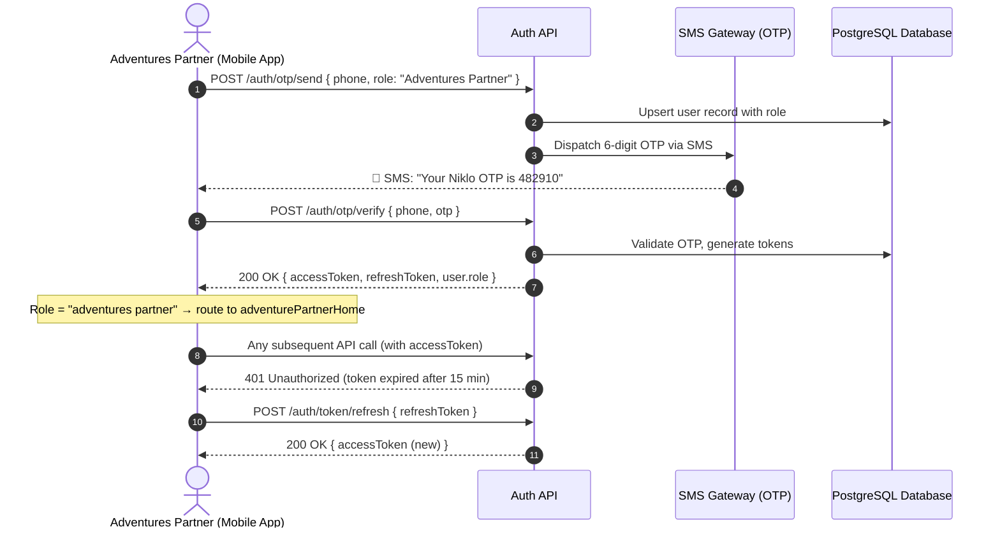
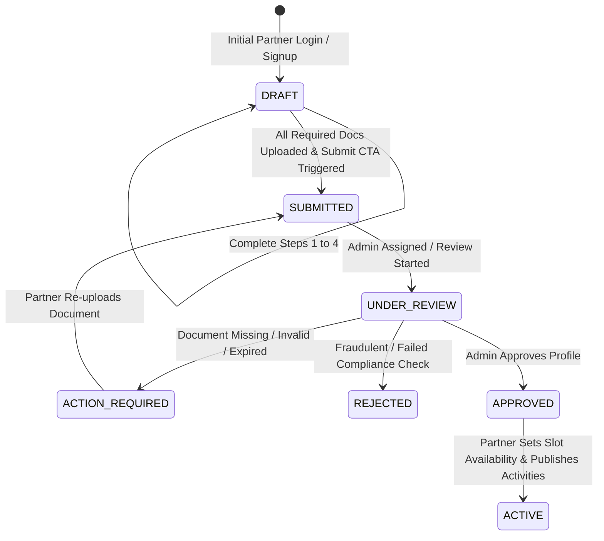
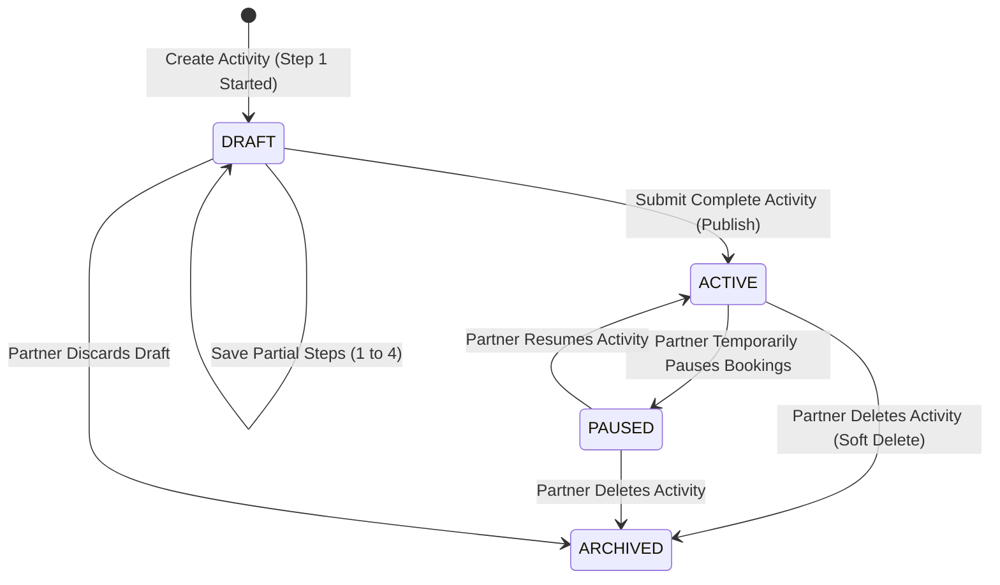
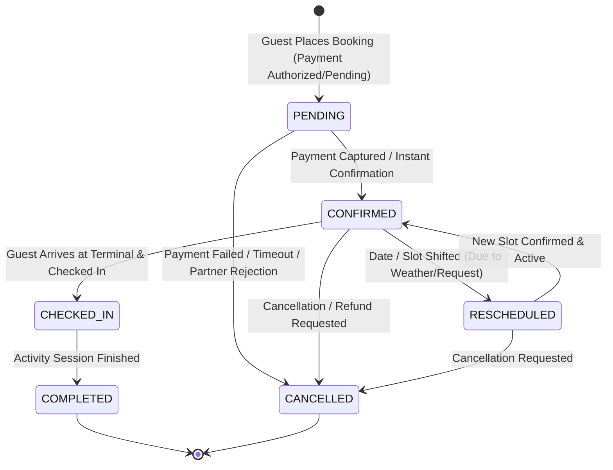
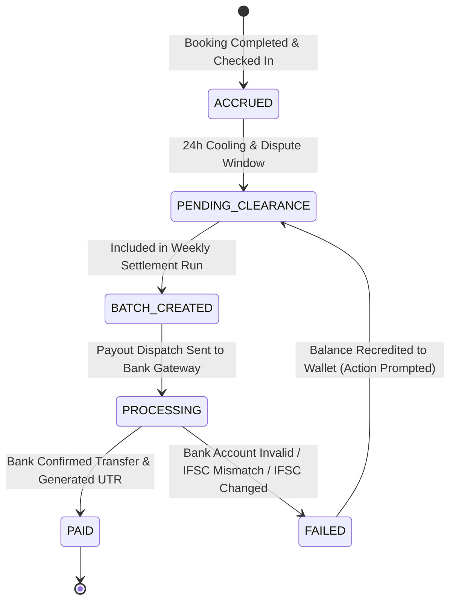
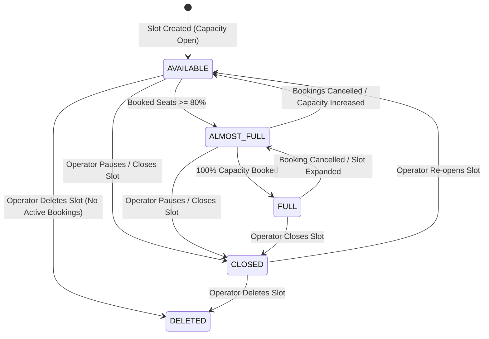
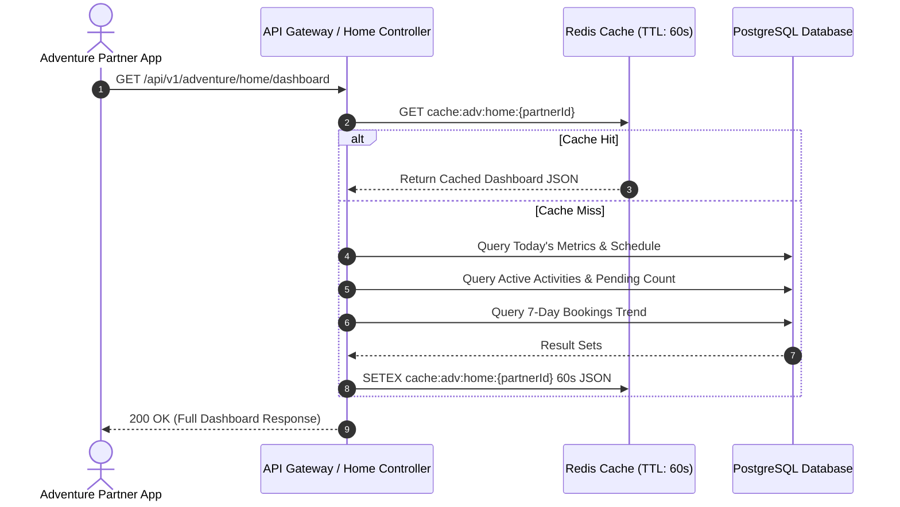
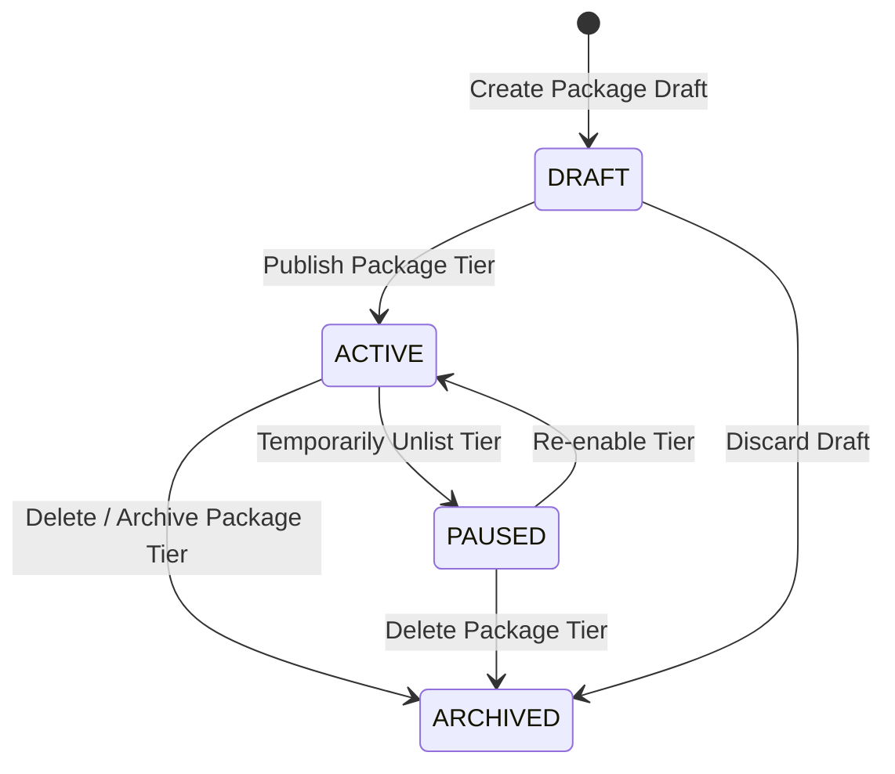
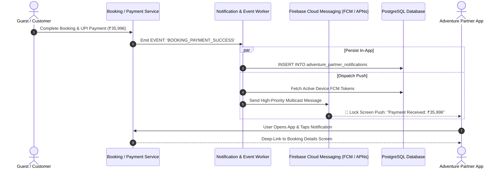
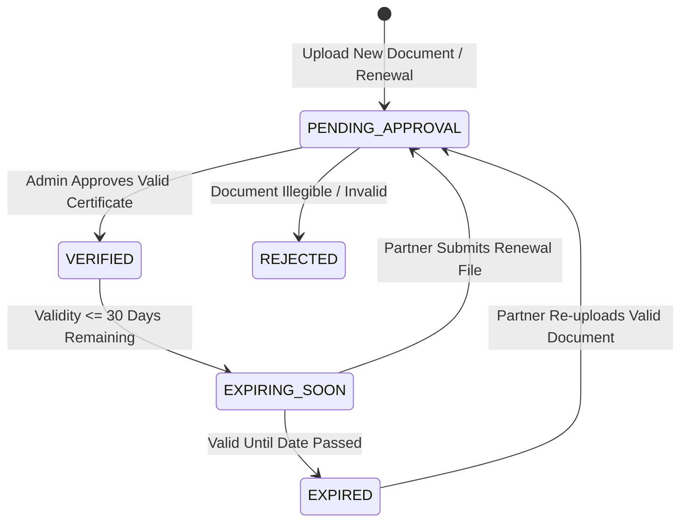

# Adventure Partner Backend Specification (`adv_rider_backend.md`)

This document provides complete, production-ready backend API specifications, database schemas, state machines, and business rules for the **Adventure Partner** service in `niklo-partner`.

---

# Module 0: Authentication & Session Management (`/auth`)

## 1. Overview & Business Flow

Auth is a **shared common module** used by all partner types (`Car Driver`, `Bus Operator`, `Package Partner`, `Adventures Partner`). The client sends a `role` field in the OTP request so the backend can provision the correct partner account type on first-time signup.

### Key Capabilities:
1. **OTP-Based Phone Authentication**: No passwords. Phone number + 6-digit OTP via SMS.
2. **Role-Discriminated Login & Registration**: Same endpoints serve all partner types; `role` in the request body determines which partner record is created or resolved.
3. **JWT Access & Refresh Token Strategy**: Access token is **short-lived (15 minutes)**. Refresh token is persisted on device and used silently by the API client (`ApiClient`) to renew sessions without forcing re-login.
4. **Role-Based Post-Login Routing**: After successful OTP verification, the client routes the operator to the correct dashboard — Adventures Partner → `AppRouter.adventurePartnerHome`.
5. **OTP Resend with Cooldown**: 54-second cooldown timer before resend is allowed.
6. **Secure Logout**: Server-side token invalidation + local FCM device token deregistration.

---

## 2. Authentication Flow State Machine



---

## 3. REST API Endpoints Specification

---

### 3.1 Send OTP (Login & Signup — Shared Endpoint)
- **Method**: `POST`
- **Path**: `/api/v1/auth/otp/send`
- **Auth**: ❌ Public (no JWT required)
- **Request Body**:
```json
{
  "phone": "+919876543210",
  "role": "Adventures Partner",
  "name": "Rohan Sharma",
  "email": "contact@adventurehub.in"
}
```
- **Field Rules**:
  - `phone`: Required. Must be a valid E.164 formatted Indian mobile number (`+91XXXXXXXXXX`).
  - `role`: Required. One of `Car Driver`, `Bus Operator`, `Package Partner`, `Adventures Partner`.
  - `name`: Optional. Used only during signup (new user creation).
  - `email`: Optional. Used only during signup.
- **Response `200 OK`**:
```json
{
  "success": true,
  "message": "OTP sent successfully"
}
```
- **Response `201 Created`** (new user account provisioned):
```json
{
  "success": true,
  "message": "Account created. OTP sent to your mobile."
}
```

---

### 3.2 Verify OTP & Obtain Tokens
- **Method**: `POST`
- **Path**: `/api/v1/auth/otp/verify`
- **Auth**: ❌ Public (no JWT required)
- **Request Body**:
```json
{
  "phone": "+919876543210",
  "otp": "482910"
}
```
- **Response `200 OK`**:
```json
{
  "success": true,
  "data": {
    "accessToken": "eyJhbGciOiJIUzI1NiIsInR5cCI6IkpXVCJ9...",
    "refreshToken": "dGhpcyBpcyBhIHJlZnJlc2ggdG9rZW4...",
    "user": {
      "id": "e3b0c442-98fc-1c14-9afb-4c8996fb9242",
      "phone": "+919876543210",
      "name": "Rohan Sharma",
      "role": "Adventures Partner"
    }
  }
}
```
- **Post-Login Routing Logic (Client-Side)**:
  - `role` contains `"adventure"` → navigate to `AppRouter.adventurePartnerHome`
  - `role` contains `"bus"` → `busOperatorHome`
  - `role` contains `"package"` → `packagePartnerHome`
  - Fallback → `home` (Car Driver)

---

### 3.3 Refresh Access Token (Silent Re-Authentication)
Called automatically by `ApiClient` when a `401 Unauthorized` response is received.

- **Method**: `POST`
- **Path**: `/api/v1/auth/token/refresh`
- **Auth**: ❌ Public (uses refreshToken in body)
- **Request Body**:
```json
{
  "refreshToken": "dGhpcyBpcyBhIHJlZnJlc2ggdG9rZW4..."
}
```
- **Response `200 OK`**:
```json
{
  "success": true,
  "data": {
    "accessToken": "eyJhbGciOiJIUzI1NiIsInR5cCI6IkpXVCJ9..."
  }
}
```

---

### 3.4 Logout & Invalidate Session
- **Method**: `POST`
- **Path**: `/api/v1/auth/logout`
- **Auth**: `Bearer <JWT_TOKEN>`
- **Request Body**:
```json
{
  "fcmToken": "eK38fl93Kd_d93lKsd:APA91bF84...token"
}
```
- **Server Actions**:
  1. Blacklist / revoke the active refresh token in DB.
  2. Mark `adventure_partner_device_tokens.is_active = false` for the given FCM token.
- **Response `200 OK`**:
```json
{
  "success": true,
  "message": "Logged out successfully."
}
```

---

## 4. Token Storage & Security Model

| Item | Storage Location | Expiry |
| :--- | :--- | :--- |
| `accessToken` | Device `flutter_secure_storage` (`AuthKeys.accessToken`) | **15 minutes** |
| `refreshToken` | Device `flutter_secure_storage` (`AuthKeys.refreshToken`) | **30 days** |
| `userRole` | Device `flutter_secure_storage` (`AuthKeys.userRole`) | Until logout |

- All token storage uses `flutter_secure_storage` (Android Keystore / iOS Keychain).
- Access token is attached via `Authorization: Bearer <token>` header on every authenticated request.
- Refresh is handled **silently** by the `ApiClient` Dio interceptor — the user never sees a re-login prompt unless the refresh token also expires.

---

## 5. Error Code Reference

| HTTP Status | Error Code | Description |
| :--- | :--- | :--- |
| `400 Bad Request` | `INVALID_PHONE` | Phone number is not a valid 10-digit Indian mobile number. |
| `400 Bad Request` | `INVALID_OTP` | OTP is incorrect or has expired (OTP TTL: 5 minutes). |
| `400 Bad Request` | `INVALID_ROLE` | Role must be one of the supported partner types. |
| `429 Too Many Requests` | `OTP_RATE_LIMITED` | Too many OTP send attempts. Wait 54 seconds before retry. |
| `401 Unauthorized` | `TOKEN_EXPIRED` | Access token expired. Use refresh token to renew. |
| `401 Unauthorized` | `REFRESH_TOKEN_INVALID` | Refresh token revoked or expired. User must log in again. |

---

# Module 1: Partner Onboarding & Business Setup (`/setup`)


## 1. Overview & Business Flow

The Setup module guides adventure operators through a structured 5-step onboarding and verification pipeline:
1. **Partner Type Classification**: Select specific business model (e.g., Activity Provider, Tour Operator, Camping, Resort, Water Sports, Equipment).
2. **Business Profile & Commercial Credentials**: Legal business name, owner details, contact information, and registered address.
3. **Category Selection**: Multi-select adventure offerings (e.g., River Rafting, Paragliding, Trekking, Scuba, Kayaking).
4. **Operating Map & Terminals**: Physical pickup terminal, meeting point address, and activity start coordinates.
5. **Document Upload & Compliance**: Mandatory and optional legal licenses, government IDs, and safety certificates (Max 10 MB per file).
6. **Verification & Review State Machine**: Submission into admin queue with real-time status tracker (Estimated 24–48 hours turnaround).

---

## 2. Partner Verification State Machine



### Verification Status Enum:
- `DRAFT`: Onboarding in progress (steps 1–5 incomplete).
- `SUBMITTED`: Completed onboarding form, awaiting admin review.
- `UNDER_REVIEW`: Admin is verifying documents and permits.
- `ACTION_REQUIRED`: One or more documents were rejected and require re-upload.
- `APPROVED`: Verification completed successfully. Operator can now accept bookings.
- `REJECTED`: Application denied permanently or blocked due to compliance violation.
- `SUSPENDED`: Temporarily deactivated by admin due to safety/licensing audit.

---

## 3. Database Schema (PostgreSQL / Prisma / TypeORM)

### 3.1 Table: `adventure_partners`
| Column | Type | Constraints | Description |
| :--- | :--- | :--- | :--- |
| `id` | `UUID` | Primary Key, default `gen_random_uuid()` | Unique partner ID |
| `user_id` | `UUID` | Unique, Foreign Key -> `users(id)` | Associated authenticated user |
| `partner_type` | `VARCHAR(50)` | Nullable | Selected classification ID (e.g., `activity_provider`) |
| `business_name` | `VARCHAR(255)` | Nullable | Commercial business name |
| `owner_name` | `VARCHAR(255)` | Nullable | Full legal name of owner/operator |
| `email` | `VARCHAR(255)` | Nullable | Official business email |
| `phone` | `VARCHAR(30)` | Nullable | Official contact phone number |
| `address` | `TEXT` | Nullable | Street address / Commercial building |
| `city` | `VARCHAR(100)` | Nullable | Operating city (e.g., `Manali`) |
| `state` | `VARCHAR(100)` | Nullable | State / Province (e.g., `HP`) |
| `pincode` | `VARCHAR(20)` | Nullable | Postal / ZIP code |
| `onboarding_step` | `INT` | Default `1` | Last active onboarding step (1 to 5) |
| `verification_status` | `VARCHAR(30)` | Default `'DRAFT'` | Verification status enum |
| `rejection_reason` | `TEXT` | Nullable | Feedback provided by admin if rejected/action needed |
| `verified_at` | `TIMESTAMP WITH TIME ZONE` | Nullable | Timestamp of approval |
| `created_at` | `TIMESTAMP WITH TIME ZONE` | Default `NOW()` | Creation timestamp |
| `updated_at` | `TIMESTAMP WITH TIME ZONE` | Default `NOW()` | Last updated timestamp |

---

### 3.2 Table: `adventure_partner_categories`
| Column | Type | Constraints | Description |
| :--- | :--- | :--- | :--- |
| `id` | `UUID` | Primary Key | Unique category mapping ID |
| `partner_id` | `UUID` | Foreign Key -> `adventure_partners(id)` ON DELETE CASCADE | Scoped partner |
| `category_id` | `VARCHAR(50)` | Not Null | Category identifier (e.g., `river_rafting`, `paragliding`) |
| `created_at` | `TIMESTAMP WITH TIME ZONE` | Default `NOW()` | Timestamp |

*Constraint:* `UNIQUE(partner_id, category_id)`

---

### 3.3 Table: `adventure_partner_locations`
| Column | Type | Constraints | Description |
| :--- | :--- | :--- | :--- |
| `id` | `UUID` | Primary Key | Unique location record ID |
| `partner_id` | `UUID` | Unique, Foreign Key -> `adventure_partners(id)` ON DELETE CASCADE | Scoped partner |
| `search_location` | `VARCHAR(255)` | Not Null | Geocoded search query/city |
| `meeting_point_address` | `TEXT` | Not Null | Exact customer reporting point / ticket counter |
| `activity_start_area` | `TEXT` | Not Null | Launch/Departure point (e.g. `Beas River Rapid Zone B`) |
| `latitude` | `DECIMAL(10, 8)` | Nullable | Geo latitude of meeting point |
| `longitude` | `DECIMAL(11, 8)` | Nullable | Geo longitude of meeting point |
| `created_at` | `TIMESTAMP WITH TIME ZONE` | Default `NOW()` | Timestamp |
| `updated_at` | `TIMESTAMP WITH TIME ZONE` | Default `NOW()` | Timestamp |

---

### 3.4 Table: `adventure_partner_documents`
| Column | Type | Constraints | Description |
| :--- | :--- | :--- | :--- |
| `id` | `UUID` | Primary Key | Unique document record ID |
| `partner_id` | `UUID` | Foreign Key -> `adventure_partners(id)` ON DELETE CASCADE | Scoped partner |
| `doc_type` | `VARCHAR(50)` | Not Null | Type: `business_reg`, `govt_id`, `adventure_license`, `safety_cert`, `insurance` |
| `title` | `VARCHAR(255)` | Not Null | Document title display |
| `file_name` | `VARCHAR(255)` | Not Null | Stored file name with size text |
| `file_url` | `TEXT` | Not Null | Cloud storage URL (S3 / GCS / Cloudinary) |
| `file_size_bytes` | `BIGINT` | Not Null | Size in bytes (Max 10 MB = 10,485,760 bytes) |
| `mime_type` | `VARCHAR(100)` | Not Null | e.g. `application/pdf`, `image/png`, `image/jpeg` |
| `is_required` | `BOOLEAN` | Default `true` | Required flag for verification |
| `status` | `VARCHAR(30)` | Default `'UPLOADED'` | `UPLOADED`, `VERIFIED`, `REJECTED` |
| `review_notes` | `TEXT` | Nullable | Admin review feedback on document |
| `created_at` | `TIMESTAMP WITH TIME ZONE` | Default `NOW()` | Upload timestamp |
| `updated_at` | `TIMESTAMP WITH TIME ZONE` | Default `NOW()` | Timestamp |

*Constraint:* `UNIQUE(partner_id, doc_type)`

---

## 4. REST API Endpoints Specification

All endpoints require JWT Bearer Token in `Authorization` header (`Authorization: Bearer <JWT_TOKEN>`).
The backend automatically resolves `userId` and `partnerId` from JWT payload.

---

### 4.1 Get Setup Metadata & Configuration
Returns the global reference lists for partner types, adventure categories, and document validation rules.

- **Method**: `GET`
- **Path**: `/api/v1/adventure/setup/meta`
- **Auth**: `Bearer <JWT_TOKEN>`
- **Response `200 OK`**:
```json
{
  "success": true,
  "data": {
    "partnerTypes": [
      {
        "id": "activity_provider",
        "title": "Adventure Activity Provider",
        "subtitle": "For direct single/multi-activity hosts",
        "icon": "explore"
      },
      {
        "id": "tour_operator",
        "title": "Tour Operator",
        "subtitle": "For customized package tours & guides",
        "icon": "near_me"
      },
      {
        "id": "adventure_resort",
        "title": "Adventure Resort",
        "subtitle": "For properties offering stay + sports",
        "icon": "holiday_village"
      },
      {
        "id": "camping_provider",
        "title": "Camping Provider",
        "subtitle": "For outdoor tent/glamping sites",
        "icon": "cabin"
      },
      {
        "id": "water_sports",
        "title": "Water Sports Provider",
        "subtitle": "For river, sea, and lake operations",
        "icon": "sailing"
      },
      {
        "id": "equipment_provider",
        "title": "Equipment Provider",
        "subtitle": "For rental gear & apparel businesses",
        "icon": "backpack"
      }
    ],
    "categories": [
      {
        "id": "river_rafting",
        "title": "River Rafting",
        "imageUrl": "https://images.unsplash.com/photo-1530866495561-507c9faab2ed?auto=format&fit=crop&w=600&q=80"
      },
      {
        "id": "paragliding",
        "title": "Paragliding",
        "imageUrl": "https://images.unsplash.com/photo-1508873696983-2df5293cb32f?auto=format&fit=crop&w=600&q=80"
      },
      {
        "id": "trekking",
        "title": "Trekking",
        "imageUrl": "https://images.unsplash.com/photo-1464822759023-fed622ff2c3b?auto=format&fit=crop&w=600&q=80"
      },
      {
        "id": "camping",
        "title": "Camping",
        "imageUrl": "https://images.unsplash.com/photo-1504280390367-361c6d9f38f4?auto=format&fit=crop&w=600&q=80"
      },
      {
        "id": "scuba_diving",
        "title": "Scuba Diving",
        "imageUrl": "https://images.unsplash.com/photo-1544551763-46a013bb70d5?auto=format&fit=crop&w=600&q=80"
      },
      {
        "id": "kayaking",
        "title": "Kayaking",
        "imageUrl": "https://images.unsplash.com/photo-1544551763-77ef2d0cfc6c?auto=format&fit=crop&w=600&q=80"
      }
    ],
    "documentRules": {
      "maxFileSizeBytes": 10485760,
      "allowedMimeTypes": [
        "application/pdf",
        "application/msword",
        "application/vnd.openxmlformats-officedocument.wordprocessingml.document",
        "image/jpeg",
        "image/png"
      ],
      "requiredDocumentTypes": [
        "business_reg",
        "govt_id",
        "adventure_license",
        "safety_cert"
      ],
      "optionalDocumentTypes": [
        "insurance"
      ]
    }
  }
}
```

---

### 4.2 Get Current Setup Progress & Draft Data
- **Method**: `GET`
- **Path**: `/api/v1/adventure/setup/progress`
- **Auth**: `Bearer <JWT_TOKEN>`
- **Response `200 OK`**:
```json
{
  "success": true,
  "data": {
    "partnerId": "e3b0c442-98fc-1c14-9afb-4c8996fb9242",
    "onboardingStep": 2,
    "verificationStatus": "DRAFT",
    "partnerType": "activity_provider",
    "businessDetails": {
      "businessName": "Himalayan Heights Adventures",
      "ownerName": "Rohan Sharma",
      "email": "contact@himalayanheights.com",
      "phone": "+1 (555) 019-2834",
      "address": "Mall Road, Opp. Grand Plaza",
      "city": "Manali",
      "state": "HP",
      "pincode": "175131"
    },
    "selectedCategories": ["river_rafting", "paragliding"],
    "location": {
      "searchLocation": "Manali, Himachal Pradesh, India",
      "meetingPointAddress": "Solang Valley Gate No. 2, Base Counter",
      "activityStartArea": "Beas River Rapid Zone B",
      "latitude": 32.2432,
      "longitude": 77.1892
    },
    "documents": [
      {
        "id": "doc_01",
        "docType": "business_reg",
        "title": "Business Registration",
        "isRequired": true,
        "status": "UPLOADED",
        "fileName": "business_reg_cert.pdf (2.4 MB)",
        "fileUrl": "https://storage.niklo.com/adventure/docs/business_reg_cert.pdf"
      },
      {
        "id": "doc_02",
        "docType": "govt_id",
        "title": "Government Authorized ID",
        "isRequired": true,
        "status": "UPLOADED",
        "fileName": "govt_id_card.png (1.8 MB)",
        "fileUrl": "https://storage.niklo.com/adventure/docs/govt_id_card.png"
      },
      {
        "id": "doc_03",
        "docType": "adventure_license",
        "title": "Adventure Operator License",
        "isRequired": true,
        "status": "NOT_UPLOADED",
        "fileName": null,
        "fileUrl": null
      },
      {
        "id": "doc_04",
        "docType": "safety_cert",
        "title": "Equipment Safety Certificate",
        "isRequired": true,
        "status": "NOT_UPLOADED",
        "fileName": null,
        "fileUrl": null
      },
      {
        "id": "doc_05",
        "docType": "insurance",
        "title": "Insurance Coverage Proof",
        "isRequired": false,
        "status": "NOT_UPLOADED",
        "fileName": null,
        "fileUrl": null
      }
    ]
  }
}
```

---

### 4.3 Step 1: Save Partner Business Type
- **Method**: `POST`
- **Path**: `/api/v1/adventure/setup/partner-type`
- **Auth**: `Bearer <JWT_TOKEN>`
- **Request Body**:
```json
{
  "partnerType": "activity_provider"
}
```
- **Validation Rules**:
  - `partnerType`: Required, String, must be one of: `activity_provider`, `tour_operator`, `adventure_resort`, `camping_provider`, `water_sports`, `equipment_provider`.
- **Response `200 OK`**:
```json
{
  "success": true,
  "message": "Partner type saved successfully",
  "data": {
    "partnerType": "activity_provider",
    "nextStep": 2
  }
}
```

---

### 4.4 Step 2: Save Business Profile Details
- **Method**: `POST`
- **Path**: `/api/v1/adventure/setup/business-details`
- **Auth**: `Bearer <JWT_TOKEN>`
- **Request Body**:
```json
{
  "businessName": "Himalayan Heights Adventures",
  "ownerName": "Rohan Sharma",
  "email": "contact@himalayanheights.com",
  "phone": "+919876543210",
  "address": "Mall Road, Opp. Grand Plaza",
  "city": "Manali",
  "state": "HP",
  "pincode": "175131"
}
```
- **Validation Rules**:
  - `businessName`: String, min 2 chars, max 255 chars.
  - `ownerName`: String, min 2 chars, max 255 chars.
  - `email`: Valid RFC 5322 email format.
  - `phone`: Valid E.164 phone format or Indian 10-digit format with country code.
  - `address`: String, min 5 chars.
  - `city`: String, required.
  - `state`: String, required.
  - `pincode`: String, 6 alphanumeric digits.
- **Response `200 OK`**:
```json
{
  "success": true,
  "message": "Business details saved successfully",
  "data": {
    "businessName": "Himalayan Heights Adventures",
    "nextStep": 3
  }
}
```

---

### 4.5 Step 3: Save Categories
- **Method**: `POST`
- **Path**: `/api/v1/adventure/setup/categories`
- **Auth**: `Bearer <JWT_TOKEN>`
- **Request Body**:
```json
{
  "categoryIds": ["river_rafting", "paragliding"]
}
```
- **Validation Rules**:
  - `categoryIds`: Array of strings, min 1 item. Each string must be a valid registered category ID.
- **Response `200 OK`**:
```json
{
  "success": true,
  "message": "Adventure categories updated successfully",
  "data": {
    "selectedCategories": ["river_rafting", "paragliding"],
    "nextStep": 4
  }
}
```

---

### 4.6 Step 4: Save Operating Location & Meeting Point
- **Method**: `POST`
- **Path**: `/api/v1/adventure/setup/location`
- **Auth**: `Bearer <JWT_TOKEN>`
- **Request Body**:
```json
{
  "searchLocation": "Manali, Himachal Pradesh, India",
  "meetingPointAddress": "Solang Valley Gate No. 2, Base Counter",
  "activityStartArea": "Beas River Rapid Zone B",
  "latitude": 32.2432,
  "longitude": 77.1892
}
```
- **Validation Rules**:
  - `meetingPointAddress`: String, min 5 chars, required.
  - `activityStartArea`: String, min 3 chars, required.
  - `latitude`: Float between -90.0 and 90.0 (optional).
  - `longitude`: Float between -180.0 and 180.0 (optional).
- **Response `200 OK`**:
```json
{
  "success": true,
  "message": "Operating location saved successfully",
  "data": {
    "nextStep": 5
  }
}
```

---

### 4.7 Step 5: Upload Partner Compliance Document
Supports direct `multipart/form-data` upload or presigned S3 URL flow.

- **Method**: `POST`
- **Path**: `/api/v1/adventure/setup/documents/upload`
- **Content-Type**: `multipart/form-data`
- **Auth**: `Bearer <JWT_TOKEN>`
- **Form Fields**:
  - `docType`: String (`business_reg`, `govt_id`, `adventure_license`, `safety_cert`, `insurance`).
  - `title`: String (e.g., `'Business Registration'`).
  - `file`: Binary file (PDF / DOC / DOCX / JPG / PNG, max 10MB).
- **Response `201 Created`**:
```json
{
  "success": true,
  "message": "Document uploaded successfully",
  "data": {
    "id": "c7a8b890-449e-4cb2-83b3-85f02f9c8911",
    "docType": "business_reg",
    "title": "Business Registration",
    "fileName": "business_reg_cert.pdf (2.4 MB)",
    "fileUrl": "https://storage.niklo.com/adventure/docs/business_reg_cert.pdf",
    "fileSizeBytes": 2516582,
    "status": "UPLOADED",
    "isRequired": true
  }
}
```

---

### 4.8 Step 5: Delete / Replace Document
- **Method**: `DELETE`
- **Path**: `/api/v1/adventure/setup/documents/:docType`
- **Auth**: `Bearer <JWT_TOKEN>`
- **Response `200 OK`**:
```json
{
  "success": true,
  "message": "Document deleted successfully"
}
```

---

### 4.9 Final Step: Submit for Verification
Validates that all mandatory fields and required compliance documents (`business_reg`, `govt_id`, `adventure_license`, `safety_cert`) are present, then transitions status from `DRAFT` $\rightarrow$ `SUBMITTED`.

- **Method**: `POST`
- **Path**: `/api/v1/adventure/setup/submit`
- **Auth**: `Bearer <JWT_TOKEN>`
- **Request Body**: `{}`
- **Response `200 OK`**:
```json
{
  "success": true,
  "message": "Onboarding submitted for verification",
  "data": {
    "verificationStatus": "UNDER_REVIEW",
    "submittedAt": "2026-08-31T21:00:00.000Z",
    "estimatedCompletionHours": 48
  }
}
```
- **Error Response `422 Unprocessable Entity`** (If required document missing):
```json
{
  "success": false,
  "errorCode": "MISSING_REQUIRED_DOCUMENTS",
  "message": "Cannot submit onboarding application. Mandatory documents are missing.",
  "missingDocTypes": ["adventure_license", "safety_cert"]
}
```

---

### 4.10 Get Live Verification Status
Returns real-time verification progress for `adventure_verification_status_screen.dart`.

- **Method**: `GET`
- **Path**: `/api/v1/adventure/setup/verification-status`
- **Auth**: `Bearer <JWT_TOKEN>`
- **Response `200 OK`**:
```json
{
  "success": true,
  "data": {
    "verificationStatus": "UNDER_REVIEW",
    "statusTitle": "Under Review",
    "statusSubtitle": "Estimated time: 24-48 hours",
    "rejectionReason": null,
    "progressSteps": [
      {
        "step": 1,
        "title": "Business Details",
        "subtitle": "Basic business info provided",
        "status": "COMPLETED"
      },
      {
        "step": 2,
        "title": "Documents Submitted",
        "subtitle": "Operator credentials uploaded",
        "status": "COMPLETED"
      },
      {
        "step": 3,
        "title": "Verification in Progress",
        "subtitle": "Our team is reviewing your profile",
        "status": "ACTIVE"
      },
      {
        "step": 4,
        "title": "Partner Approval",
        "subtitle": "Access full dashboard features",
        "status": "PENDING"
      }
    ]
  }
}
```

---

## 5. Error Code Reference

| HTTP Status | Error Code | Description |
| :--- | :--- | :--- |
| `400 Bad Request` | `INVALID_INPUT` | Request body failed schema validation. |
| `401 Unauthorized` | `UNAUTHORIZED` | Invalid or expired JWT token. |
| `403 Forbidden` | `PARTNER_SUSPENDED` | Account is restricted from onboarding actions. |
| `413 Payload Too Large` | `FILE_SIZE_EXCEEDED` | Uploaded document exceeds 10 MB limit. |
| `415 Unsupported Media Type` | `INVALID_FILE_TYPE` | File extension or MIME type not in allowed list. |
| `422 Unprocessable Entity` | `MISSING_REQUIRED_DOCUMENTS` | Application submission attempted before mandatory uploads. |
| `409 Conflict` | `INVALID_STATE_TRANSITION` | Setup cannot be submitted while already `APPROVED` or `UNDER_REVIEW`. |

---

# Module 2: Activity Management & Creation Flow (`/activities`)

## 1. Overview & Business Flow

The Activities module empowers adventure partners to create, manage, schedule, and showcase their adventure experiences.

### Key Capabilities:
1. **Activity Catalog Management**: Full inventory list with status filters (`All`, `Active`, `Draft`, `Paused`), real-time search, and quick status toggles.
2. **4-Step Guided Activity Creation**:
   - **Step 1: Basic Information**: Title, category classification, terrain difficulty, comprehensive description, duration, location, and base price per person.
   - **Step 2: Media & Gallery**: High-resolution cover photo, multi-photo gallery (up to 10 images with reordering capability), and promotional video URL.
   - **Step 3: Requirements & Safety Restrictions**: Age limits, maximum participant weight, height constraints, minimum/maximum group booking sizes, and medical restrictions.
   - **Step 4: Equipment & Inclusions**: Master inclusions list (Safety gear, instructor, insurance, transport, changing rooms) and provided safety equipment checklist.
3. **Availability & Slot Binding**: Once active, activities can be linked to daily time slots and capacity batches in the Availability module.

---

## 2. Activity Lifecycle State Machine



### Status Enum:
- `DRAFT`: Activity creation in progress or intentionally kept offline. Not visible on consumer app.
- `ACTIVE`: Published and live. Eligible for slot scheduling, consumer searches, and bookings.
- `PAUSED`: Temporarily unlisted from public discovery (e.g., weather disruption, seasonal closure). Existing confirmed bookings remain valid.
- `ARCHIVED`: Soft-deleted. Retained for historical booking audits and revenue reporting.

---

## 3. Database Schema (PostgreSQL / Prisma / TypeORM)

### 3.1 Table: `adventure_activities`
| Column | Type | Constraints | Description |
| :--- | :--- | :--- | :--- |
| `id` | `UUID` | Primary Key, default `gen_random_uuid()` | Unique activity ID |
| `partner_id` | `UUID` | Foreign Key -> `adventure_partners(id)` ON DELETE CASCADE | Owner partner |
| `title` | `VARCHAR(255)` | Not Null | Activity title (e.g. `'High Altitude Tandem Paragliding'`) |
| `category` | `VARCHAR(50)` | Not Null | Category (e.g. `'Paragliding'`, `'River Rafting'`, `'Trekking'`, `'Camping'`, `'Scuba Diving'`, `'Kayaking'`) |
| `difficulty` | `VARCHAR(30)` | Default `'Moderate'` | `'Easy'`, `'Moderate'`, `'Challenging'`, `'Extreme'` |
| `location` | `VARCHAR(255)` | Not Null | Operating location text (e.g. `'Solang Valley, Manali'`) |
| `description` | `TEXT` | Not Null | Full adventure overview & details |
| `duration` | `VARCHAR(50)` | Not Null | Duration description (e.g. `'45 Minutes'`, `'3 Hrs'`, `'4 Days'`) |
| `price_per_person` | `DECIMAL(10, 2)` | Not Null | Base price in INR per participant |
| `cover_image_url` | `TEXT` | Not Null | Hero cover image URL |
| `video_url` | `TEXT` | Nullable | Optional promotional video link |
| `rating` | `DECIMAL(3, 2)` | Default `0.00` | Average customer review rating |
| `reviews_count` | `INT` | Default `0` | Total number of guest reviews |
| `status` | `VARCHAR(30)` | Default `'DRAFT'` | `'DRAFT'`, `'ACTIVE'`, `'PAUSED'`, `'ARCHIVED'` |
| `created_at` | `TIMESTAMP WITH TIME ZONE` | Default `NOW()` | Creation timestamp |
| `updated_at` | `TIMESTAMP WITH TIME ZONE` | Default `NOW()` | Last update timestamp |

*Indexes:*
- `CREATE INDEX idx_adv_activities_partner_id ON adventure_activities(partner_id);`
- `CREATE INDEX idx_adv_activities_status ON adventure_activities(status);`
- `CREATE INDEX idx_adv_activities_category ON adventure_activities(category);`

---

### 3.2 Table: `adventure_activity_media`
| Column | Type | Constraints | Description |
| :--- | :--- | :--- | :--- |
| `id` | `UUID` | Primary Key | Unique media ID |
| `activity_id` | `UUID` | Foreign Key -> `adventure_activities(id)` ON DELETE CASCADE | Parent activity |
| `media_url` | `TEXT` | Not Null | S3 / Cloud storage image URL |
| `media_type` | `VARCHAR(20)` | Default `'IMAGE'` | `'IMAGE'`, `'VIDEO'` |
| `display_order` | `INT` | Default `0` | Zero-indexed gallery sort position |
| `is_cover` | `BOOLEAN` | Default `false` | Indicates if image is selected as cover |
| `created_at` | `TIMESTAMP WITH TIME ZONE` | Default `NOW()` | Timestamp |

---

### 3.3 Table: `adventure_activity_requirements`
| Column | Type | Constraints | Description |
| :--- | :--- | :--- | :--- |
| `id` | `UUID` | Primary Key | Unique requirements record ID |
| `activity_id` | `UUID` | Unique, Foreign Key -> `adventure_activities(id)` ON DELETE CASCADE | Parent activity |
| `is_age_restriction_enabled` | `BOOLEAN` | Default `false` | Enable/disable age checking |
| `min_age` | `INT` | Nullable | Minimum participant age (e.g. 12) |
| `max_age` | `INT` | Nullable | Maximum participant age (e.g. 60) |
| `is_weight_restriction_enabled`| `BOOLEAN` | Default `false` | Enable/disable weight restriction |
| `min_weight_kg` | `DECIMAL(5, 2)` | Nullable | Minimum weight in KG |
| `max_weight_kg` | `DECIMAL(5, 2)` | Nullable | Maximum weight in KG (e.g. 120.0) |
| `is_height_restriction_enabled`| `BOOLEAN` | Default `false` | Enable/disable height restriction |
| `min_height_cm` | `DECIMAL(5, 2)` | Nullable | Minimum height in CM |
| `max_height_cm` | `DECIMAL(5, 2)` | Nullable | Maximum height in CM |
| `min_group_size` | `INT` | Default `1` | Minimum booking party size |
| `max_group_size` | `INT` | Default `20` | Maximum booking party size |
| `medical_restrictions` | `TEXT[]` | Default `'{}'` | Medical alerts (e.g. `["Asthma", "Heart Condition"]`) |
| `what_to_bring` | `TEXT[]` | Default `'{}'` | Recommended gear (e.g. `["Sturdy Shoes", "Sunscreen"]`) |
| `safety_guidelines` | `TEXT` | Nullable | General safety instructions |
| `created_at` | `TIMESTAMP WITH TIME ZONE` | Default `NOW()` | Timestamp |
| `updated_at` | `TIMESTAMP WITH TIME ZONE` | Default `NOW()` | Timestamp |

---

### 3.4 Table: `adventure_activity_inclusions`
| Column | Type | Constraints | Description |
| :--- | :--- | :--- | :--- |
| `id` | `UUID` | Primary Key | Unique inclusions record ID |
| `activity_id` | `UUID` | Foreign Key -> `adventure_activities(id)` ON DELETE CASCADE | Parent activity |
| `item_name` | `VARCHAR(255)` | Not Null | Item name (e.g. `'Safety Equipment'`, `'Instructor'`) |
| `item_type` | `VARCHAR(30)` | Not Null | `'INCLUSION'` or `'EQUIPMENT_PROVIDED'` |
| `is_custom` | `BOOLEAN` | Default `false` | True if added on the fly by partner |
| `created_at` | `TIMESTAMP WITH TIME ZONE` | Default `NOW()` | Timestamp |

---

## 4. REST API Endpoints Specification

---

### 4.1 List Partner Activities
Returns all activities owned by the authenticated partner with search, status filters, and pagination.

- **Method**: `GET`
- **Path**: `/api/v1/adventure/activities`
- **Auth**: `Bearer <JWT_TOKEN>`
- **Query Parameters**:
  - `status` (Optional): Filter by `ALL`, `ACTIVE`, `DRAFT`, `PAUSED`. Defaults to `ALL`.
  - `search` (Optional): Case-insensitive keyword matching `title` or `location`.
  - `category` (Optional): Filter by category string.
  - `page` (Optional): Page number, defaults to `1`.
  - `limit` (Optional): Items per page, defaults to `20`.
- **Response `200 OK`**:
```json
{
  "success": true,
  "data": {
    "activities": [
      {
        "id": "act_88319a01",
        "title": "River Rafting – 16 KM",
        "location": "Rishikesh, Uttarakhand",
        "rating": 4.8,
        "reviewsCount": 124,
        "duration": "3 Hrs",
        "pricePerPerson": 1499.00,
        "imageUrl": "https://images.unsplash.com/photo-1530866495561-507c9faab2ed?auto=format&fit=crop&w=800&q=80",
        "status": "ACTIVE",
        "category": "River Rafting",
        "difficulty": "Moderate",
        "createdAt": "2026-08-15T10:00:00.000Z"
      },
      {
        "id": "act_88319a02",
        "title": "Paragliding Adventure",
        "location": "Solang Valley, Manali",
        "rating": 4.5,
        "reviewsCount": 42,
        "duration": "1 Hr",
        "pricePerPerson": 2999.00,
        "imageUrl": "https://images.unsplash.com/photo-1508873696983-2df5293cb32f?auto=format&fit=crop&w=800&q=80",
        "status": "DRAFT",
        "category": "Paragliding",
        "difficulty": "Moderate",
        "createdAt": "2026-08-20T14:30:00.000Z"
      },
      {
        "id": "act_88319a03",
        "title": "Hampta Pass Trekking",
        "location": "Manali, Himachal Pradesh",
        "rating": 4.9,
        "reviewsCount": 89,
        "duration": "4 Days",
        "pricePerPerson": 7500.00,
        "imageUrl": "https://images.unsplash.com/photo-1464822759023-fed622ff2c3b?auto=format&fit=crop&w=800&q=80",
        "status": "ACTIVE",
        "category": "Trekking",
        "difficulty": "Challenging",
        "createdAt": "2026-08-22T09:15:00.000Z"
      }
    ],
    "pagination": {
      "totalItems": 3,
      "totalPages": 1,
      "currentPage": 1,
      "limit": 20
    }
  }
}
```

---

### 4.2 Get Activity Details by ID
Returns complete activity information including media gallery, safety requirements, and equipment inclusions.

- **Method**: `GET`
- **Path**: `/api/v1/adventure/activities/:id`
- **Auth**: `Bearer <JWT_TOKEN>`
- **Response `200 OK`**:
```json
{
  "success": true,
  "data": {
    "id": "act_88319a01",
    "partnerId": "e3b0c442-98fc-1c14-9afb-4c8996fb9242",
    "title": "High Altitude Tandem Paragliding",
    "category": "Paragliding",
    "difficulty": "Moderate",
    "location": "Solang Valley, Manali",
    "description": "Experience the thrill of flying like a bird over the snow-capped Himalayan peaks. 15-20 minutes of adrenaline-pumping tandem paragliding with certified pilots.",
    "duration": "45 Minutes",
    "pricePerPerson": 2999.00,
    "rating": 4.8,
    "reviewsCount": 56,
    "status": "ACTIVE",
    "media": {
      "coverImageUrl": "https://images.unsplash.com/photo-1508873696983-2df5293cb32f?auto=format&fit=crop&w=800&q=80",
      "videoUrl": "https://cdn.niklo.com/adventure/paragliding_preview.mp4",
      "gallery": [
        "https://images.unsplash.com/photo-1508873696983-2df5293cb32f?auto=format&fit=crop&w=800&q=80",
        "https://images.unsplash.com/photo-1530866495561-507c9faab2ed?auto=format&fit=crop&w=800&q=80",
        "https://images.unsplash.com/photo-1464822759023-fed622ff2c3b?auto=format&fit=crop&w=800&q=80"
      ]
    },
    "requirements": {
      "isAgeRestrictionEnabled": true,
      "minAge": 12,
      "maxAge": 60,
      "isWeightRestrictionEnabled": true,
      "minWeightKg": null,
      "maxWeightKg": 120.0,
      "isHeightRestrictionEnabled": false,
      "minHeightCm": null,
      "maxHeightCm": null,
      "minGroupSize": 1,
      "maxGroupSize": 10,
      "medicalRestrictions": ["Heart Condition", "Severe Asthma", "Pregnancy"],
      "whatToBring": ["Warm Windproof Jacket", "Sturdy Sports Shoes", "Sunglasses"],
      "safetyGuidelines": "Participants must follow pilot instructions during takeoff and landing."
    },
    "inclusions": [
      "Safety Equipment",
      "Professional Instructor",
      "Insurance",
      "Changing Room"
    ],
    "equipmentProvided": [
      "Helmet",
      "Safety Harness",
      "Paraglider Wing",
      "Emergency Parachute"
    ],
    "createdAt": "2026-08-25T11:00:00.000Z",
    "updatedAt": "2026-08-28T09:30:00.000Z"
  }
}
```

---

### 4.3 Create New Activity
Creates a new adventure activity with all metadata, requirements, inclusions, and media. Supports direct creation or saving as a `DRAFT`.

- **Method**: `POST`
- **Path**: `/api/v1/adventure/activities`
- **Auth**: `Bearer <JWT_TOKEN>`
- **Request Body**:
```json
{
  "title": "High Altitude Tandem Paragliding",
  "category": "Paragliding",
  "difficulty": "Moderate",
  "location": "Solang Valley, Manali",
  "description": "Experience the thrill of flying like a bird over the snow-capped Himalayan peaks. 15-20 minutes of adrenaline-pumping tandem paragliding with certified pilots.",
  "duration": "45 Minutes",
  "pricePerPerson": 2999.00,
  "status": "ACTIVE",
  "coverImageUrl": "https://images.unsplash.com/photo-1508873696983-2df5293cb32f?auto=format&fit=crop&w=800&q=80",
  "videoUrl": null,
  "galleryPhotos": [
    "https://images.unsplash.com/photo-1508873696983-2df5293cb32f?auto=format&fit=crop&w=800&q=80",
    "https://images.unsplash.com/photo-1530866495561-507c9faab2ed?auto=format&fit=crop&w=800&q=80",
    "https://images.unsplash.com/photo-1464822759023-fed622ff2c3b?auto=format&fit=crop&w=800&q=80"
  ],
  "requirements": {
    "isAgeRestrictionEnabled": true,
    "minAge": 12,
    "maxAge": 60,
    "isWeightRestrictionEnabled": true,
    "maxWeightKg": 120.0,
    "isHeightRestrictionEnabled": false,
    "minGroupSize": 2,
    "maxGroupSize": 20,
    "medicalRestrictions": ["Asthma", "Heart Condition"],
    "whatToBring": ["Sturdy Shoes", "Sunscreen"]
  },
  "inclusions": [
    "Safety Equipment",
    "Professional Instructor",
    "Insurance",
    "Changing Room"
  ],
  "equipmentProvided": [
    "Helmet",
    "Life Jacket",
    "Harness",
    "Rope",
    "Safety Gear"
  ]
}
```
- **Validation Rules**:
  - `title`: String, min 3 chars, max 255 chars, required.
  - `category`: Must be one of registered categories (`Paragliding`, `River Rafting`, `Trekking`, `Camping`, `Scuba Diving`, `Kayaking`).
  - `difficulty`: String enum (`Easy`, `Moderate`, `Challenging`, `Extreme`).
  - `location`: String, min 3 chars, required.
  - `description`: String, min 10 chars, required.
  - `duration`: String, required.
  - `pricePerPerson`: Float/Decimal > 0, required.
  - `coverImageUrl`: Valid URI string, required.
  - `galleryPhotos`: Array of URI strings, max 10 images.
  - `requirements.minAge`: Integer between 1 and 100 (when enabled).
  - `requirements.maxWeightKg`: Float > 0 (when enabled).
  - `requirements.minGroupSize`: Integer >= 1.
  - `requirements.maxGroupSize`: Integer >= `minGroupSize`.
- **Response `201 Created`**:
```json
{
  "success": true,
  "message": "Activity created and published successfully",
  "data": {
    "id": "act_88319a04",
    "title": "High Altitude Tandem Paragliding",
    "status": "ACTIVE",
    "createdAt": "2026-08-31T21:10:00.000Z"
  }
}
```

---

### 4.4 Update Activity Details
Updates an existing activity's attributes, pricing, requirements, or inclusions.

- **Method**: `PATCH`
- **Path**: `/api/v1/adventure/activities/:id`
- **Auth**: `Bearer <JWT_TOKEN>`
- **Request Body**: Partial payload of fields to update.
- **Response `200 OK`**:
```json
{
  "success": true,
  "message": "Activity updated successfully",
  "data": {
    "id": "act_88319a04",
    "updatedAt": "2026-08-31T21:15:00.000Z"
  }
}
```

---

### 4.5 Toggle Activity Status (Active / Paused / Draft)
Quick endpoint for toggling status from cards or bottom sheets without submitting full payload.

- **Method**: `PATCH`
- **Path**: `/api/v1/adventure/activities/:id/status`
- **Auth**: `Bearer <JWT_TOKEN>`
- **Request Body**:
```json
{
  "status": "PAUSED"
}
```
- **Validation Rules**:
  - `status`: Required, must be one of `ACTIVE`, `PAUSED`, `DRAFT`.
- **Response `200 OK`**:
```json
{
  "success": true,
  "message": "Activity status changed to PAUSED",
  "data": {
    "id": "act_88319a04",
    "status": "PAUSED"
  }
}
```

---

### 4.6 Delete / Archive Activity
Soft deletes the activity. Existing future bookings are preserved or flagged for customer support notification.

- **Method**: `DELETE`
- **Path**: `/api/v1/adventure/activities/:id`
- **Auth**: `Bearer <JWT_TOKEN>`
- **Response `200 OK`**:
```json
{
  "success": true,
  "message": "Activity archived successfully"
}
```

---

### 4.7 Upload Activity Media (Cover or Gallery Image)
- **Method**: `POST`
- **Path**: `/api/v1/adventure/activities/media/upload`
- **Content-Type**: `multipart/form-data`
- **Auth**: `Bearer <JWT_TOKEN>`
- **Form Fields**:
  - `file`: Binary image (JPG, PNG, WebP; max 10 MB).
  - `isCover`: Boolean (`true` / `false`).
- **Response `201 Created`**:
```json
{
  "success": true,
  "message": "Media uploaded successfully",
  "data": {
    "url": "https://storage.niklo.com/adventure/activities/gallery_img_9912.jpg",
    "fileSizeBytes": 1845120,
    "mimeType": "image/jpeg"
  }
}
```

---

## 5. Error Code Reference

| HTTP Status | Error Code | Description |
| :--- | :--- | :--- |
| `400 Bad Request` | `INVALID_INPUT` | Failed payload field validation. |
| `401 Unauthorized` | `UNAUTHORIZED` | Invalid or expired token. |
| `403 Forbidden` | `ACTIVITY_NOT_OWNED` | Partner does not have permission to modify this activity ID. |
| `404 Not Found` | `ACTIVITY_NOT_FOUND` | Activity ID does not exist or has been deleted. |
| `409 Conflict` | `ACTIVE_BOOKINGS_EXIST` | Cannot archive activity with pending unfulfilled bookings without cancellation flow. |
| `413 Payload Too Large` | `MEDIA_SIZE_EXCEEDED` | Uploaded image or video exceeds size threshold. |
| `422 Unprocessable Entity` | `INVALID_CATEGORY` | Category specified is not recognized in partner's approved domains. |

---

# Module 3: Bookings Management & Guest Operations (`/bookings`)

## 1. Overview & Business Flow

The Bookings module is the core operational engine for adventure operators to track orders, manage real-time participant rosters, process guest arrivals, handle slot reschedules, and coordinate instructor assignments.

### Key Capabilities:
1. **Multi-Status Booking Feed**: Filtered streams for `All`, `Confirmed`, `Pending`, `Completed`, and `Cancelled` bookings with instant keyword search by customer name, booking ID (`#ADV-9021`), or activity title.
2. **On-Site Guest Check-in**: Operator scans/verifies guest vouchers upon terminal arrival, triggering timestamped check-in records (`POST /bookings/:id/check-in`) and live capacity updates.
3. **Slot Rescheduling Workflow**: Operator can reschedule a guest's slot (due to weather disruption, delayed transit, or customer request) with optional automated SMS/WhatsApp/Push customer notifications.
4. **Participant Manifest & Emergency Information**: Access individual participant names, age categories, gender breakdown, and primary contact telephone numbers for safety briefings and emergency protocols.
5. **Transparent Payment Auditing**: Detailed breakdown of base fare, addons, taxes, platform commission, and settlement status (`PAID`, `PENDING`, `REFUNDED`).

---

## 2. Booking Lifecycle State Machine



### Status Enum:
- `PENDING`: Order initiated, awaiting payment capture or partner acceptance.
- `CONFIRMED`: Valid, confirmed reservation. Scheduled for a future time slot.
- `CHECKED_IN`: Guest has physically reported to the base terminal/meeting point.
- `RESCHEDULED`: Slot moved to another date/time; status returns to `CONFIRMED` under the new schedule.
- `COMPLETED`: Activity successfully concluded. Funds queued for payout release.
- `CANCELLED`: Booking voided; cancellation policy evaluated for refund processing.

---

## 3. Database Schema (PostgreSQL / Prisma / TypeORM)

### 3.1 Table: `adventure_bookings`
| Column | Type | Constraints | Description |
| :--- | :--- | :--- | :--- |
| `id` | `UUID` | Primary Key, default `gen_random_uuid()` | Unique booking ID |
| `booking_number` | `VARCHAR(50)` | Unique, Not Null | Human-readable ID (e.g. `'#ADV-9021'`) |
| `partner_id` | `UUID` | Foreign Key -> `adventure_partners(id)` ON DELETE RESTRICT | Assigned operator |
| `activity_id` | `UUID` | Foreign Key -> `adventure_activities(id)` ON DELETE RESTRICT | Booked activity |
| `slot_id` | `UUID` | Nullable, Foreign Key -> `adventure_time_slots(id)` | Scheduled slot reference |
| `user_id` | `UUID` | Foreign Key -> `users(id)` ON DELETE RESTRICT | Booking customer |
| `booking_date` | `DATE` | Not Null | Scheduled activity date (e.g. `2026-08-28`) |
| `time_slot` | `VARCHAR(50)` | Not Null | Time slot text (e.g. `'08:00 AM'`) |
| `participants_count` | `INT` | Not Null, Check `> 0` | Total number of guests |
| `tier_name` | `VARCHAR(100)` | Default `'Standard'` | Package tier (e.g. `'Premium Rafting'`) |
| `instructor_name` | `VARCHAR(100)` | Nullable | Assigned guide / pilot (e.g. `'Vikram Thapa'`) |
| `customer_name` | `VARCHAR(255)` | Not Null | Primary contact full name |
| `customer_phone` | `VARCHAR(30)` | Not Null | Primary contact phone number |
| `customer_email` | `VARCHAR(255)` | Nullable | Primary contact email address |
| `total_amount` | `DECIMAL(10, 2)` | Not Null | Total order amount in INR |
| `payment_status` | `VARCHAR(30)` | Default `'PENDING'` | `'PAID'`, `'PENDING'`, `'REFUNDED'`, `'FAILED'` |
| `payment_method` | `VARCHAR(50)` | Default `'ONLINE'` | `'UPI / Online'`, `'Card'`, `'Cash at Terminal'` |
| `status` | `VARCHAR(30)` | Default `'CONFIRMED'` | `'PENDING'`, `'CONFIRMED'`, `'CHECKED_IN'`, `'COMPLETED'`, `'CANCELLED'` |
| `is_rescheduled` | `BOOLEAN` | Default `false` | Indicates if slot was rescheduled |
| `rescheduled_from_date`| `DATE` | Nullable | Original booking date before reschedule |
| `rescheduled_from_slot`| `VARCHAR(50)` | Nullable | Original slot before reschedule |
| `reschedule_reason` | `TEXT` | Nullable | Operator reason for rescheduling |
| `checked_in_at` | `TIMESTAMP WITH TIME ZONE` | Nullable | Exact check-in timestamp |
| `completed_at` | `TIMESTAMP WITH TIME ZONE` | Nullable | Session completion timestamp |
| `cancellation_reason` | `TEXT` | Nullable | Reason for cancellation |
| `cancelled_at` | `TIMESTAMP WITH TIME ZONE` | Nullable | Cancellation timestamp |
| `created_at` | `TIMESTAMP WITH TIME ZONE` | Default `NOW()` | Order creation timestamp |
| `updated_at` | `TIMESTAMP WITH TIME ZONE` | Default `NOW()` | Last update timestamp |

*Indexes:*
- `CREATE INDEX idx_adv_bookings_partner_id ON adventure_bookings(partner_id);`
- `CREATE INDEX idx_adv_bookings_status ON adventure_bookings(status);`
- `CREATE INDEX idx_adv_bookings_date ON adventure_bookings(booking_date);`
- `CREATE INDEX idx_adv_bookings_number ON adventure_bookings(booking_number);`

---

### 3.2 Table: `adventure_booking_participants`
| Column | Type | Constraints | Description |
| :--- | :--- | :--- | :--- |
| `id` | `UUID` | Primary Key | Unique participant record ID |
| `booking_id` | `UUID` | Foreign Key -> `adventure_bookings(id)` ON DELETE CASCADE | Associated booking |
| `full_name` | `VARCHAR(255)` | Not Null | Guest full name |
| `age` | `INT` | Not Null | Guest age |
| `gender` | `VARCHAR(20)` | Default `'Adult'` | `'Male'`, `'Female'`, `'Other'`, `'Adult'`, `'Child'` |
| `waiver_signed` | `BOOLEAN` | Default `false` | Liability waiver sign flag |
| `created_at` | `TIMESTAMP WITH TIME ZONE` | Default `NOW()` | Timestamp |

---

### 3.3 Table: `adventure_booking_inclusions`
| Column | Type | Constraints | Description |
| :--- | :--- | :--- | :--- |
| `id` | `UUID` | Primary Key | Unique record ID |
| `booking_id` | `UUID` | Foreign Key -> `adventure_bookings(id)` ON DELETE CASCADE | Associated booking |
| `title` | `VARCHAR(255)` | Not Null | Included item (e.g. `'Certified River Guide'`, `'Action Video'`) |
| `created_at` | `TIMESTAMP WITH TIME ZONE` | Default `NOW()` | Timestamp |

---

## 4. REST API Endpoints Specification

---

### 4.1 List Bookings
Returns a filtered list of bookings for the partner dashboard.

- **Method**: `GET`
- **Path**: `/api/v1/adventure/bookings`
- **Auth**: `Bearer <JWT_TOKEN>`
- **Query Parameters**:
  - `status` (Optional): Filter by `ALL`, `CONFIRMED`, `PENDING`, `COMPLETED`, `CANCELLED`.
  - `search` (Optional): Query matching `customer_name`, `customer_phone`, `booking_number`, or `activity_title`.
  - `date` (Optional): Exact date (`YYYY-MM-DD`).
  - `page` (Optional): Page number, defaults to `1`.
  - `limit` (Optional): Items per page, defaults to `20`.
- **Response `200 OK`**:
```json
{
  "success": true,
  "data": {
    "bookings": [
      {
        "id": "bkg_9901",
        "bookingNumber": "#ADV-9021",
        "activityTitle": "River Rafting – 16 KM",
        "activityLocation": "Rishikesh, Uttarakhand",
        "activityImageUrl": "https://images.unsplash.com/photo-1530866495561-507c9faab2ed?auto=format&fit=crop&w=800&q=80",
        "date": "Tomorrow, Oct 24",
        "time": "08:00 AM",
        "participantsCount": 4,
        "totalAmount": 5996.00,
        "status": "CONFIRMED",
        "customerName": "Rahul Verma",
        "customerPhone": "+91 98765 43210",
        "customerEmail": "rahul.verma@example.com",
        "tierName": "Premium Rafting",
        "instructor": "Vikram Thapa",
        "paymentMethod": "UPI / Online",
        "paymentStatus": "PAID",
        "createdAt": "2026-08-30T14:20:00.000Z"
      },
      {
        "id": "bkg_9902",
        "bookingNumber": "#ADV-9022",
        "activityTitle": "Paragliding Adventure",
        "activityLocation": "Solang Valley, Manali",
        "activityImageUrl": "https://images.unsplash.com/photo-1508873696983-2df5293cb32f?auto=format&fit=crop&w=800&q=80",
        "date": "28 Aug 2026",
        "time": "10:00 AM",
        "participantsCount": 2,
        "totalAmount": 5998.00,
        "status": "PENDING",
        "customerName": "Ananya Sharma",
        "customerPhone": "+91 91234 56789",
        "customerEmail": "ananya.s@example.com",
        "tierName": "High Fly Tandem",
        "instructor": "Ramesh Singh",
        "paymentMethod": "UPI / Online",
        "paymentStatus": "PAID",
        "createdAt": "2026-08-31T08:00:00.000Z"
      }
    ],
    "summaryCounts": {
      "all": 48,
      "confirmed": 24,
      "pending": 3,
      "completed": 18,
      "cancelled": 3
    },
    "pagination": {
      "totalItems": 48,
      "totalPages": 3,
      "currentPage": 1,
      "limit": 20
    }
  }
}
```

---

### 4.2 Get Booking Details by ID
Returns complete booking overview, participant roster, inclusions, and payment breakdown.

- **Method**: `GET`
- **Path**: `/api/v1/adventure/bookings/:id`
- **Auth**: `Bearer <JWT_TOKEN>`
- **Response `200 OK`**:
```json
{
  "success": true,
  "data": {
    "id": "bkg_9901",
    "bookingNumber": "#ADV-9021",
    "status": "CONFIRMED",
    "activity": {
      "id": "act_88319a01",
      "title": "River Rafting – 16 KM",
      "location": "Rishikesh, Uttarakhand",
      "imageUrl": "https://images.unsplash.com/photo-1530866495561-507c9faab2ed?auto=format&fit=crop&w=800&q=80",
      "tierName": "Premium Rafting",
      "instructor": "Vikram Thapa"
    },
    "schedule": {
      "date": "Tomorrow, Oct 24",
      "time": "08:00 AM",
      "isRescheduled": false,
      "rescheduledFromDate": null,
      "rescheduledFromSlot": null,
      "rescheduledReason": null
    },
    "checkIn": {
      "isCheckedIn": false,
      "checkedInAt": null
    },
    "customer": {
      "name": "Rahul Verma",
      "phone": "+91 98765 43210",
      "email": "rahul.verma@example.com"
    },
    "participants": [
      { "name": "Rahul Verma", "age": 28, "gender": "Male" },
      { "name": "Pooja Verma", "age": 26, "gender": "Female" },
      { "name": "Amit Sharma", "age": 30, "gender": "Male" },
      { "name": "Sneha Gupta", "age": 27, "gender": "Female" }
    ],
    "inclusions": [
      "Safety Equipment & Helmet",
      "Certified River Guide",
      "Safety Insurance",
      "HD Action Video & Photo"
    ],
    "payment": {
      "baseFare": 5996.00,
      "taxesAndGst": 299.80,
      "discount": 0.00,
      "totalAmount": 6295.80,
      "paymentMethod": "UPI / Online",
      "paymentStatus": "PAID",
      "transactionId": "TXN_991823190"
    }
  }
}
```

---

### 4.3 Check-in Guest at Terminal
Timestamped confirmation that the customer and party have arrived at the adventure base terminal.

- **Method**: `POST`
- **Path**: `/api/v1/adventure/bookings/:id/check-in`
- **Auth**: `Bearer <JWT_TOKEN>`
- **Request Body**: `{}`
- **Response `200 OK`**:
```json
{
  "success": true,
  "message": "Guest checked in successfully",
  "data": {
    "bookingId": "bkg_9901",
    "status": "CHECKED_IN",
    "checkedInAt": "2026-08-31T21:10:00.000Z",
    "checkInTimeFormatted": "08:15 AM, Today"
  }
}
```

---

### 4.4 Reschedule Booking Slot
Allows the operator to move a reservation to a new date and time slot with reason tracking and optional customer dispatch.

- **Method**: `POST`
- **Path**: `/api/v1/adventure/bookings/:id/reschedule`
- **Auth**: `Bearer <JWT_TOKEN>`
- **Request Body**:
```json
{
  "newDate": "2026-10-25",
  "newTimeSlot": "10:00 AM",
  "reason": "Heavy river current in early morning session",
  "notifyCustomer": true
}
```
- **Validation Rules**:
  - `newDate`: String (`YYYY-MM-DD`), cannot be in the past.
  - `newTimeSlot`: String, required.
  - `reason`: String, min 3 chars, required.
  - `notifyCustomer`: Boolean, default `true`.
- **Response `200 OK`**:
```json
{
  "success": true,
  "message": "Booking rescheduled successfully and customer notified",
  "data": {
    "bookingId": "bkg_9901",
    "status": "CONFIRMED",
    "isRescheduled": true,
    "newDate": "25 Oct 2026",
    "newTimeSlot": "10:00 AM",
    "rescheduledReason": "Heavy river current in early morning session",
    "customerNotified": true
  }
}
```

---

### 4.5 Accept / Confirm Pending Booking
- **Method**: `POST`
- **Path**: `/api/v1/adventure/bookings/:id/confirm`
- **Auth**: `Bearer <JWT_TOKEN>`
- **Request Body**: `{}`
- **Response `200 OK`**:
```json
{
  "success": true,
  "message": "Booking confirmed",
  "data": {
    "bookingId": "bkg_9902",
    "status": "CONFIRMED"
  }
}
```

---

### 4.6 Cancel / Reject Booking
Cancels a booking with operator remarks and triggers automated refund processing according to cancellation rules.

- **Method**: `POST`
- **Path**: `/api/v1/adventure/bookings/:id/cancel`
- **Auth**: `Bearer <JWT_TOKEN>`
- **Request Body**:
```json
{
  "reason": "Severe weather alert / thunderstorm"
}
```
- **Validation Rules**:
  - `reason`: String, min 5 chars, required.
- **Response `200 OK`**:
```json
{
  "success": true,
  "message": "Booking cancelled and refund initiated",
  "data": {
    "bookingId": "bkg_9901",
    "status": "CANCELLED",
    "refundStatus": "PROCESSING",
    "refundAmount": 6295.80
  }
}
```

---

## 5. Error Code Reference

| HTTP Status | Error Code | Description |
| :--- | :--- | :--- |
| `400 Bad Request` | `INVALID_INPUT` | Reschedule or cancellation payload failed schema checks. |
| `401 Unauthorized` | `UNAUTHORIZED` | Invalid or expired token. |
| `403 Forbidden` | `BOOKING_NOT_OWNED` | Partner does not have permission to access or modify this booking. |
| `404 Not Found` | `BOOKING_NOT_FOUND` | Booking ID does not exist. |
| `409 Conflict` | `ALREADY_CHECKED_IN` | Booking is already checked in. |
| `409 Conflict` | `SLOT_CAPACITY_EXCEEDED` | Target slot for reschedule has insufficient remaining capacity. |
| `422 Unprocessable Entity` | `CANNOT_CANCEL_COMPLETED` | Completed activities cannot be cancelled or refunded via partner app. |

---

# Module 4: Earnings, Revenue Analytics & Payout Operations (`/earnings`)

## 1. Overview & Business Flow

The Earnings module gives operators complete visibility into gross earnings, platform commission deductions, tax liabilities (TDS/GST), customer refund adjustments, and bank payouts.

### Key Capabilities:
1. **Time-Horizon Analytics**: High-level aggregated statistics with time filter tabs (`Today`, `This Week`, `This Month`, and `Custom Date Range`) showing:
   - **Net Earnings**: Final take-home revenue after platform deductions.
   - **Gross Revenue**: Sum of all confirmed customer order transactions.
   - **Platform Commission**: Configurable % (standard 10%) platform service fee.
   - **Refund Adjustments**: Total deductions from cancellations/disputes.
   - **Orders Count**: Number of fulfilled booking units.
   - **Interactive Trend Curve**: Normalized revenue time-series coordinates for smooth chart rendering.
2. **Settlement History & Financial Auditing**: List of batch settlement records (`NKL-SET-8821`) with status tracking (`Paid`, `Processing`, `Failed`), linked UTR tracking numbers, and destination bank accounts.
3. **Automated Weekly Payouts & Manual Withdrawals**: Direct automated transfers via IMPS / NEFT into verified partner bank accounts with transparent payout policies.

---

## 2. Settlement & Payout Lifecycle State Machine



### Settlement Status Enum:
- `PENDING_CLEARANCE`: Revenue from fulfilled bookings currently in cooling/audit period before payout eligibility.
- `PROCESSING`: Settlement batch created and submitted to the banking gateway (e.g. RazorpayX / Cashfree).
- `PAID`: Funds successfully transferred to partner bank account with valid bank UTR number.
- `FAILED`: Bank rejected transaction (e.g. frozen account, invalid IFSC). Balance returned to partner wallet with notification.
- `ON_HOLD`: Payout paused by admin due to active compliance audit or fraud dispute.

---

## 3. Database Schema (PostgreSQL / Prisma / TypeORM)

### 3.1 Table: `adventure_partner_earnings_wallets`
| Column | Type | Constraints | Description |
| :--- | :--- | :--- | :--- |
| `id` | `UUID` | Primary Key, default `gen_random_uuid()` | Unique wallet ID |
| `partner_id` | `UUID` | Unique, Foreign Key -> `adventure_partners(id)` ON DELETE RESTRICT | Scoped partner |
| `total_gross_revenue` | `DECIMAL(12, 2)` | Default `0.00` | Lifetime gross revenue from all bookings |
| `total_net_earnings` | `DECIMAL(12, 2)` | Default `0.00` | Lifetime net take-home earnings |
| `available_balance` | `DECIMAL(12, 2)` | Default `0.00` | Current withdrawable / next payout balance |
| `pending_clearance` | `DECIMAL(12, 2)` | Default `0.00` | Funds from recent bookings still in cooling period |
| `total_withdrawn` | `DECIMAL(12, 2)` | Default `0.00` | Total successfully paid out funds |
| `currency` | `VARCHAR(10)` | Default `'INR'` | Currency code |
| `payout_status` | `VARCHAR(30)` | Default `'ON_TRACK'` | `'ON_TRACK'`, `'DELAYED'`, `'PAUSED'` |
| `last_payout_at` | `TIMESTAMP WITH TIME ZONE` | Nullable | Timestamp of last successful payout |
| `updated_at` | `TIMESTAMP WITH TIME ZONE` | Default `NOW()` | Timestamp |

---

### 3.2 Table: `adventure_partner_bank_accounts`
| Column | Type | Constraints | Description |
| :--- | :--- | :--- | :--- |
| `id` | `UUID` | Primary Key | Unique bank account record ID |
| `partner_id` | `UUID` | Foreign Key -> `adventure_partners(id)` ON DELETE RESTRICT | Scoped partner |
| `account_holder_name` | `VARCHAR(255)` | Not Null | Legal beneficiary name on bank account |
| `account_number_enc` | `TEXT` | Not Null | Encrypted full account number (AES-256) |
| `account_number_mask` | `VARCHAR(30)` | Not Null | Masked display format (e.g. `'•••• 4892'`) |
| `bank_name` | `VARCHAR(100)` | Not Null | Financial institution (e.g. `'HDFC Bank'`) |
| `ifsc_code` | `VARCHAR(20)` | Not Null | Bank branch IFSC code (e.g. `'HDFC0000123'`) |
| `is_primary` | `BOOLEAN` | Default `true` | Primary destination for automated payouts |
| `is_verified` | `BOOLEAN` | Default `false` | Penny-drop verification status |
| `created_at` | `TIMESTAMP WITH TIME ZONE` | Default `NOW()` | Timestamp |
| `updated_at` | `TIMESTAMP WITH TIME ZONE` | Default `NOW()` | Timestamp |

---

### 3.3 Table: `adventure_partner_settlements`
| Column | Type | Constraints | Description |
| :--- | :--- | :--- | :--- |
| `id` | `UUID` | Primary Key | Unique settlement record ID |
| `reference_id` | `VARCHAR(50)` | Unique, Not Null | Human-readable ID (e.g. `'NKL-SET-8821'`) |
| `partner_id` | `UUID` | Foreign Key -> `adventure_partners(id)` ON DELETE RESTRICT | Receiving partner |
| `bank_account_id` | `UUID` | Foreign Key -> `adventure_partner_bank_accounts(id)` | Payout destination |
| `gross_amount` | `DECIMAL(12, 2)` | Not Null | Total customer bookings gross total in this batch |
| `commission_amount` | `DECIMAL(12, 2)` | Not Null | Niklo platform fee deducted (e.g. 10%) |
| `tds_gst_amount` | `DECIMAL(12, 2)` | Not Null | Government TDS (1%) + GST withholding deducted |
| `refunds_deducted` | `DECIMAL(12, 2)` | Default `0.00` | Refund chargebacks deducted |
| `net_amount` | `DECIMAL(12, 2)` | Not Null | Final amount credited to bank account |
| `total_bookings_count`| `INT` | Not Null | Count of orders bundled in this payout |
| `bank_display_text` | `VARCHAR(255)` | Not Null | e.g. `'HDFC Bank •••• 4892'` |
| `utr_number` | `VARCHAR(100)` | Nullable | Bank transaction reference / UTR number |
| `status` | `VARCHAR(30)` | Default `'PROCESSING'` | `'PAID'`, `'PROCESSING'`, `'FAILED'`, `'ON_HOLD'` |
| `failure_reason` | `TEXT` | Nullable | Error explanation if status is `FAILED` |
| `settled_at` | `TIMESTAMP WITH TIME ZONE` | Nullable | Bank completion timestamp |
| `created_at` | `TIMESTAMP WITH TIME ZONE` | Default `NOW()` | Batch generation timestamp |

*Indexes:*
- `CREATE INDEX idx_adv_settlements_partner_id ON adventure_partner_settlements(partner_id);`
- `CREATE INDEX idx_adv_settlements_ref_id ON adventure_partner_settlements(reference_id);`
- `CREATE INDEX idx_adv_settlements_status ON adventure_partner_settlements(status);`

---

## 4. REST API Endpoints Specification

---

### 4.1 Get Earnings Overview & Period Breakdown
Returns aggregate financial performance, net revenue, deductions, and waveform chart points for the selected time period.

- **Method**: `GET`
- **Path**: `/api/v1/adventure/earnings/analytics`
- **Auth**: `Bearer <JWT_TOKEN>`
- **Query Parameters**:
  - `period` (Optional): `today`, `week`, `month`, `custom`. Defaults to `month`.
  - `startDate` (Optional, for `custom`): `YYYY-MM-DD`.
  - `endDate` (Optional, for `custom`): `YYYY-MM-DD`.
- **Response `200 OK`**:
```json
{
  "success": true,
  "data": {
    "period": "month",
    "label": "THIS MONTH'S EARNINGS",
    "summary": {
      "netEarnings": 284500.00,
      "grossRevenue": 320000.00,
      "commission": -32000.00,
      "tdsGst": -3500.00,
      "refunds": 0.00,
      "ordersCount": 148,
      "payoutStatus": "On Track"
    },
    "chart": {
      "points": [0.15, 0.55, 0.45, 0.85, 0.3, 0.55, 0.35],
      "labels": ["Week 1", "Week 2", "Week 3", "Week 4"],
      "highestDayEarnings": 18450.00
    },
    "wallet": {
      "availableBalance": 42500.00,
      "pendingClearance": 12400.00,
      "lifetimeEarnings": 1285000.00,
      "nextPayoutDate": "2026-09-04"
    }
  }
}
```

---

### 4.2 List Settlement Transactions
Returns paginated historical settlement transfers with search and status filtering.

- **Method**: `GET`
- **Path**: `/api/v1/adventure/earnings/settlements`
- **Auth**: `Bearer <JWT_TOKEN>`
- **Query Parameters**:
  - `status` (Optional): Filter by `ALL`, `PAID`, `PROCESSING`, `FAILED`. Defaults to `ALL`.
  - `search` (Optional): Reference ID or UTR number keyword.
  - `page` (Optional): Defaults to `1`.
  - `limit` (Optional): Defaults to `20`.
- **Response `200 OK`**:
```json
{
  "success": true,
  "data": {
    "settlements": [
      {
        "id": "stl_8821",
        "referenceId": "NKL-SET-8821",
        "date": "28 Aug 2026",
        "amount": 38500.00,
        "grossAmount": 43500.00,
        "commission": -4350.00,
        "tdsGst": -650.00,
        "totalBookings": 22,
        "bankAccount": "HDFC Bank •••• 4892",
        "utrNumber": "UTR883920194821",
        "status": "Paid",
        "settledAt": "2026-08-28T14:30:00.000Z"
      },
      {
        "id": "stl_8820",
        "referenceId": "NKL-SET-8820",
        "date": "21 Aug 2026",
        "amount": 24500.00,
        "grossAmount": 27700.00,
        "commission": -2770.00,
        "tdsGst": -430.00,
        "totalBookings": 14,
        "bankAccount": "HDFC Bank •••• 4892",
        "utrNumber": "UTR883920194820",
        "status": "Paid",
        "settledAt": "2026-08-21T11:15:00.000Z"
      },
      {
        "id": "stl_8819",
        "referenceId": "NKL-SET-8819",
        "date": "14 Aug 2026",
        "amount": 18200.00,
        "grossAmount": 20500.00,
        "commission": -2050.00,
        "tdsGst": -250.00,
        "totalBookings": 10,
        "bankAccount": "HDFC Bank •••• 4892",
        "utrNumber": "PENDING_BANK_CLEARANCE",
        "status": "Processing",
        "settledAt": null
      },
      {
        "id": "stl_8817",
        "referenceId": "NKL-SET-8817",
        "date": "31 Jul 2026",
        "amount": 15000.00,
        "grossAmount": 17000.00,
        "commission": -1700.00,
        "tdsGst": -300.00,
        "totalBookings": 8,
        "bankAccount": "HDFC Bank •••• 4892",
        "utrNumber": "FAILED_ACCOUNT_RECHECK",
        "status": "Failed",
        "failureReason": "Beneficiary account frozen or invalid branch code. Please update bank profile.",
        "settledAt": null
      }
    ],
    "pagination": {
      "totalItems": 8,
      "totalPages": 1,
      "currentPage": 1,
      "limit": 20
    }
  }
}
```

---

### 4.3 Get Settlement Transaction Details by ID
Returns complete fee and order breakdown for a specific payout batch.

- **Method**: `GET`
- **Path**: `/api/v1/adventure/earnings/settlements/:id`
- **Auth**: `Bearer <JWT_TOKEN>`
- **Response `200 OK`**:
```json
{
  "success": true,
  "data": {
    "id": "stl_8821",
    "referenceId": "NKL-SET-8821",
    "status": "Paid",
    "netAmount": 38500.00,
    "grossAmount": 43500.00,
    "commission": -4350.00,
    "tdsGst": -650.00,
    "refundsDeducted": 0.00,
    "totalBookings": 22,
    "bank": {
      "accountDisplayText": "HDFC Bank •••• 4892",
      "accountHolderName": "Himalayan Heights Adventures",
      "ifscCode": "HDFC0000123"
    },
    "utrNumber": "UTR883920194821",
    "payoutDate": "28 Aug 2026, 02:30 PM",
    "includedBookings": [
      { "bookingNumber": "#ADV-9021", "amount": 5996.00, "date": "27 Aug 2026" },
      { "bookingNumber": "#ADV-9018", "amount": 2999.00, "date": "27 Aug 2026" },
      { "bookingNumber": "#ADV-9015", "amount": 7500.00, "date": "26 Aug 2026" }
    ]
  }
}
```

---

### 4.4 Get Payout Terms & Policy Info
Returns standard platform settlement policy details for `EarningsPolicyInfoSheet`.

- **Method**: `GET`
- **Path**: `/api/v1/adventure/earnings/payout-policy`
- **Auth**: `Bearer <JWT_TOKEN>`
- **Response `200 OK`**:
```json
{
  "success": true,
  "data": {
    "settlementCycle": "Weekly",
    "payoutDay": "Every Friday by 6:00 PM IST",
    "coolingPeriodHours": 24,
    "platformCommissionPercent": 10.0,
    "tdsRatePercent": 1.0,
    "minimumPayoutThreshold": 1000.00,
    "supportEmail": "finance@niklo.com",
    "policyNotes": [
      "Payouts include all successfully completed activities up to Wednesday 11:59 PM.",
      "TDS certificates (Form 16A) are issued quarterly.",
      "Customer refunds due to safety/operator cancellations are deducted from the next settlement cycle."
    ]
  }
}
```

---

## 5. Error Code Reference

| HTTP Status | Error Code | Description |
| :--- | :--- | :--- |
| `400 Bad Request` | `INVALID_INPUT` | Invalid date range or filter params. |
| `401 Unauthorized` | `UNAUTHORIZED` | Expired or invalid token. |
| `403 Forbidden` | `PAYOUT_RESTRICTED` | Bank account not verified or KYC compliance incomplete. |
| `404 Not Found` | `SETTLEMENT_NOT_FOUND` | Settlement reference ID does not exist. |
| `422 Unprocessable Entity` | `BELOW_MINIMUM_THRESHOLD` | Balance is below the minimum threshold of ₹1,000 for withdrawal. |
| `409 Conflict` | `PAYOUT_ALREADY_IN_PROGRESS` | Another settlement batch is currently being processed by the banking gateway. |

---

# Module 5: Slot Availability, Scheduling & Capacity Management (`/availability`)

## 1. Overview & Business Flow

The Availability module provides granular, calendar-based control over adventure operational schedules, batch capacities, instructor assignments, pricing variations, and recurring automation.

### Key Capabilities:
1. **Interactive Calendar Navigation**: Month selector with previous/next pagination and a fluid horizontal days carousel highlighting selected, current (today), and disabled past dates.
2. **Real-Time Capacity Monitoring**: Date-level summary banner calculating total scheduled slots, aggregated booked participants, and total seat capacity (e.g. `39/55 Booked`).
3. **Automated Slot Status Classification**:
   - `Available` (`bookingRatio < 0.8`): Healthy open capacity with green indicator.
   - `Almost Full` (`bookingRatio >= 0.8` and `< 1.0`): Amber warning badge alerting operators to high demand.
   - `Closed` / `Paused`: Operator paused bookings manually or slot concluded.
4. **Recurring Slot Automation**: Single-click recurrence engine supporting `Daily`, `Weekdays`, `Weekends`, or `Custom` days patterns.
5. **Instant In-Place Actions**: Modal bottom sheet for updating capacity/pricing, toggling Pause/Open state, and assigning instructors.

---

## 2. Slot Availability Lifecycle State Machine



### Status & Computed State Enum:
- `AVAILABLE`: `bookedCount < (0.8 * totalCapacity)` and not paused.
- `ALMOST_FULL`: `bookedCount >= (0.8 * totalCapacity)` and `bookedCount < totalCapacity` and not paused.
- `FULL`: `bookedCount >= totalCapacity` and not paused. Consumer app prevents further checkouts.
- `CLOSED`: Manually paused by operator or disabled due to weather/maintenance.
- `DELETED`: Removed from system schedule.

---

## 3. Database Schema (PostgreSQL / Prisma / TypeORM)

### 3.1 Table: `adventure_time_slots`
| Column | Type | Constraints | Description |
| :--- | :--- | :--- | :--- |
| `id` | `UUID` | Primary Key, default `gen_random_uuid()` | Unique slot ID |
| `partner_id` | `UUID` | Foreign Key -> `adventure_partners(id)` ON DELETE CASCADE | Owner partner |
| `activity_id` | `UUID` | Foreign Key -> `adventure_activities(id)` ON DELETE CASCADE | Associated activity |
| `slot_date` | `DATE` | Not Null | Operational date (`YYYY-MM-DD`) |
| `start_time` | `VARCHAR(20)` | Not Null | Slot start time (e.g. `'08:00 AM'`) |
| `end_time` | `VARCHAR(20)` | Not Null | Slot end time (e.g. `'10:30 AM'`) |
| `slot_title` | `VARCHAR(100)` | Nullable | Optional label (e.g. `'Morning Sunrise Batch'`) |
| `total_capacity` | `INT` | Not Null, Check `> 0` | Maximum seats available |
| `booked_count` | `INT` | Default `0`, Check `>= 0` | Currently confirmed participants |
| `price_per_person` | `DECIMAL(10, 2)` | Not Null | Price per ticket for this specific slot |
| `instructor_name` | `VARCHAR(100)` | Default `'Not Assigned'` | Assigned guide / instructor |
| `is_closed` | `BOOLEAN` | Default `false` | Manual pause flag |
| `is_recurring` | `BOOLEAN` | Default `false` | Generated via recurrence engine |
| `recurrence_id` | `UUID` | Nullable, Foreign Key -> `adventure_slot_recurrences(id)` | Parent recurrence rule |
| `created_at` | `TIMESTAMP WITH TIME ZONE` | Default `NOW()` | Timestamp |
| `updated_at` | `TIMESTAMP WITH TIME ZONE` | Default `NOW()` | Timestamp |

*Indexes:*
- `CREATE INDEX idx_adv_slots_partner_date ON adventure_time_slots(partner_id, slot_date);`
- `CREATE INDEX idx_adv_slots_activity_date ON adventure_time_slots(activity_id, slot_date);`
- `CREATE INDEX idx_adv_slots_recurrence ON adventure_time_slots(recurrence_id);`

---

### 3.2 Table: `adventure_slot_recurrences`
| Column | Type | Constraints | Description |
| :--- | :--- | :--- | :--- |
| `id` | `UUID` | Primary Key | Unique recurrence rule ID |
| `partner_id` | `UUID` | Foreign Key -> `adventure_partners(id)` ON DELETE CASCADE | Scoped partner |
| `activity_id` | `UUID` | Foreign Key -> `adventure_activities(id)` ON DELETE CASCADE | Target activity |
| `recurrence_interval` | `VARCHAR(30)` | Not Null | `'DAILY'`, `'WEEKDAYS'`, `'WEEKENDS'`, `'CUSTOM'` |
| `custom_days` | `INT[]` | Default `'{}'` | Day integers `[1=Mon, ..., 7=Sun]` for custom rules |
| `start_date` | `DATE` | Not Null | Schedule start date |
| `end_date` | `DATE` | Nullable | Auto-generation cutoff (default +60 days) |
| `start_time` | `VARCHAR(20)` | Not Null | Batch start time |
| `end_time` | `VARCHAR(20)` | Not Null | Batch end time |
| `capacity` | `INT` | Not Null | Seat capacity |
| `price_per_person` | `DECIMAL(10, 2)` | Not Null | Price per person |
| `instructor_name` | `VARCHAR(100)` | Nullable | Guide name |
| `is_active` | `BOOLEAN` | Default `true` | Active status of the series |
| `created_at` | `TIMESTAMP WITH TIME ZONE` | Default `NOW()` | Timestamp |

---

## 4. REST API Endpoints Specification

---

### 4.1 Get Slots for Selected Date
Returns all time slots scheduled for the given date, with calculated booking ratios, status badges, and overall capacity totals.

- **Method**: `GET`
- **Path**: `/api/v1/adventure/availability/slots`
- **Auth**: `Bearer <JWT_TOKEN>`
- **Query Parameters**:
  - `date` (Required): `YYYY-MM-DD` (e.g. `2026-08-28`).
  - `activityId` (Optional): Filter by specific activity ID.
- **Response `200 OK`**:
```json
{
  "success": true,
  "data": {
    "date": "2026-08-28",
    "formattedDate": "Friday, 28 August",
    "summary": {
      "totalSlots": 4,
      "totalBooked": 39,
      "totalCapacity": 55,
      "occupancyRate": 70.9
    },
    "slots": [
      {
        "id": "slt_01",
        "time": "08:00 AM",
        "endTime": "10:30 AM",
        "statusText": "Available",
        "status": "available",
        "bookedCount": 14,
        "totalCapacity": 20,
        "bookingRatio": 0.70,
        "instructor": "Vikram Thapa",
        "price": 1499.00,
        "isClosed": false
      },
      {
        "id": "slt_02",
        "time": "10:00 AM",
        "endTime": "12:30 PM",
        "statusText": "Almost Full",
        "status": "almostFull",
        "bookedCount": 18,
        "totalCapacity": 20,
        "bookingRatio": 0.90,
        "instructor": "Ramesh Singh",
        "price": 1499.00,
        "isClosed": false
      },
      {
        "id": "slt_03",
        "time": "02:00 PM",
        "endTime": "04:30 PM",
        "statusText": "Available",
        "status": "available",
        "bookedCount": 7,
        "totalCapacity": 15,
        "bookingRatio": 0.46,
        "instructor": "Vikram Thapa",
        "price": 1499.00,
        "isClosed": false
      },
      {
        "id": "slt_04",
        "time": "04:00 PM",
        "endTime": "06:30 PM",
        "statusText": "Closed",
        "status": "closed",
        "bookedCount": 0,
        "totalCapacity": 0,
        "bookingRatio": 0.00,
        "instructor": "Not Assigned",
        "price": 1499.00,
        "isClosed": true
      }
    ]
  }
}
```

---

### 4.2 Get Month Calendar Rollup & Day Occupancy
Returns daily summary indicators for the horizontal carousel and calendar picker.

- **Method**: `GET`
- **Path**: `/api/v1/adventure/availability/calendar/month-summary`
- **Auth**: `Bearer <JWT_TOKEN>`
- **Query Parameters**:
  - `year` (Required): `2026`.
  - `month` (Required): `8` (1 to 12).
- **Response `200 OK`**:
```json
{
  "success": true,
  "data": {
    "monthYear": "August 2026",
    "days": [
      { "date": "2026-08-01", "isPast": true, "slotsCount": 4, "totalBooked": 42, "totalCapacity": 50 },
      { "date": "2026-08-28", "isPast": false, "slotsCount": 4, "totalBooked": 39, "totalCapacity": 55 },
      { "date": "2026-08-29", "isPast": false, "slotsCount": 5, "totalBooked": 12, "totalCapacity": 60 }
    ]
  }
}
```

---

### 4.3 Create Time Slot (Single or Recurring Series)
Creates a single slot or schedules a recurring series across future dates.

- **Method**: `POST`
- **Path**: `/api/v1/adventure/availability/slots`
- **Auth**: `Bearer <JWT_TOKEN>`
- **Request Body**:
```json
{
  "activityId": "act_88319a01",
  "date": "2026-10-24",
  "startTime": "09:00 AM",
  "endTime": "12:30 PM",
  "capacity": 15,
  "price": 1499.00,
  "instructor": "Vikram Thapa",
  "slotTitle": "Morning Sunrise Batch",
  "repeatSlot": true,
  "repeatInterval": "Daily",
  "repeatUntilDate": "2026-11-24"
}
```
- **Validation Rules**:
  - `date`: String (`YYYY-MM-DD`), cannot be in past.
  - `startTime`: Valid time string (e.g. `'09:00 AM'`), required.
  - `endTime`: Valid time string, must be chronologically after `startTime`.
  - `capacity`: Integer >= 1, required.
  - `price`: Decimal > 0, required.
  - `repeatInterval`: One of `Daily`, `Weekdays`, `Weekends`, `Custom`.
- **Response `201 Created`**:
```json
{
  "success": true,
  "message": "Slot(s) scheduled and published successfully",
  "data": {
    "slotId": "slt_9912",
    "isRecurring": true,
    "generatedSlotsCount": 31,
    "date": "2026-10-24",
    "time": "09:00 AM - 12:30 PM"
  }
}
```

---

### 4.4 Update Slot Capacity, Price & Instructor
- **Method**: `PATCH`
- **Path**: `/api/v1/adventure/availability/slots/:id`
- **Auth**: `Bearer <JWT_TOKEN>`
- **Request Body**:
```json
{
  "capacity": 20,
  "price": 1699.00,
  "instructor": "Vikram Thapa"
}
```
- **Validation Rules**:
  - `capacity`: Integer, cannot be less than current `bookedCount`.
- **Response `200 OK`**:
```json
{
  "success": true,
  "message": "Slot updated successfully",
  "data": {
    "id": "slt_9912",
    "totalCapacity": 20,
    "price": 1699.00,
    "instructor": "Vikram Thapa"
  }
}
```

---

### 4.5 Toggle Slot Pause / Close State
Quick toggle for pausing bookings on an individual slot.

- **Method**: `PATCH`
- **Path**: `/api/v1/adventure/availability/slots/:id/status`
- **Auth**: `Bearer <JWT_TOKEN>`
- **Request Body**:
```json
{
  "isClosed": true
}
```
- **Response `200 OK`**:
```json
{
  "success": true,
  "message": "08:00 AM slot status updated to Closed",
  "data": {
    "id": "slt_9912",
    "isClosed": true,
    "status": "closed",
    "statusText": "Closed"
  }
}
```

---

### 4.6 Delete Time Slot
Deletes an unbooked slot. If bookings already exist, slot cannot be deleted without rescheduling/cancelling active bookings first.

- **Method**: `DELETE`
- **Path**: `/api/v1/adventure/availability/slots/:id`
- **Auth**: `Bearer <JWT_TOKEN>`
- **Response `200 OK`**:
```json
{
  "success": true,
  "message": "Time slot deleted successfully"
}
```

---

## 5. Error Code Reference

| HTTP Status | Error Code | Description |
| :--- | :--- | :--- |
| `400 Bad Request` | `PAST_DATE_NOT_ALLOWED` | Attempted to schedule or modify a slot in a past date. |
| `400 Bad Request` | `INVALID_TIME_RANGE` | Start time must be before end time. |
| `401 Unauthorized` | `UNAUTHORIZED` | Expired or invalid authentication token. |
| `403 Forbidden` | `SLOT_NOT_OWNED` | Partner does not own the target slot ID. |
| `404 Not Found` | `SLOT_NOT_FOUND` | Slot ID does not exist. |
| `409 Conflict` | `CAPACITY_LESS_THAN_BOOKED` | Cannot reduce capacity below currently booked seats count. |
| `409 Conflict` | `CANNOT_DELETE_BOOKED_SLOT` | Cannot delete slot with active bookings. Move bookings or close slot instead. |
| `422 Unprocessable Entity` | `SLOT_OVERLAP` | Another operational slot already exists in the same activity and overlapping time window. |

---

# Module 6: Home Dashboard & Real-Time Operational Overview (`/home`)

## 1. Overview & Business Flow

The Home module serves as the command center for adventure operators upon launching the app. It provides a real-time operational pulse of today's bookings, revenue metrics, active activities count, pending order alerts, today's batch timetable, and a 7-day/30-day booking volume trend curve.

### Key Capabilities:
1. **Aggregated 2x2 Performance Grid**:
   - **Today's Bookings**: Count of tickets booked for today's operational slots (e.g. `24`).
   - **Today's Revenue**: Gross earnings accrued from today's confirmed participants (e.g. `₹18,450`).
   - **Active Activities**: Number of published, discoverable activity listings currently live (e.g. `6`).
   - **Pending Bookings**: Count of reservations awaiting operator confirmation or action (e.g. `3`).
2. **Today's Operational Schedule Feed**: Horizontal carousel displaying today's upcoming activity batches (e.g. `08:00 AM River Rafting`, `10:00 AM Paragliding`), complete with booked participant ratios (`14/20 Booked`) and color-coded capacity progress bars.
3. **Weekly & Monthly Trend Visualizer**: Normalized spline coordinates for rendering dynamic booking volume trend curves across `Week` (Mon–Sun) and `Month` periods.
4. **Header Telemetry**: Unread notification dot indicator and operator verification status.

---

## 2. High-Performance Dashboard Data Orchestration

To achieve ultra-fast cold-start app launches (<200ms latency), the backend aggregates data from bookings, slots, earnings, and activities tables into a single cached payload via Redis.



---

## 3. Database Aggregation & Query Definitions

### 3.1 Materialized Metrics Calculation (SQL Logic):
```sql
-- Today's Metrics Aggregation for a Partner
SELECT 
    COUNT(CASE WHEN b.booking_date = CURRENT_DATE AND b.status != 'CANCELLED' THEN b.id END) AS today_bookings_count,
    COALESCE(SUM(CASE WHEN b.booking_date = CURRENT_DATE AND b.payment_status = 'PAID' THEN b.total_amount END), 0) AS today_gross_revenue,
    (SELECT COUNT(*) FROM adventure_activities WHERE partner_id = :partnerId AND status = 'ACTIVE') AS active_activities_count,
    COUNT(CASE WHEN b.status = 'PENDING' THEN b.id END) AS pending_bookings_count
FROM adventure_bookings b
WHERE b.partner_id = :partnerId;
```

---

## 4. REST API Endpoints Specification

---

### 4.1 Get Home Dashboard Overview
Single composite endpoint delivering complete telemetry for `adventure_home_screen.dart`.

- **Method**: `GET`
- **Path**: `/api/v1/adventure/home/dashboard`
- **Auth**: `Bearer <JWT_TOKEN>`
- **Response `200 OK`**:
```json
{
  "success": true,
  "data": {
    "partner": {
      "id": "e3b0c442-98fc-1c14-9afb-4c8996fb9242",
      "businessName": "Himalayan Heights Adventures",
      "isVerified": true,
      "unreadNotificationsCount": 3
    },
    "metrics": {
      "todayBookings": {
        "value": "24",
        "rawNumber": 24,
        "label": "Bookings",
        "emoji": "📅"
      },
      "todayRevenue": {
        "value": "₹18,450",
        "rawNumber": 18450.00,
        "label": "Today's Rev",
        "emoji": "💰"
      },
      "activeActivities": {
        "value": "6",
        "rawNumber": 6,
        "label": "Active Acts",
        "emoji": "⚡"
      },
      "pendingBookings": {
        "value": "3",
        "rawNumber": 3,
        "label": "Pending",
        "emoji": "⏳"
      }
    },
    "todaySchedule": [
      {
        "slotId": "slt_01",
        "time": "08:00 AM",
        "title": "River Rafting – 16 KM",
        "bookedCount": 14,
        "totalCapacity": 20,
        "bookedText": "14/20 Booked",
        "progress": 0.70,
        "imageUrl": "https://images.unsplash.com/photo-1530866495561-507c9faab2ed?auto=format&fit=crop&w=800&q=80"
      },
      {
        "slotId": "slt_02",
        "time": "10:00 AM",
        "title": "Paragliding Adventure",
        "bookedCount": 8,
        "totalCapacity": 10,
        "bookedText": "8/10 Booked",
        "progress": 0.80,
        "imageUrl": "https://images.unsplash.com/photo-1508873696983-2df5293cb32f?auto=format&fit=crop&w=800&q=80"
      },
      {
        "slotId": "slt_03",
        "time": "02:00 PM",
        "title": "Kayaking Expedition",
        "bookedCount": 6,
        "totalCapacity": 12,
        "bookedText": "6/12 Booked",
        "progress": 0.50,
        "imageUrl": "https://images.unsplash.com/photo-1544551763-46a013bb70d5?auto=format&fit=crop&w=800&q=80"
      },
      {
        "slotId": "slt_04",
        "time": "04:30 PM",
        "title": "Hampta Pass Trek",
        "bookedCount": 12,
        "totalCapacity": 15,
        "bookedText": "12/15 Booked",
        "progress": 0.80,
        "imageUrl": "https://images.unsplash.com/photo-1464822759023-fed622ff2c3b?auto=format&fit=crop&w=800&q=80"
      }
    ],
    "bookingsOverviewChart": {
      "period": "Week",
      "totalBookingsInPeriod": 112,
      "trendPoints": [0.72, 0.42, 0.65, 0.20, 0.82, 0.45, 0.74],
      "labels": ["Mon", "Tue", "Wed", "Thu", "Fri", "Sat", "Sun"]
    }
  }
}
```

---

### 4.2 Get Bookings Overview Chart by Period
Dynamic toggle endpoint when partner switches between `Week` and `Month` chart filters.

- **Method**: `GET`
- **Path**: `/api/v1/adventure/home/chart`
- **Auth**: `Bearer <JWT_TOKEN>`
- **Query Parameters**:
  - `period` (Required): `Week` or `Month`.
- **Response `200 OK`**:
```json
{
  "success": true,
  "data": {
    "period": "Month",
    "totalBookingsInPeriod": 482,
    "trendPoints": [0.35, 0.60, 0.45, 0.75, 0.50, 0.85, 0.65],
    "labels": ["Week 1", "Week 2", "Week 3", "Week 4"]
  }
}
```

---

## 5. Error Code Reference

| HTTP Status | Error Code | Description |
| :--- | :--- | :--- |
| `400 Bad Request` | `INVALID_PERIOD` | Period must be either `Week` or `Month`. |
| `401 Unauthorized` | `UNAUTHORIZED` | Expired or invalid auth token. |
| `403 Forbidden` | `PARTNER_INACTIVE` | Operator account suspended or awaiting onboarding verification. |

---

# Module 7: Multi-Activity Adventure Packages & Combo Tiers (`/packages`)

## 1. Overview & Business Flow

The Packages module enables adventure operators to create multi-tiered pricing plans (e.g. `Basic Rafting` vs `Premium Rafting`) and combo adventure packages (`Ultimate Solang Adventure Combo`), driving higher order value and tailored customer experiences.

### Key Capabilities:
1. **Tiered Pricing & Addon Configurator**:
   - **Base Tier Attributes**: Tier title, price in INR, percentage discount, total experience duration, and maximum participants capacity.
   - **Marketing Highlights**: Flagging a specific tier as `isPopular` (displays "POPULAR" banner on guest app).
   - **Custom Benefits**: Bulleted list of inclusions specific to the tier (e.g. `16 KM Extended course`, `Safety Insurance included`).
2. **Integrated Value-Add Options (Addons Included)**:
   - `photoVideo`: Action photo & 4K video recording.
   - `pickupDrop`: Shuttle transportation / hotel transfer.
   - `mealsRefreshments`: Complimentary energy drinks & lunch buffet.
   - `equipmentUpgrade`: Pro-grade helmets & action-cam mounts.
3. **Multi-Tier Inventory Linking**: Packages are attached directly to their parent activity and become selectable during consumer checkout.

---

## 2. Package Lifecycle State Machine



### Status Enum:
- `DRAFT`: Tier configured but kept hidden from guest booking selection.
- `ACTIVE`: Live and selectable during activity slot checkout.
- `PAUSED`: Temporarily hidden (e.g. photographer unavailable, equipment sold out).
- `ARCHIVED`: Soft-deleted. Existing past booking records remain intact.

---

## 3. Database Schema (PostgreSQL / Prisma / TypeORM)

### 3.1 Table: `adventure_package_tiers`
| Column | Type | Constraints | Description |
| :--- | :--- | :--- | :--- |
| `id` | `UUID` | Primary Key, default `gen_random_uuid()` | Unique package tier ID |
| `partner_id` | `UUID` | Foreign Key -> `adventure_partners(id)` ON DELETE CASCADE | Owner partner |
| `activity_id` | `UUID` | Foreign Key -> `adventure_activities(id)` ON DELETE CASCADE | Parent activity |
| `name` | `VARCHAR(255)` | Not Null | Package name (e.g. `'Ultimate Solang Adventure Combo'`) |
| `price` | `DECIMAL(10, 2)` | Not Null, Check `> 0` | Ticket base price in INR |
| `discount_percent` | `DECIMAL(5, 2)` | Default `0.00` | Optional discount (0% to 100%) |
| `duration` | `VARCHAR(50)` | Not Null | Duration description (e.g. `'1 Full Day'`, `'3 Hours'`) |
| `max_participants` | `INT` | Not Null, Check `> 0` | Maximum booking party limit |
| `description` | `TEXT` | Not Null | Comprehensive package overview |
| `is_popular` | `BOOLEAN` | Default `false` | Popular recommendation badge flag |
| `photo_video` | `BOOLEAN` | Default `false` | Includes action photo/video |
| `pickup_drop` | `BOOLEAN` | Default `false` | Includes shuttle transfer |
| `meals_refreshments`| `BOOLEAN` | Default `false` | Includes meals/snacks |
| `equipment_upgrade` | `BOOLEAN` | Default `false` | Includes pro-level gear |
| `status` | `VARCHAR(30)` | Default `'ACTIVE'` | `'DRAFT'`, `'ACTIVE'`, `'PAUSED'`, `'ARCHIVED'` |
| `created_at` | `TIMESTAMP WITH TIME ZONE` | Default `NOW()` | Timestamp |
| `updated_at` | `TIMESTAMP WITH TIME ZONE` | Default `NOW()` | Timestamp |

*Indexes:*
- `CREATE INDEX idx_adv_packages_activity_id ON adventure_package_tiers(activity_id);`
- `CREATE INDEX idx_adv_packages_partner_id ON adventure_package_tiers(partner_id);`

---

### 3.2 Table: `adventure_package_benefits`
| Column | Type | Constraints | Description |
| :--- | :--- | :--- | :--- |
| `id` | `UUID` | Primary Key | Unique benefit record ID |
| `package_tier_id` | `UUID` | Foreign Key -> `adventure_package_tiers(id)` ON DELETE CASCADE | Parent tier |
| `benefit_text` | `VARCHAR(255)` | Not Null | Bullet point description (e.g. `'16 KM Extended course'`) |
| `display_order` | `INT` | Default `0` | List sort order |
| `created_at` | `TIMESTAMP WITH TIME ZONE` | Default `NOW()` | Timestamp |

---

## 4. REST API Endpoints Specification

---

### 4.1 List Packages for an Activity
Returns all configured pricing tiers and combos attached to an activity.

- **Method**: `GET`
- **Path**: `/api/v1/adventure/activities/:activityId/packages`
- **Auth**: `Bearer <JWT_TOKEN>`
- **Response `200 OK`**:
```json
{
  "success": true,
  "data": {
    "activityId": "act_88319a01",
    "activityTitle": "River Rafting – 16 KM",
    "packages": [
      {
        "id": "pkg_01",
        "name": "Basic Rafting",
        "price": 999.00,
        "discountPercent": 0,
        "duration": "2 Hours",
        "maxParticipants": 10,
        "isPopular": false,
        "description": "Standard 10 KM course with basic safety gears.",
        "benefits": [
          "10 KM Course distance",
          "Standard Safety Equipment",
          "Certified River Guide"
        ],
        "addons": {
          "photoVideo": false,
          "pickupDrop": false,
          "mealsRefreshments": false,
          "equipmentUpgrade": false
        },
        "status": "ACTIVE"
      },
      {
        "id": "pkg_02",
        "name": "Premium Rafting",
        "price": 1499.00,
        "discountPercent": 10,
        "duration": "3 Hours",
        "maxParticipants": 20,
        "isPopular": true,
        "description": "Extended 16 KM rapid ride with HD action cameras and riverside lunch.",
        "benefits": [
          "16 KM Extended course",
          "Advanced safety helmet with camera mount",
          "Elite Professional Instructor",
          "HD Action Photography & Video",
          "Safety Insurance included"
        ],
        "addons": {
          "photoVideo": true,
          "pickupDrop": false,
          "mealsRefreshments": true,
          "equipmentUpgrade": false
        },
        "status": "ACTIVE"
      }
    ]
  }
}
```

---

### 4.2 Create New Package Tier
- **Method**: `POST`
- **Path**: `/api/v1/adventure/activities/:activityId/packages`
- **Auth**: `Bearer <JWT_TOKEN>`
- **Request Body**:
```json
{
  "name": "Ultimate Solang Adventure Combo",
  "price": 4500.00,
  "discountPercent": 10.0,
  "duration": "1 Full Day",
  "maxParticipants": 12,
  "description": "Paragliding from High Peak, Grade 3+ River Rafting (9km), Riverside Lunch Buffet, Professional Action HD Video/Photos included.",
  "isPopular": true,
  "photoVideo": true,
  "pickupDrop": true,
  "mealsRefreshments": true,
  "equipmentUpgrade": false,
  "benefits": [
    "Tandem High-Altitude Paragliding",
    "Grade 3+ River Rafting Session",
    "Riverside Buffet Lunch",
    "HD Action 4K Footage Package"
  ]
}
```
- **Validation Rules**:
  - `name`: String, min 3 chars, max 255 chars, required.
  - `price`: Float/Decimal > 0, required.
  - `duration`: String, min 2 chars, required.
  - `maxParticipants`: Integer >= 1, required.
  - `description`: String, min 10 chars, required.
- **Response `201 Created`**:
```json
{
  "success": true,
  "message": "Package created successfully",
  "data": {
    "id": "pkg_03",
    "name": "Ultimate Solang Adventure Combo",
    "price": 4500.00,
    "status": "ACTIVE",
    "createdAt": "2026-08-31T21:20:00.000Z"
  }
}
```

---

### 4.3 Update Package Tier
- **Method**: `PATCH`
- **Path**: `/api/v1/adventure/packages/:id`
- **Auth**: `Bearer <JWT_TOKEN>`
- **Request Body**: Partial payload of package attributes to update.
- **Response `200 OK`**:
```json
{
  "success": true,
  "message": "Package tier updated successfully",
  "data": {
    "id": "pkg_03",
    "updatedAt": "2026-08-31T21:22:00.000Z"
  }
}
```

---

### 4.4 Toggle Package Status (Active / Paused)
- **Method**: `PATCH`
- **Path**: `/api/v1/adventure/packages/:id/status`
- **Auth**: `Bearer <JWT_TOKEN>`
- **Request Body**:
```json
{
  "status": "PAUSED"
}
```
- **Response `200 OK`**:
```json
{
  "success": true,
  "message": "Package status updated to PAUSED"
}
```

---

### 4.5 Delete / Archive Package Tier
- **Method**: `DELETE`
- **Path**: `/api/v1/adventure/packages/:id`
- **Auth**: `Bearer <JWT_TOKEN>`
- **Response `200 OK`**:
```json
{
  "success": true,
  "message": "Package tier archived successfully"
}
```

---

## 5. Error Code Reference

| HTTP Status | Error Code | Description |
| :--- | :--- | :--- |
| `400 Bad Request` | `INVALID_INPUT` | Price, max participants, or duration validation failed. |
| `401 Unauthorized` | `UNAUTHORIZED` | Expired or invalid token. |
| `403 Forbidden` | `PACKAGE_NOT_OWNED` | Partner does not own the parent activity or package. |
| `404 Not Found` | `PACKAGE_NOT_FOUND` | Package ID does not exist. |
| `409 Conflict` | `ACTIVE_PACKAGE_BOOKINGS` | Cannot archive package tier with unfulfilled reservations. |

---

# Module 8: Real-Time Notifications, Push Alerts & Event System (`/notifications`)

## 1. Overview & Business Flow

The Notifications module provides a real-time event pipeline informing operators about guest reservations, completed payments, seat shortages, weekly settlements, and platform compliance notices.

### Key Capabilities:
1. **Dual Notification Channels**:
   - **In-App Notification Center**: Persisted, timeline-grouped notification inbox (`TODAY`, `YESTERDAY`, `EARLIER`) with categorized filters (`All`, `Bookings`, `Payments`, `Packages`, `System`).
   - **High-Priority Mobile Push (FCM / APNs)**: Direct lock-screen notifications with custom notification sounds, application badges, and deep-link payload routing to the target booking or settlement transaction.
2. **Read State Synchronization & Bulk Actions**:
   - Mark single notification as read upon click.
   - Global `Mark all read` action updating all pending notifications simultaneously.
3. **Interactive Detail Sheets & Deep Links**:
   - Tapping any notification opens a structured bottom sheet with full details, contextual action buttons, and direct deep links (e.g. `AppRouter.adventureBookingDetails`).
4. **Partner Notification Preferences**:
   - Granular opt-in/opt-out toggles for new booking alerts, payment confirmations, low-seat warnings, and marketing updates.

---

## 2. Notification Event Matrix & Trigger Pipeline



### Event Matrix & Category Mapping:
| Event Type | Category | Icon / Styling | Push Priority | Deep-Link Destination |
| :--- | :--- | :--- | :--- | :--- |
| `BOOKING_NEW` | `Bookings` | `luggage_outlined` / Green | High | `niklo://partner/bookings/:id` |
| `PAYMENT_RECEIVED` | `Payments` | `account_balance_wallet` / Emerald | High | `niklo://partner/bookings/:id` |
| `BOOKING_RESCHEDULED` | `Bookings` | `schedule` / Blue | High | `niklo://partner/bookings/:id` |
| `SLOT_LOW_CAPACITY` | `Packages` | `warning_amber` / Amber | Normal | `niklo://partner/availability` |
| `PACKAGE_APPROVED` | `Packages` | `check_circle` / Purple | Normal | `niklo://partner/packages/:id` |
| `SETTLEMENT_PROCESSED`| `Payments` | `receipt_long` / Blue | Normal | `niklo://partner/settlements/:id` |
| `KYC_ACTION_REQUIRED` | `System` | `shield_outlined` / Red | High | `niklo://partner/setup/verification` |

---

## 3. Database Schema (PostgreSQL / Prisma / TypeORM)

### 3.1 Table: `adventure_partner_notifications`
| Column | Type | Constraints | Description |
| :--- | :--- | :--- | :--- |
| `id` | `UUID` | Primary Key, default `gen_random_uuid()` | Unique notification ID |
| `partner_id` | `UUID` | Foreign Key -> `adventure_partners(id)` ON DELETE CASCADE | Target partner |
| `category` | `VARCHAR(30)` | Not Null | `'Bookings'`, `'Payments'`, `'Packages'`, `'System'` |
| `event_type` | `VARCHAR(50)` | Not Null | e.g. `'BOOKING_NEW'`, `'PAYMENT_RECEIVED'` |
| `title` | `VARCHAR(255)` | Not Null | Notification title (e.g. `'New Booking'`) |
| `description` | `TEXT` | Not Null | Formatted body text |
| `is_unread` | `BOOLEAN` | Default `true` | Read/unread flag |
| `has_border_highlight` | `BOOLEAN` | Default `true` | Visual unread border badge flag |
| `target_type` | `VARCHAR(50)` | Nullable | Entity type: `'BOOKING'`, `'SETTLEMENT'`, `'PACKAGE'` |
| `target_id` | `VARCHAR(255)` | Nullable | ID of associated record |
| `deep_link_url` | `TEXT` | Nullable | Universal / deep link schema URI |
| `created_at` | `TIMESTAMP WITH TIME ZONE` | Default `NOW()` | Notification dispatch timestamp |

*Indexes:*
- `CREATE INDEX idx_adv_notif_partner_unread ON adventure_partner_notifications(partner_id, is_unread);`
- `CREATE INDEX idx_adv_notif_category ON adventure_partner_notifications(category);`
- `CREATE INDEX idx_adv_notif_created_at ON adventure_partner_notifications(created_at DESC);`

---

### 3.2 Table: `adventure_partner_device_tokens`
| Column | Type | Constraints | Description |
| :--- | :--- | :--- | :--- |
| `id` | `UUID` | Primary Key | Unique token registration ID |
| `partner_id` | `UUID` | Foreign Key -> `adventure_partners(id)` ON DELETE CASCADE | Associated partner |
| `fcm_token` | `TEXT` | Unique, Not Null | Firebase Cloud Messaging device registration token |
| `device_os` | `VARCHAR(20)` | Not Null | `'android'`, `'ios'` |
| `device_model` | `VARCHAR(100)` | Nullable | e.g. `'Pixel 8'`, `'iPhone 15 Pro'` |
| `app_version` | `VARCHAR(20)` | Nullable | e.g. `'1.2.0'` |
| `is_active` | `BOOLEAN` | Default `true` | Token active validity |
| `last_active_at` | `TIMESTAMP WITH TIME ZONE` | Default `NOW()` | Heartbeat / token refresh timestamp |

---

### 3.3 Table: `adventure_partner_notification_preferences`
| Column | Type | Constraints | Description |
| :--- | :--- | :--- | :--- |
| `id` | `UUID` | Primary Key | Unique preferences ID |
| `partner_id` | `UUID` | Unique, Foreign Key -> `adventure_partners(id)` ON DELETE CASCADE | Scoped partner |
| `push_new_bookings` | `BOOLEAN` | Default `true` | Instant push on new bookings |
| `push_payment_alerts`| `BOOLEAN` | Default `true` | Instant push on successful payment |
| `push_low_capacity` | `BOOLEAN` | Default `true` | Warnings when slots are $\ge 80\%$ full |
| `push_settlements` | `BOOLEAN` | Default `true` | Weekly payout notifications |
| `email_daily_summary`| `BOOLEAN` | Default `true` | Daily digest email at 9:00 PM |
| `whatsapp_urgent` | `BOOLEAN` | Default `false` | Critical cancellations via WhatsApp API |
| `updated_at` | `TIMESTAMP WITH TIME ZONE` | Default `NOW()` | Timestamp |

---

## 4. REST API Endpoints Specification

---

### 4.1 List Grouped Notifications
Returns timeline-sectioned notifications with unread counters and category filtering.

- **Method**: `GET`
- **Path**: `/api/v1/adventure/notifications`
- **Auth**: `Bearer <JWT_TOKEN>`
- **Query Parameters**:
  - `category` (Optional): Filter by `All`, `Bookings`, `Payments`, `Packages`, `System`. Defaults to `All`.
  - `page` (Optional): Defaults to `1`.
  - `limit` (Optional): Defaults to `30`.
- **Response `200 OK`**:
```json
{
  "success": true,
  "data": {
    "unreadCount": 2,
    "sections": [
      {
        "header": "TODAY",
        "items": [
          {
            "id": "notif_01",
            "category": "Bookings",
            "eventType": "BOOKING_NEW",
            "title": "New Booking",
            "description": "You received a new booking for Meghalaya Explorer.",
            "time": "2h ago",
            "isUnread": true,
            "hasBorderHighlight": true,
            "targetType": "BOOKING",
            "targetId": "bkg_9901",
            "deepLinkUrl": "niklo://partner/bookings/bkg_9901",
            "createdAt": "2026-08-31T19:20:00.000Z"
          },
          {
            "id": "notif_02",
            "category": "Payments",
            "eventType": "PAYMENT_RECEIVED",
            "title": "Payment Received",
            "description": "₹35,996 payment successfully received.",
            "time": "5h ago",
            "isUnread": true,
            "hasBorderHighlight": true,
            "targetType": "BOOKING",
            "targetId": "bkg_9901",
            "deepLinkUrl": "niklo://partner/bookings/bkg_9901",
            "createdAt": "2026-08-31T16:15:00.000Z"
          }
        ]
      },
      {
        "header": "YESTERDAY",
        "items": [
          {
            "id": "notif_03",
            "category": "Packages",
            "eventType": "SLOT_LOW_CAPACITY",
            "title": "Low Availability",
            "description": "Only 3 seats remaining for 28 Aug departure.",
            "time": "Yesterday",
            "isUnread": false,
            "hasBorderHighlight": false,
            "targetType": "SLOT",
            "targetId": "slt_02",
            "deepLinkUrl": "niklo://partner/availability",
            "createdAt": "2026-08-30T10:00:00.000Z"
          }
        ]
      },
      {
        "header": "EARLIER",
        "items": [
          {
            "id": "notif_04",
            "category": "Packages",
            "eventType": "PACKAGE_APPROVED",
            "title": "Package Approved",
            "description": "Your Meghalaya Explorer package is now live.",
            "time": "2 days ago",
            "isUnread": false,
            "hasBorderHighlight": false,
            "targetType": "PACKAGE",
            "targetId": "pkg_03",
            "deepLinkUrl": "niklo://partner/packages/pkg_03",
            "createdAt": "2026-08-29T14:30:00.000Z"
          },
          {
            "id": "notif_05",
            "category": "Payments",
            "eventType": "SETTLEMENT_PROCESSED",
            "title": "Weekly Settlement Processed",
            "description": "₹2,84,500 has been transferred to your HDFC Bank account.",
            "time": "4 days ago",
            "isUnread": false,
            "hasBorderHighlight": false,
            "targetType": "SETTLEMENT",
            "targetId": "stl_8821",
            "deepLinkUrl": "niklo://partner/settlements/stl_8821",
            "createdAt": "2026-08-27T11:00:00.000Z"
          }
        ]
      }
    ]
  }
}
```

---

### 4.2 Mark Single Notification as Read
- **Method**: `PATCH`
- **Path**: `/api/v1/adventure/notifications/:id/read`
- **Auth**: `Bearer <JWT_TOKEN>`
- **Response `200 OK`**:
```json
{
  "success": true,
  "message": "Notification marked as read",
  "data": {
    "id": "notif_01",
    "isUnread": false,
    "hasBorderHighlight": false
  }
}
```

---

### 4.3 Mark All Notifications as Read
- **Method**: `POST`
- **Path**: `/api/v1/adventure/notifications/mark-all-read`
- **Auth**: `Bearer <JWT_TOKEN>`
- **Request Body**: `{}`
- **Response `200 OK`**:
```json
{
  "success": true,
  "message": "All notifications marked as read",
  "data": {
    "updatedCount": 2,
    "unreadCount": 0
  }
}
```

---

### 4.4 Delete / Dismiss Notification
- **Method**: `DELETE`
- **Path**: `/api/v1/adventure/notifications/:id`
- **Auth**: `Bearer <JWT_TOKEN>`
- **Response `200 OK`**:
```json
{
  "success": true,
  "message": "Notification dismissed"
}
```

---

### 4.5 Register / Refresh FCM Device Push Token
Called by mobile app on login or when Firebase refreshes the push token.

- **Method**: `POST`
- **Path**: `/api/v1/adventure/notifications/device-token`
- **Auth**: `Bearer <JWT_TOKEN>`
- **Request Body**:
```json
{
  "fcmToken": "eK38fl93Kd_d93lKsd:APA91bF84...sample...token",
  "deviceOs": "android",
  "deviceModel": "Pixel 8 Pro",
  "appVersion": "1.2.0"
}
```
- **Validation Rules**:
  - `fcmToken`: String, required.
  - `deviceOs`: Must be `android` or `ios`, required.
- **Response `200 OK`**:
```json
{
  "success": true,
  "message": "Device push token registered successfully"
}
```

---

### 4.6 Get & Update Notification Preferences
- **Method**: `GET` / `PATCH`
- **Path**: `/api/v1/adventure/notifications/preferences`
- **Auth**: `Bearer <JWT_TOKEN>`
- **Request Body (for PATCH)**:
```json
{
  "pushNewBookings": true,
  "pushPaymentAlerts": true,
  "pushLowCapacity": true,
  "pushSettlements": true,
  "emailDailySummary": true,
  "whatsappUrgent": false
}
```
- **Response `200 OK`**:
```json
{
  "success": true,
  "data": {
    "pushNewBookings": true,
    "pushPaymentAlerts": true,
    "pushLowCapacity": true,
    "pushSettlements": true,
    "emailDailySummary": true,
    "whatsappUrgent": false
  }
}
```

---

## 5. FCM Push Notification Payload Schema

When a booking or payment event occurs, backend workers dispatch this payload to Firebase Cloud Messaging:

```json
{
  "message": {
    "token": "eK38fl93Kd_d93lKsd:APA91bF84...token",
    "notification": {
      "title": "🎉 Payment Received!",
      "body": "₹35,996 received for Meghalaya Explorer (Booking #ADV-9021)."
    },
    "data": {
      "category": "Payments",
      "eventType": "PAYMENT_RECEIVED",
      "targetType": "BOOKING",
      "targetId": "bkg_9901",
      "click_action": "FLUTTER_NOTIFICATION_CLICK",
      "deepLink": "niklo://partner/bookings/bkg_9901"
    },
    "android": {
      "priority": "high",
      "notification": {
        "channel_id": "niklo_partner_bookings",
        "color": "#2E7D32",
        "sound": "booking_chime.mp3"
      }
    },
    "apns": {
      "payload": {
        "aps": {
          "sound": "booking_chime.caf",
          "badge": 1
        }
      }
    }
  }
}
```

---

## 6. Error Code Reference

| HTTP Status | Error Code | Description |
| :--- | :--- | :--- |
| `400 Bad Request` | `INVALID_INPUT` | FCM token or device metadata missing. |
| `401 Unauthorized` | `UNAUTHORIZED` | Expired or invalid authentication token. |
| `403 Forbidden` | `NOTIFICATION_NOT_OWNED` | Partner does not own the requested notification ID. |
| `404 Not Found` | `NOTIFICATION_NOT_FOUND` | Notification ID does not exist. |

---

# Module 9: Operator Profile, Document Compliance & Bank Configuration (`/profile`)

## 1. Overview & Business Scope

The Profile module handles the operator's commercial profile, business locations, ongoing document compliance/renewals, primary bank payouts account, and session logout lifecycle.

*(Note: In accordance with platform architecture, local static pages like Help/Support, Staff Management, and Notifications are decoupled from this core profile contract).*

### Key Capabilities:
1. **Operator Profile & Brand Presence**:
   - Commercial name, brand logo/avatar, owner credentials, verified status badge (`VERIFIED PARTNER`), and customer rating (e.g. `4.8 ★`).
2. **Business & Operating Location Management**:
   - Maintain registered headquarters address, base terminal pickup address, and launch coordinates.
3. **Continuous Document Compliance & Expiry Auditing**:
   - Track validity of active permits, insurance, safety certificates, and licenses with automated alert states (`Verified`, `Expiring Soon`, `Pending Approval`, `Expired`).
   - Document renewal and re-upload pipeline with direct admin review routing.
4. **Bank Account Management**:
   - Link, verify, and view masked payout bank account (`HDFC Bank •••• 4892`).
5. **Secure Session Termination (Logout)**:
   - Invalidate active JWT bearer tokens and deregister device push notification tokens.

---

## 2. Document Compliance Lifecycle State Machine



### Document Status Enum:
- `VERIFIED`: Active, government/safety approved document.
- `EXPIRING_SOON`: Valid document with $\le 30$ days remaining before expiration (triggers warning banner).
- `PENDING_APPROVAL`: Newly submitted or renewed document awaiting compliance review.
- `EXPIRED`: Document expired. If a mandatory license expires, activity listings are automatically paused.
- `REJECTED`: Compliance audit failed; operator prompted to re-upload.

---

## 3. Database Schema (PostgreSQL / Prisma / TypeORM)

### 3.1 Table: `adventure_partner_compliance_documents`
| Column | Type | Constraints | Description |
| :--- | :--- | :--- | :--- |
| `id` | `UUID` | Primary Key, default `gen_random_uuid()` | Unique document ID |
| `partner_id` | `UUID` | Foreign Key -> `adventure_partners(id)` ON DELETE CASCADE | Scoped partner |
| `title` | `VARCHAR(255)` | Not Null | Document title (e.g. `'Safety Certificate'`) |
| `doc_type` | `VARCHAR(50)` | Not Null | `business_license`, `insurance_cert`, `safety_cert`, `gst_cert` |
| `doc_number` | `VARCHAR(100)` | Not Null | Reference/License number (e.g. `'SFT-4491-ADV'`) |
| `valid_until` | `DATE` | Nullable | Expiry date (null if `'Lifetime'`) |
| `status` | `VARCHAR(30)` | Default `'PENDING_APPROVAL'` | `'VERIFIED'`, `'EXPIRING_SOON'`, `'PENDING_APPROVAL'`, `'EXPIRED'` |
| `file_url` | `TEXT` | Not Null | Secure cloud storage URL |
| `file_name` | `VARCHAR(255)` | Not Null | Stored file name |
| `rejection_reason` | `TEXT` | Nullable | Feedback if rejected |
| `verified_at` | `TIMESTAMP WITH TIME ZONE` | Nullable | Verification timestamp |
| `created_at` | `TIMESTAMP WITH TIME ZONE` | Default `NOW()` | Timestamp |
| `updated_at` | `TIMESTAMP WITH TIME ZONE` | Default `NOW()` | Timestamp |

---

## 4. REST API Endpoints Specification

---

### 4.1 Get Operator Profile & Header Telemetry
- **Method**: `GET`
- **Path**: `/api/v1/adventure/profile`
- **Auth**: `Bearer <JWT_TOKEN>`
- **Response `200 OK`**:
```json
{
  "success": true,
  "data": {
    "id": "e3b0c442-98fc-1c14-9afb-4c8996fb9242",
    "businessName": "Adventure Hub",
    "ownerName": "Rohan Sharma",
    "logoUrl": "https://cdn.niklo.com/adventure/avatars/adventure_hub_logo.png",
    "email": "contact@adventurehub.in",
    "phone": "+91 98765 43210",
    "rating": 4.8,
    "totalReviews": 128,
    "isVerified": true,
    "verificationBadgeText": "VERIFIED PARTNER",
    "businessType": "Adventure Activity Provider",
    "registeredAddress": {
      "addressLine": "Mall Road, Opp. Grand Plaza",
      "city": "Manali",
      "state": "HP",
      "pincode": "175131"
    },
    "operatingLocation": {
      "searchLocation": "Manali, Himachal Pradesh, India",
      "meetingPointAddress": "Solang Valley Gate No. 2, Base Counter",
      "activityStartArea": "Beas River Rapid Zone B",
      "latitude": 32.2432,
      "longitude": 77.1892
    }
  }
}
```

---

### 4.2 Update Business Profile Details
- **Method**: `PATCH`
- **Path**: `/api/v1/adventure/profile/business-details`
- **Auth**: `Bearer <JWT_TOKEN>`
- **Request Body**:
```json
{
  "businessName": "Adventure Hub Himalayas",
  "ownerName": "Rohan Sharma",
  "email": "contact@adventurehub.in",
  "phone": "+919876543210",
  "address": "Mall Road, Opp. Grand Plaza",
  "city": "Manali",
  "state": "HP",
  "pincode": "175131"
}
```
- **Response `200 OK`**:
```json
{
  "success": true,
  "message": "Business details updated successfully"
}
```

---

### 4.3 List Compliance Documents
Returns all verified, expiring, and pending legal compliance documents for `adventure_profile_documents_screen.dart`.

- **Method**: `GET`
- **Path**: `/api/v1/adventure/profile/documents`
- **Auth**: `Bearer <JWT_TOKEN>`
- **Response `200 OK`**:
```json
{
  "success": true,
  "data": {
    "documents": [
      {
        "id": "doc_101",
        "title": "Business License",
        "docType": "business_license",
        "docNumber": "BL-98234-UK",
        "validUntil": "31 Dec 2027",
        "status": "VERIFIED",
        "statusLabel": "VERIFIED",
        "fileUrl": "https://storage.niklo.com/adventure/docs/business_license.pdf"
      },
      {
        "id": "doc_102",
        "title": "Insurance Certificate",
        "docType": "insurance_cert",
        "docNumber": "POL-773921-2026",
        "validUntil": "15 Oct 2027",
        "status": "VERIFIED",
        "statusLabel": "VERIFIED",
        "fileUrl": "https://storage.niklo.com/adventure/docs/insurance.pdf"
      },
      {
        "id": "doc_103",
        "title": "Safety Certificate",
        "docType": "safety_cert",
        "docNumber": "SFT-4491-ADV",
        "validUntil": "12 Sep 2026",
        "status": "EXPIRING_SOON",
        "statusLabel": "⚠️ EXPIRES IN 15 DAYS",
        "fileUrl": "https://storage.niklo.com/adventure/docs/safety_cert_old.pdf"
      },
      {
        "id": "doc_104",
        "title": "GST Certificate",
        "docType": "gst_cert",
        "docNumber": "05AAAAA0000A1Z5",
        "validUntil": "Lifetime",
        "status": "VERIFIED",
        "statusLabel": "VERIFIED",
        "fileUrl": "https://storage.niklo.com/adventure/docs/gst_certificate.pdf"
      }
    ]
  }
}
```

---

### 4.4 Upload New Compliance Document
- **Method**: `POST`
- **Path**: `/api/v1/adventure/profile/documents`
- **Content-Type**: `multipart/form-data`
- **Auth**: `Bearer <JWT_TOKEN>`
- **Form Fields**:
  - `title`: String (e.g. `'Wilderness First Aid Permit'`).
  - `docNumber`: String (e.g. `'FA-99214'`).
  - `validUntil`: String (`YYYY-MM-DD`).
  - `file`: Binary document (PDF, PNG, JPG; max 10 MB).
- **Response `201 Created`**:
```json
{
  "success": true,
  "message": "Document uploaded for verification",
  "data": {
    "id": "doc_105",
    "title": "Wilderness First Aid Permit",
    "status": "PENDING_APPROVAL",
    "statusLabel": "PENDING APPROVAL"
  }
}
```

---

### 4.5 Renew / Replace Expiring Document
- **Method**: `PUT`
- **Path**: `/api/v1/adventure/profile/documents/:id`
- **Content-Type**: `multipart/form-data`
- **Auth**: `Bearer <JWT_TOKEN>`
- **Form Fields**:
  - `file`: Binary document (PDF, PNG, JPG; max 10 MB).
  - `validUntil`: String (`YYYY-MM-DD`).
- **Response `200 OK`**:
```json
{
  "success": true,
  "message": "Safety Certificate renewal submitted for verification",
  "data": {
    "id": "doc_103",
    "status": "PENDING_APPROVAL",
    "statusLabel": "PENDING APPROVAL"
  }
}
```

---

### 4.6 Get & Update Linked Bank Details
- **Method**: `GET` / `POST`
- **Path**: `/api/v1/adventure/profile/bank-details`
- **Auth**: `Bearer <JWT_TOKEN>`
- **Request Body (for POST)**:
```json
{
  "accountHolderName": "Adventure Hub Himalayas",
  "accountNumber": "50100293848921",
  "ifscCode": "HDFC0000123",
  "bankName": "HDFC Bank"
}
```
- **Response `200 OK`**:
```json
{
  "success": true,
  "message": "Bank account updated successfully",
  "data": {
    "accountHolderName": "Adventure Hub Himalayas",
    "bankName": "HDFC Bank",
    "accountNumberMask": "HDFC Bank •••• 8921",
    "ifscCode": "HDFC0000123",
    "isVerified": true
  }
}
```

---

### 4.7 Partner Logout & Session Invalidation
- **Method**: `POST`
- **Path**: `/api/v1/adventure/auth/logout`
- **Auth**: `Bearer <JWT_TOKEN>`
- **Request Body**:
```json
{
  "fcmToken": "eK38fl93Kd_d93lKsd:APA91bF84...token"
}
```
- **Response `200 OK`**:
```json
{
  "success": true,
  "message": "Logged out successfully. Device token deregistered."
}
```

---

## 5. Error Code Reference

| HTTP Status | Error Code | Description |
| :--- | :--- | :--- |
| `400 Bad Request` | `INVALID_INPUT` | Bank account number or IFSC code invalid. |
| `401 Unauthorized` | `UNAUTHORIZED` | Invalid or expired token. |
| `403 Forbidden` | `DOCUMENT_NOT_OWNED` | Partner cannot modify document belonging to another operator. |
| `404 Not Found` | `DOCUMENT_NOT_FOUND` | Document record ID does not exist. |
| `413 Payload Too Large` | `FILE_SIZE_EXCEEDED` | Uploaded certificate exceeds 10 MB limit. |

---

# Appendix: Global Conventions

## Authentication
All endpoints require a valid `Bearer <JWT_TOKEN>` in the `Authorization` header, issued upon login. Tokens expire in **24 hours**. Use the refresh token endpoint to obtain a new token.

## Base URL
```
https://api.niklo.com/api/v1/adventure( ask backend develoeper what is the actual base url )
```

## Standard Error Response Shape
All error responses return the following consistent JSON envelope:
```json
{
  "success": false,
  "errorCode": "ERROR_CODE_STRING",
  "message": "Human-readable description of the error."
}
```

## Standard Pagination (for list endpoints)
All paginated list responses include:
```json
{
  "pagination": {
    "page": 1,
    "limit": 20,
    "total": 87,
    "totalPages": 5
  }
}
```

## File Upload Limits
| Asset Type | Max Size | Accepted Formats |
| :--- | :--- | :--- |
| Activity / Profile Photos | 5 MB | JPG, JPEG, PNG, WebP |
| Compliance Documents | 10 MB | PDF, JPG, PNG |
| Activity Cover Videos | 50 MB | MP4, MOV |

## Currency
All monetary values are in **Indian Rupee (INR / ₹)**. API responses return numeric values (e.g. `35996`). Formatting (`₹35,996`) is handled by the client.

## Timestamps
All timestamps follow **ISO 8601 UTC format**: `2026-08-31T19:20:00.000Z`.

---

*Document last updated: 2026-08-31 | Version: 1.0.0 | Adventure Partner Backend Specification*


