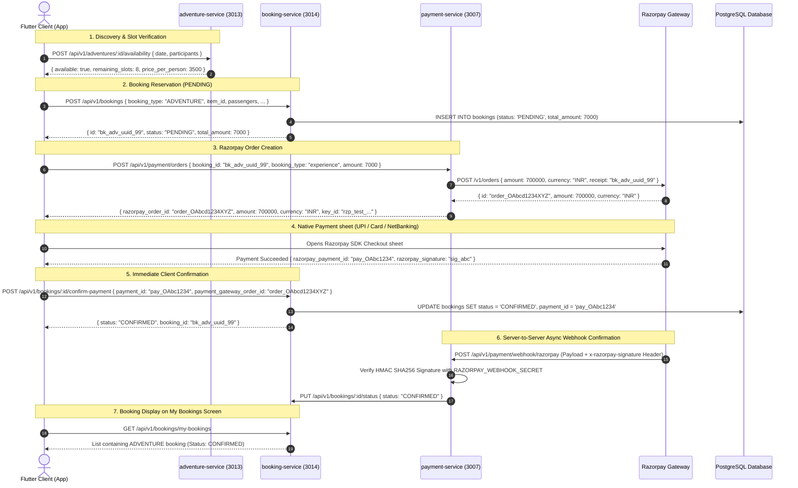

# Niklo — Adventures / Experiences Booking Module Production Backend Specification

> **Target Microservices**:
> - `adventure-service` (Port `3013`) — Base URL: `http://ra0qdnh3xfolrfu1y82bva9g.187.127.157.13.sslip.io` / `/api/v1/adventures`
> - `booking-service` (Port `3014`) — For Adventure Reservation & History (`/api/v1/bookings`)
> - `payment-service` (Port `3007`) — For Razorpay Payment Gateway & Webhooks (`/api/v1/payment`)
>
> **Frontend Module Consumers**:
> - Experience Discovery & Details: `lib/features/experience_booking/`
> - Checkout & Traveler Details: `lib/features/packages/presentation/screens/package_traveler_details_screen.dart` (shared flow)
> - Unified Bookings & History: `lib/features/bookings/`
> - Location Search: `lib/features/experience_booking/presentation/screens/experience_location_search_screen.dart`

---

## 📋 Table of Contents
1. [Backend Service Architecture & Endpoints Summary](#1-backend-service-architecture--endpoints-summary)
2. [Screen-by-Screen UI Audit & Static Data Analysis](#2-screen-by-screen-ui-audit--static-data-analysis)
3. [Complete Razorpay Booking Lifecycle & Payment Integration](#3-complete-razorpay-booking-lifecycle--payment-integration)
   - [3.1 End-to-End Mermaid Sequence Diagram](#31-end-to-end-mermaid-sequence-diagram)
   - [3.2 Step-by-Step Payment & Booking Flow](#32-step-by-step-payment--booking-flow)
   - [3.3 Razorpay Order Creation API (`POST /api/v1/payment/orders`)](#33-razorpay-order-creation-api-post-apiv1paymentorders)
   - [3.4 Flutter Razorpay Checkout SDK Setup & Handlers](#34-flutter-razorpay-checkout-sdk-setup--handlers)
   - [3.5 Client Payment Confirmation API (`POST /api/v1/bookings/:id/confirm-payment`)](#35-client-payment-confirmation-api-post-apiv1bookingsidconfirm-payment)
   - [3.6 Server-to-Server Razorpay HMAC SHA256 Webhook (`POST /api/v1/payment/webhook/razorpay`)](#36-server-to-server-razorpay-hmac-sha256-webhook-post-apiv1paymentwebhookrazorpay)
   - [3.7 My Bookings History Display Mapping (`GET /api/v1/bookings/my-bookings`)](#37-my-bookings-history-display-mapping-get-apiv1bookingsmy-bookings)
   - [3.8 Cancellation & Razorpay Instant Refund Flow](#38-cancellation--razorpay-instant-refund-flow)
4. [Database Schema & Migrations (`schema.sql`)](#4-database-schema--migrations-schemasql)
5. [TypeORM Entities (`adventure.entity.ts` & `adventure-review.entity.ts`)](#5-typeorm-entities-adventureentityts--adventure-reviewentityts)
6. [DTOs & API Contracts](#6-dtos--api-contracts)
   - [6.1 List Adventures with Query Filters (`GET /api/v1/adventures`)](#61-list-adventures-with-query-filters-get-apiv1adventures)
   - [6.2 Single Adventure Details (`GET /api/v1/adventures/:id`)](#62-single-adventure-details-get-apiv1adventuresid)
   - [6.3 Dynamic Categories API (`GET /api/v1/adventures/categories`)](#63-dynamic-categories-api-get-apiv1adventurescategories)
   - [6.4 Adventure Reviews API (`GET /api/v1/adventures/:id/reviews`)](#64-adventure-reviews-api-get-apiv1adventuresidreviews)
   - [6.5 Real Availability Slot Check (`POST /api/v1/adventures/:id/availability`)](#65-real-availability-slot-check-post-apiv1adventuresidavailability)
   - [6.6 Create Booking (`POST /api/v1/bookings`)](#66-create-booking-post-apiv1bookings)
7. [Complete Production Seed Data & SQL Scripts](#7-complete-production-seed-data--sql-scripts)
8. [cURL Verification & Test Suite](#8-curl-verification--test-suite)
9. [Summary of Developer Action Items](#9-summary-of-developer-action-items)

---

## 1. Backend Service Architecture & Endpoints Summary

> **Legend**:  
> ✅ = Fully Implemented in backend repo — UI calling directly  
> ⚠️ = Partially Implemented (exists in repo but needs filter/query improvements or returns mock/hardcoded data)  
> ❌ = **Missing** from repo — UI calls or needs this endpoint to be fully dynamic and production-ready

---

### 🔍 Production Audit — UI Screen → Endpoint Mapping

| Status | Service | Method | Route | Called By (UI Screen) | What UI Expects | Auth |
| :---: | :--- | :---: | :--- | :--- | :--- | :---: |
| ⚠️ | **Adventure** | `GET` | `/api/v1/adventures` | `experience_booking_screen.dart` & `experience_list_screen.dart` | Filterable list with `category`, `location`, `city`, `min_price`, `max_price`, `difficulty`, `is_trending`, `sort_by`, `page`, `limit` params | Public |
| ✅ | **Adventure** | `GET` | `/api/v1/adventures/:id` | `experience_details_screen.dart` | Full adventure object with `latitude`, `longitude`, `meeting_point`, `highlights`, `whats_included`, `what_to_bring`, `gallery_images` | Public |
| ⚠️ | **Adventure** | `GET` | `/api/v1/adventures/categories` | `experience_booking_screen.dart` (Browse by Adventure Type) | Dynamic list: `[{ id, title, imageUrl, count }]` | Public |
| ❌ | **Adventure** | `GET` | `/api/v1/adventures/:id/reviews` | `experience_details_screen.dart` (Reviews Tab) | Average rating, rating breakdown (Safety, Experience, Value), guest review list with pagination | Public |
| ❌ | **Adventure** | `POST` | `/api/v1/adventures/:id/reviews` | Reviews submission form (post-trip) | Submit guest review & update adventure rating | Bearer JWT |
| ⚠️ | **Adventure** | `POST` | `/api/v1/adventures/:id/availability` | `package_traveler_details_screen.dart` / Booking Flow | Check date slots & remaining capacity from database | Public |
| ✅ | **Adventure** | `POST` | `/api/v1/adventures` | Admin panel | Create adventure | Admin JWT |
| ✅ | **Adventure** | `PUT` | `/api/v1/adventures/:id` | Admin panel | Update adventure | Admin JWT |
| ✅ | **Adventure** | `DELETE` | `/api/v1/adventures/:id` | Admin panel | Soft delete adventure | Admin JWT |
| ❌ | **Booking** | `POST` | `/api/v1/bookings` | `package_traveler_details_screen.dart` | Create PENDING booking with `booking_type: "ADVENTURE"`, returns UUID | Bearer JWT |
| ❌ | **Booking** | `POST` | `/api/v1/bookings/:id/confirm-payment` | Razorpay checkout success handler | Flips booking status from `PENDING` to `CONFIRMED` | Bearer JWT |
| ❌ | **Booking** | `GET` | `/api/v1/bookings/my-bookings` | `bookings_screen.dart` | Aggregated list including ADVENTURE bookings | Bearer JWT |
| ❌ | **Payment** | `POST` | `/api/v1/payment/orders` | `payment_methods_screen.dart` | Create Razorpay order `{ razorpay_order_id, amount, currency, key_id }` | Bearer JWT |
| ❌ | **Payment** | `POST` | `/api/v1/payment/webhook/razorpay` | Razorpay Webhook (server-to-server) | HMAC SHA256 signature verification & async confirmation | Razorpay-Signature |
| ❌ | **Payment** | `POST` | `/api/v1/payment/refunds` | Cancellation flow | Initiates Razorpay instant refund on cancelled booking | Bearer JWT |

---

## 2. Screen-by-Screen UI Audit & Static Data Analysis

### Screen 1: `experience_booking_screen.dart` — Home / Discovery Screen

**Sections (in order):**
1. **Header + Search Form** (`experience_search_form.dart`)
   - `Location`: Connected to Google Places API (`ExperienceLocationSearchScreen`).
   - `Date`: DatePicker works with 1-year window.
   - `Adventure Type`: ⚠️ Hardcoded in Flutter `['Water Sports', 'Trekking', 'Camping', 'Sightseeing']`. **Backend Fix**: Must fetch from `GET /api/v1/adventures/categories`.
   - `Travelers`: Bottom sheet counter (1 to 20).
   - `Search Button`: Navigates to `ExperienceListScreen`. **Backend Fix**: Must accept query params in `GET /api/v1/adventures`.
2. **Popular Destinations** (`_PopularDestinationsSection`)
   - Current: Static destination cards (`Goa`, `Manali`, `Andaman`, `Kashmir`).
   - Tapping filters experiences by location name.
3. **Browse by Adventure Type** (`_BrowseByAdventureTypeSection`)
   - Current: 5 static categories with Unsplash photos.
   - **Backend Fix**: Connect to `GET /api/v1/adventures/categories` to return dynamic icons, counts, and category labels.
4. **Travel Memories Made Real** (`_TravelMemoriesSection`)
   - Circular story-ring UI (decorative). Static image assets are appropriate.
5. **Trending Adventures** (`_TrendingAdventuresSection`)
   - Connected to `experiencesProvider` calling `GET /api/v1/adventures`.
   - Renders `ExperienceCard` with dynamic price, duration, rating, network image.
6. **Exciting Offers for you** (`ExcitingOffersBanner`)
   - Static marketing card redirecting to wallet offers.

---

### Screen 2: `experience_list_screen.dart` — Search Results & Filters

- Calls `GET /api/v1/adventures` via Riverpod.
- Client-side Filter Chips:
  - Price: Under ₹1500, Above ₹1500, Low to High, High to Low
  - Category: Water Sports, Trekking, Air Sports, Wildlife, Nature Escapes
  - Difficulty: Easy, Moderate, Hard
- **Backend Fix**: Enable server-side filtering on `GET /api/v1/adventures?category=...&min_price=...&max_price=...&difficulty=...`.

---

### Screen 3: `experience_details_screen.dart` — Adventure Detail View

#### Tab-by-Tab Verification:
| Tab Index | Section Widget | Current Data Source | Required Backend Action |
|:---:|---|---|---|
| `0` | `ExperienceDetailsAboutSection` | `experience.aboutText` (`description`) | ✅ Real data from API |
| `1` | `ExperienceDetailsHighlightsSection` | `experience.highlights` (`highlights` JSONB) | ✅ Real data from API |
| `2` | `ExperienceDetailsIncludedSection` | `experience.whatsIncluded` (`whats_included` JSONB) | ✅ Real data from API |
| `3` | `ExperienceDetailsBringSection` | `experience.whatToBring` (`what_to_bring` JSONB) | ✅ Real data from API |
| `4` | `ExperienceDetailsReviewsSection` | ❌ **100% FAKE / HARDCODED** (2 fake reviews, static 4.8 score) | **Implement `GET /api/v1/adventures/:id/reviews`** |
| `5` | `ExperienceDetailsPhotosSection` | `experience.galleryImages` (`gallery_images` JSONB) | ✅ Real data from API |
| `6` | `ExperienceDetailsLocationSection` | ❌ **HARDCODED `if/else` coordinates** for 4 cities | **Return real `latitude`, `longitude`, `meeting_point` from DB** |
| `7` | `ExperienceDetailsRulesSection` | ⚠️ Real duration/group size + hardcoded cancellation/safety text | **Add `cancellation_policy` & `safety_guidelines` columns to DB** |

---

### Screen 4: `package_traveler_details_screen.dart` (Shared Booking Screen)

When user taps "Book Now" on `ExperienceDetailsBottomBar`:
```dart
context.push(
  AppRouter.packageTravelerDetails,
  extra: {
    'bookingType': 'experience',
    'id': experience.id,           // UUID -> item_id in booking-service
    'title': experience.title,
    'price': experience.price,
    'groupSize': experience.groupSize,
    'duration': experience.duration,
    'location': experience.location,
  },
);
```
- Validates traveler details (Full Name, Age, Gender) for each participant.
- Collects contact phone number and email address.
- Computes `total_amount = price * travelers`.
- Calls `POST /api/v1/bookings` with `booking_type: "ADVENTURE"`.

---

## 3. Complete Razorpay Booking Lifecycle & Payment Integration

### 3.1 End-to-End Mermaid Sequence Diagram



---

### 3.2 Step-by-Step Payment & Booking Flow

```
1. User selects Adventure & travelers (e.g. 2 travelers @ ₹3,500 = ₹7,000)
2. Taps "Book Now" -> Fills traveler names, ages, phone, email in traveler details
3. Taps "Continue to Payment"
4. [Step 1] POST /api/v1/bookings (booking-service) -> Creates PENDING booking UUID
5. [Step 2] POST /api/v1/payment/orders (payment-service) -> Generates Razorpay Order ID
6. [Step 3] Flutter opens Razorpay SDK native sheet
7. User pays via UPI / Card / NetBanking
8. [Step 4] POST /api/v1/bookings/:id/confirm-payment -> Flips booking to CONFIRMED
9. [Step 5] POST /api/v1/payment/webhook/razorpay -> Razorpay independently verifies signature
10. Booking appears on bookings_screen.dart under Active Tab with Hiking Badge
```

---

### 3.3 Razorpay Order Creation API (`POST /api/v1/payment/orders`)

**UI Caller:** `payment_methods_screen.dart`  
**Endpoint:** `http://payment-service:3007/api/v1/payment/orders`  
**Auth:** `Bearer <JWT>`

#### Request Payload:
```json
{
  "booking_id": "b8f3a2c1-1234-5678-abcd-ef0123456789",
  "booking_type": "experience",
  "amount": 7000.00
}
```

#### Success Response (200 OK):
```json
{
  "success": true,
  "statusCode": 200,
  "data": {
    "razorpay_order_id": "order_OAbcd1234XYZ",
    "amount": 700000,
    "currency": "INR",
    "key_id": "rzp_test_XXXXXXXXXXXX"
  }
}
```

---

### 3.4 Flutter Razorpay Checkout SDK Setup & Handlers

In `payment_methods_screen.dart` / `RazorpayService`:

```dart
import 'package:razorpay_flutter/razorpay_flutter.dart';

void openRazorpayCheckout({
  required String razorpayOrderId,
  required int amountInPaise,
  required String keyId,
  required String bookingId,
  required String userEmail,
  required String userPhone,
  required String adventureTitle,
}) {
  final Razorpay razorpay = Razorpay();

  razorpay.on(Razorpay.EVENT_PAYMENT_SUCCESS, (PaymentSuccessResponse response) async {
    // 1. Confirm payment immediately with booking-service
    await bookingRepository.confirmPayment(
      bookingId: bookingId,
      paymentId: response.paymentId!,
      orderId: response.orderId ?? razorpayOrderId,
      signature: response.signature,
    );
    
    // 2. Navigate to Booking Success Screen
    context.go(AppRouter.bookingSuccess, extra: {'bookingId': bookingId});
    razorpay.clear();
  });

  razorpay.on(Razorpay.EVENT_PAYMENT_ERROR, (PaymentFailureResponse response) {
    ScaffoldMessenger.of(context).showSnackBar(
      SnackBar(content: Text('Payment Failed: ${response.message}')),
    );
    razorpay.clear();
  });

  razorpay.on(Razorpay.EVENT_EXTERNAL_WALLET, (ExternalWalletResponse response) {
    // Handle external wallet (e.g. Paytm / Mobikwik)
  });

  final options = {
    'key': keyId,
    'amount': amountInPaise, // 700000 for ₹7000.00
    'name': 'Niklo Travel',
    'order_id': razorpayOrderId,
    'description': 'Booking for $adventureTitle',
    'timeout': 300, // 5 minutes
    'prefill': {
      'contact': userPhone,
      'email': userEmail,
    },
    'theme': {
      'color': '#0EA5E9', // AppColors.primary
    },
    'notes': {
      'booking_id': bookingId,
      'booking_type': 'ADVENTURE',
    }
  };

  razorpay.open(options);
}
```

---

### 3.5 Client Payment Confirmation API (`POST /api/v1/bookings/:id/confirm-payment`)

**UI Caller:** `booking_repository.dart` → `confirmPayment()`  
**Auth:** `Bearer <JWT>`

#### Request Payload:
```json
{
  "payment_id": "pay_OAbc1234XYZ",
  "payment_gateway_order_id": "order_OAbcd1234XYZ",
  "signature": "e5b3c4a2d1f0e9..."
}
```

#### Success Response (200 OK):
```json
{
  "success": true,
  "statusCode": 200,
  "data": {
    "id": "b8f3a2c1-1234-5678-abcd-ef0123456789",
    "booking_type": "ADVENTURE",
    "status": "CONFIRMED",
    "item_id": "exp_scuba_goa_01",
    "total_amount": "7000.00",
    "payment_id": "pay_OAbc1234XYZ",
    "boarding_point": "Grand Island, Goa",
    "travel_date": "2025-12-20T00:00:00.000Z",
    "updated_at": "2025-11-01T11:00:00.000Z"
  }
}
```

---

### 3.6 Server-to-Server Razorpay HMAC SHA256 Webhook (`POST /api/v1/payment/webhook/razorpay`)

Triggered automatically by Razorpay upon successful capture (`payment.captured` or `order.paid`).

#### Required Security Header:
`x-razorpay-signature: <HMAC_SHA256_HEX>`

#### NestJS Verification Snippet:
```typescript
import * as crypto from 'crypto';

@Post('webhook/razorpay')
async handleRazorpayWebhook(
  @Req() req: Request,
  @Headers('x-razorpay-signature') signature: string,
  @Body() payload: any,
) {
  const secret = process.env.RAZORPAY_WEBHOOK_SECRET;
  const expectedSignature = crypto
    .createHmac('sha256', secret)
    .update(JSON.stringify(payload))
    .digest('hex');

  if (signature !== expectedSignature) {
    throw new UnauthorizedException('Invalid Razorpay webhook signature');
  }

  const event = payload.event;
  if (event === 'payment.captured' || event === 'order.paid') {
    const bookingId = payload.payload.payment.entity.notes.booking_id;
    const paymentId = payload.payload.payment.entity.id;
    await this.bookingService.markConfirmed(bookingId, paymentId);
  }

  return { status: 'ok' };
}
```

---

### 3.7 My Bookings History Display Mapping (`GET /api/v1/bookings/my-bookings`)

**UI Caller:** `bookings_screen.dart` → `myBookingsProvider`  
**Endpoint:** `http://booking-service:3014/api/v1/bookings/my-bookings`

#### Expected JSON Item in Response Array:
```json
{
  "id": "b8f3a2c1-1234-5678-abcd-ef0123456789",
  "booking_type": "ADVENTURE",
  "status": "CONFIRMED",
  "boarding_point": "Grand Island, Goa",
  "dropping_point": "",
  "seat_numbers": [],
  "travel_date": "2025-12-20T00:00:00.000Z",
  "end_date": null,
  "total_amount": "7000.00",
  "payment_id": "pay_OAbc1234XYZ",
  "contact_email": "anish@example.com",
  "contact_phone": "9876543210",
  "passenger_details": [
    { "name": "Anish Das", "age": 28, "gender": "Male" },
    { "name": "Priya Das", "age": 25, "gender": "Female" }
  ],
  "fare_breakdown": {
    "base": 7000,
    "taxes": 0,
    "total": 7000
  },
  "created_at": "2025-11-01T10:30:00.000Z"
}
```

#### Flutter UI Rendering Rule on `bookings_screen.dart`:
- `booking_type == "ADVENTURE"`:
  - Icon: `Icons.hiking_rounded` or `Icons.explore_rounded`
  - Chip Label: `'Experience'`
  - Title: Displays `boarding_point` (e.g. "Grand Island, Goa")
  - Subtitle: `2 Travelers • 20 Dec 2025`
  - Dropping point arrow: **Hidden** (adventures are single-location activities)

---

### 3.8 Cancellation & Razorpay Instant Refund Flow

When a user cancels an adventure booking:
1. `POST /api/v1/bookings/:id/cancel`
2. Backend checks `cancellation_policy`:
   - > 24 hours prior to `travel_date`: **100% Refund**
   - 12–24 hours prior: **50% Refund**
   - < 12 hours: **0% Refund**
3. Backend triggers Razorpay Refund API:
   - `POST https://api.razorpay.com/v1/payments/{payment_id}/refund` with `{ "amount": refund_amount_in_paise }`
4. Booking status updated to `CANCELLED` and `refund_id` logged.

---

## 4. Database Schema & Migrations (`schema.sql`)

Run the following SQL migrations in PostgreSQL database:

```sql
-- Enable UUID extension
CREATE EXTENSION IF NOT EXISTS "uuid-ossp";

-- 1. Main Adventures Table
CREATE TABLE IF NOT EXISTS travel_adventures (
  id UUID PRIMARY KEY DEFAULT uuid_generate_v4(),
  title VARCHAR(255) NOT NULL,
  description TEXT NOT NULL,
  price NUMERIC(10, 2) NOT NULL,
  original_price NUMERIC(10, 2),
  discount_percent INT DEFAULT 0,
  duration_hours INT NOT NULL,
  location VARCHAR(255) NOT NULL,
  city VARCHAR(100) DEFAULT 'Goa',
  category VARCHAR(100) DEFAULT 'Adventure',
  meeting_point TEXT DEFAULT 'Activity Headquarters',
  latitude NUMERIC(10, 6),
  longitude NUMERIC(10, 6),
  rating NUMERIC(3, 2) DEFAULT 4.8,
  reviews_count INT DEFAULT 120,
  difficulty VARCHAR(50) DEFAULT 'Moderate',
  group_size VARCHAR(100) DEFAULT 'Up to 10 People',
  image_url TEXT,
  gallery_images JSONB DEFAULT '[]'::jsonb,
  highlights JSONB DEFAULT '[]'::jsonb,
  whats_included JSONB DEFAULT '[]'::jsonb,
  what_to_bring JSONB DEFAULT '[]'::jsonb,
  cancellation_policy TEXT DEFAULT 'Free cancellation 24h prior',
  safety_guidelines TEXT DEFAULT 'Follow pilot/guide instructions strictly',
  min_age INT DEFAULT 10,
  max_participants INT DEFAULT 15,
  is_trending BOOLEAN DEFAULT FALSE,
  is_featured BOOLEAN DEFAULT FALSE,
  is_active BOOLEAN DEFAULT TRUE,
  created_at TIMESTAMPTZ DEFAULT NOW(),
  updated_at TIMESTAMPTZ DEFAULT NOW()
);

CREATE INDEX IF NOT EXISTS idx_adventures_category ON travel_adventures(category);
CREATE INDEX IF NOT EXISTS idx_adventures_city ON travel_adventures(city);
CREATE INDEX IF NOT EXISTS idx_adventures_price ON travel_adventures(price);
CREATE INDEX IF NOT EXISTS idx_adventures_is_active ON travel_adventures(is_active);

-- 2. Adventure Reviews Table (New)
CREATE TABLE IF NOT EXISTS adventure_reviews (
  id UUID PRIMARY KEY DEFAULT uuid_generate_v4(),
  adventure_id UUID NOT NULL REFERENCES travel_adventures(id) ON DELETE CASCADE,
  user_id UUID,
  user_name VARCHAR(100) NOT NULL,
  user_avatar TEXT,
  rating NUMERIC(3, 1) NOT NULL CHECK (rating >= 1.0 AND rating <= 5.0),
  comment TEXT,
  safety_rating NUMERIC(3, 1) DEFAULT 5.0,
  experience_rating NUMERIC(3, 1) DEFAULT 5.0,
  value_rating NUMERIC(3, 1) DEFAULT 5.0,
  created_at TIMESTAMPTZ DEFAULT NOW(),
  updated_at TIMESTAMPTZ DEFAULT NOW()
);

CREATE INDEX IF NOT EXISTS idx_adventure_reviews_adv_id ON adventure_reviews(adventure_id);

-- 3. Adventure Daily Availability & Slots Table (New)
CREATE TABLE IF NOT EXISTS adventure_slots (
  id UUID PRIMARY KEY DEFAULT uuid_generate_v4(),
  adventure_id UUID NOT NULL REFERENCES travel_adventures(id) ON DELETE CASCADE,
  slot_date DATE NOT NULL,
  time_slot VARCHAR(50) NOT NULL, -- e.g. "07:30 AM", "10:30 AM", "01:30 PM"
  total_capacity INT NOT NULL DEFAULT 15,
  booked_slots INT NOT NULL DEFAULT 0,
  is_available BOOLEAN DEFAULT TRUE,
  created_at TIMESTAMPTZ DEFAULT NOW(),
  UNIQUE(adventure_id, slot_date, time_slot)
);

CREATE INDEX IF NOT EXISTS idx_adventure_slots_date ON adventure_slots(adventure_id, slot_date);
```

---

## 5. TypeORM Entities (`adventure.entity.ts` & `adventure-review.entity.ts`)

### `adventure.entity.ts`
```typescript
import {
  Entity,
  PrimaryGeneratedColumn,
  Column,
  CreateDateColumn,
  UpdateDateColumn,
  OneToMany,
} from 'typeorm';
import { AdventureReview } from './adventure-review.entity';

@Entity('travel_adventures')
export class TravelAdventure {
  @PrimaryGeneratedColumn('uuid')
  id: string;

  @Column({ type: 'varchar', length: 255 })
  title: string;

  @Column({ type: 'text' })
  description: string;

  @Column({ type: 'numeric', precision: 10, scale: 2 })
  price: number;

  @Column({ type: 'numeric', precision: 10, scale: 2, nullable: true })
  original_price: number;

  @Column({ type: 'int', default: 0 })
  discount_percent: number;

  @Column({ type: 'int' })
  duration_hours: number;

  @Column({ type: 'varchar', length: 255 })
  location: string;

  @Column({ type: 'varchar', length: 100, default: 'Goa' })
  city: string;

  @Column({ type: 'varchar', length: 100, default: 'Water Sports' })
  category: string;

  @Column({ type: 'text', default: 'Activity Headquarters' })
  meeting_point: string;

  @Column({ type: 'numeric', precision: 10, scale: 6, nullable: true })
  latitude: number;

  @Column({ type: 'numeric', precision: 10, scale: 6, nullable: true })
  longitude: number;

  @Column({ type: 'numeric', precision: 3, scale: 2, default: 4.8 })
  rating: number;

  @Column({ type: 'int', default: 120 })
  reviews_count: number;

  @Column({ type: 'varchar', length: 50, default: 'Moderate' })
  difficulty: string;

  @Column({ type: 'varchar', length: 100, default: 'Up to 10 People' })
  group_size: string;

  @Column({ type: 'text', nullable: true })
  image_url: string;

  @Column({ type: 'jsonb', default: [] })
  gallery_images: string[];

  @Column({ type: 'jsonb', default: [] })
  highlights: string[];

  @Column({ type: 'jsonb', default: [] })
  whats_included: string[];

  @Column({ type: 'jsonb', default: [] })
  what_to_bring: string[];

  @Column({ type: 'text', default: 'Free cancellation 24h prior' })
  cancellation_policy: string;

  @Column({ type: 'text', default: 'Follow pilot/guide instructions strictly' })
  safety_guidelines: string;

  @Column({ type: 'int', default: 10 })
  min_age: number;

  @Column({ type: 'int', default: 15 })
  max_participants: number;

  @Column({ type: 'boolean', default: false })
  is_trending: boolean;

  @Column({ type: 'boolean', default: false })
  is_featured: boolean;

  @Column({ type: 'boolean', default: true })
  is_active: boolean;

  @OneToMany(() => AdventureReview, (review) => review.adventure)
  reviews: AdventureReview[];

  @CreateDateColumn()
  created_at: Date;

  @UpdateDateColumn()
  updated_at: Date;
}
```

---

## 6. DTOs & API Contracts

### 6.1 List Adventures with Query Filters (`GET /api/v1/adventures`)

#### Query Parameters:
```
GET /api/v1/adventures?category=Water+Sports&location=Goa&min_price=1000&max_price=5000&difficulty=Easy&is_trending=true&sort_by=price_asc&page=1&limit=20
```

#### Response (200 OK):
```json
{
  "success": true,
  "statusCode": 200,
  "data": [
    {
      "id": "exp_scuba_goa_01",
      "title": "Grand Island Scuba Diving & Water Sports",
      "description": "Dive into the crystal-clear waters of the Arabian Sea at Grand Island, Goa...",
      "price": 3500.00,
      "original_price": 4500.00,
      "discount_percent": 22,
      "duration_hours": 6,
      "duration": "6 Hours",
      "location": "Grand Island, Goa",
      "city": "Goa",
      "category": "Water Sports",
      "meeting_point": "Malim Jetty, Panaji, Goa - 403001",
      "latitude": 15.5011,
      "longitude": 73.8244,
      "rating": 4.9,
      "reviews_count": 342,
      "difficulty": "Easy",
      "group_size": "Up to 15 People",
      "image_url": "https://images.unsplash.com/photo-1544551763-46a013bb70d5?w=800&auto=format&fit=crop",
      "gallery_images": [
        "https://images.unsplash.com/photo-1544551763-46a013bb70d5?w=800&auto=format&fit=crop",
        "https://images.unsplash.com/photo-1682687220063-4742bd7fd538?w=800&auto=format&fit=crop"
      ],
      "highlights": ["Underwater Photos Included", "PADI Instructor", "Boat Ride"],
      "whats_included": ["Full Equipment", "Buffet Lunch", "Speedboat Transfer"],
      "what_to_bring": ["Swimwear", "Valid Government ID"],
      "cancellation_policy": "Free cancellation 24h prior. 50% refund within 12h.",
      "safety_guidelines": "Follow PADI instructor at all times. No diving if unwell.",
      "is_trending": true,
      "is_active": true
    }
  ],
  "meta": {
    "total": 42,
    "page": 1,
    "limit": 20
  }
}
```

---

### 6.2 Single Adventure Details (`GET /api/v1/adventures/:id`)

Returns exact single object including `latitude`, `longitude`, and `meeting_point` for the Google Map component.

---

### 6.3 Dynamic Categories API (`GET /api/v1/adventures/categories`)

#### Response (200 OK):
```json
{
  "success": true,
  "statusCode": 200,
  "data": [
    {
      "id": "cat_water",
      "title": "Water Sports",
      "imageUrl": "https://images.unsplash.com/photo-1530866495561-507c9faab2ed?auto=format&fit=crop&w=300",
      "count": 12
    },
    {
      "id": "cat_trek",
      "title": "Trekking",
      "imageUrl": "https://images.unsplash.com/photo-1501555088652-021faa106b9b?auto=format&fit=crop&w=300",
      "count": 8
    },
    {
      "id": "cat_air",
      "title": "Air Sports",
      "imageUrl": "https://images.unsplash.com/photo-1516738901171-8eb4fc13bd20?auto=format&fit=crop&w=300",
      "count": 5
    },
    {
      "id": "cat_camp",
      "title": "Camping",
      "imageUrl": "https://images.unsplash.com/photo-1504280390367-361c6d9f38f4?auto=format&fit=crop&w=300",
      "count": 6
    },
    {
      "id": "cat_nature",
      "title": "Nature Escapes",
      "imageUrl": "https://images.unsplash.com/photo-1441974231531-c6227db76b6e?auto=format&fit=crop&w=300",
      "count": 4
    },
    {
      "id": "cat_wildlife",
      "title": "Wildlife",
      "imageUrl": "https://images.unsplash.com/photo-1542397284385-6010376c5302?auto=format&fit=crop&w=300",
      "count": 3
    }
  ]
}
```

---

### 6.4 Adventure Reviews API (`GET /api/v1/adventures/:id/reviews`)

#### Response (200 OK):
```json
{
  "success": true,
  "statusCode": 200,
  "data": {
    "average_rating": 4.9,
    "total_reviews": 342,
    "rating_breakdown": {
      "safety": 4.9,
      "experience": 4.8,
      "value_for_money": 4.9
    },
    "reviews": [
      {
        "id": "rev_01",
        "user_name": "Arjun Sharma",
        "user_avatar": null,
        "rating": 5.0,
        "comment": "Absolutely thrilling! PADI instructor was excellent, safety was top priority, and underwater photos came out stunning.",
        "created_at": "2025-10-15T08:00:00Z"
      },
      {
        "id": "rev_02",
        "user_name": "Priya Patel",
        "user_avatar": null,
        "rating": 4.7,
        "comment": "Amazing adventure! Well organized and we had so much fun. Will definitely book again on our next trip.",
        "created_at": "2025-10-10T09:30:00Z"
      }
    ]
  }
}
```

---

### 6.5 Real Availability Slot Check (`POST /api/v1/adventures/:id/availability`)

#### Request Payload:
```json
{
  "date": "2025-12-20",
  "participants": 2
}
```

#### Response (200 OK):
```json
{
  "success": true,
  "statusCode": 200,
  "data": {
    "adventure_id": "exp_scuba_goa_01",
    "date": "2025-12-20",
    "available": true,
    "remaining_slots": 8,
    "price_per_person": 3500.00,
    "total_price": 7000.00,
    "time_slots": ["07:30 AM", "10:30 AM", "01:30 PM"]
  }
}
```

---

### 6.6 Create Booking (`POST /api/v1/bookings`)

**Service:** `booking-service` (Port `3014`)  
**Auth:** `Bearer <JWT>`

#### Request Payload:
```json
{
  "booking_type": "ADVENTURE",
  "item_id": "exp_scuba_goa_01",
  "passenger_details": [
    { "name": "Anish Das", "age": 28, "gender": "Male" },
    { "name": "Priya Das", "age": 25, "gender": "Female" }
  ],
  "fare_breakdown": {
    "base": 7000,
    "taxes": 0,
    "total": 7000
  },
  "total_amount": 7000,
  "boarding_point": "Grand Island, Goa",
  "travel_date": "2025-12-20",
  "contact_email": "anish@example.com",
  "contact_phone": "9876543210"
}
```

---

## 7. Complete Production Seed Data & SQL Scripts

```sql
-- Clean old data
DELETE FROM adventure_reviews WHERE adventure_id IN (
  'exp_scuba_goa_01','exp_rafting_rish_02','exp_paragliding_man_03',
  'exp_seawalk_and_04','exp_skiing_gul_05','exp_safari_jai_06'
);
DELETE FROM travel_adventures WHERE id IN (
  'exp_scuba_goa_01','exp_rafting_rish_02','exp_paragliding_man_03',
  'exp_seawalk_and_04','exp_skiing_gul_05','exp_safari_jai_06'
);

INSERT INTO travel_adventures (
  id, title, description, price, original_price, discount_percent,
  duration_hours, location, city, category, meeting_point, latitude, longitude,
  rating, reviews_count, difficulty, group_size, image_url, gallery_images,
  highlights, whats_included, what_to_bring, cancellation_policy, safety_guidelines,
  is_trending, is_featured, is_active
) VALUES
(
  'exp_scuba_goa_01',
  'Grand Island Scuba Diving & Water Sports',
  'Dive into the crystal-clear Arabian Sea at Grand Island, Goa. Experience vibrant coral reefs, colorful marine life, and underwater photography guided by certified PADI instructors.',
  3500.00, 4500.00, 22, 6,
  'Grand Island, Goa', 'Goa', 'Water Sports',
  'Malim Jetty, Panaji, Goa - 403001', 15.5011, 73.8244,
  4.9, 342, 'Easy', 'Up to 15 People',
  'https://images.unsplash.com/photo-1544551763-46a013bb70d5?auto=format&fit=crop&w=800&q=80',
  ARRAY[
    'https://images.unsplash.com/photo-1544551763-46a013bb70d5?auto=format&fit=crop&w=800&q=80',
    'https://images.unsplash.com/photo-1682687220063-4742bd7fd538?auto=format&fit=crop&w=800&q=80',
    'https://images.unsplash.com/photo-1507525428034-b723cf961d3e?auto=format&fit=crop&w=800&q=80'
  ],
  ARRAY['Underwater Photos Included', 'PADI Certified Dive Master', 'Speedboat to Grand Island', 'Dolphin Spotting', '5 Water Sports Included'],
  ARRAY['Full Scuba Equipment & Wet Suit', '5 Water Sports Activities', 'Buffet Lunch & Soft Drinks', 'Speedboat Transfer'],
  ARRAY['Swimwear or quick-dry clothes', 'Valid Government Photo ID', 'Sunscreen & Sunglasses'],
  'Free cancellation 24h prior. 50% refund within 12h.', 'Follow PADI instructor at all times. No diving if unwell.',
  TRUE, TRUE, TRUE
),
(
  'exp_rafting_rish_02',
  'Ganges White Water River Rafting 16 KM',
  'Conquer thrilling Grade III-IV rapids like Roller Coaster and Golf Course on the holy Ganges in Rishikesh. Includes cliff jumping and body surfing at marine drive.',
  1299.00, 1800.00, 28, 4,
  'Shivpuri to Rishikesh, Uttarakhand', 'Rishikesh', 'Water Sports',
  'Shivpuri Rafting Camp, Shivpuri, Rishikesh - 249201', 30.0869, 78.2676,
  4.8, 512, 'Moderate', '8-10 Per Raft',
  'https://images.unsplash.com/photo-1530866495561-507c9faab2ed?auto=format&fit=crop&w=800&q=80',
  ARRAY[
    'https://images.unsplash.com/photo-1530866495561-507c9faab2ed?auto=format&fit=crop&w=800&q=80',
    'https://images.unsplash.com/photo-1470071459604-3b5ec3a7fe05?auto=format&fit=crop&w=800&q=80'
  ],
  ARRAY['16 km river run on major rapids', 'Cliff jumping & body surfing', 'Imported self-bailing rafts', 'Safety kayaks alongside'],
  ARRAY['Life Jackets & Helmets', 'Professional River Guide', 'Transport to start point'],
  ARRAY['Quick-dry t-shirt and shorts', 'Strap sandals or water shoes', 'Waterproof phone pouch'],
  'Free cancellation 24h prior.', 'Wear life jacket at all times. Listen to guide strictly on rapids.',
  TRUE, TRUE, TRUE
),
(
  'exp_paragliding_man_03',
  'Solang Valley High Fly Paragliding',
  'Soar above snow-capped Himalayan peaks and cedar forests with tandem paragliding from Solang Valley. 15-20 minutes thermal flight with panoramic views of Rohtang Pass.',
  2499.00, 3000.00, 17, 2,
  'Solang Valley, Manali, Himachal Pradesh', 'Manali', 'Air Sports',
  'Solang Valley Ropeway Base Station, Manali - 175131', 32.3327, 77.1546,
  4.9, 420, 'Easy', '1 on 1 with Pilot',
  'https://images.unsplash.com/photo-1516738901171-8eb4fc13bd20?auto=format&fit=crop&w=800&q=80',
  ARRAY[
    'https://images.unsplash.com/photo-1516738901171-8eb4fc13bd20?auto=format&fit=crop&w=800&q=80',
    'https://images.unsplash.com/photo-1464822759023-fed622ff2c3b?auto=format&fit=crop&w=800&q=80'
  ],
  ARRAY['15-20 min thermal flight at high altitude', 'Rohtang Pass panoramic view', 'Licensed certified aviator', '4K GoPro recording included'],
  ARRAY['Certified tandem harness & gear', 'Safety helmet & briefing', 'Ropeway to takeoff'],
  ARRAY['Warm jacket or windcheater', 'Sports shoes or trekking boots', 'Sunglasses with strap'],
  'Non-refundable if weather cancellation. Rescheduled at no cost.', 'Follow pilot instructions strictly. No loose items during flight.',
  TRUE, TRUE, TRUE
),
(
  'exp_seawalk_and_04',
  'Havelock Island Underwater Sea Walk',
  'Walk on the ocean bed without any swimming skills! Breathe naturally through a specialized helmet and walk among tropical corals and reef fish at Elephant Beach.',
  3999.00, 4500.00, 11, 2,
  'Elephant Beach, Havelock, Andaman', 'Andaman', 'Water Sports',
  'Havelock Jetty, Swaraj Dweep, Andaman - 744211', 11.9855, 92.9928,
  4.9, 198, 'Easy', 'Up to 6 People',
  'https://images.unsplash.com/photo-1682687220063-4742bd7fd538?auto=format&fit=crop&w=800&q=80',
  ARRAY[
    'https://images.unsplash.com/photo-1682687220063-4742bd7fd538?auto=format&fit=crop&w=800&q=80',
    'https://images.unsplash.com/photo-1586359716568-3e1907e4cf9f?auto=format&fit=crop&w=800&q=80'
  ],
  ARRAY['No swimming required', 'Walk 6-7m deep on sea floor', 'Interact with clownfish & sea turtles', 'Personal underwater guide'],
  ARRAY['Sea walk helmet & air supply', 'Certified safety marshals', 'Speedboat transfer', 'Complimentary underwater photos'],
  ARRAY['Beachwear or swimming costume', 'Towel and dry clothes', 'Waterproof sunblock SPF 50+'],
  'Free cancellation 48h prior.', 'No diving if asthmatic or heart condition. Follow instructor exactly.',
  FALSE, TRUE, TRUE
),
(
  'exp_skiing_gul_05',
  'Gulmarg Snow Skiing & Gondola Tour',
  'Experience world-class powder snow slopes in Gulmarg with expert instructors and the highest cable car in Asia. Perfect for beginners and intermediate skiers.',
  4999.00, 6000.00, 17, 5,
  'Gulmarg, Jammu & Kashmir', 'Gulmarg', 'Trekking',
  'Gulmarg Gondola Station, Gulmarg, J&K - 193403', 34.0494, 74.3816,
  5.0, 265, 'Moderate', 'Small Groups of 4',
  'https://images.unsplash.com/photo-1595815771614-ade9d652a65d?auto=format&fit=crop&w=800&q=80',
  ARRAY[
    'https://images.unsplash.com/photo-1595815771614-ade9d652a65d?auto=format&fit=crop&w=800&q=80',
    'https://images.unsplash.com/photo-1551698618-1dfe5d97d256?auto=format&fit=crop&w=800&q=80'
  ],
  ARRAY['Skiing on natural Himalayan powder snow', 'Gulmarg Gondola Phase 1 & 2 access', 'Certified ski instructor', 'Views of Apharwat Peak at 4200m'],
  ARRAY['Professional Ski Equipment & Boots', 'Instructor fees & beginner lesson', 'Safety gear & thermal gloves'],
  ARRAY['Heavy winter jacket and snow trousers', 'Thermal inner wear', 'UV sunglasses & cold cream'],
  'Non-refundable. Rescheduled free if weather cancellation.', 'Stay on marked slopes. Follow instructor commands.',
  TRUE, TRUE, TRUE
),
(
  'exp_safari_jai_06',
  'Thar Desert Dune Bashing & Camel Safari',
  'Ride the golden dunes of Thar on high-speed 4x4 jeeps, enjoy sunset camel safaris, and experience Rajasthani cultural folk night with dinner under the stars at Sam Sand Dunes.',
  1899.00, 2500.00, 24, 4,
  'Sam Sand Dunes, Jaisalmer, Rajasthan', 'Jaisalmer', 'Wildlife',
  'Sam Sand Dune Gate, Jaisalmer - 345001', 26.8770, 70.5757,
  4.8, 388, 'Easy', 'Up to 6 Per Jeep',
  'https://images.unsplash.com/photo-1542397284385-6010376c5302?auto=format&fit=crop&w=800&q=80',
  ARRAY[
    'https://images.unsplash.com/photo-1542397284385-6010376c5302?auto=format&fit=crop&w=800&q=80',
    'https://images.unsplash.com/photo-1509316975850-ff9c5deb0cd9?auto=format&fit=crop&w=800&q=80'
  ],
  ARRAY['High-adrenaline 4x4 dune bashing at sunset', 'Camel ride into deep dunes', 'Kalbelia dance & music evening', 'Traditional campfire & stargazing'],
  ARRAY['4x4 Jeep Safari & Camel Ride', 'Evening Cultural Program entry', 'Traditional welcome tea & refreshments'],
  ARRAY['Comfortable cotton clothing', 'Scarf or dupatta to protect from sand', 'Sunglasses and charged camera'],
  'Free cancellation 24h prior.', 'Fasten seatbelts in jeep at all times. Avoid loose flowing clothing.',
  FALSE, TRUE, TRUE
);

-- Seed Real Reviews
INSERT INTO adventure_reviews (adventure_id, user_name, rating, comment, safety_rating, experience_rating, value_rating) VALUES
('exp_scuba_goa_01',    'Arjun Sharma', 5.0, 'Absolutely thrilling! PADI instructor was excellent, safety was top priority, photos came out stunning.', 5.0, 5.0, 4.8),
('exp_scuba_goa_01',    'Priya Patel',  4.7, 'Amazing adventure! Well organized and great fun. Will definitely book again on next trip.', 4.8, 4.7, 4.6),
('exp_rafting_rish_02', 'Rahul Verma',  4.9, 'Best rafting experience of my life! Grade IV rapids were insane. Worth every rupee.', 4.9, 5.0, 4.8),
('exp_paragliding_man_03','Sneha Gupta',5.0, 'Flying over the Himalayas is surreal. Pilot was professional and kept me calm throughout.', 5.0, 5.0, 4.9),
('exp_skiing_gul_05',   'Vikram Nair',  4.8, 'Powder snow was unreal! Great instructor for beginners. Gondola views are breathtaking.', 4.9, 4.8, 4.7);

-- Sync average rating and review counts
UPDATE travel_adventures t SET
  rating        = sub.avg_rating,
  reviews_count = sub.cnt
FROM (
  SELECT adventure_id,
         ROUND(AVG(rating)::numeric, 1) AS avg_rating,
         COUNT(*) AS cnt
  FROM adventure_reviews GROUP BY adventure_id
) sub
WHERE t.id = sub.adventure_id;
```

---

## 8. cURL Verification & Test Suite

```bash
# Target host configurations
ADV_BASE="http://ra0qdnh3xfolrfu1y82bva9g.187.127.157.13.sslip.io"
BK_BASE="http://localhost:3014"
PAY_BASE="http://localhost:3007"
TOKEN="eyJhbGciOiJIUzI1NiIsInR5cCI6IkpXVCJ9..." # Test user Bearer Token

# 1. Fetch all adventures
curl -s "$ADV_BASE/api/v1/adventures" | python -m json.tool

# 2. Filter adventures by Category and Price Range
curl -s "$ADV_BASE/api/v1/adventures?category=Water+Sports&location=Goa&min_price=1000&max_price=5000&page=1&limit=10" | python -m json.tool

# 3. Fetch Adventure Details (Verify latitude, longitude, and meeting_point)
curl -s "$ADV_BASE/api/v1/adventures/exp_scuba_goa_01" | python -m json.tool

# 4. Fetch Dynamic Categories
curl -s "$ADV_BASE/api/v1/adventures/categories" | python -m json.tool

# 5. Fetch Adventure Reviews
curl -s "$ADV_BASE/api/v1/adventures/exp_scuba_goa_01/reviews" | python -m json.tool

# 6. Check Slot Availability
curl -s -X POST "$ADV_BASE/api/v1/adventures/exp_scuba_goa_01/availability" \
  -H "Content-Type: application/json" \
  -d '{"date": "2025-12-20", "participants": 2}' | python -m json.tool

# 7. Create Adventure Booking in booking-service
BOOKING_RES=$(curl -s -X POST "$BK_BASE/api/v1/bookings" \
  -H "Content-Type: application/json" \
  -H "Authorization: Bearer $TOKEN" \
  -d '{
    "booking_type": "ADVENTURE",
    "item_id": "exp_scuba_goa_01",
    "passenger_details": [{"name": "Anish Das", "age": 28, "gender": "Male"}],
    "fare_breakdown": {"base": 3500, "taxes": 0, "total": 3500},
    "total_amount": 3500,
    "boarding_point": "Grand Island, Goa",
    "travel_date": "2025-12-20",
    "contact_email": "anish@niklo.com",
    "contact_phone": "9876543210"
  }')
echo $BOOKING_RES | python -m json.tool

# 8. Create Razorpay Payment Order
curl -s -X POST "$PAY_BASE/api/v1/payment/orders" \
  -H "Content-Type: application/json" \
  -H "Authorization: Bearer $TOKEN" \
  -d '{
    "booking_id": "b8f3a2c1-1234-5678-abcd-ef0123456789",
    "booking_type": "experience",
    "amount": 3500
  }' | python -m json.tool

# 9. Confirm Booking Payment
curl -s -X POST "$BK_BASE/api/v1/bookings/b8f3a2c1-1234-5678-abcd-ef0123456789/confirm-payment" \
  -H "Content-Type: application/json" \
  -H "Authorization: Bearer $TOKEN" \
  -d '{
    "payment_id": "pay_test_987654321",
    "payment_gateway_order_id": "order_test_12345678"
  }' | python -m json.tool

# 10. Verify My Bookings History contains Adventure record
curl -s "$BK_BASE/api/v1/bookings/my-bookings" \
  -H "Authorization: Bearer $TOKEN" | python -m json.tool
```

---

## 9. Summary of Developer Action Items

| Priority | Microservice | Task | Effort |
|:---:|:---:|---|:---:|
| 🔴 **P0** | `adventure-service` | Add `latitude`, `longitude`, `meeting_point` to `TravelAdventure` entity & seed real coordinates | 1 hour |
| 🔴 **P0** | `payment-service` | Support `booking_type: "experience"` in `POST /api/v1/payment/orders` to return `razorpay_order_id` & `key_id` | 2 hours |
| 🔴 **P0** | `booking-service` | Support `booking_type: "ADVENTURE"` in `POST /api/v1/bookings` and `confirm-payment` endpoint | 2 hours |
| 🔴 **P0** | `adventure-service` | Create `GET /api/v1/adventures/:id/reviews` endpoint + `adventure_reviews` table | 3 hours |
| 🟡 **P1** | `adventure-service` | Add query filter parameters (`category`, `location`, `min_price`, `max_price`, `difficulty`, `is_trending`) to `GET /api/v1/adventures` | 2 hours |
| 🟡 **P1** | `adventure-service` | Update `GET /api/v1/adventures/categories` to return live count and `imageUrl` per category | 1 hour |
| 🟡 **P1** | `payment-service` | Implement server-to-server Razorpay HMAC SHA256 webhook handler (`POST /api/v1/payment/webhook/razorpay`) | 3 hours |
| 🟢 **P2** | `adventure-service` | Add `cancellation_policy`, `safety_guidelines`, `min_age`, and `max_participants` fields | 1 hour |
| 🟢 **P2** | `adventure-service` | Replace mock availability logic with real DB slot capacity lookup in `adventure_slots` | 3 hours |
