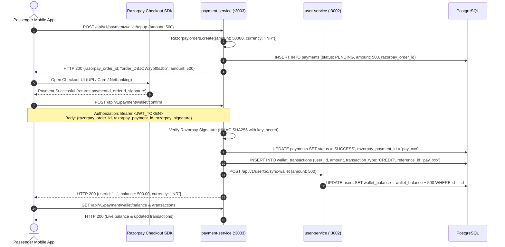
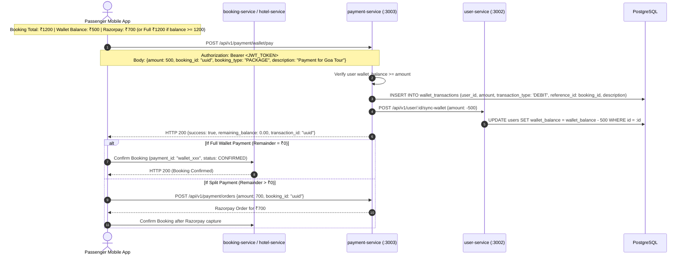
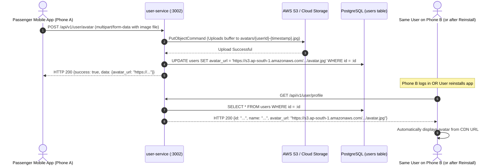
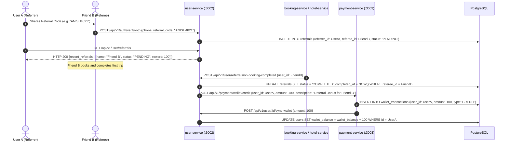

# Backend Specification: Wallet, Checkout, User Profile & Refer & Earn Modules

> **Target Services:** `payment-service` (Port 3003), `user-service` (Port 3002) & `booking-service` (Port 3009)  
> **Audience:** Backend Engineering Team  
> **Status:** Action Required

---

## 1. Executive Summary & Problem Descriptions

### 1.1. Wallet Top-up & Ledger Issue (`payment-service`)
- **Top-up Flow:** The user completes payment via Razorpay on their phone, but the backend lacks a client confirmation endpoint (`POST /api/v1/payment/wallet/confirm`). As a result, no record is saved in `wallet_transactions`, leaving the balance at `0` (or the mock `1500.50`) and recent transactions empty.

### 1.2. Booking Checkout ("Pay with Wallet") Issue (`payment-service`)
- Users booking Hotels, Tour Packages, Adventures, or Buses now have the option to use their available Niklo Wallet balance:
  - **Full Wallet Payment (100% covered):** When `wallet_balance >= booking_amount`, users complete booking with 1-click (zero gateway charges).
  - **Split Payment:** When `0 < wallet_balance < booking_amount`, the wallet balance is deducted first, and the remainder is paid via Razorpay.
  - **Backend Need:** `payment-service` needs a `POST /api/v1/payment/wallet/pay` endpoint to debit the wallet and sync with `user-service`.

### 1.3. Profile Avatar Persistence Issue (`user-service`)
- **Symptoms:** When a user uploads a new profile picture, uninstalls the app, and logs in again (or opens the account on Phone B), the profile picture reverts back to the default fallback image.
- **Root Cause:** The deployed cloud `user-service` does not have active AWS S3 storage for `POST /api/v1/user/avatar`. When the user uploads a photo, the cloud server fails to store it on S3, leaving `users.avatar_url` empty in PostgreSQL. When the user reinstalls the app, `GET /api/v1/user/profile` returns `avatar_url: null` or the stale static mock.

### 1.4. Refer & Earn Module Missing (`user-service` & `payment-service`)
- **Symptoms:** The Refer & Earn screen previously showed hardcoded mock friends (`Amit Sharma`, `Priya Das`).
- **Root Cause:** No backend endpoint or table exists for referrals. Users need a persistent referral code, a ledger of referred friends, and automated ₹100 wallet credits whenever a referred friend completes their first travel booking.

---

## 2. End-to-End Sequence Diagrams

### 2.1. Wallet Top-up Flow


---

### 2.2. Pay with Wallet on Checkout (Hotels, Packages, Adventures, Buses)


---

### 2.3. User Avatar Upload & Cross-Device Persistence Flow (`user-service`)


---

### 2.4. Refer & Earn End-to-End Reward Flow


---

## 3. Payment Service Updates (`niklo-main/payment-service`)

### 3.1. Top-up Confirmation DTO: `confirm-topup.dto.ts`
**Location:** `payment-service/src/wallet/dto/confirm-topup.dto.ts`

```typescript
import { IsNotEmpty, IsOptional, IsString } from 'class-validator';

export class ConfirmTopUpDto {
  @IsString()
  @IsNotEmpty()
  razorpay_order_id: string;

  @IsString()
  @IsNotEmpty()
  razorpay_payment_id: string;

  @IsString()
  @IsOptional()
  razorpay_signature?: string;
}
```

---

### 3.2. Pay with Wallet DTO: `pay-with-wallet.dto.ts`
**Location:** `payment-service/src/wallet/dto/pay-with-wallet.dto.ts`

```typescript
import { IsNotEmpty, IsNumber, IsOptional, IsString, Min } from 'class-validator';

export class PayWithWalletDto {
  @IsNumber()
  @Min(0.01)
  amount: number;

  @IsString()
  @IsOptional()
  booking_id?: string;

  @IsString()
  @IsOptional()
  booking_type?: string;

  @IsString()
  @IsOptional()
  description?: string;
}
```

---

### 3.3. Controller Routes: `wallet.controller.ts`
**Location:** `payment-service/src/wallet/wallet.controller.ts`

```typescript
import {
  Controller,
  Post,
  Get,
  Body,
  UseGuards,
  Request,
} from '@nestjs/common';
import { WalletService } from './wallet.service';
import { TopUpDto } from './dto/top-up.dto';
import { ConfirmTopUpDto } from './dto/confirm-topup.dto';
import { PayWithWalletDto } from './dto/pay-with-wallet.dto';
import { JwtAuthGuard } from '../common/guards/jwt-auth.guard';

@Controller('api/v1/payment/wallet')
export class WalletController {
  constructor(private readonly walletService: WalletService) {}

  @UseGuards(JwtAuthGuard)
  @Get('balance')
  async getBalance(@Request() req: any) {
    const data = await this.walletService.getBalance(req.user.id);
    return { success: true, statusCode: 200, data };
  }

  @UseGuards(JwtAuthGuard)
  @Post('topup')
  async initiateTopUp(@Request() req: any, @Body() dto: TopUpDto) {
    const data = await this.walletService.initiateTopUp(req.user.id, dto);
    return { success: true, statusCode: 200, data };
  }

  @UseGuards(JwtAuthGuard)
  @Post('confirm')
  async confirmTopUp(@Request() req: any, @Body() dto: ConfirmTopUpDto) {
    const data = await this.walletService.confirmTopUp(req.user.id, dto);
    return { success: true, statusCode: 200, data };
  }

  @UseGuards(JwtAuthGuard)
  @Post('pay')
  async payWithWallet(@Request() req: any, @Body() dto: PayWithWalletDto) {
    const data = await this.walletService.payWithWallet(req.user.id, dto);
    return { success: true, statusCode: 200, data };
  }

  @UseGuards(JwtAuthGuard)
  @Get('transactions')
  async getTransactions(@Request() req: any) {
    const data = await this.walletService.getTransactions(req.user.id);
    return { success: true, statusCode: 200, data };
  }
}
```

---

### 3.4. Service Implementation: `wallet.service.ts`
**Location:** `payment-service/src/wallet/wallet.service.ts`

```typescript
import { Injectable, BadRequestException, Logger } from '@nestjs/common';
import { InjectRepository } from '@nestjs/typeorm';
import { Repository } from 'typeorm';
import { ConfigService } from '@nestjs/config';
import { HttpService } from '@nestjs/axios';
import { lastValueFrom } from 'rxjs';
import * as crypto from 'crypto';
import {
  WalletTransaction,
  TransactionType,
} from './entities/wallet-transaction.entity';
import { TopUpDto } from './dto/top-up.dto';
import { ConfirmTopUpDto } from './dto/confirm-topup.dto';
import { PayWithWalletDto } from './dto/pay-with-wallet.dto';
import { PaymentsService } from '../payments/payments.service';
import { PaymentStatus } from '../payments/entities/payment.entity';

@Injectable()
export class WalletService {
  private readonly logger = new Logger(WalletService.name);

  constructor(
    @InjectRepository(WalletTransaction)
    private readonly walletRepo: Repository<WalletTransaction>,
    private readonly paymentsService: PaymentsService,
    private readonly configService: ConfigService,
    private readonly httpService: HttpService,
  ) {}

  async initiateTopUp(userId: string, dto: TopUpDto) {
    if (dto.amount <= 0) {
      throw new BadRequestException('Amount must be greater than zero');
    }

    const order = await this.paymentsService.createOrder(userId, {
      amount: dto.amount,
      currency: 'INR',
    });

    return order;
  }

  async confirmTopUp(userId: string, dto: ConfirmTopUpDto) {
    const key_secret = this.configService.get<string>('razorpay.key_secret');

    // 1. Verify HMAC SHA256 signature if signature & secret exist
    if (dto.razorpay_signature && key_secret) {
      const generatedSignature = crypto
        .createHmac('sha256', key_secret)
        .update(`${dto.razorpay_order_id}|${dto.razorpay_payment_id}`)
        .digest('hex');

      if (generatedSignature !== dto.razorpay_signature) {
        throw new BadRequestException('Invalid Razorpay signature');
      }
    }

    // 2. Update Payment record to SUCCESS
    const payment = await this.paymentsService.updatePaymentStatus(
      dto.razorpay_order_id,
      PaymentStatus.SUCCESS,
      dto.razorpay_payment_id,
    );

    const amount = payment ? Number(payment.amount) : 0;

    // 3. Create CREDIT entry in wallet_transactions
    await this.processTopUpSuccess(
      userId,
      amount,
      dto.razorpay_payment_id,
    );

    // 4. Return live recalculated balance
    return this.getBalance(userId);
  }

  async payWithWallet(userId: string, dto: PayWithWalletDto) {
    const currentBalance = await this.getBalance(userId);
    if (currentBalance.balance < dto.amount) {
      throw new BadRequestException('Insufficient wallet balance');
    }

    // 1. Record DEBIT transaction
    const transaction = this.walletRepo.create({
      user_id: userId,
      amount: dto.amount,
      transaction_type: TransactionType.DEBIT,
      reference_id: dto.booking_id || `booking_${Date.now()}`,
      description: dto.description || `Payment for ${dto.booking_type || 'booking'}`,
    });

    await this.walletRepo.save(transaction);

    // 2. Synchronize user-service wallet_balance (decrease by amount)
    try {
      const userServiceUrl =
        process.env.USER_SERVICE_URL || 'http://user-service:3002';
      await lastValueFrom(
        this.httpService.post(
          `${userServiceUrl}/api/v1/user/${userId}/sync-wallet`,
          { amount: -Number(dto.amount) },
        ),
      );
    } catch (error) {
      this.logger.error(
        `Failed to sync debit wallet balance with user-service for user ${userId}: ${error.message}`,
      );
    }

    const updatedBalance = await this.getBalance(userId);

    return {
      success: true,
      transaction_id: transaction.id,
      debited_amount: dto.amount,
      remaining_balance: updatedBalance.balance,
      currency: 'INR',
    };
  }

  async processTopUpSuccess(
    userId: string,
    amount: number,
    referenceId: string,
  ) {
    const transaction = this.walletRepo.create({
      user_id: userId,
      amount,
      transaction_type: TransactionType.CREDIT,
      reference_id: referenceId,
      description: 'Wallet Top-up via Razorpay',
    });

    await this.walletRepo.save(transaction);

    // Synchronize wallet balance in user-service (increase by amount)
    try {
      const userServiceUrl =
        process.env.USER_SERVICE_URL || 'http://user-service:3002';
      await lastValueFrom(
        this.httpService.post(
          `${userServiceUrl}/api/v1/user/${userId}/sync-wallet`,
          { amount },
        ),
      );
    } catch (error) {
      this.logger.error(
        `Failed to sync wallet balance with user-service for user ${userId}: ${error.message}`,
      );
    }

    return transaction;
  }

  async getTransactions(userId: string) {
    return this.walletRepo.find({
      where: { user_id: userId },
      order: { created_at: 'DESC' },
    });
  }

  async getBalance(userId: string) {
    const transactions = await this.walletRepo.find({
      where: { user_id: userId },
    });

    const balance = transactions.reduce((acc, tx) => {
      return tx.transaction_type === TransactionType.CREDIT
        ? acc + Number(tx.amount)
        : acc - Number(tx.amount);
    }, 0);

    return {
      userId,
      balance: parseFloat(balance.toFixed(2)),
      currency: 'INR',
    };
  }
}
```

---

## 4. User Service Updates: Avatar Upload & S3 Integration (`user-service`)

### 4.1. Controller: `users.controller.ts`
**Location:** `user-service/src/users/users.controller.ts`

```typescript
import {
  Controller,
  Get,
  Patch,
  Post,
  Body,
  UseGuards,
  Req,
  UploadedFile,
  UseInterceptors,
} from '@nestjs/common';
import { FileInterceptor } from '@nestjs/platform-express';
import { UsersService } from './users.service';
import { JwtAuthGuard } from '../common/guards/jwt-auth.guard';

@Controller('api/v1/user')
export class UsersController {
  constructor(private readonly usersService: UsersService) {}

  @Get('profile')
  @UseGuards(JwtAuthGuard)
  async getProfile(@Req() req: any) {
    const data = await this.usersService.getProfile(req.user.id);
    return { success: true, statusCode: 200, data };
  }

  @Patch('profile')
  @UseGuards(JwtAuthGuard)
  async updateProfile(@Req() req: any, @Body() body: any) {
    const data = await this.usersService.updateProfile(req.user.id, body);
    return { success: true, statusCode: 200, data };
  }

  @Post('avatar')
  @UseGuards(JwtAuthGuard)
  @UseInterceptors(FileInterceptor('file'))
  async uploadAvatar(@Req() req: any, @UploadedFile() file: Express.Multer.File) {
    const data = await this.usersService.uploadAvatar(req.user.id, file);
    return { success: true, statusCode: 200, data };
  }
}
```

---

### 4.2. Service: `users.service.ts`
**Location:** `user-service/src/users/users.service.ts`

```typescript
import {
  Injectable,
  NotFoundException,
  BadRequestException,
  Logger,
} from '@nestjs/common';
import { InjectRepository } from '@nestjs/typeorm';
import { Repository } from 'typeorm';
import { ConfigService } from '@nestjs/config';
import { S3Client, PutObjectCommand } from '@aws-sdk/client-s3';
import { User } from './entities/user.entity';

@Injectable()
export class UsersService {
  private readonly logger = new Logger(UsersService.name);
  private s3Client: S3Client;
  private s3BucketName: string;

  constructor(
    @InjectRepository(User)
    private readonly userRepository: Repository<User>,
    private readonly configService: ConfigService,
  ) {
    this.s3Client = new S3Client({
      region: this.configService.get<string>('AWS_REGION', 'ap-south-1'),
      credentials: {
        accessKeyId: this.configService.get<string>('AWS_ACCESS_KEY_ID', ''),
        secretAccessKey: this.configService.get<string>('AWS_SECRET_ACCESS_KEY', ''),
      },
    });
    this.s3BucketName = this.configService.get<string>(
      'AWS_S3_BUCKET_NAME',
      'niklo-avatars-bucket',
    );
  }

  async getProfile(userId: string) {
    const user = await this.userRepository.findOne({ where: { id: userId } });
    if (!user) throw new NotFoundException('User not found');

    return {
      id: user.id,
      phone: user.phone,
      email: user.email,
      name: user.name,
      dob: user.dob,
      gender: user.gender,
      avatar_url: user.avatar_url,
      kyc_status: user.kyc_status,
      wallet_balance: Number(user.wallet_balance),
      preferred_language: user.preferred_language,
    };
  }

  async uploadAvatar(userId: string, file: Express.Multer.File) {
    const user = await this.userRepository.findOne({ where: { id: userId } });
    if (!user) throw new NotFoundException('User not found');

    if (!file || !file.buffer) {
      throw new BadRequestException('No image file provided');
    }

    const fileExtension = file.originalname?.split('.').pop() || 'jpg';
    const key = `avatars/${userId}-${Date.now()}.${fileExtension}`;

    // 1. Upload to S3
    const command = new PutObjectCommand({
      Bucket: this.s3BucketName,
      Key: key,
      Body: file.buffer,
      ContentType: file.mimetype || 'image/jpeg',
    });

    await this.s3Client.send(command);

    // 2. Formulate permanent CDN URL and save in Postgres
    const region = this.configService.get<string>('AWS_REGION', 'ap-south-1');
    const avatarUrl = `https://${this.s3BucketName}.s3.${region}.amazonaws.com/${key}`;
    user.avatar_url = avatarUrl;
    await this.userRepository.save(user);

    return {
      message: 'Avatar uploaded successfully',
      avatar_url: avatarUrl,
    };
  }
}
```

---

## 5. Refer & Earn Module Specification (`user-service` & `payment-service`)

### 5.1. Database Schema (`users` & `referrals`)

```sql
-- 1. Ensure users table has a persistent unique referral_code
ALTER TABLE users ADD COLUMN IF NOT EXISTS referral_code VARCHAR(50) UNIQUE;

-- 2. Referrals tracking ledger
CREATE TABLE IF NOT EXISTS referrals (
    id UUID PRIMARY KEY DEFAULT gen_random_uuid(),
    referrer_id UUID NOT NULL REFERENCES users(id) ON DELETE CASCADE,
    referee_id UUID NOT NULL UNIQUE REFERENCES users(id) ON DELETE CASCADE,
    referral_code VARCHAR(50) NOT NULL,
    status VARCHAR(20) NOT NULL DEFAULT 'PENDING', -- 'PENDING' | 'COMPLETED'
    reward_amount DECIMAL(10, 2) NOT NULL DEFAULT 100.00,
    created_at TIMESTAMP WITH TIME ZONE DEFAULT CURRENT_TIMESTAMP,
    completed_at TIMESTAMP WITH TIME ZONE
);

CREATE INDEX IF NOT EXISTS idx_referrals_referrer ON referrals(referrer_id);
```

---

### 5.2. User Service Referral Endpoints (`user-service`)

**Location:** `user-service/src/referrals/referrals.controller.ts`

```typescript
import {
  Controller,
  Get,
  Post,
  Body,
  UseGuards,
  Req,
} from '@nestjs/common';
import { ReferralsService } from './referrals.service';
import { JwtAuthGuard } from '../common/guards/jwt-auth.guard';

@Controller('api/v1/user/referrals')
export class ReferralsController {
  constructor(private readonly referralsService: ReferralsService) {}

  @Get()
  @UseGuards(JwtAuthGuard)
  async getReferralStats(@Req() req: any) {
    const data = await this.referralsService.getReferralStats(req.user.id);
    return { success: true, statusCode: 200, data };
  }

  @Post('apply')
  @UseGuards(JwtAuthGuard)
  async applyReferralCode(@Req() req: any, @Body('referral_code') code: string) {
    const data = await this.referralsService.applyReferralCode(req.user.id, code);
    return { success: true, statusCode: 200, data };
  }
}
```

---

### 5.3. Service Implementation (`referrals.service.ts`)

```typescript
import { Injectable, BadRequestException } from '@nestjs/common';
import { InjectRepository } from '@nestjs/typeorm';
import { Repository } from 'typeorm';
import { Referral } from './entities/referral.entity';
import { User } from '../users/entities/user.entity';

@Injectable()
export class ReferralsService {
  constructor(
    @InjectRepository(Referral)
    private readonly referralRepo: Repository<Referral>,
    @InjectRepository(User)
    private readonly userRepo: Repository<User>,
  ) {}

  async getReferralStats(userId: string) {
    const user = await this.userRepo.findOne({ where: { id: userId } });
    if (!user) throw new BadRequestException('User not found');

    // Generate and persist referral code if not already saved
    if (!user.referral_code) {
      const namePrefix = (user.name || 'NIKLO').replace(/[^a-zA-Z]/g, '').toUpperCase().slice(0, 5) || 'NIKLO';
      const suffix = user.phone ? user.phone.slice(-4) : Math.floor(1000 + Math.random() * 9000).toString();
      user.referral_code = `${namePrefix}${suffix}`;
      await this.userRepo.save(user);
    }

    const referralCode = user.referral_code;
    const rewardPerReferral = 100.0;
    const shareLink = `https://niklotravel.app/join?ref=${referralCode}`;
    const shareTitle = `Join Niklo Travel & Earn ₹${Math.round(rewardPerReferral)}!`;
    const shareMessage =
      `Plan trips, book hotels, buses & adventure experiences on Niklo Travel!\n` +
      `Use my referral code *${referralCode}* to get ₹${Math.round(rewardPerReferral)} bonus in your Niklo Wallet on your first booking.\n` +
      `Download the app: ${shareLink}`;

    const referrals = await this.referralRepo.find({
      where: { referrer_id: userId },
      relations: ['referee'],
      order: { created_at: 'DESC' },
    });

    const completed = referrals.filter(r => r.status === 'COMPLETED');
    const totalEarned = completed.reduce((sum, r) => sum + Number(r.reward_amount), 0);

    const recentReferrals = referrals.map(r => ({
      id: r.id,
      name: r.referee?.name || 'Friend',
      avatar_url: r.referee?.avatar_url,
      joined_at: r.created_at,
      status: r.status,
      reward_amount: Number(r.reward_amount),
    }));

    return {
      referral_code: referralCode,
      reward_per_referral: rewardPerReferral,
      share_title: shareTitle,
      share_message: shareMessage,
      share_link: shareLink,
      total_earned: totalEarned,
      completed_referrals: completed.length,
      pending_referrals: referrals.length - completed.length,
      recent_referrals: recentReferrals,
    };
  }

  async applyReferralCode(refereeId: string, referralCode: string) {
    const trimmedCode = referralCode.trim().toUpperCase();
    const referrer = await this.userRepo.findOne({ where: { referral_code: trimmedCode } });

    if (!referrer || referrer.id === refereeId) {
      throw new BadRequestException('Invalid or expired referral code');
    }

    const existing = await this.referralRepo.findOne({ where: { referee_id: refereeId } });
    if (existing) {
      throw new BadRequestException('Referral code already applied on this account');
    }

    const referral = this.referralRepo.create({
      referrer_id: referrer.id,
      referee_id: refereeId,
      referral_code: trimmedCode,
      status: 'PENDING',
      reward_amount: 100.0,
    });

    return this.referralRepo.save(referral);
  }
}
```

---

## 6. Verification & Testing cURL Commands

### 1. Fetch Refer & Earn Stats:
```http
GET {{user_service_url}}/api/v1/user/referrals
Authorization: Bearer {{token}}
```
**Expected Response:**
```json
{
  "success": true,
  "statusCode": 200,
  "data": {
    "referral_code": "ANISH4821",
    "reward_per_referral": 100.0,
    "share_title": "Join Niklo Travel & Earn ₹100!",
    "share_message": "Plan trips, book hotels, buses & adventure experiences on Niklo Travel!\nUse my referral code *ANISH4821* to get ₹100 bonus in your Niklo Wallet on your first booking.\nDownload the app: https://niklotravel.app/join?ref=ANISH4821",
    "share_link": "https://niklotravel.app/join?ref=ANISH4821",
    "total_earned": 200.0,
    "completed_referrals": 2,
    "pending_referrals": 1,
    "recent_referrals": [
      {
        "id": "uuid",
        "name": "Friend Name",
        "avatar_url": null,
        "joined_at": "2024-05-20T10:00:00.000Z",
        "status": "COMPLETED",
        "reward_amount": 100.0
      }
    ]
  }
}
```

---

## 7. Bus Booking Module: Dynamic Popular Routes Specification (`bus-service`)

> **Target Microservice:** `bus-service` (Port `3004`)  
> **Target Database:** `niklo_bus` (PostgreSQL)  
> **Frontend Consumer:** `PopularBusRoutesSection` (`lib/features/bus_booking/presentation/widgets/bus_booking_screen/popular_bus_routes_section.dart`)  
> **Repository:** `BusRepository.getPopularRoutes()` (`lib/features/bus_booking/data/repositories/bus_repository.dart`)

---

### 7.1. Overview & Objective
When passengers open the Bus Booking screen before typing a search query, the mobile app dynamically displays top popular travel corridors. Tapping any route triggers an instant 1-tap search with pre-populated `source` and `destination`.

The backend `bus-service` must provide:
1. `GET /api/v1/bus/popular-routes`: Public endpoint returning active popular routes sorted by priority.
2. `POST /api/v1/bus/popular-routes`: Admin endpoint to create/manage popular routes dynamically.

---

### 7.2. Database Schema (`popular_bus_routes`)

```sql
CREATE TABLE IF NOT EXISTS popular_bus_routes (
    id UUID PRIMARY KEY DEFAULT gen_random_uuid(),
    source VARCHAR(100) NOT NULL,
    destination VARCHAR(100) NOT NULL,
    duration VARCHAR(50) NOT NULL,
    start_price DECIMAL(10, 2) NOT NULL,
    tag VARCHAR(50) DEFAULT '🔥 Popular',
    priority INT DEFAULT 0,
    is_active BOOLEAN DEFAULT TRUE,
    created_at TIMESTAMPTZ DEFAULT NOW(),
    updated_at TIMESTAMPTZ DEFAULT NOW(),
    CONSTRAINT uq_bus_route_corridor UNIQUE (source, destination)
);

CREATE INDEX IF NOT EXISTS idx_popular_routes_active ON popular_bus_routes(is_active, priority DESC);

-- Initial Seed Data
INSERT INTO popular_bus_routes (source, destination, duration, start_price, tag, priority, is_active)
VALUES
    ('Kolkata', 'Siliguri', '10h 30m', 650.00, '🔥 Popular', 100, true),
    ('Kolkata', 'Digha', '4h 15m', 180.00, '⚡ Fast Connect', 90, true),
    ('Kolkata', 'Mandarmani', '4h 45m', 220.00, '🏖️ Weekend Special', 80, true),
    ('Siliguri', 'Gangtok', '4h 00m', 350.00, '🏔️ Scenic Route', 70, true),
    ('Kolkata', 'Darjeeling', '12h 00m', 750.00, '⭐ Top Rated', 60, true)
ON CONFLICT (source, destination) DO UPDATE 
SET start_price = EXCLUDED.start_price, duration = EXCLUDED.duration, tag = EXCLUDED.tag;
```

---

### 7.3. TypeORM Entity: `popular-bus-route.entity.ts`
**Location:** `bus-service/src/routes/entities/popular-bus-route.entity.ts`

```typescript
import {
  Entity,
  PrimaryGeneratedColumn,
  Column,
  CreateDateColumn,
  UpdateDateColumn,
  Unique,
  Index,
} from 'typeorm';

@Entity('popular_bus_routes')
@Unique(['source', 'destination'])
export class PopularBusRoute {
  @PrimaryGeneratedColumn('uuid')
  id: string;

  @Column({ length: 100 })
  source: string;

  @Column({ length: 100 })
  destination: string;

  @Column({ length: 50 })
  duration: string;

  @Column('decimal', { precision: 10, scale: 2, name: 'start_price' })
  start_price: number;

  @Column({ length: 50, default: '🔥 Popular' })
  tag: string;

  @Column({ type: 'int', default: 0 })
  @Index()
  priority: number;

  @Column({ type: 'boolean', default: true })
  @Index()
  is_active: boolean;

  @CreateDateColumn({ type: 'timestamptz' })
  created_at: Date;

  @UpdateDateColumn({ type: 'timestamptz' })
  updated_at: Date;
}
```

---

### 7.4. Controller: `popular-routes.controller.ts`
**Location:** `bus-service/src/routes/popular-routes.controller.ts`

```typescript
import {
  Controller,
  Get,
  Post,
  Body,
  UseGuards,
  HttpStatus,
  HttpCode,
} from '@nestjs/common';
import { PopularRoutesService } from './popular-routes.service';
import { CreatePopularRouteDto } from './dto/create-popular-route.dto';
import { JwtAuthGuard } from '../common/guards/jwt-auth.guard';
import { RolesGuard } from '../common/guards/roles.guard';
import { Roles } from '../common/decorators/roles.decorator';

@Controller('api/v1/bus/popular-routes')
export class PopularRoutesController {
  constructor(private readonly routesService: PopularRoutesService) {}

  @Get()
  @HttpCode(HttpStatus.OK)
  async getPopularRoutes() {
    const data = await this.routesService.getActivePopularRoutes();
    return {
      success: true,
      statusCode: 200,
      data,
    };
  }

  @Post()
  @UseGuards(JwtAuthGuard, RolesGuard)
  @Roles('ADMIN')
  @HttpCode(HttpStatus.CREATED)
  async createPopularRoute(@Body() dto: CreatePopularRouteDto) {
    const data = await this.routesService.createPopularRoute(dto);
    return {
      success: true,
      statusCode: 201,
      message: 'Popular route created successfully',
      data,
    };
  }
}
```

---

### 7.5. Service: `popular-routes.service.ts`
**Location:** `bus-service/src/routes/popular-routes.service.ts`

```typescript
import { Injectable, Logger, ConflictException } from '@nestjs/common';
import { InjectRepository } from '@nestjs/typeorm';
import { Repository } from 'typeorm';
import { PopularBusRoute } from './entities/popular-bus-route.entity';
import { CreatePopularRouteDto } from './dto/create-popular-route.dto';

@Injectable()
export class PopularRoutesService {
  private readonly logger = new Logger(PopularRoutesService.name);

  constructor(
    @InjectRepository(PopularBusRoute)
    private readonly routeRepo: Repository<PopularBusRoute>,
  ) {}

  async getActivePopularRoutes(): Promise<PopularBusRoute[]> {
    return this.routeRepo.find({
      where: { is_active: true },
      order: { priority: 'DESC', created_at: 'ASC' },
      take: 10,
    });
  }

  async createPopularRoute(dto: CreatePopularRouteDto): Promise<PopularBusRoute> {
    const existing = await this.routeRepo.findOne({
      where: { source: dto.source, destination: dto.destination },
    });

    if (existing) {
      throw new ConflictException(
        `Route ${dto.source} -> ${dto.destination} already exists`,
      );
    }

    const route = this.routeRepo.create(dto);
    return this.routeRepo.save(route);
  }
}
```

---

### 7.6. Verification & cURL Command

```http
GET {{bus_service_url}}/api/v1/bus/popular-routes
```

**Expected JSON Response (`200 OK`):**
```json
{
  "success": true,
  "statusCode": 200,
  "data": [
    {
      "id": "7a8b9c0d-1234-5678-9abc-def012345678",
      "source": "Kolkata",
      "destination": "Siliguri",
      "duration": "10h 30m",
      "start_price": 650.00,
      "tag": "🔥 Popular",
      "priority": 100,
      "is_active": true
    },
    {
      "id": "8b9c0d1e-2345-6789-abcd-ef0123456789",
      "source": "Kolkata",
      "destination": "Digha",
      "duration": "4h 15m",
      "start_price": 180.00,
      "tag": "⚡ Fast Connect",
      "priority": 90,
      "is_active": true
    }
  ]
}
```


