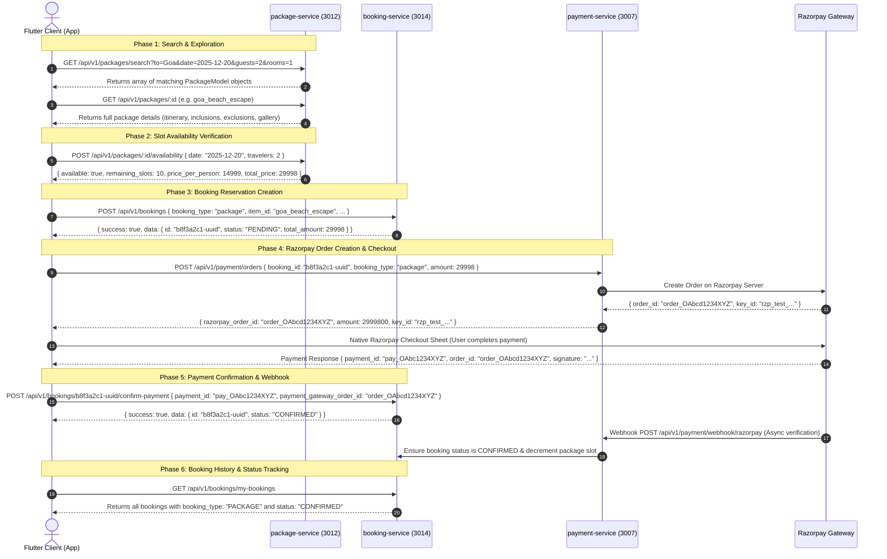

# Niklo — Package Booking Module Production Backend Specification

> **Target Microservices**:
> - `package-service` (Port `3012`) — Base URL: `http://ltmzir9qa389f53ho5hkzlq0.187.127.157.13.sslip.io` / `/api/v1/packages`
> - `booking-service` (Port `3014`) — For Package Reservation & History (`/api/v1/bookings`)
> - `payment-service` (Port `3007`) — For Razorpay Payment Gateway & Webhooks (`/api/v1/payment`)
>
> **Frontend Module Consumers**:
> - Package UI & Search: `lib/features/packages/`
> - Booking & Checkout UI: `lib/features/bookings/` & `lib/features/packages/presentation/screens/package_traveler_details_screen.dart`
> - Wishlist: `lib/features/wishlist/`

---

## 📋 Table of Contents
1. [Core Architecture & Discovery Logic](#1-core-architecture--discovery-logic)
2. [Backend Service Architecture & Endpoints Summary](#2-backend-service-architecture--endpoints-summary)
3. [Complete Step-by-Step User Journey & Booking Lifecycle](#3-complete-step-by-step-user-journey--booking-lifecycle)
4. [Database Schema & Migrations (`schema.sql`)](#4-database-schema--migrations-schemasql)
5. [TypeORM Entities (`package.entity.ts`)](#5-typeorm-entities-packageentityts)
6. [DTOs & Validation Schemas](#6-dtos--validation-schemas)
   - [Search Packages Query DTO (`search-packages.dto.ts`)](#61-search-packages-query-dto-search-packagesdtots)
   - [Check Availability DTO (`check-availability.dto.ts`)](#62-check-availability-dto-check-availabilitydtots)
   - [Create Package Booking DTO (`create-package-booking.dto.ts`)](#63-create-package-booking-dto-create-package-bookingdtots)
   - [Confirm Payment DTO (`confirm-payment.dto.ts`)](#64-confirm-payment-dto-confirm-paymentdtots)
   - [Create Package DTO (`create-package.dto.ts`)](#65-create-package-dto-create-packagedtots)
   - [Update Package DTO (`update-package.dto.ts`)](#66-update-package-dto-update-packagedtots)
7. [Controller Implementation (`packages.controller.ts`)](#7-controller-implementation-packagescontrollerts)
8. [Service Implementation (`packages.service.ts`)](#8-service-implementation-packagesservicets)
9. [Main Bootstrap & Routing Configuration (`main.ts`)](#9-main-bootstrap--routing-configuration-maints)
10. [Complete Production Seed Data & SQL Scripts](#10-complete-production-seed-data--sql-scripts)
11. [Complete Curl Verification Suite](#11-complete-curl-verification-suite)

---

## 1. Core Architecture & Discovery Logic

### 📍 Destination & Location-Driven Travel Packages
Unlike transit products (buses, trains, flights) which require a point-to-point departure origin and destination, **Travel Packages are destination-based holiday experiences** (e.g., Goa Beach Escape, Manali Snowy Retreat, Kashmir Paradise).

### 🔍 How the Frontend Discovers and Searches Packages:
1. **Dynamic Destination & Location Keyword Search (`to` & `search` query params)**:
   - The user can **type or search ANY destination, city, tourist spot, landmark, or holiday region** (e.g. `"Goa"`, `"North Goa"`, `"Manali"`, `"Solang Valley"`, `"Andaman"`, `"Havelock"`, `"Kashmir"`, `"Pahalgam"`, `"Kerala"`, `"Munnar"`), not just select from a static list.
   - The backend SQL query matches the query term case-insensitively across:
     - `pkg.destination ILIKE :to` (e.g., `"Goa"`, `"Manali"`, `"Kashmir"`)
     - `pkg.location_text ILIKE :to` (e.g., `"North Goa, South Goa"`, `"Solang Valley, Mall Road"`, `"Havelock Island, Port Blair"`)
     - `pkg.title ILIKE :to` (e.g., `"Goa Beach Escape"`, `"Kashmir Paradise Tour"`)
     - `pkg.snippet ILIKE :to` / `pkg.description ILIKE :to`
   - *Note:* The user interface focuses purely on destination search (`"Traveling To"`). Departure origin (`from` / `start_city`) is optional fallback metadata.

2. **Journey Date (`date` query param)**:
   - Format: `YYYY-MM-DD` (e.g. `2025-12-20`).
   - Used for date validation and availability slot checks.

3. **Guests & Rooms (`guests`, `rooms` query params)**:
   - `guests`: Number of adult travelers (default `2`).
   - `rooms`: Number of hotel rooms allocated (default `1`).
   - Used to verify slot availability and calculate total passenger pricing.

4. **Category / Style Filter (`category` query param)**:
   - Examples: `'Beach Escapes'`, `'Mountain Escapes'`, `'Honeymoon'`, `'Family Trips'`, `'Spiritual Journeys'`.
   - Optional. When set to `'All'` or omitted, all active packages matching the destination are returned.

5. **Sorting & Filtering Options**:
   - `sort_by`: `'rating_desc'` (Top Rated), `'price_asc'` (Price Low-to-High), `'price_desc'` (Price High-to-Low), `'newest'`.
   - `duration_min` & `duration_max`: Number of trip days (e.g. `1-3`, `4-5`, `6+` days).
   - `price_min` & `price_max`: Price range boundaries.

---

## 2. Backend Service Architecture & Endpoints Summary

> **Legend**:  
> ✅ = Implemented and working  
> ⚠️ = Partially Implemented (exists in repo but needs filter/query improvements or field camelCase fix)  
> ❌ = **Missing from repo** — Needs implementation according to this specification  

---

### 🔍 Production Audit — UI Screen → Endpoint Mapping

| Status | Service | Method | Route | Called By (UI Screen) | What UI Expects | Auth |
| :---: | :--- | :---: | :--- | :--- | :--- | :---: |
| ⚠️ | **Package** | `GET` | `/api/v1/packages` | `package_list_screen.dart` → `getAllPackages()` | Filterable list with `destination`, `category`, `min_price`, `max_price`, `sort_by`, `is_trending`, `search`, `page`, `limit` params | Public |
| ❌ | **Package** | `GET` | `/api/v1/packages/search` | `package_list_screen.dart` → `searchPackages()` | Search by `to` (destination/location), `date`, `guests`, `rooms`, `category`, `min_price`, `max_price`, `duration_min`, `duration_max`, `sort_by` | Public |
| ❌ | **Package** | `GET` | `/api/v1/packages/destination/:name` | `package_list_screen.dart` → `getPackagesByDestination()` | Packages filtered by destination name | Public |
| ❌ | **Package** | `GET` | `/api/v1/packages/category/:category` | `package_list_screen.dart` → `getPackagesByCategory()` | Packages filtered by category string | Public |
| ⚠️ | **Package** | `GET` | `/api/v1/packages/destinations/popular` | `packages_demo_sections.dart` → `getPopularDestinations()` | `{ name: string, imageUrl: string, packageCount: number }[]` — **Fix: field must be `imageUrl` and `packageCount`** | Public |
| ❌ | **Package** | `GET` | `/api/v1/packages/categories` | `packages_screen.dart` chips + `packages_demo_sections.dart` → `getCategories()` | `{ name: string, imageUrl: string, packageCount: number }[]` — **Fix: field must be `imageUrl` and `packageCount`** | Public |
| ❌ | **Package** | `GET` | `/api/v1/packages/trending` | `packages_demo_sections.dart` → `getTrendingPackages()` | Top packages sorted by rating DESC, `?limit=6` param | Public |
| ❌ | **Package** | `GET` | `/api/v1/packages/offers` | `packages_demo_sections.dart` → `getOffers()` | `{ id, title, destination, originalPrice, discountedPrice, discountPercent, offerLabel, imageUrl }[]` | Public |
| ❌ | **Package** | `GET` | `/api/v1/packages/meta/cities` | `package_list_screen.dart` edit modal → `getCities()` | `{ startingCities: string[], destinationCities: string[] }` | Public |
| ✅ | **Package** | `GET` | `/api/v1/packages/:id` | `package_details_screen.dart` → `getPackageById()` | Full package object (itinerary, inclusions, exclusions, gallery) | Public |
| ⚠️ | **Package** | `POST` | `/api/v1/packages/:id/availability` | `package_traveler_details_screen.dart` | `{ available: bool, remaining_slots: int, price_per_person: number, total_price: number }` | Public |
| ✅ | **Package** | `POST` | `/api/v1/packages` | Admin panel | Create package | Admin JWT |
| ✅ | **Package** | `PUT` | `/api/v1/packages/:id` | Admin panel | Update package | Admin JWT |
| ✅ | **Package** | `DELETE` | `/api/v1/packages/:id` | Admin panel | Delete package | Admin JWT |
| ❌ | **Booking** | `POST` | `/api/v1/bookings` | `package_traveler_details_screen.dart` → `createItemBooking()` | Create PENDING package booking, returns booking UUID | Bearer JWT |
| ❌ | **Booking** | `POST` | `/api/v1/bookings/:id/confirm-payment` | `booking_repository.dart` → `confirmPayment()` | Send `payment_id` & `payment_gateway_order_id`, flips status to `CONFIRMED` | Bearer JWT |
| ❌ | **Booking** | `GET` | `/api/v1/bookings/my-bookings` | Bookings Screen → `myBookingsProvider` | User's bookings array including `booking_type: "PACKAGE"` | Bearer JWT |
| ❌ | **Booking** | `GET` | `/api/v1/bookings/:id` | Booking details screen | Single booking object with passenger list and fare breakdown | Bearer JWT |
| ❌ | **Booking** | `POST` | `/api/v1/bookings/:id/cancel` | Booking details screen | Cancel booking, returns status `CANCELLED` | Bearer JWT |
| ❌ | **Payment** | `POST` | `/api/v1/payment/orders` | `payment_methods_screen.dart` (Razorpay flow) | Creates Razorpay order `{ razorpay_order_id, amount, currency, key_id }` | Bearer JWT |
| ❌ | **Payment** | `POST` | `/api/v1/payment/webhook/razorpay` | Server-to-server Webhook from Razorpay | Verify signature header and confirm booking status | Razorpay-Signature |

---

## 3. Complete Step-by-Step User Journey & Booking Lifecycle



---

## 4. Database Schema & Migrations (`schema.sql`)

```sql
CREATE EXTENSION IF NOT EXISTS "uuid-ossp";

-- 1. Travel Packages Core Table
CREATE TABLE IF NOT EXISTS travel_packages (
    id VARCHAR(100) PRIMARY KEY, -- e.g., 'goa_beach_escape'
    title VARCHAR(255) NOT NULL,
    category VARCHAR(100) NOT NULL, -- 'Beach Escapes', 'Mountain Escapes', 'Honeymoon', 'Family Trips', 'Spiritual Journeys'
    destination VARCHAR(100) NOT NULL, -- 'Goa', 'Manali', 'Kashmir', 'Andaman', 'Kerala'
    start_city VARCHAR(100) NOT NULL DEFAULT 'Kolkata', -- Optional pickup/start point metadata
    rating NUMERIC(3, 2) NOT NULL DEFAULT 4.80,
    reviews_count INT NOT NULL DEFAULT 85,
    location_text VARCHAR(255) NOT NULL, -- 'North Goa, South Goa'
    snippet TEXT NOT NULL,
    description TEXT NOT NULL,
    duration VARCHAR(50) NOT NULL, -- '4 Days / 3 Nights'
    duration_days INT NOT NULL DEFAULT 4,
    duration_nights INT NOT NULL DEFAULT 3,
    group_size VARCHAR(50) NOT NULL DEFAULT '2-6 Travelers',
    price NUMERIC(10, 2) NOT NULL,
    original_price NUMERIC(10, 2) DEFAULT NULL,
    discount_percent INT NOT NULL DEFAULT 0,
    image_url TEXT NOT NULL,
    gallery_images JSONB NOT NULL DEFAULT '[]'::jsonb,
    itinerary JSONB NOT NULL DEFAULT '[]'::jsonb,
    inclusions JSONB NOT NULL DEFAULT '[]'::jsonb,
    exclusions JSONB NOT NULL DEFAULT '[]'::jsonb,
    is_trending BOOLEAN NOT NULL DEFAULT false,
    is_featured BOOLEAN NOT NULL DEFAULT false,
    is_active BOOLEAN NOT NULL DEFAULT true,
    created_at TIMESTAMP WITH TIME ZONE DEFAULT CURRENT_TIMESTAMP,
    updated_at TIMESTAMP WITH TIME ZONE DEFAULT CURRENT_TIMESTAMP
);

-- Search and filter indexes
CREATE INDEX IF NOT EXISTS idx_pkg_destination ON travel_packages(destination);
CREATE INDEX IF NOT EXISTS idx_pkg_location_text ON travel_packages(location_text);
CREATE INDEX IF NOT EXISTS idx_pkg_category ON travel_packages(category);
CREATE INDEX IF NOT EXISTS idx_pkg_price ON travel_packages(price);
CREATE INDEX IF NOT EXISTS idx_pkg_rating ON travel_packages(rating DESC);
CREATE INDEX IF NOT EXISTS idx_pkg_trending ON travel_packages(is_trending) WHERE is_trending = true;
CREATE INDEX IF NOT EXISTS idx_pkg_active ON travel_packages(is_active) WHERE is_active = true;

-- 2. Package Availability Calendar & Slots
CREATE TABLE IF NOT EXISTS package_availability (
    id UUID PRIMARY KEY DEFAULT uuid_generate_v4(),
    package_id VARCHAR(100) NOT NULL REFERENCES travel_packages(id) ON DELETE CASCADE,
    travel_date DATE NOT NULL,
    total_slots INT NOT NULL DEFAULT 20,
    booked_slots INT NOT NULL DEFAULT 0,
    price_override NUMERIC(10, 2) DEFAULT NULL,
    is_closed BOOLEAN NOT NULL DEFAULT false,
    created_at TIMESTAMP WITH TIME ZONE DEFAULT CURRENT_TIMESTAMP,
    CONSTRAINT uq_pkg_date UNIQUE (package_id, travel_date)
);

CREATE INDEX IF NOT EXISTS idx_pkg_avail_date ON package_availability(package_id, travel_date);
```

---

## 5. TypeORM Entities (`package.entity.ts`)

```typescript
import {
  Entity,
  PrimaryColumn,
  Column,
  CreateDateColumn,
  UpdateDateColumn,
} from 'typeorm';

@Entity('travel_packages')
export class TravelPackage {
  @PrimaryColumn({ type: 'varchar', length: 100 })
  id: string;

  @Column({ type: 'varchar', length: 255 })
  title: string;

  @Column({ type: 'varchar', length: 100 })
  category: string;

  @Column({ type: 'varchar', length: 100 })
  destination: string;

  @Column({ type: 'varchar', length: 100, default: 'Kolkata' })
  start_city: string;

  @Column({ type: 'numeric', precision: 3, scale: 2, default: 4.8 })
  rating: number;

  @Column({ type: 'int', default: 85 })
  reviews_count: number;

  @Column({ type: 'varchar', length: 255 })
  location_text: string;

  @Column({ type: 'text' })
  snippet: string;

  @Column({ type: 'text' })
  description: string;

  @Column({ type: 'varchar', length: 50 })
  duration: string;

  @Column({ type: 'int', default: 4 })
  duration_days: number;

  @Column({ type: 'int', default: 3 })
  duration_nights: number;

  @Column({ type: 'varchar', length: 50, default: '2-6 Travelers' })
  group_size: string;

  @Column({ type: 'numeric', precision: 10, scale: 2 })
  price: number;

  @Column({ type: 'numeric', precision: 10, scale: 2, nullable: true })
  original_price: number;

  @Column({ type: 'int', default: 0 })
  discount_percent: number;

  @Column({ type: 'text' })
  image_url: string;

  @Column({ type: 'jsonb', default: [] })
  gallery_images: string[];

  @Column({ type: 'jsonb', default: [] })
  itinerary: string[];

  @Column({ type: 'jsonb', default: [] })
  inclusions: string[];

  @Column({ type: 'jsonb', default: [] })
  exclusions: string[];

  @Column({ type: 'boolean', default: false })
  is_trending: boolean;

  @Column({ type: 'boolean', default: false })
  is_featured: boolean;

  @Column({ type: 'boolean', default: true })
  is_active: boolean;

  @CreateDateColumn()
  created_at: Date;

  @UpdateDateColumn()
  updated_at: Date;
}
```

---

## 6. DTOs & Validation Schemas

### 6.1 Search Packages Query DTO (`search-packages.dto.ts`)

```typescript
import { IsOptional, IsString, IsNumberString } from 'class-validator';

export class SearchPackagesDto {
  @IsOptional()
  @IsString()
  to?: string; // Primary destination search term (e.g. 'Goa', 'Manali') — matches destination/location_text/title

  @IsOptional()
  @IsString()
  from?: string; // Optional departure / pickup city metadata

  @IsOptional()
  @IsString()
  date?: string; // Travel date in YYYY-MM-DD format (e.g. '2025-12-20')

  @IsOptional()
  @IsNumberString()
  guests?: string; // Number of adult travelers (e.g. '2')

  @IsOptional()
  @IsNumberString()
  rooms?: string; // Number of rooms (e.g. '1')

  @IsOptional()
  @IsString()
  category?: string; // Travel style (e.g. 'Beach Escapes', 'Mountain Escapes')

  @IsOptional()
  @IsNumberString()
  duration_min?: string; // Minimum duration in days (e.g. '1')

  @IsOptional()
  @IsNumberString()
  duration_max?: string; // Maximum duration in days (e.g. '5')

  @IsOptional()
  @IsNumberString()
  price_min?: string;

  @IsOptional()
  @IsNumberString()
  price_max?: string;

  @IsOptional()
  @IsString()
  sort_by?: 'price_asc' | 'price_desc' | 'rating_desc' | 'newest';

  @IsOptional()
  @IsNumberString()
  page?: string;

  @IsOptional()
  @IsNumberString()
  limit?: string;
}
```

---

### 6.2 Check Availability DTO (`check-availability.dto.ts`)

```typescript
import { IsNotEmpty, IsString, IsNumber, Min } from 'class-validator';

export class CheckPackageAvailabilityDto {
  @IsString()
  @IsNotEmpty()
  date: string; // ISO 8601 or YYYY-MM-DD (e.g. '2025-12-20')

  @IsNumber()
  @Min(1)
  travelers: number; // Number of travelers
}
```

---

### 6.3 Create Package Booking DTO (`create-package-booking.dto.ts` — `booking-service`)

```typescript
import {
  IsString,
  IsNotEmpty,
  IsNumber,
  IsArray,
  ValidateNested,
  IsEmail,
  IsOptional,
} from 'class-validator';
import { Type } from 'class-transformer';

class TravellerDto {
  @IsString()
  @IsNotEmpty()
  name: string;

  @IsNumber()
  age: number;

  @IsString()
  @IsNotEmpty()
  gender: string;
}

class FareBreakdownDto {
  @IsNumber()
  base: number;

  @IsNumber()
  discount: number;

  @IsNumber()
  taxes: number;

  @IsNumber()
  total: number;
}

export class CreatePackageBookingDto {
  @IsString()
  @IsNotEmpty()
  booking_type: 'package';

  @IsString()
  @IsNotEmpty()
  item_id: string; // Package ID (e.g. 'goa_beach_escape')

  @IsArray()
  @ValidateNested({ each: true })
  @Type(() => TravellerDto)
  travellers: TravellerDto[];

  @IsNumber()
  total_amount: number;

  @ValidateNested()
  @Type(() => FareBreakdownDto)
  fare_breakdown: FareBreakdownDto;

  @IsString()
  @IsNotEmpty()
  travel_date: string; // YYYY-MM-DD or ISO string

  @IsString()
  @IsOptional()
  end_date?: string;

  @IsString()
  @IsNotEmpty()
  location: string; // Destination name (e.g. 'Goa')

  @IsEmail()
  contact_email: string;

  @IsString()
  @IsNotEmpty()
  contact_phone: string;
}
```

---

### 6.4 Confirm Payment DTO (`confirm-payment.dto.ts` — `booking-service`)

```typescript
import { IsNotEmpty, IsString } from 'class-validator';

export class ConfirmPaymentDto {
  @IsString()
  @IsNotEmpty()
  payment_id: string; // Razorpay payment ID (e.g. 'pay_OAbc1234XYZ')

  @IsString()
  @IsNotEmpty()
  payment_gateway_order_id: string; // Razorpay order ID (e.g. 'order_OAbcd1234XYZ')
}
```

---

### 6.5 Create Package DTO (`create-package.dto.ts`)

```typescript
import {
  IsString,
  IsNotEmpty,
  IsNumber,
  IsOptional,
  IsArray,
  IsBoolean,
  Min,
  Max,
} from 'class-validator';

export class CreatePackageDto {
  @IsString()
  @IsOptional()
  id?: string;

  @IsString()
  @IsNotEmpty()
  title: string;

  @IsString()
  @IsNotEmpty()
  category: string;

  @IsString()
  @IsNotEmpty()
  destination: string;

  @IsString()
  @IsOptional()
  start_city?: string;

  @IsNumber()
  @IsOptional()
  @Min(0)
  @Max(5)
  rating?: number;

  @IsNumber()
  @IsOptional()
  reviews_count?: number;

  @IsString()
  @IsNotEmpty()
  location_text: string;

  @IsString()
  @IsNotEmpty()
  snippet: string;

  @IsString()
  @IsNotEmpty()
  description: string;

  @IsString()
  @IsNotEmpty()
  duration: string;

  @IsNumber()
  @IsOptional()
  duration_days?: number;

  @IsNumber()
  @IsOptional()
  duration_nights?: number;

  @IsString()
  @IsOptional()
  group_size?: string;

  @IsNumber()
  @IsNotEmpty()
  @Min(0)
  price: number;

  @IsNumber()
  @IsOptional()
  original_price?: number;

  @IsNumber()
  @IsOptional()
  discount_percent?: number;

  @IsString()
  @IsNotEmpty()
  image_url: string;

  @IsArray()
  @IsOptional()
  gallery_images?: string[];

  @IsArray()
  @IsOptional()
  itinerary?: string[];

  @IsArray()
  @IsOptional()
  inclusions?: string[];

  @IsArray()
  @IsOptional()
  exclusions?: string[];

  @IsBoolean()
  @IsOptional()
  is_trending?: boolean;

  @IsBoolean()
  @IsOptional()
  is_featured?: boolean;

  @IsBoolean()
  @IsOptional()
  is_active?: boolean;
}
```

---

### 6.6 Update Package DTO (`update-package.dto.ts`)

```typescript
import { PartialType } from '@nestjs/mapped-types';
import { CreatePackageDto } from './create-package.dto';

export class UpdatePackageDto extends PartialType(CreatePackageDto) {}
```

---

## 7. Controller Implementation (`packages.controller.ts`)

```typescript
import {
  Controller,
  Get,
  Post,
  Body,
  Param,
  Put,
  Delete,
  Query,
  HttpCode,
  HttpStatus,
} from '@nestjs/common';
import { PackagesService } from './packages.service';
import { CreatePackageDto } from './dto/create-package.dto';
import { UpdatePackageDto } from './dto/update-package.dto';
import { SearchPackagesDto } from './dto/search-packages.dto';
import { CheckPackageAvailabilityDto } from './dto/check-availability.dto';

@Controller(['packages', 'package'])
export class PackagesController {
  constructor(private readonly packagesService: PackagesService) {}

  @Post()
  async create(@Body() createPackageDto: CreatePackageDto) {
    const data = await this.packagesService.create(createPackageDto);
    return { success: true, statusCode: 201, data };
  }

  @Get()
  async findAll(@Query() query: any) {
    const data = await this.packagesService.findAll(query);
    return { success: true, statusCode: 200, data };
  }

  @Get('search')
  async search(@Query() query: SearchPackagesDto) {
    const data = await this.packagesService.search(query);
    return { success: true, statusCode: 200, data };
  }

  @Get('destinations/popular')
  async getPopularDestinations() {
    const data = await this.packagesService.getPopularDestinations();
    return { success: true, statusCode: 200, data };
  }

  @Get('categories')
  async getCategories() {
    const data = await this.packagesService.getCategories();
    return { success: true, statusCode: 200, data };
  }

  @Get('trending')
  async getTrending(@Query('limit') limit?: number) {
    const data = await this.packagesService.getTrendingPackages(
      limit ? Number(limit) : 6,
    );
    return { success: true, statusCode: 200, data };
  }

  @Get('offers')
  async getOffers() {
    const data = await this.packagesService.getOffers();
    return { success: true, statusCode: 200, data };
  }

  @Get('meta/cities')
  async getCities() {
    const data = await this.packagesService.getCities();
    return { success: true, statusCode: 200, data };
  }

  @Get('destination/:destination')
  async findByDestination(
    @Param('destination') destination: string,
    @Query() query: any,
  ) {
    const data = await this.packagesService.findByDestination(
      destination,
      query,
    );
    return { success: true, statusCode: 200, destination, data };
  }

  @Get('category/:category')
  async findByCategory(
    @Param('category') category: string,
    @Query() query: any,
  ) {
    const data = await this.packagesService.findByCategory(category, query);
    return { success: true, statusCode: 200, category, data };
  }

  @Post(':id/availability')
  @HttpCode(HttpStatus.OK)
  async checkAvailability(
    @Param('id') id: string,
    @Body() body: CheckPackageAvailabilityDto,
  ) {
    const data = await this.packagesService.checkAvailability(id, body);
    return { success: true, statusCode: 200, data };
  }

  @Get(':id')
  async findOne(@Param('id') id: string) {
    const data = await this.packagesService.findOne(id);
    return { success: true, statusCode: 200, data };
  }

  @Put(':id')
  async update(
    @Param('id') id: string,
    @Body() updatePackageDto: UpdatePackageDto,
  ) {
    const data = await this.packagesService.update(id, updatePackageDto);
    return { success: true, statusCode: 200, data };
  }

  @Delete(':id')
  async remove(@Param('id') id: string) {
    const data = await this.packagesService.remove(id);
    return { success: true, statusCode: 200, data };
  }
}
```

---

## 8. Service Implementation (`packages.service.ts`)

```typescript
import {
  Injectable,
  NotFoundException,
  OnApplicationBootstrap,
} from '@nestjs/common';
import { InjectRepository } from '@nestjs/typeorm';
import { Repository } from 'typeorm';
import { TravelPackage } from './entities/package.entity';
import { CreatePackageDto } from './dto/create-package.dto';
import { UpdatePackageDto } from './dto/update-package.dto';
import { SearchPackagesDto } from './dto/search-packages.dto';

@Injectable()
export class PackagesService implements OnApplicationBootstrap {
  constructor(
    @InjectRepository(TravelPackage)
    private readonly packageRepo: Repository<TravelPackage>,
  ) {}

  async onApplicationBootstrap() {
    const count = await this.packageRepo.count();
    if (count === 0) {
      console.log('Seeding initial package data...');
    }
  }

  private mapPackageToDto(p: TravelPackage) {
    return {
      id: p.id,
      title: p.title,
      destination: p.destination,
      startCity: p.start_city,
      rating: Number(p.rating),
      reviews_count: p.reviews_count || 0,
      locationText: p.location_text,
      snippet: p.snippet,
      description: p.description,
      duration: p.duration,
      duration_days: p.duration_days,
      duration_nights: p.duration_nights,
      groupSize: p.group_size,
      price: Number(p.price),
      original_price: p.original_price ? Number(p.original_price) : Number(p.price),
      discount_percent: p.discount_percent || 0,
      imagePath: p.image_url,
      galleryImages: p.gallery_images || [],
      category: p.category,
      itinerary: p.itinerary || [],
      inclusions: p.inclusions || [],
      exclusions: p.exclusions || [],
      is_trending: p.is_trending,
    };
  }

  async create(createPackageDto: CreatePackageDto) {
    const newPackage = this.packageRepo.create(createPackageDto as Partial<TravelPackage>);
    const saved = await this.packageRepo.save(newPackage);
    return this.mapPackageToDto(saved);
  }

  async findAll(query: any) {
    const {
      destination,
      category,
      is_trending,
      start_city,
      search,
      min_price,
      max_price,
      sort_by,
      limit = 20,
      page = 1,
    } = query;

    const qb = this.packageRepo.createQueryBuilder('pkg').where('pkg.is_active = true');

    if (destination && destination.trim() !== '' && destination.toLowerCase() !== 'all') {
      qb.andWhere(
        '(pkg.destination ILIKE :dest OR pkg.location_text ILIKE :dest OR pkg.title ILIKE :dest)',
        { dest: `%${destination.trim()}%` },
      );
    }

    if (category && category.trim() !== '' && category.toLowerCase() !== 'all') {
      qb.andWhere('pkg.category ILIKE :cat', { cat: `%${category.trim()}%` });
    }

    if (start_city && start_city.trim() !== '') {
      qb.andWhere('pkg.start_city ILIKE :startCity', { startCity: `%${start_city.trim()}%` });
    }

    if (is_trending === 'true' || is_trending === true) {
      qb.andWhere('pkg.is_trending = true');
    }

    if (min_price) {
      qb.andWhere('pkg.price >= :minPrice', { minPrice: Number(min_price) });
    }

    if (max_price) {
      qb.andWhere('pkg.price <= :maxPrice', { maxPrice: Number(max_price) });
    }

    if (search && search.trim() !== '') {
      const s = `%${search.trim()}%`;
      qb.andWhere(
        '(pkg.title ILIKE :s OR pkg.destination ILIKE :s OR pkg.location_text ILIKE :s OR pkg.snippet ILIKE :s)',
        { s },
      );
    }

    if (sort_by === 'price_asc') {
      qb.orderBy('pkg.price', 'ASC');
    } else if (sort_by === 'price_desc') {
      qb.orderBy('pkg.price', 'DESC');
    } else if (sort_by === 'rating_desc') {
      qb.orderBy('pkg.rating', 'DESC');
    } else {
      qb.orderBy('pkg.created_at', 'DESC');
    }

    const packages = await qb
      .skip((Number(page) - 1) * Number(limit))
      .take(Number(limit))
      .getMany();

    return packages.map((p) => this.mapPackageToDto(p));
  }

  async search(params: SearchPackagesDto) {
    const {
      to,
      from,
      category,
      duration_min,
      duration_max,
      price_min,
      price_max,
      sort_by,
      limit = '20',
      page = '1',
    } = params;

    const qb = this.packageRepo.createQueryBuilder('pkg').where('pkg.is_active = true');

    // Dynamic location matching (matches destination name, location text, title, or snippet)
    if (to && to.trim() !== '' && to.toLowerCase() !== 'all') {
      qb.andWhere(
        '(pkg.destination ILIKE :dest OR pkg.location_text ILIKE :dest OR pkg.title ILIKE :dest OR pkg.snippet ILIKE :dest)',
        { dest: `%${to.trim()}%` },
      );
    }

    if (from && from.trim() !== '') {
      qb.andWhere('pkg.start_city ILIKE :from', { from: `%${from.trim()}%` });
    }

    if (category && category.trim() !== '' && category.toLowerCase() !== 'all') {
      qb.andWhere('pkg.category ILIKE :cat', { cat: `%${category.trim()}%` });
    }

    if (price_min) {
      qb.andWhere('pkg.price >= :minPrice', { minPrice: Number(price_min) });
    }

    if (price_max) {
      qb.andWhere('pkg.price <= :maxPrice', { maxPrice: Number(price_max) });
    }

    if (sort_by === 'price_asc') {
      qb.orderBy('pkg.price', 'ASC');
    } else if (sort_by === 'price_desc') {
      qb.orderBy('pkg.price', 'DESC');
    } else if (sort_by === 'rating_desc') {
      qb.orderBy('pkg.rating', 'DESC');
    } else {
      qb.orderBy('pkg.rating', 'DESC').addOrderBy('pkg.price', 'ASC');
    }

    const packages = await qb
      .skip((Number(page) - 1) * Number(limit))
      .take(Number(limit))
      .getMany();

    let results = packages.map((p) => this.mapPackageToDto(p));

    if (duration_min || duration_max) {
      const minD = duration_min ? Number(duration_min) : 0;
      const maxD = duration_max ? Number(duration_max) : 999;
      results = results.filter((p) => {
        const match = RegExp(/(\d+)/).exec(p.duration);
        const days = match ? parseInt(match[1], 10) : p.duration_days || 1;
        return days >= minD && days <= maxD;
      });
    }

    return results;
  }

  async getPopularDestinations() {
    const rawDestinations = await this.packageRepo
      .createQueryBuilder('pkg')
      .select('pkg.destination', 'destination')
      .addSelect('COUNT(pkg.id)', 'package_count')
      .addSelect('MAX(pkg.image_url)', 'image_url')
      .where('pkg.is_active = true')
      .groupBy('pkg.destination')
      .orderBy('package_count', 'DESC')
      .getRawMany();

    if (rawDestinations && rawDestinations.length > 0) {
      return rawDestinations.map((r) => ({
        name: r.destination,
        packageCount: parseInt(r.package_count, 10) || 1,
        imageUrl: r.image_url || 'https://images.unsplash.com/photo-1507525428034-b723cf961d3e?w=500&auto=format&fit=crop',
      }));
    }

    return [];
  }

  async getCategories() {
    const rawCategories = await this.packageRepo
      .createQueryBuilder('pkg')
      .select('pkg.category', 'category')
      .addSelect('COUNT(pkg.id)', 'package_count')
      .addSelect('MAX(pkg.image_url)', 'image_url')
      .where('pkg.is_active = true')
      .groupBy('pkg.category')
      .orderBy('package_count', 'DESC')
      .getRawMany();

    return rawCategories.map((r) => ({
      name: r.category,
      packageCount: parseInt(r.package_count, 10) || 1,
      imageUrl: r.image_url || 'https://images.unsplash.com/photo-1507525428034-b723cf961d3e?w=150&auto=format&fit=crop',
    }));
  }

  async getTrendingPackages(limit = 6) {
    const packages = await this.packageRepo.find({
      where: [{ is_trending: true, is_active: true }, { is_active: true }],
      order: { rating: 'DESC', reviews_count: 'DESC' },
      take: limit,
    });
    return packages.map((p) => this.mapPackageToDto(p));
  }

  async getOffers() {
    const packages = await this.packageRepo
      .createQueryBuilder('pkg')
      .where('pkg.is_active = true')
      .andWhere('(pkg.discount_percent > 0 OR pkg.original_price > pkg.price)')
      .orderBy('pkg.discount_percent', 'DESC')
      .getMany();

    return packages.map((p) => ({
      id: p.id,
      title: p.title,
      destination: p.destination,
      originalPrice: Number(p.original_price || p.price),
      discountedPrice: Number(p.price),
      discountPercent: p.discount_percent || Math.round(((Number(p.original_price) - Number(p.price)) / Number(p.original_price)) * 100),
      offerLabel: 'Special Deal',
      imageUrl: p.image_url,
      validUntil: new Date(Date.now() + 30 * 24 * 60 * 60 * 1000).toISOString(),
    }));
  }

  async getCities() {
    const startingCities = ['Kolkata', 'Delhi', 'Mumbai', 'Bangalore', 'Chennai', 'Hyderabad'];

    const destinations = await this.packageRepo
      .createQueryBuilder('pkg')
      .select('DISTINCT(pkg.destination)', 'destination')
      .where('pkg.is_active = true')
      .getRawMany();

    const destList =
      destinations.length > 0
        ? destinations.map((d) => d.destination)
        : ['Goa', 'Manali', 'Andaman', 'Kashmir', 'Gangtok', 'Darjeeling', 'Kerala', 'Ooty', 'Shimla'];

    return {
      startingCities: startingCities,
      destinationCities: destList,
    };
  }

  async findByDestination(destination: string, query: any = {}) {
    return this.findAll({ ...query, destination });
  }

  async findByCategory(category: string, query: any = {}) {
    return this.findAll({ ...query, category });
  }

  async checkAvailability(id: string, checkParams: any) {
    const travelPackage = await this.packageRepo.findOne({ where: { id } });
    if (!travelPackage) {
      throw new NotFoundException(`Travel package with ID ${id} not found`);
    }

    const travelers = checkParams.travelers || 1;

    return {
      package_id: id,
      date: checkParams.date,
      available: true,
      remaining_slots: 10,
      price_per_person: Number(travelPackage.price),
      total_price: Number(travelPackage.price) * travelers,
    };
  }

  async findOne(id: string) {
    const travelPackage = await this.packageRepo.findOne({ where: { id } });
    if (!travelPackage) {
      throw new NotFoundException(`Travel package with ID ${id} not found`);
    }
    return this.mapPackageToDto(travelPackage);
  }

  async update(id: string, updatePackageDto: UpdatePackageDto) {
    const travelPackage = await this.packageRepo.findOne({ where: { id } });
    if (!travelPackage) {
      throw new NotFoundException(`Travel package with ID ${id} not found`);
    }
    const updated = this.packageRepo.merge(
      travelPackage,
      updatePackageDto as Partial<TravelPackage>,
    );
    await this.packageRepo.save(updated);
    return this.findOne(id);
  }

  async remove(id: string) {
    const travelPackage = await this.packageRepo.findOne({ where: { id } });
    if (!travelPackage) {
      throw new NotFoundException(`Travel package with ID ${id} not found`);
    }
    await this.packageRepo.remove(travelPackage);
    return { message: 'Package deleted successfully' };
  }
}
```

---

## 9. Main Bootstrap & Routing Configuration (`main.ts`)

```typescript
import { NestFactory } from '@nestjs/core';
import { AppModule } from './app.module';

async function bootstrap() {
  const app = await NestFactory.create(AppModule);
  app.setGlobalPrefix('api/v1');
  app.enableCors();
  await app.listen(process.env.PORT || 3012, '0.0.0.0');
}
bootstrap();
```

---

## 10. Complete Production Seed Data & SQL Scripts

```sql
INSERT INTO travel_packages (
    id, title, category, destination, start_city, rating, reviews_count,
    location_text, snippet, description, duration, duration_days, duration_nights,
    group_size, price, original_price, discount_percent, image_url,
    gallery_images, itinerary, inclusions, exclusions, is_trending, is_featured, is_active
) VALUES 
(
    'goa_beach_escape',
    'Goa Beach Escape',
    'Beach Escapes',
    'Goa',
    'Kolkata',
    4.8,
    142,
    'North Goa, South Goa',
    'Experience waterfalls, caves, crystal-clear rivers, and scenic landscapes.',
    'Embrace the perfect combination of thrill and serenity. Bask in the warm sun on North Goa beaches and explore the historical heritage sites and churches of South Goa.',
    '4 Days / 3 Nights',
    4,
    3,
    '2-6 Travelers',
    8999.00,
    11999.00,
    25,
    'https://images.unsplash.com/photo-1507525428034-b723cf961d3e?w=800&auto=format&fit=crop',
    '["https://images.unsplash.com/photo-1507525428034-b723cf961d3e?w=800", "https://images.unsplash.com/photo-1544735716-392fe2489ffa?w=800", "https://images.unsplash.com/photo-1519046904884-53103b34b206?w=800"]'::jsonb,
    '["Day 1: Arrival in Goa, Hotel check-in & relaxing Sunset Walk at Calangute Beach.", "Day 2: Full Day North Goa Tour exploring Fort Aguada, Baga Beach, Anjuna Beach & Vagator Beach.", "Day 3: South Goa Cultural Tour visiting Basilica of Bom Jesus, Mangueshi Temple & Miramar Beach.", "Day 4: Morning free for leisure shopping & departure transfers to Goa Airport/Railway Station."]'::jsonb,
    '["3 Nights accommodation in 3-star hotel", "Daily breakfast buffet", "Airport pick-up and drop-off in private AC sedan", "All local sightseeing by private cab", "Complimentary welcome drinks"]'::jsonb,
    '["Flight or Train tickets", "Lunch and Dinner expenses", "Water sports activity charges", "Entry tickets at historical monuments"]'::jsonb,
    true,
    true,
    true
),
(
    'manali_snowy_retreat',
    'Manali Snowy Retreat',
    'Mountain Escapes',
    'Manali',
    'Kolkata',
    4.8,
    110,
    'Solang Valley, Mall Road',
    'Breathtaking mountain passes, paragliding, and cozy stays.',
    'Immerse yourself in the gorgeous snow-peaked Himalayas. Explore Rohtang Pass, Hadimba Temple, Solang Valley, and shop at the local Mall Road.',
    '5 Days / 4 Nights',
    5,
    4,
    '2-6 Travelers',
    7800.00,
    9500.00,
    18,
    'https://images.unsplash.com/photo-1593181629936-11c609b8db9b?w=800&auto=format&fit=crop',
    '["https://images.unsplash.com/photo-1593181629936-11c609b8db9b?w=800", "https://images.unsplash.com/photo-1501555088652-021faa106b9b?w=800"]'::jsonb,
    '["Day 1: Arrival at Manali, check-in, walk around Mall Road & Van Vihar.", "Day 2: Visit Hadimba Devi Temple, Vashisht Hot Springs & Manu Temple.", "Day 3: Excursion to Solang Valley for skiing, paragliding & adventure activities.", "Day 4: Scenic drive to Atal Tunnel and Sissu (subject to weather permission).", "Day 5: Check out & boarding Volvo bus back or private cab transfer."]'::jsonb,
    '["4 Nights in Deluxe Mountain-view room", "Daily breakfast & dinner at the hotel", "Local sightseeing by private Alto / Dzire cab", "Atal Tunnel excursion permissions"]'::jsonb,
    '["Activity charges like paragliding, zip-line, ski gears", "Rohtang Pass permission charges"]'::jsonb,
    true,
    true,
    true
),
(
    'andaman_island_escape',
    'Andaman Island Escape',
    'Beach Escapes',
    'Andaman',
    'Kolkata',
    4.9,
    88,
    'Havelock Island, Port Blair',
    'White sand beaches, coral reefs, scuba diving, and cruise transfers.',
    'Explore the spectacular Andaman & Nicobar islands. Experience Radhanagar Beach, cellular jail light & sound show, and cruise rides in the blue ocean.',
    '6 Days / 5 Nights',
    6,
    5,
    '2-4 Travelers',
    16500.00,
    21000.00,
    21,
    'https://images.unsplash.com/photo-1586359716568-3e1907e4cf9f?w=800&auto=format&fit=crop',
    '["https://images.unsplash.com/photo-1586359716568-3e1907e4cf9f?w=800", "https://images.unsplash.com/photo-1507525428034-b723cf961d3e?w=800"]'::jsonb,
    '["Day 1: Arrive in Port Blair, Cellular Jail visit & Sound & Light Show.", "Day 2: Cruise ferry to Havelock Island, check-in at beach resort.", "Day 3: Visit Radhanagar beach - rated as one of Asia\'s best beaches.", "Day 4: Elephant Beach trip for coral watching and snorkeling.", "Day 5: Cruise back to Port Blair, local shopping in Aberdeen Bazar.", "Day 6: Check-out and departure transfer to Port Blair airport."]'::jsonb,
    '["3 Nights in Port Blair, 2 Nights in Havelock beach resort", "Daily breakfast at all hotels", "Private cruise tickets (Makruzz / Nautika) Port Blair - Havelock - Port Blair", "All airport & jetty transfers in private vehicle", "Cellular Jail light show entry tickets"]'::jsonb,
    '["Airfare to/from Port Blair", "Scuba diving, Sea walk or under-water photo sessions", "Lunches & Dinners"]'::jsonb,
    true,
    true,
    true
),
(
    'kashmir_paradise',
    'Kashmir Paradise Tour',
    'Mountain Escapes',
    'Kashmir',
    'Kolkata',
    4.8,
    120,
    'Srinagar, Gulmarg, Pahalgam',
    'Enjoy premium houseboat stays, shikara rides, and cable cars.',
    'Truly heaven on Earth. Experience the pristine valleys of Pahalgam, snow activities in Gulmarg, mugal gardens of Srinagar, and sleeping on a traditional Dal Lake Houseboat.',
    '6 Days / 5 Nights',
    6,
    5,
    '2-6 Travelers',
    14800.00,
    18500.00,
    20,
    'https://images.unsplash.com/photo-1595815771614-ade9d652a65d?w=800&auto=format&fit=crop',
    '["https://images.unsplash.com/photo-1595815771614-ade9d652a65d?w=800", "https://images.unsplash.com/photo-1501555088652-021faa106b9b?w=800"]'::jsonb,
    '["Day 1: Arrive in Srinagar, check-in to Luxury Houseboat. Evening 1-hour Shikara Ride.", "Day 2: Day excursion to Gulmarg. Gondola cable car ride (Phase 1 included).", "Day 3: Scenic transfer from Srinagar to Pahalgam. Evening visit to Aru & Betaab Valley.", "Day 4: Explore Pahalgam riverside walks, transfer back to Srinagar hotel.", "Day 5: Srinagar sightseeing: Shalimar Bagh, Nishat Bagh, and Hazratbal Shrine.", "Day 6: Morning breakfast & airport departure transfers."]'::jsonb,
    '["1 Night in Premium Houseboat, 4 Nights in 3-star Srinagar/Pahalgam hotels", "Daily Breakfast & Dinner buffet", "Private AC Cab for all days transportation", "1-Hour Shikara ride on Dal Lake", "Gulmarg Gondola Phase 1 ticket per person"]'::jsonb,
    '["Air tickets", "Local pony rides in Pahalgam/Gulmarg", "Betaab valley local taxi charges"]'::jsonb,
    true,
    true,
    true
),
(
    'kerala_backwaters_retreat',
    'Kerala Backwaters & Hill Tour',
    'Family Trips',
    'Kerala',
    'Kolkata',
    4.9,
    94,
    'Munnar, Thekkady, Alleppey',
    'Lush tea hills, spice plantations, and houseboat cruises.',
    'Discover God\'s own country. Walk through the misty tea hills of Munnar, spot wildlife in Periyar sanctuary, and drift along tranquil palm-fringed backwaters on a private houseboat.',
    '5 Days / 4 Nights',
    5,
    4,
    '2-6 Travelers',
    13999.00,
    17500.00,
    20,
    'https://images.unsplash.com/photo-1602216056096-3b40cc0c9944?w=800&auto=format&fit=crop',
    '["https://images.unsplash.com/photo-1602216056096-3b40cc0c9944?w=800", "https://images.unsplash.com/photo-1507525428034-b723cf961d3e?w=800"]'::jsonb,
    '["Day 1: Arrival at Cochin, scenic drive to Munnar, evening leisure.", "Day 2: Munnar sightseeing - Mattupetty Dam, Tea Museum, Echo Point.", "Day 3: Drive to Thekkady, visit spice plantations & Kathakali show.", "Day 4: Transfer to Alleppey, check in to deluxe AC Houseboat cruise.", "Day 5: Check out from houseboat & transfer to Cochin airport."]'::jsonb,
    '["3 Nights in Munnar & Thekkady resorts, 1 Night in Alleppey Houseboat", "All meals on houseboat (Lunch, Dinner, Breakfast)", "Daily breakfast in resorts", "Private AC Sedan / Ertiga for all transfers"]'::jsonb,
    '["Flight fares", "Entry fees at monuments & shows"]'::jsonb,
    true,
    true,
    true
)
ON CONFLICT (id) DO UPDATE SET
    title = EXCLUDED.title,
    price = EXCLUDED.price,
    itinerary = EXCLUDED.itinerary,
    inclusions = EXCLUDED.inclusions,
    exclusions = EXCLUDED.exclusions,
    gallery_images = EXCLUDED.gallery_images;
```

---

## 11. Complete Curl Verification Suite

```bash
# ----------------------------------------------------------------------------
# 1. Search Packages by Destination Location (matches 'Goa' in destination/title/location)
# ----------------------------------------------------------------------------
curl -X GET "http://localhost:3012/api/v1/packages/search?to=Goa&date=2025-12-20&guests=2&rooms=1&sort_by=price_asc"

# ----------------------------------------------------------------------------
# 2. Get Popular Destinations (returns imageUrl & packageCount)
# ----------------------------------------------------------------------------
curl -X GET "http://localhost:3012/api/v1/packages/destinations/popular"

# ----------------------------------------------------------------------------
# 3. Get Travel Categories / Styles (returns Beach Escapes, Mountain, Honeymoon, etc.)
# ----------------------------------------------------------------------------
curl -X GET "http://localhost:3012/api/v1/packages/categories"

# ----------------------------------------------------------------------------
# 4. Get Trending Packages (limit 6)
# ----------------------------------------------------------------------------
curl -X GET "http://localhost:3012/api/v1/packages/trending?limit=6"

# ----------------------------------------------------------------------------
# 5. Get Exclusive Offers
# ----------------------------------------------------------------------------
curl -X GET "http://localhost:3012/api/v1/packages/offers"

# ----------------------------------------------------------------------------
# 6. Get Cities Metadata
# ----------------------------------------------------------------------------
curl -X GET "http://localhost:3012/api/v1/packages/meta/cities"

# ----------------------------------------------------------------------------
# 7. Get Package Details by ID
# ----------------------------------------------------------------------------
curl -X GET "http://localhost:3012/api/v1/packages/goa_beach_escape"

# ----------------------------------------------------------------------------
# 8. Check Availability for Selected Date & Travelers
# ----------------------------------------------------------------------------
curl -X POST "http://localhost:3012/api/v1/packages/goa_beach_escape/availability" \
  -H "Content-Type: application/json" \
  -d '{"date": "2025-12-20", "travelers": 2}'

# ----------------------------------------------------------------------------
# 9. Create Pending Booking (booking-service :3014)
# ----------------------------------------------------------------------------
curl -X POST "http://localhost:3014/api/v1/bookings" \
  -H "Content-Type: application/json" \
  -H "Authorization: Bearer <USER_JWT_TOKEN>" \
  -d '{
    "booking_type": "package",
    "item_id": "goa_beach_escape",
    "travellers": [
      { "name": "Anish Das", "age": 28, "gender": "Male" },
      { "name": "Priya Das", "age": 25, "gender": "Female" }
    ],
    "total_amount": 29998,
    "fare_breakdown": {
      "base": 29700,
      "discount": 300,
      "taxes": 1499,
      "total": 29998
    },
    "travel_date": "2025-12-20",
    "end_date": "2025-12-23",
    "location": "Goa",
    "contact_email": "anish@example.com",
    "contact_phone": "9876543210"
  }'

# ----------------------------------------------------------------------------
# 10. Create Razorpay Payment Order (payment-service :3007)
# ----------------------------------------------------------------------------
curl -X POST "http://localhost:3007/api/v1/payment/orders" \
  -H "Content-Type: application/json" \
  -H "Authorization: Bearer <USER_JWT_TOKEN>" \
  -d '{
    "booking_id": "<BOOKING_UUID_FROM_STEP_9>",
    "booking_type": "package",
    "amount": 29998
  }'

# ----------------------------------------------------------------------------
# 11. Confirm Payment after Razorpay success (booking-service :3014)
# ----------------------------------------------------------------------------
curl -X POST "http://localhost:3014/api/v1/bookings/<BOOKING_UUID_FROM_STEP_9>/confirm-payment" \
  -H "Content-Type: application/json" \
  -H "Authorization: Bearer <USER_JWT_TOKEN>" \
  -d '{
    "payment_id": "pay_OAbc1234XYZ",
    "payment_gateway_order_id": "order_OAbcd1234XYZ"
  }'

# ----------------------------------------------------------------------------
# 12. Fetch User My Bookings (booking-service :3014)
# ----------------------------------------------------------------------------
curl -X GET "http://localhost:3014/api/v1/bookings/my-bookings" \
  -H "Authorization: Bearer <USER_JWT_TOKEN>"
