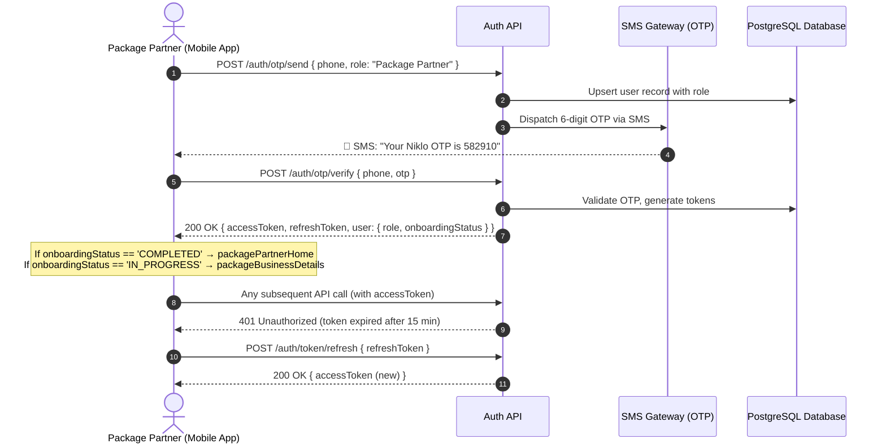
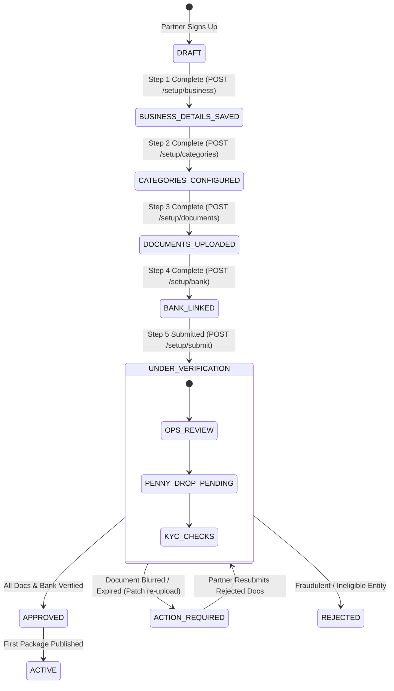
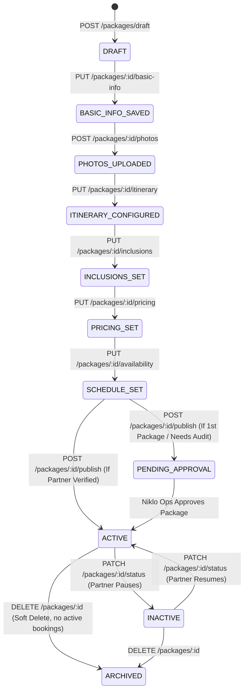
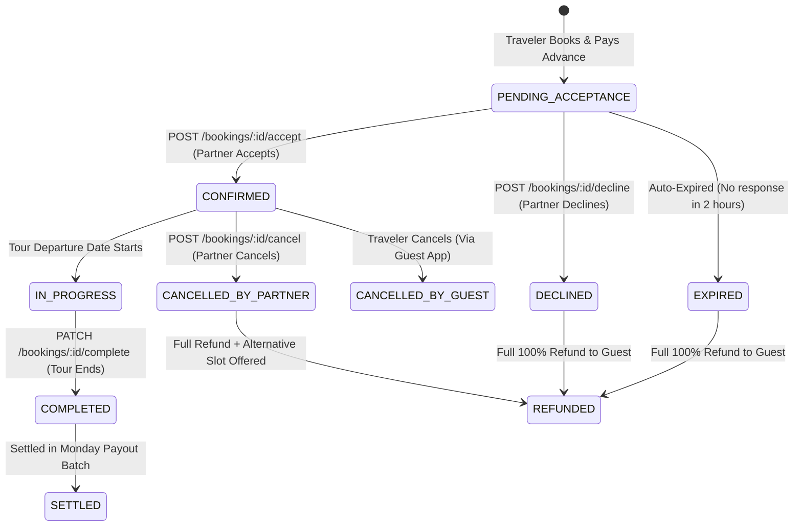
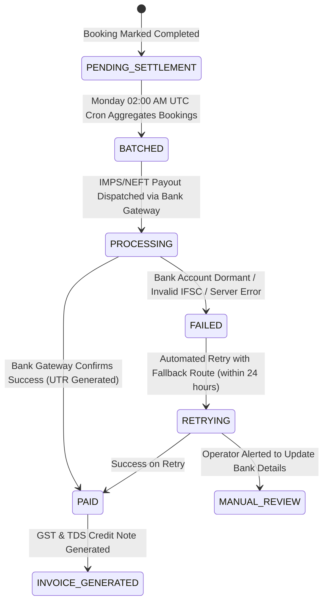
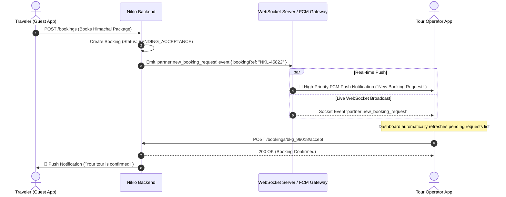
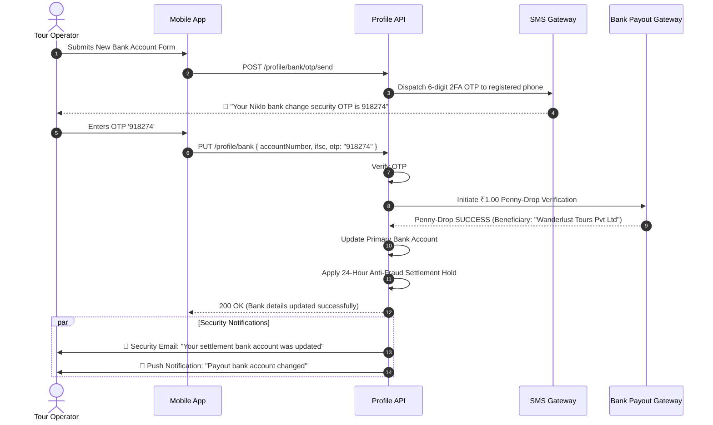
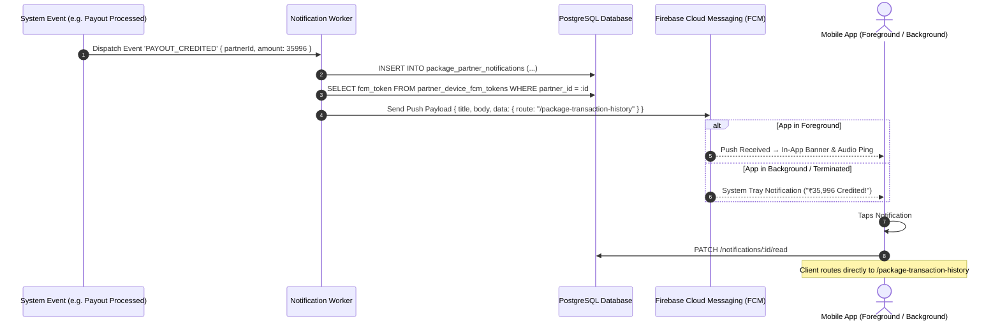

# Package Partner Backend Specification

> **Service**: Package Partner (Holiday Tour Operators)
> **File**: `package_partner_backend.md`
> **Version**: v1.0
> **Last Updated**: September 2026
> **Status**: ✅ Ready for Backend Development
> **Prepared By**: Frontend Team → Backend Handoff

This document provides complete, production-ready backend API specifications, database schemas, state machines, and business rules for the **Package Partner (Holiday Tour Operators)** service in `niklo-partner`. It is intended as the authoritative specification for backend developers to implement API endpoints, database tables, push notification triggers, and settlement pipelines.

---

## Table of Contents

| Module | Description | Endpoints |
|--------|-------------|-----------|
| [Module 0: Authentication](#module-0-authentication--session-management-auth) | OTP login, JWT tokens, logout | 4 |
| [Module 1: Partner Setup & KYC](#module-1-partner-onboarding--business-verification-partnersetup) | 5-step onboarding, docs, penny-drop bank | 8 |
| [Module 2: Package Catalog](#module-2-package-catalog-multi-step-creation--availability-management-partnerpackages) | 7-step creation wizard, availability calendar | 14 |
| [Module 3: Bookings Management](#module-3-bookings-management-requests-details--cancellations-partnerbookings) | Accept/decline requests, manifests, cancellations | 7 |
| [Module 4: Earnings & Settlements](#module-4-earnings-dashboard-weekly-settlements-tax-deductions--payout-invoices-partnerearnings) | Monday payout pipeline, TDS/GST deductions, invoices | 6 |
| [Module 5: Home Dashboard](#module-5-home--real-time-partner-dashboard-partnerhome) | Real-time stats, WebSocket push, Redis caching | 2 |
| [Module 6: Profile & Support](#module-6-profile-business-settings-payout-bank--help-support-partnerprofile) | 2FA bank updates, support tickets, legal docs | 10 |
| [Module 7: Notifications](#module-7-notifications-center-push-triggers--alert-preferences-partnernotifications) | FCM push, mark-read, swipe-dismiss, event triggers | 5 |

### Total API Endpoints: **56**

### Key Tech Stack Requirements for Backend:
- **Database**: PostgreSQL 15+ with `gen_random_uuid()`, `GENERATED ALWAYS AS` computed columns, and Materialized Views.
- **Cache**: Redis 7+ (30-second TTL for dashboard, event-triggered cache eviction).
- **Push Notifications**: Firebase Cloud Messaging (FCM) with `niklo_booking_alerts` high-priority Android channel.
- **Storage**: AWS S3 (Private bucket `niklo-partner-kyc-private` for KYC docs, Public CDN for package media).
- **Bank Payout Gateway**: RazorpayX / Cashfree Payouts (penny-drop, IMPS/NEFT transfers, webhook `transfer.processed`).
- **SMS Gateway**: Kaleyra / MSG91 (OTP delivery, E.164 phone format `+91XXXXXXXXXX`).
- **Tax Compliance**: NSDL PAN verification, GSTN validation APIs, TDS under Section 194-O @ 1%.
- **Cron Scheduler**: Weekly Monday settlement cron at `02:00:00 UTC` (07:30 IST).

---

# Module 0: Authentication & Session Management (`/auth`)

## 1. Overview & Business Flow

Auth is a **shared common module** used by all partner types (`Car Driver`, `Bus Operator`, `Package Partner`, `Adventures Partner`). The client sends a `role` field in the OTP request so the backend can provision the correct partner account type on first-time signup.

### Key Capabilities:
1. **OTP-Based Phone Authentication**: No passwords. Phone number + 6-digit OTP via SMS.
2. **Role-Discriminated Login & Registration**: Same endpoints serve all partner types; `role` in the request body determines which partner record is created or resolved (`role: "Package Partner"`).
3. **JWT Access & Refresh Token Strategy**: Access token is **short-lived (15 minutes)**. Refresh token is persisted on device and used silently by the API client (`ApiClient`) to renew sessions without forcing re-login.
4. **Role-Based Post-Login Routing**: After successful OTP verification, the client routes the operator to the correct dashboard — Package Partner → `AppRouter.packagePartnerHome` (or `AppRouter.packageBusinessDetails` if onboarding is incomplete).
5. **OTP Resend with Cooldown**: 54-second cooldown timer before resend is allowed.
6. **Secure Logout**: Server-side token invalidation + local FCM device token deregistration.

---

## 2. Authentication Flow State Machine



---

## 3. REST API Endpoints Specification

### 3.1 Send OTP (Login & Signup — Shared Endpoint)
- **Method**: `POST`
- **Path**: `/api/v1/auth/otp/send`
- **Auth**: ❌ Public (no JWT required)
- **Request Body**:
```json
{
  "phone": "+919876543210",
  "role": "Package Partner",
  "name": "Rahul Sharma",
  "email": "info@wanderlusttours.in"
}
```
- **Field Rules**:
  - `phone`: Required. Must be a valid E.164 formatted Indian mobile number (`+91XXXXXXXXXX`).
  - `role`: Required. One of `Car Driver`, `Bus Operator`, `Package Partner`, `Adventures Partner`.
  - `name`: Optional during login; required during first-time signup.
  - `email`: Optional during login; required during first-time signup.
- **Response `200 OK`**:
```json
{
  "success": true,
  "message": "OTP sent successfully"
}
```
- **Response `201 Created`** (new user account provisioned):
```json
{
  "success": true,
  "message": "Account created. OTP sent to your mobile."
}
```

---

### 3.2 Verify OTP & Obtain Tokens
- **Method**: `POST`
- **Path**: `/api/v1/auth/otp/verify`
- **Auth**: ❌ Public (no JWT required)
- **Request Body**:
```json
{
  "phone": "+919876543210",
  "otp": "582910"
}
```
- **Response `200 OK`**:
```json
{
  "success": true,
  "data": {
    "accessToken": "eyJhbGciOiJIUzI1NiIsInR5cCI6IkpXVCJ9...",
    "refreshToken": "dGhpcyBpcyBhIHJlZnJlc2ggdG9rZW4...",
    "user": {
      "id": "e3b0c442-98fc-1c14-9afb-4c8996fb9242",
      "phone": "+919876543210",
      "name": "Rahul Sharma",
      "role": "Package Partner",
      "partnerProfileId": "pkg_partner_77281",
      "onboardingStatus": "PENDING_VERIFICATION"
    }
  }
}
```

---

### 3.3 Refresh Access Token (Silent Re-Authentication)
- **Method**: `POST`
- **Path**: `/api/v1/auth/token/refresh`
- **Auth**: ❌ Public (uses refreshToken in body)
- **Request Body**:
```json
{
  "refreshToken": "dGhpcyBpcyBhIHJlZnJlc2ggdG9rZW4..."
}
```
- **Response `200 OK`**:
```json
{
  "success": true,
  "data": {
    "accessToken": "eyJhbGciOiJIUzI1NiIsInR5cCI6IkpXVCJ9..."
  }
}
```

---

### 3.4 Logout & Invalidate Session
- **Method**: `POST`
- **Path**: `/api/v1/auth/logout`
- **Auth**: 🔒 Bearer Token required
- **Request Body**:
```json
{
  "fcmToken": "c-9d8f...optional_device_push_token"
}
```
- **Response `200 OK`**:
```json
{
  "success": true,
  "message": "Logged out successfully"
}
```

---

# Module 1: Partner Onboarding & Business Verification (`/partner/setup`)

## 1. Overview & Business Flow

The **Package Partner Onboarding Flow** takes a newly registered holiday tour operator from an unverified signup through a rigorous 5-step compliance check before their packages can be published on the Niklo marketplace.

### Onboarding Steps:
1. **Step 1: Business Details (`package_business_details_screen.dart`)**: Legal entity name, trade name, business registration type, registered office address, GSTIN, PAN, and contact coordinates.
2. **Step 2: Operational Categories & Regions (`package_business_categories_screen.dart` / `package_categories_screen.dart`)**: Primary tour operational zones (e.g. *Northeast India, Himachal, Goa, Rajasthan*), tour specialties (*Treks, Wildlife Safaris, Luxury Escapes, Heritage, Honeymoon*), average departure group sizes, and fleet/logistics assets.
3. **Step 3: Document Uploads (`package_document_upload_screen.dart`)**: Upload business registration certificate, company PAN, GST registration, Ministry of Tourism / State Tourism Board / IATO license, cancelled bank cheque, and ID proof of authorized signatory.
4. **Step 4: Bank Settlement Account (`package_bank_details_screen.dart`)**: Bank name, account number, IFSC code, account type (Current/Savings), with automated branch lookup and penny-drop micro-deposit bank account verification.
5. **Step 5: Application Submission & Verification Tracking (`package_application_submitted_screen.dart`)**: Generates unique Application Reference (`APP-PKG-8821`), initiates background KYC validation, and displays a step-by-step verification progress timeline (24-48 business hours SLA).

---

## 2. Onboarding Lifecycle State Machine



---

## 3. Database Schema (PostgreSQL)

```sql
-- 1. Package Partner Main Profile Table
CREATE TABLE package_partners (
    id UUID PRIMARY KEY DEFAULT gen_random_uuid(),
    user_id UUID NOT NULL REFERENCES users(id) ON DELETE CASCADE,
    application_ref VARCHAR(30) UNIQUE NOT NULL, -- e.g. 'APP-PKG-8821'
    business_name VARCHAR(150) NOT NULL,
    trade_name VARCHAR(150),
    business_type VARCHAR(50) NOT NULL, -- 'Sole Proprietorship', 'Partnership', 'Private Limited', 'LLP'
    registration_number VARCHAR(80),
    years_in_business INT DEFAULT 0,
    phone VARCHAR(20) NOT NULL,
    email VARCHAR(120) NOT NULL,
    
    -- Address
    address_line1 VARCHAR(255) NOT NULL,
    city VARCHAR(80) NOT NULL,
    state VARCHAR(80) NOT NULL,
    pincode VARCHAR(10) NOT NULL,
    
    -- Tax Identifiers
    pan_number VARCHAR(10) NOT NULL,
    gstin VARCHAR(15),
    
    -- Operational Meta
    primary_regions TEXT[] DEFAULT '{}',
    tour_categories TEXT[] DEFAULT '{}',
    average_group_size VARCHAR(30),
    
    -- Onboarding & Compliance State
    onboarding_step VARCHAR(30) NOT NULL DEFAULT 'BUSINESS_DETAILS', -- 'BUSINESS_DETAILS', 'CATEGORIES', 'DOCUMENTS', 'BANK_DETAILS', 'SUBMITTED', 'VERIFIED'
    verification_status VARCHAR(30) NOT NULL DEFAULT 'DRAFT', -- 'DRAFT', 'UNDER_VERIFICATION', 'ACTION_REQUIRED', 'APPROVED', 'REJECTED'
    rejection_reason TEXT,
    verified_at TIMESTAMPTZ,
    verified_by UUID REFERENCES admin_users(id),
    
    created_at TIMESTAMPTZ NOT NULL DEFAULT NOW(),
    updated_at TIMESTAMPTZ NOT NULL DEFAULT NOW()
);

-- 2. Partner Compliance Documents Table
CREATE TABLE package_partner_documents (
    id UUID PRIMARY KEY DEFAULT gen_random_uuid(),
    partner_id UUID NOT NULL REFERENCES package_partners(id) ON DELETE CASCADE,
    document_type VARCHAR(50) NOT NULL, 
    -- 'BUSINESS_REGISTRATION', 'PAN_CARD', 'GST_CERTIFICATE', 'TOURISM_LICENSE', 'CANCELLED_CHEQUE', 'SIGNATORY_ID'
    document_number VARCHAR(80),
    file_url VARCHAR(500) NOT NULL,
    file_name VARCHAR(255) NOT NULL,
    file_size_bytes INT NOT NULL,
    mime_type VARCHAR(50) NOT NULL,
    
    verification_status VARCHAR(30) NOT NULL DEFAULT 'PENDING', -- 'PENDING', 'VERIFIED', 'REJECTED'
    rejection_reason TEXT,
    uploaded_at TIMESTAMPTZ NOT NULL DEFAULT NOW(),
    reviewed_at TIMESTAMPTZ,
    
    UNIQUE(partner_id, document_type)
);

-- 3. Partner Payout Bank Accounts Table
CREATE TABLE package_partner_bank_accounts (
    id UUID PRIMARY KEY DEFAULT gen_random_uuid(),
    partner_id UUID NOT NULL REFERENCES package_partners(id) ON DELETE CASCADE,
    bank_name VARCHAR(100) NOT NULL,
    branch_name VARCHAR(120),
    account_holder_name VARCHAR(120) NOT NULL,
    account_number_encrypted TEXT NOT NULL,
    account_number_mask VARCHAR(20) NOT NULL, -- e.g. '•••• •••• 4521'
    ifsc_code VARCHAR(11) NOT NULL,
    account_type VARCHAR(20) NOT NULL DEFAULT 'CURRENT', -- 'CURRENT', 'SAVINGS'
    
    -- Penny drop micro-deposit validation
    penny_drop_status VARCHAR(30) NOT NULL DEFAULT 'PENDING', -- 'PENDING', 'SUCCESS', 'FAILED'
    penny_drop_ref VARCHAR(100),
    penny_drop_beneficiary_name VARCHAR(120),
    
    is_primary BOOLEAN NOT NULL DEFAULT TRUE,
    is_verified BOOLEAN NOT NULL DEFAULT FALSE,
    created_at TIMESTAMPTZ NOT NULL DEFAULT NOW(),
    updated_at TIMESTAMPTZ NOT NULL DEFAULT NOW()
);

-- Indexes for lightning queries
CREATE INDEX idx_pkg_partner_user_id ON package_partners(user_id);
CREATE INDEX idx_pkg_partner_app_ref ON package_partners(application_ref);
CREATE INDEX idx_pkg_partner_docs ON package_partner_documents(partner_id, document_type);
CREATE INDEX idx_pkg_partner_bank ON package_partner_bank_accounts(partner_id);
```

---

## 4. REST API Endpoints Specification

---

### 4.1 Save Business Details (Step 1)
Saves or updates legal business identification, address, and tax information.

- **Method**: `POST`
- **Path**: `/api/v1/package-partner/setup/business`
- **Auth**: 🔒 Bearer Token required
- **Request Body**:
```json
{
  "businessName": "Wanderlust Tours & Travels Pvt Ltd",
  "tradeName": "Wanderlust Tours",
  "businessType": "Private Limited",
  "registrationNumber": "U63040MH2021PTC368291",
  "yearsInBusiness": 5,
  "phone": "+919876543210",
  "email": "info@wanderlusttours.in",
  "address": {
    "line1": "123, MG Road, Fort",
    "city": "Mumbai",
    "state": "Maharashtra",
    "pincode": "400001"
  },
  "panNumber": "AADCW1234F",
  "gstin": "27AADCW1234F1Z5"
}
```
- **Validation Rules**:
  - `businessName`: Required. Max 150 chars.
  - `businessType`: Must be one of `['Sole Proprietorship', 'Partnership', 'Private Limited', 'LLP']`.
  - `panNumber`: Required. Format: `^[A-Z]{5}[0-9]{4}[A-Z]{1}$`.
  - `gstin`: Optional if turnover < ₹20L, otherwise format `^[0-9]{2}[A-Z]{5}[0-9]{4}[A-Z]{1}[1-9A-Z]{1}Z[0-9A-Z]{1}$`.
  - `pincode`: Required. 6 digits.
- **Response `200 OK`**:
```json
{
  "success": true,
  "message": "Business details saved successfully",
  "data": {
    "partnerId": "pkg_partner_77281",
    "applicationRef": "APP-PKG-8821",
    "nextStep": "CATEGORIES"
  }
}
```

---

### 4.2 Save Operational Regions & Categories (Step 2)
Sets up tour destinations, specialty tags, and operational capacity.

- **Method**: `POST`
- **Path**: `/api/v1/package-partner/setup/categories`
- **Auth**: 🔒 Bearer Token required
- **Request Body**:
```json
{
  "primaryRegions": [
    "Northeast India",
    "Himachal & Uttarakhand",
    "Goa & Coastal Escapes"
  ],
  "tourCategories": [
    "Adventure & Treks",
    "Luxury Escapes",
    "Cultural & Heritage",
    "Wildlife Safaris"
  ],
  "averageGroupSize": "10-25 Travelers"
}
```
- **Response `200 OK`**:
```json
{
  "success": true,
  "message": "Operational categories configured",
  "data": {
    "partnerId": "pkg_partner_77281",
    "nextStep": "DOCUMENTS"
  }
}
```

---

### 4.3 Upload Compliance Document (Step 3)
Uploads legal compliance documents directly (or requests an S3 presigned URL).

- **Method**: `POST`
- **Path**: `/api/v1/package-partner/setup/documents/upload`
- **Auth**: 🔒 Bearer Token required
- **Content-Type**: `multipart/form-data`
- **Form Fields**:
  - `documentType`: `BUSINESS_REGISTRATION` | `PAN_CARD` | `GST_CERTIFICATE` | `TOURISM_LICENSE` | `CANCELLED_CHEQUE` | `SIGNATORY_ID`
  - `documentNumber`: (e.g. `27AADCW1234F1Z5`)
  - `file`: Binary file (PDF, JPG, PNG, max 10MB)
- **Response `201 Created`**:
```json
{
  "success": true,
  "message": "Document uploaded successfully",
  "data": {
    "documentId": "doc_88491",
    "documentType": "GST_CERTIFICATE",
    "fileName": "gst_registration_cert.pdf",
    "fileUrl": "https://s3.ap-south-1.amazonaws.com/niklo-docs/pkg_partner_77281/gst_cert.pdf",
    "verificationStatus": "PENDING",
    "uploadedAt": "2026-08-31T18:24:00Z"
  }
}
```

---

### 4.4 Get Onboarding Document Checklist & Status (Step 3)
Retrieves the real-time upload and verification status of all required documents.

- **Method**: `GET`
- **Path**: `/api/v1/package-partner/setup/documents`
- **Auth**: 🔒 Bearer Token required
- **Response `200 OK`**:
```json
{
  "success": true,
  "data": {
    "requiredCount": 6,
    "uploadedCount": 6,
    "verifiedCount": 0,
    "documents": [
      {
        "documentType": "BUSINESS_REGISTRATION",
        "title": "Business Registration / Incorporation",
        "isRequired": true,
        "status": "UPLOADED",
        "fileName": "incorporation_cert.pdf",
        "rejectionReason": null
      },
      {
        "documentType": "PAN_CARD",
        "title": "Company PAN Card",
        "isRequired": true,
        "status": "UPLOADED",
        "fileName": "company_pan.jpg",
        "rejectionReason": null
      },
      {
        "documentType": "GST_CERTIFICATE",
        "title": "GST Registration Certificate",
        "isRequired": true,
        "status": "UPLOADED",
        "fileName": "gst_certificate.pdf",
        "rejectionReason": null
      },
      {
        "documentType": "TOURISM_LICENSE",
        "title": "State Tourism / IATO License",
        "isRequired": true,
        "status": "UPLOADED",
        "fileName": "iato_license_2026.pdf",
        "rejectionReason": null
      },
      {
        "documentType": "CANCELLED_CHEQUE",
        "title": "Cancelled Cheque / Bank Statement",
        "isRequired": true,
        "status": "UPLOADED",
        "fileName": "hdfc_cancelled_cheque.jpg",
        "rejectionReason": null
      },
      {
        "documentType": "SIGNATORY_ID",
        "title": "Aadhaar / Passport of Signatory",
        "isRequired": true,
        "status": "UPLOADED",
        "fileName": "signatory_aadhaar.pdf",
        "rejectionReason": null
      }
    ]
  }
}
```

---

### 4.5 Lookup Bank IFSC Code (Step 4 Helper)
Fetches bank name, branch name, city, and state automatically from Razorpay / RBI IFSC registry.

- **Method**: `GET`
- **Path**: `/api/v1/package-partner/setup/bank/ifsc-lookup?ifsc={ifscCode}`
- **Auth**: 🔒 Bearer Token required
- **Response `200 OK`**:
```json
{
  "success": true,
  "data": {
    "ifsc": "HDFC0000240",
    "bankName": "HDFC Bank",
    "branchName": "Fort Mumbai Branch",
    "city": "Mumbai",
    "state": "Maharashtra",
    "isSupported": true
  }
}
```
- **Error `404 Not Found`**:
```json
{
  "success": false,
  "errorCode": "INVALID_IFSC",
  "message": "Invalid IFSC code. Please verify the code on your cheque book."
}
```

---

### 4.6 Save Bank Details & Initiate Penny Drop Verification (Step 4)
Saves payout bank credentials and automatically triggers an instant ₹1 penny-drop validation via RazorpayX / Cashfree Payouts.

- **Method**: `POST`
- **Path**: `/api/v1/package-partner/setup/bank`
- **Auth**: 🔒 Bearer Token required
- **Request Body**:
```json
{
  "accountHolderName": "WANDERLUST TOURS AND TRAVELS PVT LTD",
  "accountNumber": "50200084920194",
  "confirmAccountNumber": "50200084920194",
  "ifscCode": "HDFC0000240",
  "accountType": "CURRENT"
}
```
- **Response `200 OK`**:
```json
{
  "success": true,
  "message": "Bank details linked. Penny drop verification initiated.",
  "data": {
    "bankAccountId": "bnk_99182",
    "bankName": "HDFC Bank",
    "branch": "Fort Mumbai Branch",
    "accountMask": "•••• •••• 0194",
    "pennyDropStatus": "SUCCESS",
    "nameMatchScore": 98.5,
    "registeredBeneficiary": "WANDERLUST TOURS & TRAVELS PRIVATE LIMITED",
    "nextStep": "SUBMIT_APPLICATION"
  }
}
```

---

### 4.7 Submit Partner Application for Verification (Step 5)
Freezes the onboarding profile and submits it to the Niklo Ops Admin team for approval.

- **Method**: `POST`
- **Path**: `/api/v1/package-partner/setup/submit`
- **Auth**: 🔒 Bearer Token required
- **Response `200 OK`**:
```json
{
  "success": true,
  "message": "Application submitted successfully for review",
  "data": {
    "applicationRef": "APP-PKG-8821",
    "submissionDate": "2026-08-31T18:25:00Z",
    "estimatedReviewHours": 24,
    "status": "UNDER_VERIFICATION",
    "checklist": {
      "businessDetails": "COMPLETED",
      "categories": "COMPLETED",
      "documents": "UPLOADED",
      "bankAccount": "VERIFIED"
    }
  }
}
```

---

### 4.8 Get Partner Application Review Status (Step 5 Tracker)
Polled by mobile client or checked upon app start.

- **Method**: `GET`
- **Path**: `/api/v1/package-partner/setup/status`
- **Auth**: 🔒 Bearer Token required
- **Response `200 OK` (Under Review)**:
```json
{
  "success": true,
  "data": {
    "applicationRef": "APP-PKG-8821",
    "status": "UNDER_VERIFICATION",
    "submittedAt": "2026-08-31T18:25:00Z",
    "timeline": [
      {
        "title": "Application Submitted",
        "description": "Your documents & business profile were received.",
        "status": "COMPLETED",
        "completedAt": "2026-08-31T18:25:00Z"
      },
      {
        "title": "Document & Tax Verification",
        "description": "Ops team verifying GSTIN, PAN and Tourism License.",
        "status": "IN_PROGRESS",
        "completedAt": null
      },
      {
        "title": "Bank Account Penny-Drop",
        "description": "Automatic verification of payout beneficiary.",
        "status": "COMPLETED",
        "completedAt": "2026-08-31T18:25:05Z"
      },
      {
        "title": "Account Activation",
        "description": "Final approval to publish packages on marketplace.",
        "status": "PENDING",
        "completedAt": null
      }
    ]
  }
}
```

---

## 5. Security, Validation & Business Logic Rules

1. **Document Storage Security**:
   - Files are stored in a private AWS S3 bucket (`niklo-partner-kyc-private`) with AES-256 server-side encryption.
   - Files are only accessible via time-bounded (15-minute) presigned S3 URLs generated for authorized Admin Ops reviewers.
2. **PAN & GSTIN Validation**:
   - Backend calls NSDL / GSTN APIs to verify entity active status and registered name similarity (>85% Levenshtein match).
3. **Bank Account Penny-Drop Validation**:
   - ₹1.00 is credited to the operator's bank account via IMPS.
   - Returned beneficiary name from the destination bank must match the business entity name or proprietor name.
4. **Resubmission Flow**:
   - If a document is rejected (e.g. *Blurry image*), the backend sets status to `ACTION_REQUIRED` and pushes an FCM notification prompting the partner to re-upload only that specific document.

---

# Module 2: Package Catalog, Multi-Step Creation & Availability Management (`/partner/packages`)

## 1. Overview & Business Flow

The **Package Catalog Module** is the core commercial engine for holiday tour operators. Operators create, configure, price, schedule, and manage comprehensive multi-day tour packages with full itinerary breakdowns and departure seat allocations.

### Key Workflows:
1. **Catalog Overview & Quick Status Toggle (`package_screen.dart`)**:
   - View all packages grouped by state: `All`, `Active`, `Draft`, `Inactive`.
   - Instant toggle switch to pause or resume booking availability for any package.
   - Quick metrics per package: duration, price per person, total active bookings, next departure date.
2. **7-Step Package Creation Wizard (`create_package_*_screen.dart`)**:
   - **Step 1: Basic Info**: Package title, description, category tag, duration (Days & Nights), destination city, pickup location, min/max traveler capacity.
   - **Step 2: Photos**: Cover photo (16:9 ratio) and gallery images (up to 10 photos) with S3 storage.
   - **Step 3: Day-by-Day Itinerary Builder**: Detailed itinerary where each day has a title, summary, and timed activity items (e.g., `08:00 AM - Hotel Pickup & Scenic Drive`).
   - **Step 4: Inclusions & Exclusions**: Tag chips specifying included amenities (Stay, Meals, Transport, Guide, Entry passes) vs excluded expenses (Flights, Personal, Insurance).
   - **Step 5: Pricing & Commercials**: Per-person or fixed-group pricing model, base price, optional discount toggle (flat or %), 5% GST tax rules.
   - **Step 6: Calendar Schedule & Departure Slots**: Schedule presets (*All Days*, *Every Weekend*, *Custom Selection*), seat capacity allocation per departure date, and slot availability states (`Available`, `Limited`, `Sold Out`, `Blocked`).
   - **Step 7: Review & Publish (`create_package_review_screen.dart` & `package_published_screen.dart`)**: Full preview summary, draft persistence, and instant marketplace publishing.
3. **Live Calendar Availability Management (`package_availability_management_screen.dart`)**:
   - Ongoing slot management for published packages.
   - Operators can adjust remaining seats, block specific dates (e.g., due to monsoon or vehicle maintenance), or set seasonal price overrides.

---

## 2. Package Lifecycle State Machine



---

## 3. Database Schema (PostgreSQL)

```sql
-- 1. Main Packages Table
CREATE TABLE holiday_packages (
    id UUID PRIMARY KEY DEFAULT gen_random_uuid(),
    partner_id UUID NOT NULL REFERENCES package_partners(id) ON DELETE CASCADE,
    title VARCHAR(200) NOT NULL,
    tagline VARCHAR(300),
    description TEXT NOT NULL,
    category VARCHAR(80) NOT NULL, 
    -- 'Adventure & Treks', 'Luxury Escapes', 'Cultural & Heritage', 'Wildlife Safaris', 'Weekend Getaways', 'Honeymoon Special'
    
    -- Duration
    duration_days INT NOT NULL CHECK (duration_days >= 1),
    duration_nights INT NOT NULL CHECK (duration_nights >= 0),
    
    -- Location Coordinates
    destination_city VARCHAR(100) NOT NULL,
    destination_state VARCHAR(100) NOT NULL,
    starting_location VARCHAR(200) NOT NULL,
    dropoff_location VARCHAR(200),
    
    -- Capacity Constraints
    min_travelers INT NOT NULL DEFAULT 1,
    max_travelers INT NOT NULL DEFAULT 30,
    
    -- Commercials
    pricing_mode VARCHAR(30) NOT NULL DEFAULT 'PER_PERSON', -- 'PER_PERSON', 'FIXED_GROUP'
    base_price NUMERIC(12, 2) NOT NULL CHECK (base_price > 0),
    has_discount BOOLEAN NOT NULL DEFAULT FALSE,
    discount_type VARCHAR(20) DEFAULT 'PERCENTAGE', -- 'PERCENTAGE', 'FLAT'
    discount_value NUMERIC(10, 2) DEFAULT 0,
    final_price NUMERIC(12, 2) NOT NULL,
    is_gst_included BOOLEAN NOT NULL DEFAULT TRUE,
    
    -- Media
    cover_image_url VARCHAR(500),
    
    -- Lifecycle State
    status VARCHAR(30) NOT NULL DEFAULT 'DRAFT', 
    -- 'DRAFT', 'PENDING_APPROVAL', 'ACTIVE', 'INACTIVE', 'ARCHIVED'
    current_creation_step INT NOT NULL DEFAULT 1, -- 1 to 7
    total_bookings_count INT NOT NULL DEFAULT 0,
    average_rating NUMERIC(3, 2) DEFAULT 5.0,
    total_reviews_count INT NOT NULL DEFAULT 0,
    
    created_at TIMESTAMPTZ NOT NULL DEFAULT NOW(),
    updated_at TIMESTAMPTZ NOT NULL DEFAULT NOW()
);

-- 2. Package Gallery Media Table
CREATE TABLE package_gallery_media (
    id UUID PRIMARY KEY DEFAULT gen_random_uuid(),
    package_id UUID NOT NULL REFERENCES holiday_packages(id) ON DELETE CASCADE,
    media_url VARCHAR(500) NOT NULL,
    thumbnail_url VARCHAR(500),
    media_type VARCHAR(20) NOT NULL DEFAULT 'IMAGE', -- 'IMAGE', 'VIDEO'
    sort_order INT NOT NULL DEFAULT 0,
    created_at TIMESTAMPTZ NOT NULL DEFAULT NOW()
);

-- 3. Package Itinerary Days Table
CREATE TABLE package_itinerary_days (
    id UUID PRIMARY KEY DEFAULT gen_random_uuid(),
    package_id UUID NOT NULL REFERENCES holiday_packages(id) ON DELETE CASCADE,
    day_number INT NOT NULL, -- 1, 2, 3...
    title VARCHAR(200) NOT NULL, -- e.g. 'Arrival in Shillong & Umiam Lake Visit'
    summary TEXT NOT NULL,
    meals_included TEXT[] DEFAULT '{}', -- 'Breakfast', 'Lunch', 'Dinner'
    hotel_stay_name VARCHAR(150),
    created_at TIMESTAMPTZ NOT NULL DEFAULT NOW(),
    
    UNIQUE(package_id, day_number)
);

-- 4. Package Itinerary Activities Table
CREATE TABLE package_itinerary_activities (
    id UUID PRIMARY KEY DEFAULT gen_random_uuid(),
    day_id UUID NOT NULL REFERENCES package_itinerary_days(id) ON DELETE CASCADE,
    time_slot VARCHAR(30) NOT NULL, -- '09:00 AM', '02:30 PM', 'Evening'
    title VARCHAR(150) NOT NULL,
    description TEXT,
    activity_icon VARCHAR(50) DEFAULT 'explore', -- 'directions_bus', 'hotel', 'restaurant', 'hiking'
    sort_order INT NOT NULL DEFAULT 0
);

-- 5. Package Inclusions & Exclusions Table
CREATE TABLE package_inclusions (
    id UUID PRIMARY KEY DEFAULT gen_random_uuid(),
    package_id UUID NOT NULL REFERENCES holiday_packages(id) ON DELETE CASCADE,
    item_title VARCHAR(120) NOT NULL,
    is_included BOOLEAN NOT NULL DEFAULT TRUE, -- TRUE = Included, FALSE = Excluded
    category VARCHAR(50) DEFAULT 'GENERAL' -- 'ACCOMMODATION', 'TRANSPORT', 'MEALS', 'ACTIVITIES', 'INSURANCE'
);

-- 6. Package Calendar Departures & Seat Allocations Table
CREATE TABLE package_departures (
    id UUID PRIMARY KEY DEFAULT gen_random_uuid(),
    package_id UUID NOT NULL REFERENCES holiday_packages(id) ON DELETE CASCADE,
    departure_date DATE NOT NULL,
    return_date DATE NOT NULL,
    
    total_seats INT NOT NULL CHECK (total_seats > 0),
    booked_seats INT NOT NULL DEFAULT 0 CHECK (booked_seats >= 0),
    available_seats INT GENERATED ALWAYS AS (total_seats - booked_seats) STORED,
    
    price_override NUMERIC(12, 2), -- Optional seasonal surge price for this specific departure date
    status VARCHAR(30) NOT NULL DEFAULT 'AVAILABLE', 
    -- 'AVAILABLE', 'LIMITED', 'SOLD_OUT', 'BLOCKED'
    
    created_at TIMESTAMPTZ NOT NULL DEFAULT NOW(),
    updated_at TIMESTAMPTZ NOT NULL DEFAULT NOW(),
    
    UNIQUE(package_id, departure_date)
);

-- Indexes for ultra-fast catalog and departure queries
CREATE INDEX idx_packages_partner_status ON holiday_packages(partner_id, status);
CREATE INDEX idx_packages_category ON holiday_packages(category);
CREATE INDEX idx_departures_package_date ON package_departures(package_id, departure_date);
CREATE INDEX idx_departures_availability ON package_departures(departure_date, status) WHERE available_seats > 0;
```

---

## 4. REST API Endpoints Specification

---

### 4.1 List Partner Packages
Retrieves a paginated list of packages created by the authenticated partner with optional status and text filtering.

- **Method**: `GET`
- **Path**: `/api/v1/package-partner/packages`
- **Auth**: 🔒 Bearer Token required
- **Query Parameters**:
  - `status`: Optional. `ALL` | `ACTIVE` | `DRAFT` | `INACTIVE` (Default: `ALL`)
  - `search`: Optional string (filters by title, destination, category)
  - `page`: Optional int (Default: 1)
  - `limit`: Optional int (Default: 20)
- **Response `200 OK`**:
```json
{
  "success": true,
  "data": {
    "totalCount": 6,
    "activeCount": 4,
    "draftCount": 1,
    "inactiveCount": 1,
    "packages": [
      {
        "id": "pkg_8829104",
        "title": "Himachal Snow & Valley Adventure",
        "tagline": "Experience pristine snow peaks and serene cedar forests.",
        "category": "Adventure & Treks",
        "durationDays": 5,
        "durationNights": 4,
        "destinationCity": "Manali",
        "startingLocation": "Chandigarh / Delhi",
        "price": 18999,
        "rawPrice": "₹18,999",
        "pricingMode": "PER_PERSON",
        "coverImageUrl": "https://images.unsplash.com/photo-1626621341517-bbf3d9990a23?w=800",
        "status": "ACTIVE",
        "totalBookingsCount": 8,
        "averageRating": 4.9,
        "nextDepartureDate": "2026-10-12",
        "seatsAvailableNextDeparture": 6
      },
      {
        "id": "pkg_8829105",
        "title": "Goa Luxury Coastal Escape",
        "tagline": "Private villas, yacht sunset cruise & heritage trails.",
        "category": "Luxury Escapes",
        "durationDays": 4,
        "durationNights": 3,
        "destinationCity": "North Goa",
        "startingLocation": "Goa Airport (GOI)",
        "price": 24500,
        "rawPrice": "₹24,500",
        "pricingMode": "PER_PERSON",
        "coverImageUrl": "https://images.unsplash.com/photo-1512343879784-a960bf40e7f2?w=800",
        "status": "ACTIVE",
        "totalBookingsCount": 4,
        "averageRating": 4.8,
        "nextDepartureDate": "2026-10-20",
        "seatsAvailableNextDeparture": 4
      },
      {
        "id": "pkg_8829106",
        "title": "Golden Triangle Heritage Tour",
        "tagline": "Delhi, Agra Taj Mahal and Royal Jaipur Palaces.",
        "category": "Cultural & Heritage",
        "durationDays": 6,
        "durationNights": 5,
        "destinationCity": "Jaipur & Agra",
        "startingLocation": "New Delhi (DEL)",
        "price": 32000,
        "rawPrice": "₹32,000",
        "pricingMode": "PER_PERSON",
        "coverImageUrl": "https://images.unsplash.com/photo-1564507592333-c60657eea523?w=800",
        "status": "DRAFT",
        "totalBookingsCount": 0,
        "averageRating": 5.0,
        "nextDepartureDate": null,
        "seatsAvailableNextDeparture": 0
      }
    ]
  }
}
```

---

### 4.2 Get Package Full Details
Fetches complete itinerary, media, inclusions, and active departure schedules for editing or review.

- **Method**: `GET`
- **Path**: `/api/v1/package-partner/packages/:id`
- **Auth**: 🔒 Bearer Token required
- **Response `200 OK`**:
```json
{
  "success": true,
  "data": {
    "id": "pkg_8829104",
    "title": "Himachal Snow & Valley Adventure",
    "tagline": "Experience pristine snow peaks and serene cedar forests.",
    "description": "A thrilling 5-day mountain escape through Solang Valley, Rohtang Pass, Kasol and Manikaran with riverside camping and guided trekking.",
    "category": "Adventure & Treks",
    "durationDays": 5,
    "durationNights": 4,
    "destinationCity": "Manali",
    "destinationState": "Himachal Pradesh",
    "startingLocation": "Chandigarh Airport / Station",
    "minTravelers": 2,
    "maxTravelers": 16,
    "pricingMode": "PER_PERSON",
    "basePrice": 19999,
    "hasDiscount": true,
    "discountType": "FLAT",
    "discountValue": 1000,
    "finalPrice": 18999,
    "isGstIncluded": true,
    "coverImageUrl": "https://images.unsplash.com/photo-1626621341517-bbf3d9990a23?w=800",
    "gallery": [
      "https://images.unsplash.com/photo-1586375300773-8384e3e4916f?w=800",
      "https://images.unsplash.com/photo-1605649487212-47bdab064df7?w=800"
    ],
    "itinerary": [
      {
        "dayNumber": 1,
        "title": "Arrival in Chandigarh & Drive to Manali",
        "summary": "Pickup from Chandigarh, scenic highway drive through Kullu Valley, evening hotel check-in.",
        "mealsIncluded": ["Dinner"],
        "activities": [
          {
            "timeSlot": "09:00 AM",
            "title": "Airport / Railway Station Pickup",
            "description": "Meet tour coordinator in AC Tempo Traveller.",
            "activityIcon": "directions_bus"
          },
          {
            "timeSlot": "06:30 PM",
            "title": "Hotel Check-in & Welcome Dinner",
            "description": "Relax at alpine resort with traditional Himachali meal.",
            "activityIcon": "hotel"
          }
        ]
      },
      {
        "dayNumber": 2,
        "title": "Solang Valley Snow Activities & Old Manali",
        "summary": "Paragliding, snow scooter rides, visit Hadimba Temple and cafes.",
        "mealsIncluded": ["Breakfast", "Dinner"],
        "activities": [
          {
            "timeSlot": "08:30 AM",
            "title": "Solang Valley Excursion",
            "description": "Guided snow adventure and cable car ride.",
            "activityIcon": "hiking"
          }
        ]
      }
    ],
    "inclusions": [
      { "itemTitle": "4 Nights 3-Star Resort Stay", "isIncluded": true },
      { "itemTitle": "Daily Breakfast & Dinner", "isIncluded": true },
      { "itemTitle": "AC Tempo Traveller Transfers", "isIncluded": true },
      { "itemTitle": "Certified Mountain Guide", "isIncluded": true },
      { "itemTitle": "Flights / Train Tickets", "isIncluded": false },
      { "itemTitle": "Personal Paragliding / Sports Charges", "isIncluded": false },
      { "itemTitle": "Lunch Expenses", "isIncluded": false }
    ],
    "status": "ACTIVE"
  }
}
```

---

### 4.3 Initialize Package Creation Draft
Starts a new package draft and allocates a draft UUID.

- **Method**: `POST`
- **Path**: `/api/v1/package-partner/packages/draft`
- **Auth**: 🔒 Bearer Token required
- **Response `201 Created`**:
```json
{
  "success": true,
  "data": {
    "packageId": "pkg_9901841",
    "currentStep": 1,
    "status": "DRAFT"
  }
}
```

---

### 4.4 Save Basic Information (Step 1)
- **Method**: `PUT`
- **Path**: `/api/v1/package-partner/packages/:id/basic-info`
- **Auth**: 🔒 Bearer Token required
- **Request Body**:
```json
{
  "title": "Himachal Snow & Valley Adventure",
  "tagline": "Experience pristine snow peaks and serene cedar forests.",
  "description": "A thrilling 5-day mountain escape through Solang Valley and Kasol.",
  "category": "Adventure & Treks",
  "durationDays": 5,
  "durationNights": 4,
  "destinationCity": "Manali",
  "destinationState": "Himachal Pradesh",
  "startingLocation": "Chandigarh Airport / Station",
  "minTravelers": 2,
  "maxTravelers": 16
}
```
- **Validation Rules**:
  - `title`: Required, 10–150 characters.
  - `durationDays`: Must be >= 1.
  - `durationNights`: Must equal `durationDays - 1` (or same if overnight journey included).
  - `minTravelers` must be <= `maxTravelers`.
- **Response `200 OK`**:
```json
{
  "success": true,
  "message": "Basic info saved",
  "data": {
    "packageId": "pkg_9901841",
    "nextStep": 2
  }
}
```

---

### 4.5 Upload Package Photos & Media (Step 2)
- **Method**: `POST`
- **Path**: `/api/v1/package-partner/packages/:id/photos`
- **Auth**: 🔒 Bearer Token required
- **Content-Type**: `multipart/form-data`
- **Form Fields**:
  - `coverImage`: Binary file (JPEG/PNG/WebP, minimum 1200x800 px, max 8MB).
  - `galleryImages`: Multiple binary files (up to 10 photos).
- **Response `200 OK`**:
```json
{
  "success": true,
  "message": "Photos uploaded successfully",
  "data": {
    "coverImageUrl": "https://s3.ap-south-1.amazonaws.com/niklo-packages/pkg_9901841/cover.jpg",
    "galleryCount": 4,
    "nextStep": 3
  }
}
```

---

### 4.6 Save Day-by-Day Itinerary (Step 3)
- **Method**: `PUT`
- **Path**: `/api/v1/package-partner/packages/:id/itinerary`
- **Auth**: 🔒 Bearer Token required
- **Request Body**:
```json
{
  "itinerary": [
    {
      "dayNumber": 1,
      "title": "Arrival in Chandigarh & Drive to Manali",
      "summary": "Pickup from Chandigarh, scenic highway drive through Kullu Valley.",
      "mealsIncluded": ["Dinner"],
      "activities": [
        {
          "timeSlot": "09:00 AM",
          "title": "Airport / Railway Station Pickup",
          "description": "Meet tour coordinator in AC Tempo Traveller.",
          "activityIcon": "directions_bus"
        },
        {
          "timeSlot": "06:30 PM",
          "title": "Hotel Check-in & Dinner",
          "description": "Check in to resort and evening dinner.",
          "activityIcon": "hotel"
        }
      ]
    },
    {
      "dayNumber": 2,
      "title": "Solang Valley Snow Adventure",
      "summary": "Full day excursion to Solang Valley for adventure activities.",
      "mealsIncluded": ["Breakfast", "Dinner"],
      "activities": [
        {
          "timeSlot": "09:00 AM",
          "title": "Solang Valley Excursion",
          "description": "Enjoy skiing and snow games.",
          "activityIcon": "hiking"
        }
      ]
    }
  ]
}
```
- **Validation Rule**:
  - The count of elements in `itinerary` array must strictly match `durationDays` configured in Step 1.
- **Response `200 OK`**:
```json
{
  "success": true,
  "message": "Itinerary updated",
  "data": {
    "daysCount": 2,
    "nextStep": 4
  }
}
```

---

### 4.7 Save Inclusions & Exclusions (Step 4)
- **Method**: `PUT`
- **Path**: `/api/v1/package-partner/packages/:id/inclusions`
- **Auth**: 🔒 Bearer Token required
- **Request Body**:
```json
{
  "included": [
    "Hotel Stay",
    "Breakfast",
    "Airport Transfer",
    "Sightseeing",
    "Transportation",
    "Tour Guide",
    "Entry Tickets"
  ],
  "excluded": [
    "Flights",
    "Personal Expenses",
    "Lunch",
    "Dinner",
    "Travel Insurance"
  ]
}
```
- **Response `200 OK`**:
```json
{
  "success": true,
  "message": "Inclusions configured",
  "data": {
    "includedCount": 7,
    "excludedCount": 5,
    "nextStep": 5
  }
}
```

---

### 4.8 Save Pricing & Tax Details (Step 5)
- **Method**: `PUT`
- **Path**: `/api/v1/package-partner/packages/:id/pricing`
- **Auth**: 🔒 Bearer Token required
- **Request Body**:
```json
{
  "pricingMode": "PER_PERSON",
  "basePrice": 19999,
  "hasDiscount": true,
  "discountType": "FLAT",
  "discountValue": 1000,
  "isGstIncluded": true
}
```
- **Validation Rule**:
  - `finalPrice` is calculated server-side: `basePrice - discountValue` = `₹18,999`. Must be > 0.
- **Response `200 OK`**:
```json
{
  "success": true,
  "message": "Pricing rules saved",
  "data": {
    "pricingMode": "PER_PERSON",
    "basePrice": 19999,
    "finalPrice": 18999,
    "nextStep": 6
  }
}
```

---

### 4.9 Batch Schedule Departure Calendar (Step 6)
Creates departure dates with seat allocations.

- **Method**: `PUT`
- **Path**: `/api/v1/package-partner/packages/:id/availability`
- **Auth**: 🔒 Bearer Token required
- **Request Body**:
```json
{
  "seatsPerDeparture": 12,
  "departureDates": [
    "2026-10-03",
    "2026-10-10",
    "2026-10-17",
    "2026-10-24",
    "2026-10-31",
    "2026-11-07"
  ]
}
```
- **Response `200 OK`**:
```json
{
  "success": true,
  "message": "Departures schedule created",
  "data": {
    "totalDeparturesCreated": 6,
    "totalSeatsAllocated": 72,
    "nextStep": 7
  }
}
```

---

### 4.10 Publish Package to Marketplace (Step 7 Finalize)
Validates all 6 steps for data completeness and publishes the tour package.

- **Method**: `POST`
- **Path**: `/api/v1/package-partner/packages/:id/publish`
- **Auth**: 🔒 Bearer Token required
- **Response `200 OK`**:
```json
{
  "success": true,
  "message": "Package published successfully to Niklo marketplace!",
  "data": {
    "packageId": "pkg_9901841",
    "title": "Himachal Snow & Valley Adventure",
    "status": "ACTIVE",
    "publishedAt": "2026-08-31T18:40:00Z",
    "marketplaceUrl": "https://niklo.in/packages/himachal-snow-valley-pkg_9901841"
  }
}
```
- **Error `422 Unprocessable Entity` (Missing Steps)**:
```json
{
  "success": false,
  "errorCode": "PACKAGE_INCOMPLETE",
  "message": "Cannot publish package. Day 3 itinerary has no activities and at least 1 departure date is required.",
  "missingFields": ["itinerary[2].activities", "departures"]
}
```

---

### 4.11 Toggle Package Status (Active / Inactive)
- **Method**: `PATCH`
- **Path**: `/api/v1/package-partner/packages/:id/status`
- **Auth**: 🔒 Bearer Token required
- **Request Body**:
```json
{
  "status": "INACTIVE"
}
```
- **Response `200 OK`**:
```json
{
  "success": true,
  "message": "Package status updated to Inactive. New bookings paused.",
  "data": {
    "packageId": "pkg_9901841",
    "status": "INACTIVE"
  }
}
```

---

### 4.12 Delete / Archive Package
Soft-deletes a package. Rejects deletion if any upcoming departure has active confirmed bookings.

- **Method**: `DELETE`
- **Path**: `/api/v1/package-partner/packages/:id`
- **Auth**: 🔒 Bearer Token required
- **Response `200 OK`**:
```json
{
  "success": true,
  "message": "Package deleted successfully"
}
```
- **Error `409 Conflict` (Active Bookings Exist)**:
```json
{
  "success": false,
  "errorCode": "ACTIVE_BOOKINGS_EXIST",
  "message": "Cannot delete package. There are 8 active traveler bookings for upcoming departures. Please fulfill or cancel existing bookings first."
}
```

---

### 4.13 Get Monthly Availability Calendar for Slot Management
Used by `package_availability_management_screen.dart` to manage seat capacities and block/unblock dates.

- **Method**: `GET`
- **Path**: `/api/v1/package-partner/packages/:id/availability-calendar?month=10&year=2026`
- **Auth**: 🔒 Bearer Token required
- **Response `200 OK`**:
```json
{
  "success": true,
  "data": {
    "packageId": "pkg_9901841",
    "month": 10,
    "year": 2026,
    "departures": [
      {
        "departureId": "dep_1001",
        "date": "2026-10-03",
        "totalSeats": 12,
        "bookedSeats": 12,
        "availableSeats": 0,
        "status": "SOLD_OUT",
        "priceOverride": null
      },
      {
        "departureId": "dep_1002",
        "date": "2026-10-10",
        "totalSeats": 12,
        "bookedSeats": 10,
        "availableSeats": 2,
        "status": "LIMITED",
        "priceOverride": null
      },
      {
        "departureId": "dep_1003",
        "date": "2026-10-17",
        "totalSeats": 12,
        "bookedSeats": 4,
        "availableSeats": 8,
        "status": "AVAILABLE",
        "priceOverride": 19999
      },
      {
        "departureId": "dep_1004",
        "date": "2026-10-24",
        "totalSeats": 12,
        "bookedSeats": 0,
        "availableSeats": 0,
        "status": "BLOCKED",
        "priceOverride": null
      }
    ]
  }
}
```

---

### 4.14 Batch Update Departure Slots & Seats
- **Method**: `PUT`
- **Path**: `/api/v1/package-partner/packages/:id/availability/slots`
- **Auth**: 🔒 Bearer Token required
- **Request Body**:
```json
{
  "updates": [
    {
      "date": "2026-10-24",
      "status": "BLOCKED"
    },
    {
      "date": "2026-10-17",
      "totalSeats": 16,
      "priceOverride": 20500
    }
  ]
}
```
- **Response `200 OK`**:
```json
{
  "success": true,
  "message": "Departure slots updated successfully"
}
```

---

## 5. Concurrency, Seat Locking & Integrity Rules

1. **Pessimistic Row Locking for Bookings**:
   - When a guest attempts to book seats on a departure date, the booking engine acquires a row lock:
     ```sql
     SELECT * FROM package_departures 
     WHERE id = :departureId 
     FOR UPDATE;
     ```
   - Prevents overbooking across simultaneous traveler checkouts.
2. **Day Continuity Rule**:
   - `duration_days` defined in Basic Info must exactly equal the number of records in `package_itinerary_days`.
3. **Capacity Thresholds**:
   - `AVAILABLE`: `available_seats > 3`
   - `LIMITED`: `1 <= available_seats <= 3`
   - `SOLD_OUT`: `available_seats == 0`
   - `BLOCKED`: Operator manually closed bookings.

---

# Module 3: Bookings Management, Requests, Details & Cancellations (`/partner/bookings`)

## 1. Overview & Business Flow

The **Bookings Management Module** handles the end-to-end lifecycle of traveler reservations for holiday packages. Tour operators review incoming booking requests, view traveler rosters, manage guest logistics, and process cancellations in accordance with Niklo partner policies.

### Key Capabilities:
1. **Bookings List & Status Filtering (`package_bookings_screen.dart`)**:
   - Filter by status tabs: `All`, `Confirmed`, `Requests` (Pending operator acceptance), `Completed`, `Cancelled`.
   - Real-time search by booking reference ID (`NKL-45822`), guest name, or package title.
   - Summary cards displaying primary guest, party breakdown (e.g. *2 Adults, 1 Child*), departure date range, gross booking amount, and status pill.
2. **New Booking Request Acceptance Flow (`package_new_booking_request_screen.dart`)**:
   - Immediate review of incoming booking requests placed by travelers.
   - Payout preview: Shows Gross Fare, Niklo Platform Fee (10%), and Partner Net Payout.
   - Actionable triggers: `Accept Booking` (instant confirmation) or `Decline Booking` (prompts reason).
3. **Comprehensive Booking Details Screen (`package_booking_details_screen.dart`)**:
   - Complete traveler manifest: Full name, age, gender, primary contact phone & email.
   - Trip logistics: Pickup location, reporting time, destination hotel name, emergency contact.
   - Financial breakdown: Base price, discounts, GST, Niklo 10% commission, Net Payout, payment status.
   - Operator actions: Direct phone call to traveler, download official tour invoice/voucher PDF, cancel reservation.
4. **Partner-Initiated Cancellation Dialog (`package_booking_cancel_dialog.dart`)**:
   - Structured cancellation reason picker: *Overbooked*, *Vehicle/Guide Breakdown*, *Weather Emergency*, *Personal Emergency*, *Other*.
   - Niklo partner penalty and refund disclaimer agreement before execution.

---

## 2. Booking Lifecycle State Machine



---

## 3. Database Schema (PostgreSQL)

```sql
-- 1. Main Package Bookings Table
CREATE TABLE package_bookings (
    id UUID PRIMARY KEY DEFAULT gen_random_uuid(),
    booking_ref VARCHAR(30) UNIQUE NOT NULL, -- e.g. 'NKL-45822'
    package_id UUID NOT NULL REFERENCES holiday_packages(id),
    partner_id UUID NOT NULL REFERENCES package_partners(id),
    departure_id UUID NOT NULL REFERENCES package_departures(id),
    traveler_user_id UUID NOT NULL REFERENCES users(id),
    
    -- Schedule
    start_date DATE NOT NULL,
    end_date DATE NOT NULL,
    pickup_point VARCHAR(200) NOT NULL,
    reporting_time VARCHAR(30) NOT NULL DEFAULT '08:00 AM',
    
    -- Traveler Counts
    adults_count INT NOT NULL CHECK (adults_count >= 1),
    children_count INT NOT NULL DEFAULT 0,
    total_travelers INT GENERATED ALWAYS AS (adults_count + children_count) STORED,
    
    -- Financials & Settlements
    gross_amount NUMERIC(12, 2) NOT NULL,
    discount_amount NUMERIC(10, 2) NOT NULL DEFAULT 0,
    gst_amount NUMERIC(10, 2) NOT NULL,
    net_total NUMERIC(12, 2) NOT NULL,
    platform_fee_percent NUMERIC(5, 2) NOT NULL DEFAULT 10.0, -- 10%
    platform_fee_amount NUMERIC(10, 2) NOT NULL,
    partner_payout_amount NUMERIC(12, 2) NOT NULL, -- net_total - platform_fee_amount
    
    -- State & Payment
    status VARCHAR(30) NOT NULL DEFAULT 'PENDING_ACCEPTANCE',
    -- 'PENDING_ACCEPTANCE', 'CONFIRMED', 'IN_PROGRESS', 'COMPLETED', 'DECLINED', 'CANCELLED_BY_PARTNER', 'CANCELLED_BY_GUEST', 'EXPIRED'
    payment_status VARCHAR(30) NOT NULL DEFAULT 'PAID_ADVANCE',
    -- 'PAID_ADVANCE', 'FULLY_PAID', 'REFUNDED', 'SETTLED'
    settlement_id UUID REFERENCES package_settlements(id),
    
    -- Response SLA Timer
    expires_at TIMESTAMPTZ, -- 2 hours from creation for PENDING_ACCEPTANCE
    accepted_at TIMESTAMPTZ,
    completed_at TIMESTAMPTZ,
    
    created_at TIMESTAMPTZ NOT NULL DEFAULT NOW(),
    updated_at TIMESTAMPTZ NOT NULL DEFAULT NOW()
);

-- 2. Package Booking Traveler Roster Table
CREATE TABLE package_booking_travelers (
    id UUID PRIMARY KEY DEFAULT gen_random_uuid(),
    booking_id UUID NOT NULL REFERENCES package_bookings(id) ON DELETE CASCADE,
    full_name VARCHAR(120) NOT NULL,
    age INT NOT NULL,
    gender VARCHAR(20) NOT NULL, -- 'MALE', 'FEMALE', 'OTHER'
    is_primary BOOLEAN NOT NULL DEFAULT FALSE,
    phone VARCHAR(20),
    email VARCHAR(120),
    id_proof_type VARCHAR(30), -- 'AADHAAR', 'PASSPORT', 'VOTER_ID'
    id_proof_number VARCHAR(50)
);

-- 3. Package Booking Cancellations Table
CREATE TABLE package_booking_cancellations (
    id UUID PRIMARY KEY DEFAULT gen_random_uuid(),
    booking_id UUID NOT NULL REFERENCES package_bookings(id) ON DELETE CASCADE,
    cancelled_by VARCHAR(30) NOT NULL, -- 'PARTNER', 'TRAVELER', 'SYSTEM_TIMEOUT', 'ADMIN'
    reason_category VARCHAR(80) NOT NULL,
    -- 'OVERBOOKED', 'VEHICLE_GUIDE_BREAKDOWN', 'WEATHER_EMERGENCY', 'PERSONAL_EMERGENCY', 'OTHER'
    custom_notes TEXT,
    refund_amount NUMERIC(12, 2) NOT NULL,
    partner_penalty_amount NUMERIC(10, 2) DEFAULT 0,
    cancelled_at TIMESTAMPTZ NOT NULL DEFAULT NOW()
);

-- Indexes for lightning searches
CREATE INDEX idx_pkg_bookings_partner ON package_bookings(partner_id, status);
CREATE INDEX idx_pkg_bookings_ref ON package_bookings(booking_ref);
CREATE INDEX idx_pkg_bookings_departure ON package_bookings(departure_id);
CREATE INDEX idx_pkg_travelers_booking ON package_booking_travelers(booking_id);
```

---

## 4. REST API Endpoints Specification

---

### 4.1 List Partner Bookings
Retrieves a paginated list of bookings with status filtering and multi-attribute search.

- **Method**: `GET`
- **Path**: `/api/v1/package-partner/bookings`
- **Auth**: 🔒 Bearer Token required
- **Query Parameters**:
  - `status`: Optional. `ALL` | `CONFIRMED` | `REQUESTS` | `COMPLETED` | `CANCELLED` (Default: `ALL`)
  - `search`: Optional string (matches reference ID, guest name, package title)
  - `page`: Optional int (Default: 1)
  - `limit`: Optional int (Default: 20)
- **Response `200 OK`**:
```json
{
  "success": true,
  "data": {
    "totalCount": 8,
    "confirmedCount": 4,
    "requestsCount": 2,
    "completedCount": 1,
    "cancelledCount": 1,
    "bookings": [
      {
        "id": "bkg_99018",
        "bookingRef": "NKL-45822",
        "packageTitle": "Himachal Snow & Valley Adventure",
        "guestName": "Ananya Verma",
        "guestPhone": "+91 98765 43210",
        "startDate": "12 Oct 2026",
        "endDate": "17 Oct 2026",
        "datesString": "12 Oct - 17 Oct, 2026",
        "adultsCount": 2,
        "childrenCount": 1,
        "travelersSummary": "2 Adults, 1 Child",
        "amount": "₹42,500",
        "rawAmount": 42500,
        "status": "REQUESTS",
        "paymentStatus": "PAID_ADVANCE",
        "expiresInSeconds": 6420
      },
      {
        "id": "bkg_99017",
        "bookingRef": "NKL-45821",
        "packageTitle": "Goa Luxury Coastal Escape",
        "guestName": "Vikramaditya Roy",
        "guestPhone": "+91 91234 56789",
        "startDate": "20 Oct 2026",
        "endDate": "24 Oct 2026",
        "datesString": "20 Oct - 24 Oct, 2026",
        "adultsCount": 2,
        "childrenCount": 0,
        "travelersSummary": "2 Adults",
        "amount": "₹49,000",
        "rawAmount": 49000,
        "status": "CONFIRMED",
        "paymentStatus": "FULLY_PAID",
        "expiresInSeconds": null
      }
    ]
  }
}
```

---

### 4.2 Get Booking Full Details
Fetches full manifest, traveler roster, pickup instructions, and financial breakdown.

- **Method**: `GET`
- **Path**: `/api/v1/package-partner/bookings/:id`
- **Auth**: 🔒 Bearer Token required
- **Response `200 OK`**:
```json
{
  "success": true,
  "data": {
    "id": "bkg_99018",
    "bookingRef": "NKL-45822",
    "status": "CONFIRMED",
    "paymentStatus": "FULLY_PAID",
    "package": {
      "id": "pkg_8829104",
      "title": "Himachal Snow & Valley Adventure",
      "category": "Adventure & Treks",
      "coverImageUrl": "https://images.unsplash.com/photo-1626621341517-bbf3d9990a23?w=800"
    },
    "schedule": {
      "startDate": "12 Oct 2026",
      "endDate": "17 Oct 2026",
      "duration": "5 Days / 4 Nights",
      "pickupPoint": "Chandigarh Airport (IXC) Terminal 1",
      "reportingTime": "08:30 AM",
      "hotelStay": "Snow Crest Alpine Resort, Old Manali"
    },
    "primaryGuest": {
      "name": "Ananya Verma",
      "phone": "+91 98765 43210",
      "email": "ananya.verma@example.com",
      "emergencyContact": "+91 98111 22233 (Father)"
    },
    "travelersRoster": [
      {
        "fullName": "Ananya Verma",
        "age": 32,
        "gender": "Female",
        "isPrimary": true,
        "idProofType": "Aadhaar",
        "idProofNumber": "•••• •••• 4912"
      },
      {
        "fullName": "Rohan Verma",
        "age": 34,
        "gender": "Male",
        "isPrimary": false,
        "idProofType": "Aadhaar",
        "idProofNumber": "•••• •••• 8291"
      },
      {
        "fullName": "Aarav Verma",
        "age": 6,
        "gender": "Male",
        "isPrimary": false,
        "idProofType": null,
        "idProofNumber": null
      }
    ],
    "financials": {
      "grossFare": 42500,
      "rawGrossFare": "₹42,500",
      "gstIncluded": 2024,
      "platformFeeRate": "10%",
      "platformFeeAmount": -4250,
      "tdsGstDeductions": -425,
      "netPartnerPayout": 37825,
      "rawNetPartnerPayout": "₹37,825",
      "settlementStatus": "PENDING_MONDAY_SETTLEMENT"
    }
  }
}
```

---

### 4.3 Accept Booking Request
Accepts an incoming traveler booking request. Confirms reservation and sends instant push notification to guest.

- **Method**: `POST`
- **Path**: `/api/v1/package-partner/bookings/:id/accept`
- **Auth**: 🔒 Bearer Token required
- **Response `200 OK`**:
```json
{
  "success": true,
  "message": "Booking #NKL-45822 confirmed successfully!",
  "data": {
    "bookingId": "bkg_99018",
    "bookingRef": "NKL-45822",
    "status": "CONFIRMED",
    "confirmedAt": "2026-09-01T00:15:00Z"
  }
}
```

---

### 4.4 Decline Booking Request
Declines a pending booking request. Automatically releases seat lock and refunds traveler.

- **Method**: `POST`
- **Path**: `/api/v1/package-partner/bookings/:id/decline`
- **Auth**: 🔒 Bearer Token required
- **Request Body**:
```json
{
  "reason": "OVERBOOKED",
  "notes": "Vehicle capacity full on requested departure date."
}
```
- **Response `200 OK`**:
```json
{
  "success": true,
  "message": "Booking request declined. Full refund initiated for traveler.",
  "data": {
    "bookingId": "bkg_99018",
    "status": "DECLINED"
  }
}
```

---

### 4.5 Cancel Confirmed Booking
Used when a partner needs to cancel an already-confirmed tour departure due to an emergency or force majeure.

- **Method**: `POST`
- **Path**: `/api/v1/package-partner/bookings/:id/cancel`
- **Auth**: 🔒 Bearer Token required
- **Request Body**:
```json
{
  "reasonCategory": "WEATHER_EMERGENCY",
  "customNotes": "Landslide on NH-3 highway leading to Rohtang Pass, travel advisory issued by local authorities."
}
```
- **Response `200 OK`**:
```json
{
  "success": true,
  "message": "Booking cancelled. Guest notified and full refund processed.",
  "data": {
    "bookingId": "bkg_99018",
    "bookingRef": "NKL-45822",
    "status": "CANCELLED_BY_PARTNER",
    "refundAmount": 42500,
    "penaltyApplied": 0
  }
}
```

---

### 4.6 Mark Tour Departure as Completed
Operator marks tour as completed after safe return of travelers. Transitions financials into the Monday settlement queue.

- **Method**: `PATCH`
- **Path**: `/api/v1/package-partner/bookings/:id/complete`
- **Auth**: 🔒 Bearer Token required
- **Response `200 OK`**:
```json
{
  "success": true,
  "message": "Tour departure marked as completed! Payout scheduled for upcoming Monday settlement.",
  "data": {
    "bookingId": "bkg_99018",
    "status": "COMPLETED",
    "settlementPayoutDate": "2026-10-19",
    "netPayout": 37825
  }
}
```

---

### 4.7 Download / Generate Booking PDF Voucher
Generates a signed, GST-compliant printable booking confirmation voucher.

- **Method**: `GET`
- **Path**: `/api/v1/package-partner/bookings/:id/voucher`
- **Auth**: 🔒 Bearer Token required
- **Response `200 OK`**:
```json
{
  "success": true,
  "data": {
    "voucherUrl": "https://s3.ap-south-1.amazonaws.com/niklo-invoices/pkg_vouchers/VOUCHER_NKL-45822.pdf",
    "fileName": "VOUCHER_NKL-45822.pdf",
    "generatedAt": "2026-09-01T00:20:00Z"
  }
}
```

---

## 5. SLAs, Cancellation Rules & Notification Triggers

1. **2-Hour Auto-Expiration SLA**:
   - `PENDING_ACCEPTANCE` requests have an active timer (`expires_at = created_at + INTERVAL '2 hours'`).
   - If unacted upon by the operator, an automated background cron worker cancels the request, returns the seats to the departure pool, and refunds the traveler.
2. **Partner Cancellation Penalty Matrix**:
   - **> 72 hours before departure**: No penalty.
   - **24–72 hours before departure**: 5% cancellation penalty deducted from partner's next settlement batch (waived for certified weather/force majeure reasons).
   - **< 24 hours before departure**: 10% penalty + priority flag review by Niklo partner operations.
3. **Automated Notification Dispatches**:
   - On `Accept`: Sends Traveler Push Notification (*"Your tour with Wanderlust Tours is confirmed!"*) + SMS with pickup coordinates.
   - On `Cancel`: Sends urgent SMS, Push, and WhatsApp update with instant refund tracking link.

---

# Module 4: Earnings Dashboard, Weekly Settlements, Tax Deductions & Payout Invoices (`/partner/earnings`)

## 1. Overview & Business Flow

The **Earnings and Settlements Module** provides tour operators with full financial transparency into their revenue stream, platform commission deductions, statutory tax deductions (TDS & GST), and weekly bank payout distributions.

### Key Financial Flows:
1. **Earnings Overview Dashboard (`package_earnings_screen.dart`)**:
   - **Available Balance Card**: Displays currently cleared funds available for manual withdrawal (`₹1,84,500`) with instant "Withdraw" trigger.
   - **Secondary Metrics Grid**: Real-time summary of *Pending Settlements* (unsettled departures: `₹42,000`) and *Total Lifetime Earned* (`₹6,84,500`).
   - **Revenue Overview Interactive Bar Chart**: Monthly or yearly visual breakdown of gross vs net earnings with current month highlight.
   - **This Month Summary Breakdown**: Total Gross Revenue (`₹98,500`), Niklo 10% Platform Fee (`-₹9,850`), and Net Earnings (`₹88,650`).
   - **Recent Settlement Transactions**: List of the most recent payout transactions with direct link to full settlement history.
2. **Settlement History & Transaction Breakdown (`package_transaction_history_screen.dart`)**:
   - Filterable tabs: `All`, `Paid`, `Processing`, `Failed`.
   - Real-time search by settlement reference ID (e.g. `NKL-PKG-9921`) or tour package title.
   - Deep-dive Modal Sheet: Itemizes gross booking volume, number of completed bookings, 10% Niklo commission, TDS/GST tax deductions, destination bank account mask (`HDFC Bank •••• 4892`), and IMPS/NEFT UTR reference number (`UTR992184920194`).
   - **One-Click Tax Invoice Download**: Generates GST-compliant PDF settlement credit note with TDS certificate references.
3. **Automated Weekly Monday Payout Pipeline**:
   - Automated settlement batch runs every Monday at 02:00 AM UTC.
   - Aggregates all tours completed in the preceding weekly cycle (Monday 00:00 to Sunday 23:59).
   - Automatically transfers net funds directly to the operator's verified bank account via connected banking APIs.

---

## 2. Settlement Lifecycle State Machine



---

## 3. Database Schema (PostgreSQL)

```sql
-- 1. Package Weekly Settlements Table
CREATE TABLE package_settlements (
    id UUID PRIMARY KEY DEFAULT gen_random_uuid(),
    reference_id VARCHAR(40) UNIQUE NOT NULL, -- e.g. 'NKL-PKG-9921'
    partner_id UUID NOT NULL REFERENCES package_partners(id),
    bank_account_id UUID NOT NULL REFERENCES package_partner_bank_accounts(id),
    
    -- Settlement Date Window
    cycle_start_date DATE NOT NULL,
    cycle_end_date DATE NOT NULL,
    settlement_date DATE NOT NULL, -- Monday date
    
    -- Metrics & Financials
    total_completed_bookings INT NOT NULL CHECK (total_completed_bookings >= 1),
    gross_volume NUMERIC(14, 2) NOT NULL,
    
    -- Deductions
    commission_rate NUMERIC(5, 2) NOT NULL DEFAULT 10.0, -- 10%
    commission_amount NUMERIC(12, 2) NOT NULL,
    gst_on_commission NUMERIC(10, 2) NOT NULL, -- 18% GST on platform fee
    tds_deduction_amount NUMERIC(10, 2) NOT NULL, -- 1% under Section 194-O
    total_deductions NUMERIC(12, 2) GENERATED ALWAYS AS (commission_amount + gst_on_commission + tds_deduction_amount) STORED,
    
    net_payout_amount NUMERIC(14, 2) NOT NULL, -- gross_volume - total_deductions
    
    -- Banking & Gateway Transfer Meta
    gateway_provider VARCHAR(40) NOT NULL DEFAULT 'RAZORPAYX', -- 'RAZORPAYX', 'CASHFREE'
    gateway_transfer_id VARCHAR(100),
    utr_number VARCHAR(60), -- e.g. 'UTR992184920194'
    status VARCHAR(30) NOT NULL DEFAULT 'PROCESSING', -- 'PENDING', 'PROCESSING', 'PAID', 'FAILED'
    failure_reason TEXT,
    
    -- PDF Invoicing
    invoice_pdf_url VARCHAR(500),
    invoice_number VARCHAR(50),
    
    created_at TIMESTAMPTZ NOT NULL DEFAULT NOW(),
    updated_at TIMESTAMPTZ NOT NULL DEFAULT NOW()
);

-- 2. Settlement Line Items (Mapping completed bookings to settlement batch)
CREATE TABLE package_settlement_items (
    id UUID PRIMARY KEY DEFAULT gen_random_uuid(),
    settlement_id UUID NOT NULL REFERENCES package_settlements(id) ON DELETE CASCADE,
    booking_id UUID NOT NULL REFERENCES package_bookings(id),
    package_title VARCHAR(200) NOT NULL,
    booking_gross NUMERIC(12, 2) NOT NULL,
    commission_share NUMERIC(10, 2) NOT NULL,
    tds_share NUMERIC(10, 2) NOT NULL,
    net_share NUMERIC(12, 2) NOT NULL
);

-- 3. Partner Manual Withdrawal Requests Table
CREATE TABLE package_withdrawal_requests (
    id UUID PRIMARY KEY DEFAULT gen_random_uuid(),
    request_ref VARCHAR(40) UNIQUE NOT NULL, -- e.g. 'WTH-PKG-10492'
    partner_id UUID NOT NULL REFERENCES package_partners(id),
    bank_account_id UUID NOT NULL REFERENCES package_partner_bank_accounts(id),
    amount NUMERIC(12, 2) NOT NULL CHECK (amount >= 1000), -- Minimum ₹1,000 withdrawal
    status VARCHAR(30) NOT NULL DEFAULT 'REQUESTED', -- 'REQUESTED', 'PROCESSING', 'COMPLETED', 'REJECTED'
    utr_number VARCHAR(60),
    requested_at TIMESTAMPTZ NOT NULL DEFAULT NOW(),
    processed_at TIMESTAMPTZ
);

-- Indexes for high-performance financial reporting
CREATE INDEX idx_settlements_partner ON package_settlements(partner_id, status);
CREATE INDEX idx_settlements_ref ON package_settlements(reference_id);
CREATE INDEX idx_settlement_items_settlement ON package_settlement_items(settlement_id);
CREATE INDEX idx_withdrawals_partner ON package_withdrawal_requests(partner_id);
```

---

## 4. REST API Endpoints Specification

---

### 4.1 Get Earnings Dashboard Overview
Retrieves available balance, pending settlements, lifetime earnings, and current month performance breakdown.

- **Method**: `GET`
- **Path**: `/api/v1/package-partner/earnings/overview`
- **Auth**: 🔒 Bearer Token required
- **Response `200 OK`**:
```json
{
  "success": true,
  "data": {
    "availableBalance": 184500,
    "rawAvailableBalance": "₹1,84,500",
    "pendingSettlements": 42000,
    "rawPendingSettlements": "₹42,000",
    "totalLifetimeEarned": 684500,
    "rawTotalLifetimeEarned": "₹6,84,500",
    "thisMonthSummary": {
      "monthName": "August 2026",
      "totalGrossRevenue": 98500,
      "rawTotalGrossRevenue": "₹98,500",
      "platformFees": -9850,
      "rawPlatformFees": "-₹9,850",
      "platformFeeRate": "10%",
      "tdsDeducted": -985,
      "netEarnings": 88650,
      "rawNetEarnings": "₹88,650"
    }
  }
}
```

---

### 4.2 Get Earnings Revenue Bar Chart
Fetches historical monthly or yearly data points for the interactive bar chart widget.

- **Method**: `GET`
- **Path**: `/api/v1/package-partner/earnings/chart?timeframe=Month&year=2026`
- **Auth**: 🔒 Bearer Token required
- **Query Parameters**:
  - `timeframe`: `Month` | `Year` (Default: `Month`)
  - `year`: Optional int (Default: current year `2026`)
- **Response `200 OK`**:
```json
{
  "success": true,
  "data": {
    "timeframe": "Month",
    "year": 2026,
    "totalVolumeInPeriod": 492000,
    "chartData": [
      { "month": "Feb", "value": 0.35, "grossRevenue": 34500, "isCurrent": false },
      { "month": "Mar", "value": 0.50, "grossRevenue": 49200, "isCurrent": false },
      { "month": "Apr", "value": 0.40, "grossRevenue": 39800, "isCurrent": false },
      { "month": "May", "value": 0.65, "grossRevenue": 64000, "isCurrent": false },
      { "month": "Jun", "value": 0.75, "grossRevenue": 73800, "isCurrent": false },
      { "month": "Jul", "value": 0.95, "grossRevenue": 98500, "isCurrent": true }
    ]
  }
}
```

---

### 4.3 Initiate Balance Withdrawal Request
Transfers cleared available balance on-demand to the operator's primary verified bank account.

- **Method**: `POST`
- **Path**: `/api/v1/package-partner/earnings/withdraw`
- **Auth**: 🔒 Bearer Token required
- **Request Body**:
```json
{
  "amount": 184500
}
```
- **Validation Rules**:
  - `amount`: Must be >= 1000 and <= `availableBalance`.
  - Operator must have a verified bank account.
- **Response `200 OK`**:
```json
{
  "success": true,
  "message": "Withdrawal request initiated successfully! Payout will reflect in your account within 2 hours.",
  "data": {
    "withdrawalRef": "WTH-PKG-10492",
    "amount": 184500,
    "destinationBank": "HDFC Bank •••• 4892",
    "status": "PROCESSING",
    "requestedAt": "2026-09-01T00:30:00Z"
  }
}
```

---

### 4.4 List Settlement Transactions
Retrieves paginated settlement payouts history with status filters and reference ID search.

- **Method**: `GET`
- **Path**: `/api/v1/package-partner/earnings/transactions`
- **Auth**: 🔒 Bearer Token required
- **Query Parameters**:
  - `status`: Optional. `ALL` | `PAID` | `PROCESSING` | `FAILED` (Default: `ALL`)
  - `search`: Optional string (matches reference ID, package title, date)
  - `page`: Optional int (Default: 1)
  - `limit`: Optional int (Default: 20)
- **Response `200 OK`**:
```json
{
  "success": true,
  "data": {
    "totalCount": 6,
    "paidCount": 5,
    "processingCount": 1,
    "failedCount": 0,
    "transactions": [
      {
        "id": "stl_9921",
        "referenceId": "NKL-PKG-9921",
        "packageTitle": "Meghalaya Explorer",
        "date": "28 Aug 2026",
        "amount": "₹35,996",
        "rawAmount": 35996,
        "status": "Paid",
        "grossAmount": "₹39,996",
        "commission": "-₹3,599",
        "tdsGst": "-₹401",
        "bankAccount": "HDFC Bank •••• 4892",
        "utrNumber": "UTR992184920194",
        "totalBookings": 4
      },
      {
        "id": "stl_9920",
        "referenceId": "NKL-PKG-9920",
        "packageTitle": "Kaziranga Wildlife Safari",
        "date": "21 Aug 2026",
        "amount": "₹26,997",
        "rawAmount": 26997,
        "status": "Paid",
        "grossAmount": "₹30,000",
        "commission": "-₹2,700",
        "tdsGst": "-₹303",
        "bankAccount": "HDFC Bank •••• 4892",
        "utrNumber": "UTR992083920188",
        "totalBookings": 3
      },
      {
        "id": "stl_9919",
        "referenceId": "NKL-PKG-9919",
        "packageTitle": "Tawang Monasteries & Lakes",
        "date": "14 Aug 2026",
        "amount": "₹44,995",
        "rawAmount": 44995,
        "status": "Processing",
        "grossAmount": "₹50,000",
        "commission": "-₹4,500",
        "tdsGst": "-₹505",
        "bankAccount": "HDFC Bank •••• 4892",
        "utrNumber": "PENDING_BANK_CLEARANCE",
        "totalBookings": 5
      }
    ]
  }
}
```

---

### 4.5 Get Settlement Transaction Breakdown Details
Itemizes the exact deductions, booking tickets, UTR numbers, and bank account for any payout.

- **Method**: `GET`
- **Path**: `/api/v1/package-partner/earnings/transactions/:id`
- **Auth**: 🔒 Bearer Token required
- **Response `200 OK`**:
```json
{
  "success": true,
  "data": {
    "id": "stl_9921",
    "referenceId": "NKL-PKG-9921",
    "packageTitle": "Meghalaya Explorer",
    "status": "Paid",
    "payoutDate": "28 Aug 2026",
    "destinationAccount": "HDFC Bank •••• 4892",
    "utrNumber": "UTR992184920194",
    "totalBookings": 4,
    "financials": {
      "grossRevenue": 39996,
      "rawGrossRevenue": "₹39,996",
      "nikloCommission": -3599,
      "rawNikloCommission": "-₹3,599",
      "commissionRate": "10%",
      "tdsGstDeductions": -401,
      "rawTdsGstDeductions": "-₹401",
      "netSettlementPayout": 35996,
      "rawNetSettlementPayout": "₹35,996"
    },
    "bookingItemization": [
      {
        "bookingRef": "NKL-45810",
        "guestName": "Deepak Patel",
        "departureDate": "2026-08-20",
        "guestsCount": 2,
        "grossAmount": 19998,
        "netShare": 17998
      },
      {
        "bookingRef": "NKL-45811",
        "guestName": "Sunita Rao",
        "departureDate": "2026-08-20",
        "guestsCount": 2,
        "grossAmount": 19998,
        "netShare": 17998
      }
    ]
  }
}
```

---

### 4.6 Download Settlement Tax Invoice & Credit Note
Generates compliant GST credit note and payment advice PDF.

- **Method**: `GET`
- **Path**: `/api/v1/package-partner/earnings/transactions/:id/invoice`
- **Auth**: 🔒 Bearer Token required
- **Response `200 OK`**:
```json
{
  "success": true,
  "data": {
    "invoiceNumber": "INV-SETTL-2026-08-9921",
    "invoicePdfUrl": "https://s3.ap-south-1.amazonaws.com/niklo-invoices/settlements/INV_NKL-PKG-9921.pdf",
    "fileName": "Settlement_Invoice_NKL-PKG-9921.pdf",
    "generatedAt": "2026-08-28T09:00:00Z"
  }
}
```

---

## 5. Settlement Math, Tax Formulas & Automated Pipeline

### 5.1 Settlement Deductions Formula

$$\text{Gross Revenue} = \sum_{i=1}^{n} \text{Booking Gross}_i$$

$$\text{Niklo Commission} = 10\% \times \text{Gross Revenue}$$

$$\text{GST on Commission} = 18\% \times \text{Niklo Commission}$$

$$\text{TDS under Section 194-O} = 1\% \times \text{Gross Revenue}$$

$$\text{Net Partner Payout} = \text{Gross Revenue} - (\text{Niklo Commission} + \text{GST on Commission} + \text{TDS})$$

### 5.2 Automated Monday Payout Pipeline (Cron Worker)
- **Schedule**: Every Monday at `02:00:00 UTC` (`07:30:00 IST`).
- **Processing Steps**:
  1. Finds all `COMPLETED` bookings with `settlement_id IS NULL`.
  2. Groups by `partner_id` and checks minimum payout threshold (₹500).
  3. Creates `package_settlements` record in `PROCESSING` state.
  4. Calls Bank Payout Gateway API (RazorpayX / Cashfree) with partner's primary verified account.
  5. Upon gateway webhook `transfer.processed`, updates record with `UTR_NUMBER` and sets status to `PAID`.
  6. Sends Push Notification + WhatsApp summary to operator (*"₹35,996 has been deposited into your HDFC Bank account!"*).

---

# Module 5: Home & Real-Time Partner Dashboard (`/partner/home`)

## 1. Overview & Business Flow

The **Partner Home Dashboard Module** is the central command center for tour operators. It aggregates real-time performance indicators, incoming reservation alerts, quick commercial shortcuts, and catalog highlights into a single low-latency payload.

### Key Capabilities:
1. **Operator Profile Header & Alert Center (`package_home_header.dart`)**:
   - Operator Legal / Trade Name (e.g. *Wanderlust Tours & Travels*).
   - Real-time Verification Status pill (*"Verified"* vs *"Pending Verification"*).
   - Notification Bell with unread counter badge.
2. **KYC Verification Alert Banner (`package_home_verification_banner.dart`)**:
   - Conditional amber/blue alert card displayed when business verification is in review, document resubmission is required (`ACTION_REQUIRED`), or bank account penny-drop is pending.
3. **2x2 Performance Analytics Grid (`package_home_stat_card.dart`)**:
   - **Active Packages**: Total live packages currently bookable on the marketplace + monthly change trend.
   - **Monthly Bookings**: Confirmed departures count in the current billing cycle + percentage growth vs previous month.
   - **Monthly Revenue**: Net earned revenue generated this month with trend indicator.
   - **Operator Rating**: Aggregate customer review star score (e.g. `4.9 ★`) + total verified reviews count.
4. **Instant Action Shortcuts Bar (`package_home_quick_actions.dart`)**:
   - `Create Package`: Launches 7-step package creation wizard.
   - `Bookings`: Directly opens incoming booking request list.
   - `Earnings`: Opens financial overview and withdrawal portal.
5. **Live Pending Booking Requests Strip (`package_home_booking_request_card.dart`)**:
   - Displays incoming traveler requests with live countdown timer, guest manifest count, date ranges, gross fare, and 1-tap `Accept` / `Decline` triggers.
6. **Active Catalog Showcase (`package_home_package_card.dart`)**:
   - Top-performing published tour packages with duration, price per person, rating, and quick edit links.

---

## 2. Real-Time WebSocket & Push Notification Flow



---

## 3. Database Schema & Aggregation Views (PostgreSQL)

```sql
-- Materialized View for Ultra-Fast Dashboard Stats (Refreshed hourly or upon booking completions)
CREATE MATERIALIZED VIEW mv_package_partner_dashboard_stats AS
SELECT 
    p.id AS partner_id,
    
    -- Active packages count
    COUNT(DISTINCT pkg.id) FILTER (WHERE pkg.status = 'ACTIVE') AS active_packages_count,
    
    -- Current month bookings count
    COUNT(DISTINCT bkg.id) FILTER (
        WHERE bkg.status IN ('CONFIRMED', 'COMPLETED') 
        AND bkg.created_at >= DATE_TRUNC('month', CURRENT_DATE)
    ) AS current_month_bookings,
    
    -- Current month gross revenue
    COALESCE(SUM(bkg.gross_amount) FILTER (
        WHERE bkg.status IN ('CONFIRMED', 'COMPLETED') 
        AND bkg.created_at >= DATE_TRUNC('month', CURRENT_DATE)
    ), 0) AS current_month_gross_revenue,
    
    -- Current month net partner revenue
    COALESCE(SUM(bkg.partner_payout_amount) FILTER (
        WHERE bkg.status IN ('CONFIRMED', 'COMPLETED') 
        AND bkg.created_at >= DATE_TRUNC('month', CURRENT_DATE)
    ), 0) AS current_month_net_revenue,
    
    -- Rating aggregate
    COALESCE(AVG(pkg.average_rating), 5.0) AS aggregate_rating,
    COALESCE(SUM(pkg.total_reviews_count), 0) AS total_reviews_count

FROM package_partners p
LEFT JOIN holiday_packages pkg ON pkg.partner_id = p.id
LEFT JOIN package_bookings bkg ON bkg.partner_id = p.id
GROUP BY p.id;

CREATE UNIQUE INDEX idx_mv_pkg_partner_stats ON mv_package_partner_dashboard_stats(partner_id);
```

---

## 4. REST API Endpoints Specification

---

### 4.1 Get Unified Home Dashboard Payload
Returns the complete bundle required to render `package_home.dart` in a single high-speed query (cached in Redis).

- **Method**: `GET`
- **Path**: `/api/v1/package-partner/home/dashboard`
- **Auth**: 🔒 Bearer Token required
- **Response `200 OK`**:
```json
{
  "success": true,
  "data": {
    "partnerProfile": {
      "partnerId": "pkg_partner_77281",
      "businessName": "Wanderlust Tours & Travels Pvt Ltd",
      "tradeName": "Wanderlust Tours",
      "verificationStatus": "APPROVED",
      "isVerified": true,
      "avatarUrl": "https://images.unsplash.com/photo-1534528741775-53994a69daeb?w=200",
      "unreadNotificationsCount": 3
    },
    "verificationBanner": null,
    "stats": {
      "activePackages": {
        "value": "4",
        "numericValue": 4,
        "subtitle": "+1 this month",
        "isPositiveTrend": true
      },
      "monthlyBookings": {
        "value": "28",
        "numericValue": 28,
        "subtitle": "+12% vs last mo",
        "isPositiveTrend": true
      },
      "monthlyRevenue": {
        "value": "₹1,84,500",
        "numericValue": 184500,
        "subtitle": "+18% this month",
        "isPositiveTrend": true
      },
      "rating": {
        "value": "4.9 ★",
        "numericValue": 4.9,
        "subtitle": "98 reviews",
        "isPositiveTrend": true
      }
    },
    "pendingBookingRequests": [
      {
        "id": "bkg_99018",
        "bookingRef": "NKL-45822",
        "packageTitle": "Himachal Snow & Valley Adventure",
        "guestName": "Ananya Verma",
        "guestPhone": "+91 98765 43210",
        "startDate": "12 Oct 2026",
        "endDate": "17 Oct 2026",
        "datesString": "12 Oct - 17 Oct, 2026",
        "adultsCount": 2,
        "childrenCount": 1,
        "travelersSummary": "2 Adults, 1 Child",
        "amount": "₹42,500",
        "rawAmount": 42500,
        "expiresInSeconds": 6420,
        "coverImageUrl": "https://images.unsplash.com/photo-1626621341517-bbf3d9990a23?w=800"
      }
    ],
    "topPackages": [
      {
        "id": "pkg_8829104",
        "title": "Himachal Snow & Valley Adventure",
        "category": "Adventure & Treks",
        "duration": "5 Days / 4 Nights",
        "price": "₹18,999",
        "rating": 4.9,
        "bookingsCount": 8,
        "coverImageUrl": "https://images.unsplash.com/photo-1626621341517-bbf3d9990a23?w=800",
        "status": "ACTIVE"
      },
      {
        "id": "pkg_8829105",
        "title": "Goa Luxury Coastal Escape",
        "category": "Luxury Escapes",
        "duration": "4 Days / 3 Nights",
        "price": "₹24,500",
        "rating": 4.8,
        "bookingsCount": 4,
        "coverImageUrl": "https://images.unsplash.com/photo-1512343879784-a960bf40e7f2?w=800",
        "status": "ACTIVE"
      }
    ]
  }
}
```

---

### 4.2 Get Verification Status Banner (Conditional)
Returned when partner verification is not yet `APPROVED`.

- **Response `200 OK` (Under Review State)**:
```json
{
  "success": true,
  "data": {
    "bannerType": "UNDER_REVIEW",
    "title": "Application Under Verification",
    "message": "Our partner onboarding team is reviewing your GST and Tourism license. Packages will be publicly listed upon approval.",
    "actionLabel": "Track Status",
    "actionRoute": "/package-setup-status"
  }
}
```

---

## 5. Performance Optimizations & Redis Caching

1. **Redis Cache Strategy**:
   - Cache Key: `cache:pkg_partner:home:${partnerId}`
   - TTL: 30 seconds.
2. **Instant Cache Eviction Triggers**:
   - When a new booking is created (`POST /bookings`).
   - When an operator accepts/declines a booking (`POST /bookings/:id/accept`).
   - When a package status or details are updated (`PATCH /packages/:id/status`).

---

# Module 6: Profile, Business Settings, Payout Bank & Help Support (`/partner/profile`)

## 1. Overview & Business Flow

The **Partner Profile & Business Management Module** allows tour operators to maintain their legal and public business identity, manage sensitive payout bank configurations under Two-Factor Authentication (2FA), adjust notification preferences, and interface with the Niklo Partner Support Center.

### Key Capabilities:
1. **Profile Command Center (`package_profile_screen.dart`)**:
   - Business Identity Header: Registered Business Name, Trade Brand, Owner/Authorized Signatory Name, Verified status badge, and company logo.
   - Lifetime Stats Bar: Total Lifetime Bookings (`142`), Aggregate Rating (`4.9 ★`), Active Packages (`6`).
   - Preferences & Settings: Push notification toggle with instant server sync.
   - Legal Compliance: Bottom sheet viewers for Terms of Service and Privacy Policy.
   - Secure Logout: Invalidates JWT tokens on the server and unregisters device FCM push tokens.
2. **Business Identity & Contact Profile (`package_business_profile_screen.dart`)**:
   - Logo / Avatar image upload with CDN hosting.
   - Legal entity name, trade name/brand, company registration number, primary phone, email, and registered office address (Street, City, State, Pincode).
3. **Payout Bank Details with 2FA OTP Security (`package_profile_bank_details_screen.dart`)**:
   - Displays active verified settlement account with masked account number (`•••• •••• 4892`) and IFSC.
   - **Bank Change 2FA Security**: Any modification to the bank account requires a 6-digit SMS OTP dispatched to the registered mobile number, followed by automated ₹1 penny-drop account verification before the update is committed.
   - **24-Hour Settlement Cooldown**: A 24-hour temporary hold is applied to automated weekly payouts after a bank account change as an anti-takeover security safeguard.
4. **Help Center, FAQs & Ticket Management (`package_help_support_screen.dart`)**:
   - Searchable knowledge base covering *Bookings & Cancellations*, *Payouts & Settlements*, *Package Publishing*, and *KYC Verification*.
   - Direct helpline channels: Tap-to-call Niklo Partner Desk (`1800-NIKLO-TOUR`) and WhatsApp Support Chat.
   - Support Ticket Tracker: View ticket reference IDs (`TCK-8821`), priority, status (`Open`, `In Progress`, `Resolved`), and full conversation thread.
   - Interactive Ticket Submission Sheet: Category picker, subject, description, priority, and photo/document attachments.

---

## 2. Bank Account Update 2FA Security State Machine



---

## 3. Database Schema (PostgreSQL)

```sql
-- 1. Partner Support Tickets Table
CREATE TABLE support_tickets (
    id UUID PRIMARY KEY DEFAULT gen_random_uuid(),
    ticket_ref VARCHAR(30) UNIQUE NOT NULL, -- e.g. 'TCK-8821'
    partner_id UUID NOT NULL REFERENCES package_partners(id),
    category VARCHAR(50) NOT NULL, 
    -- 'BOOKINGS_CANCELLATIONS', 'PAYOUTS_SETTLEMENTS', 'PACKAGE_LISTING', 'ACCOUNT_KYC', 'OTHER'
    subject VARCHAR(200) NOT NULL,
    description TEXT NOT NULL,
    priority VARCHAR(20) NOT NULL DEFAULT 'MEDIUM', -- 'LOW', 'MEDIUM', 'HIGH', 'URGENT'
    status VARCHAR(30) NOT NULL DEFAULT 'OPEN', -- 'OPEN', 'IN_PROGRESS', 'RESOLVED', 'CLOSED'
    attachment_urls TEXT[] DEFAULT '{}',
    
    assigned_agent_id UUID REFERENCES admin_users(id),
    resolution_notes TEXT,
    resolved_at TIMESTAMPTZ,
    
    created_at TIMESTAMPTZ NOT NULL DEFAULT NOW(),
    updated_at TIMESTAMPTZ NOT NULL DEFAULT NOW()
);

-- 2. Support Ticket Messages / Conversation Thread
CREATE TABLE support_ticket_messages (
    id UUID PRIMARY KEY DEFAULT gen_random_uuid(),
    ticket_id UUID NOT NULL REFERENCES support_tickets(id) ON DELETE CASCADE,
    sender_type VARCHAR(20) NOT NULL, -- 'PARTNER', 'SUPPORT_AGENT', 'SYSTEM'
    sender_id UUID NOT NULL,
    message TEXT NOT NULL,
    attachment_url VARCHAR(500),
    created_at TIMESTAMPTZ NOT NULL DEFAULT NOW()
);

-- 3. Searchable FAQ Knowledge Base
CREATE TABLE faq_articles (
    id UUID PRIMARY KEY DEFAULT gen_random_uuid(),
    category VARCHAR(50) NOT NULL,
    question VARCHAR(300) NOT NULL,
    answer TEXT NOT NULL,
    sort_order INT NOT NULL DEFAULT 0,
    is_active BOOLEAN NOT NULL DEFAULT TRUE
);

-- Indexes for lightning queries
CREATE INDEX idx_tickets_partner ON support_tickets(partner_id, status);
CREATE INDEX idx_ticket_messages_ticket ON support_ticket_messages(ticket_id);
CREATE INDEX idx_faq_category ON faq_articles(category) WHERE is_active = TRUE;
```

---

## 4. REST API Endpoints Specification

---

### 4.1 Get Partner Profile Overview
Retrieves full business profile, owner name, lifetime metrics, and settings.

- **Method**: `GET`
- **Path**: `/api/v1/package-partner/profile`
- **Auth**: 🔒 Bearer Token required
- **Response `200 OK`**:
```json
{
  "success": true,
  "data": {
    "partnerId": "pkg_partner_77281",
    "businessName": "Wanderlust Tours & Travels Pvt Ltd",
    "tradeName": "Wanderlust Tours",
    "ownerName": "Rahul Sharma",
    "phone": "+91 98765 43210",
    "email": "info@wanderlusttours.in",
    "avatarUrl": "https://images.unsplash.com/photo-1534528741775-53994a69daeb?w=300",
    "isVerified": true,
    "stats": {
      "totalBookings": 142,
      "rating": 4.9,
      "packagesCount": 6
    },
    "settings": {
      "pushNotificationsEnabled": true,
      "smsNotificationsEnabled": true,
      "emailDigestEnabled": false
    }
  }
}
```

---

### 4.2 Update Business Profile Details
Updates contact information, trade branding, office address, and logo.

- **Method**: `PUT`
- **Path**: `/api/v1/package-partner/profile/business`
- **Auth**: 🔒 Bearer Token required
- **Request Body**:
```json
{
  "businessName": "Wanderlust Tours & Travels Pvt Ltd",
  "tradeName": "Wanderlust Tours",
  "registrationNumber": "U63040MH2021PTC368291",
  "phone": "+919876543210",
  "email": "contact@wanderlusttours.in",
  "address": {
    "line1": "123, MG Road, Fort",
    "city": "Mumbai",
    "state": "Maharashtra",
    "pincode": "400001"
  },
  "avatarUrl": "https://s3.ap-south-1.amazonaws.com/niklo-partner-logos/pkg_77281_logo.png"
}
```
- **Response `200 OK`**:
```json
{
  "success": true,
  "message": "Business profile updated successfully"
}
```

---

### 4.3 Toggle Notification Preferences
- **Method**: `PATCH`
- **Path**: `/api/v1/package-partner/profile/notifications-toggle`
- **Auth**: 🔒 Bearer Token required
- **Request Body**:
```json
{
  "pushNotificationsEnabled": true
}
```
- **Response `200 OK`**:
```json
{
  "success": true,
  "message": "Notification preferences saved",
  "data": {
    "pushNotificationsEnabled": true
  }
}
```

---

### 4.4 Get Active Payout Bank Details
- **Method**: `GET`
- **Path**: `/api/v1/package-partner/profile/bank`
- **Auth**: 🔒 Bearer Token required
- **Response `200 OK`**:
```json
{
  "success": true,
  "data": {
    "bankAccountId": "bnk_99182",
    "bankName": "HDFC Bank",
    "branchName": "Fort Mumbai Branch",
    "accountHolderName": "WANDERLUST TOURS & TRAVELS PRIVATE LIMITED",
    "accountMask": "•••• •••• 4892",
    "ifscCode": "HDFC0000240",
    "accountType": "Current Account",
    "isVerified": true,
    "pennyDropStatus": "SUCCESS"
  }
}
```

---

### 4.5 Send 2FA OTP for Bank Account Modification
- **Method**: `POST`
- **Path**: `/api/v1/package-partner/profile/bank/otp/send`
- **Auth**: 🔒 Bearer Token required
- **Response `200 OK`**:
```json
{
  "success": true,
  "message": "A 6-digit security OTP has been sent to your registered mobile number ending in 3210."
}
```

---

### 4.6 Update Payout Bank Details (with 2FA Verification)
- **Method**: `PUT`
- **Path**: `/api/v1/package-partner/profile/bank`
- **Auth**: 🔒 Bearer Token required
- **Request Body**:
```json
{
  "otp": "918274",
  "accountHolderName": "WANDERLUST TOURS AND TRAVELS PVT LTD",
  "accountNumber": "50200084920194",
  "confirmAccountNumber": "50200084920194",
  "ifscCode": "ICIC0000004",
  "accountType": "CURRENT"
}
```
- **Response `200 OK`**:
```json
{
  "success": true,
  "message": "Bank account updated and verified via penny-drop! A 24-hour security hold has been applied to automated settlements.",
  "data": {
    "bankAccountId": "bnk_99245",
    "bankName": "ICICI Bank",
    "branch": "Nariman Point Branch",
    "accountMask": "•••• •••• 0194",
    "settlementHoldUntil": "2026-09-02T00:30:00Z"
  }
}
```

---

### 4.7 List Help Categories & FAQs
- **Method**: `GET`
- **Path**: `/api/v1/package-partner/profile/support/categories`
- **Auth**: 🔒 Bearer Token required
- **Response `200 OK`**:
```json
{
  "success": true,
  "data": {
    "helplinePhone": "+91 1800-NIKLO-TOUR",
    "whatsappChatUrl": "https://wa.me/919876500000?text=Hello%20Niklo%20Support",
    "categories": [
      {
        "id": "cat_bookings",
        "title": "Bookings & Cancellations",
        "description": "Managing guest requests, refund policies, and manifest changes",
        "icon": "event_available",
        "articleCount": 12
      },
      {
        "id": "cat_payouts",
        "title": "Payouts & Settlements",
        "description": "Weekly Monday payout cycles, commission fees, and TDS certificates",
        "icon": "account_balance_wallet",
        "articleCount": 8
      },
      {
        "id": "cat_packages",
        "title": "Package Publishing",
        "description": "Creating multi-day itineraries, calendar availability, and pricing",
        "icon": "inventory_2",
        "articleCount": 15
      },
      {
        "id": "cat_kyc",
        "title": "Account & KYC Verification",
        "description": "GST, PAN, Tourism license compliance, and bank account changes",
        "icon": "verified_user",
        "articleCount": 6
      }
    ]
  }
}
```

---

### 4.8 List Recent Support Tickets
- **Method**: `GET`
- **Path**: `/api/v1/package-partner/profile/support/tickets`
- **Auth**: 🔒 Bearer Token required
- **Response `200 OK`**:
```json
{
  "success": true,
  "data": {
    "totalTickets": 2,
    "tickets": [
      {
        "id": "tck_8821",
        "ticketRef": "TCK-8821",
        "category": "Payouts & Settlements",
        "subject": "Inquiry regarding TDS certificate for Q1 2026",
        "status": "In Progress",
        "priority": "MEDIUM",
        "createdAt": "28 Aug 2026",
        "lastUpdated": "2 hours ago",
        "latestResponse": "Our finance desk is preparing Form 16A."
      },
      {
        "id": "tck_8819",
        "ticketRef": "TCK-8819",
        "category": "Package Publishing",
        "subject": "Request to increase max traveler capacity on Manali package",
        "status": "Resolved",
        "priority": "LOW",
        "createdAt": "15 Aug 2026",
        "lastUpdated": "16 Aug 2026",
        "latestResponse": "Capacity updated to 25 travelers."
      }
    ]
  }
}
```

---

### 4.9 Raise a Support Ticket
- **Method**: `POST`
- **Path**: `/api/v1/package-partner/profile/support/tickets`
- **Auth**: 🔒 Bearer Token required
- **Request Body**:
```json
{
  "category": "PAYOUTS_SETTLEMENTS",
  "subject": "Inquiry regarding TDS certificate for Q1 2026",
  "description": "Please provide Form 16A TDS deduction certificate for the period April - June 2026.",
  "priority": "MEDIUM",
  "attachmentUrls": []
}
```
- **Response `201 Created`**:
```json
{
  "success": true,
  "message": "Support ticket raised successfully. Our team will respond within 4 business hours.",
  "data": {
    "ticketId": "tck_8821",
    "ticketRef": "TCK-8821",
    "status": "OPEN",
    "createdAt": "2026-09-01T00:35:00Z"
  }
}
```

---

### 4.10 Get Legal Documents (Terms & Privacy)
- **Method**: `GET`
- **Path**: `/api/v1/package-partner/profile/legal/:documentType` (e.g. `terms` | `privacy`)
- **Auth**: 🔒 Bearer Token required
- **Response `200 OK`**:
```json
{
  "success": true,
  "data": {
    "documentType": "terms",
    "title": "Terms and Conditions for Tour Package Partners",
    "version": "v2.4",
    "lastUpdated": "August 2026",
    "markdownContent": "# Niklo Package Partner Agreement\n\n1. **Commission & Fees**: Niklo charges a standard 10% platform facilitation fee...\n2. **Traveler Safety & Insurance**..."
  }
}
```

---

## 5. Security Safeguards & Rate Limits

1. **24-Hour Settlement Hold**:
   - Changing bank account triggers a 24-hour freeze on automated payouts to mitigate compromised account draining.
2. **2FA Mobile OTP Verification**:
   - 6-digit OTP expires in 3 minutes. Max 3 incorrect attempts before 15-minute lock.
3. **Support Ticket Rate Limit**:
   - Maximum 5 active `OPEN` / `IN_PROGRESS` tickets per operator to prevent spamming.

---

# Module 7: Notifications Center, Push Triggers & Alert Preferences (`/partner/notifications`)

## 1. Overview & Business Flow

The **Notifications Center Module** provides real-time transactional, commercial, and operational communication to tour operators. It keeps partners informed of incoming reservation requests, advance payment credits, inventory seat alerts, and platform compliance status.

### Key Capabilities:
1. **Modern Categorized Notification Feed (`package_notifications_screen.dart`)**:
   - Horizontal category filters:
     - `All`: Unified reverse-chronological notification list.
     - `Bookings`: New booking requests, confirmed reservations, traveler cancellations, and tour start reminders.
     - `Payments`: Weekly Monday settlement payouts credited, advance deposits, and TDS certificate releases.
     - `Packages`: Package published approvals, low-seat inventory warnings (e.g. *Only 2 seats left on Oct 12 departure*), and seasonal price adjustments.
     - `Alerts`: KYC document approvals, re-upload action requests, and weather advisories.
2. **Interactive Notification Elements (`notification_card.dart`)**:
   - Unread indicator dot with automatic read-state persistence.
   - Categorized icon badges with distinct semantic colors (Emerald for Payments, Indigo for Bookings, Amber for Alerts, Violet for Packages).
   - Dedicated Action Chips (e.g. `View Request`, `View Settlement`, `Manage Slots`, `Track KYC`) with direct deep linking.
   - Swipe-to-Dismiss / Swipe-to-Delete gesture with backend synchronization.
3. **Global State Actions**:
   - One-tap "Mark all read" button to clear unread badges across dashboard and notification screen.
   - Category-specific empty states with custom illustrations and helpful descriptions.

---

## 2. Push Notification Dispatch Architecture



---

## 3. Database Schema (PostgreSQL)

```sql
-- 1. Package Partner In-App Notifications Table
CREATE TABLE package_partner_notifications (
    id UUID PRIMARY KEY DEFAULT gen_random_uuid(),
    partner_id UUID NOT NULL REFERENCES package_partners(id) ON DELETE CASCADE,
    category VARCHAR(30) NOT NULL, 
    -- 'BOOKINGS', 'PAYMENTS', 'PACKAGES', 'ALERTS'
    title VARCHAR(150) NOT NULL,
    body TEXT NOT NULL,
    
    -- Deep Link Routing & Action Chip
    action_label VARCHAR(50), -- e.g. 'View Request', 'View Settlement', 'Manage Slots'
    action_route VARCHAR(150), -- e.g. '/package-new-booking-request', '/package-transaction-history'
    metadata_json JSONB DEFAULT '{}', -- Stores reference IDs (bookingId, settlementId, packageId)
    
    is_read BOOLEAN NOT NULL DEFAULT FALSE,
    read_at TIMESTAMPTZ,
    created_at TIMESTAMPTZ NOT NULL DEFAULT NOW()
);

-- 2. Partner Device FCM Push Tokens Table
CREATE TABLE partner_device_fcm_tokens (
    id UUID PRIMARY KEY DEFAULT gen_random_uuid(),
    user_id UUID NOT NULL REFERENCES users(id) ON DELETE CASCADE,
    partner_id UUID NOT NULL REFERENCES package_partners(id) ON DELETE CASCADE,
    fcm_token VARCHAR(500) UNIQUE NOT NULL,
    device_os VARCHAR(20) NOT NULL, -- 'ANDROID', 'IOS'
    device_model VARCHAR(100),
    app_version VARCHAR(30),
    is_active BOOLEAN NOT NULL DEFAULT TRUE,
    created_at TIMESTAMPTZ NOT NULL DEFAULT NOW(),
    last_active_at TIMESTAMPTZ NOT NULL DEFAULT NOW()
);

-- Indexes for ultra-fast unread count & category filtering
CREATE INDEX idx_pkg_notifications_partner_cat ON package_partner_notifications(partner_id, category, is_read);
CREATE INDEX idx_pkg_notifications_created ON package_partner_notifications(created_at DESC);
CREATE INDEX idx_partner_fcm_tokens ON partner_device_fcm_tokens(partner_id) WHERE is_active = TRUE;
```

---

## 4. REST API Endpoints Specification

---

### 4.1 List Partner Notifications
Retrieves paginated notifications with optional category filtering.

- **Method**: `GET`
- **Path**: `/api/v1/package-partner/notifications`
- **Auth**: 🔒 Bearer Token required
- **Query Parameters**:
  - `category`: Optional. `ALL` | `BOOKINGS` | `PAYMENTS` | `PACKAGES` | `ALERTS` (Default: `ALL`)
  - `page`: Optional int (Default: 1)
  - `limit`: Optional int (Default: 20)
- **Response `200 OK`**:
```json
{
  "success": true,
  "data": {
    "totalCount": 5,
    "unreadCount": 3,
    "notifications": [
      {
        "id": "notif_001",
        "category": "BOOKINGS",
        "title": "New Booking Request",
        "body": "Ananya Verma requested 3 seats for Himachal Snow & Valley Adventure (12 Oct - 17 Oct).",
        "timeAgo": "10m ago",
        "createdAt": "2026-09-01T00:25:00Z",
        "isRead": false,
        "actionLabel": "View Request",
        "actionRoute": "/package-new-booking-request",
        "metadata": {
          "bookingId": "bkg_99018",
          "bookingRef": "NKL-45822"
        }
      },
      {
        "id": "notif_002",
        "category": "PAYMENTS",
        "title": "Payout Credited",
        "body": "Weekly settlement of ₹35,996 for Meghalaya Explorer has been deposited to your HDFC Bank account.",
        "timeAgo": "2h ago",
        "createdAt": "2026-08-31T22:30:00Z",
        "isRead": false,
        "actionLabel": "View Settlement",
        "actionRoute": "/package-transaction-history",
        "metadata": {
          "settlementId": "stl_9921",
          "utrNumber": "UTR992184920194"
        }
      },
      {
        "id": "notif_003",
        "category": "PACKAGES",
        "title": "Low Inventory Alert",
        "body": "Only 2 seats remaining for Goa Luxury Coastal Escape on 20 Oct departure date.",
        "timeAgo": "Yesterday",
        "createdAt": "2026-08-30T14:15:00Z",
        "isRead": false,
        "actionLabel": "Manage Slots",
        "actionRoute": "/package-availability-management",
        "metadata": {
          "packageId": "pkg_8829105",
          "departureDate": "2026-10-20"
        }
      },
      {
        "id": "notif_004",
        "category": "ALERTS",
        "title": "KYC Documents Approved",
        "body": "Your GST & Tourism Operator License have been verified. You can now publish unlimited packages.",
        "timeAgo": "3d ago",
        "createdAt": "2026-08-28T09:00:00Z",
        "isRead": true,
        "actionLabel": "Create Package",
        "actionRoute": "/create-package-basic-info",
        "metadata": {}
      }
    ]
  }
}
```

---

### 4.2 Mark Single Notification as Read
- **Method**: `PATCH`
- **Path**: `/api/v1/package-partner/notifications/:id/read`
- **Auth**: 🔒 Bearer Token required
- **Response `200 OK`**:
```json
{
  "success": true,
  "message": "Notification marked as read"
}
```

---

### 4.3 Mark All Notifications as Read
- **Method**: `PATCH`
- **Path**: `/api/v1/package-partner/notifications/mark-all-read`
- **Auth**: 🔒 Bearer Token required
- **Response `200 OK`**:
```json
{
  "success": true,
  "message": "All notifications marked as read",
  "data": {
    "markedCount": 3
  }
}
```

---

### 4.4 Delete / Dismiss Notification
- **Method**: `DELETE`
- **Path**: `/api/v1/package-partner/notifications/:id`
- **Auth**: 🔒 Bearer Token required
- **Response `200 OK`**:
```json
{
  "success": true,
  "message": "Notification dismissed"
}
```

---

### 4.5 Register / Update FCM Device Push Token
Called by mobile app on login and on token refresh.

- **Method**: `POST`
- **Path**: `/api/v1/package-partner/notifications/fcm-token`
- **Auth**: 🔒 Bearer Token required
- **Request Body**:
```json
{
  "fcmToken": "eK92jd8192-d9821hd9821:APA91bF84...",
  "deviceOs": "ANDROID",
  "deviceModel": "Pixel 8 Pro",
  "appVersion": "1.4.0"
}
```
- **Response `200 OK`**:
```json
{
  "success": true,
  "message": "Device push token registered successfully"
}
```

---

## 5. Event Trigger Specifications & FCM Payloads

### 5.1 Event: New Booking Request (`NEW_BOOKING_REQUEST`)
- **Trigger**: Traveler places a booking and pays advance deposit.
- **FCM High-Priority Payload**:
```json
{
  "notification": {
    "title": "New Booking Request 🎒",
    "body": "Ananya Verma requested 3 seats for Himachal Snow & Valley Adventure."
  },
  "data": {
    "type": "NEW_BOOKING_REQUEST",
    "bookingId": "bkg_99018",
    "bookingRef": "NKL-45822",
    "route": "/package-new-booking-request"
  },
  "android": {
    "priority": "high",
    "notification": {
      "sound": "default",
      "channel_id": "niklo_booking_alerts"
    }
  }
}
```

### 5.2 Event: Payout Deposited (`PAYOUT_CREDITED`)
- **Trigger**: Monday automated batch or manual withdrawal webhook confirmation.
- **FCM Payload**:
```json
{
  "notification": {
    "title": "₹35,996 Deposited! 💰",
    "body": "Your weekly settlement for Meghalaya Explorer has been credited."
  },
  "data": {
    "type": "PAYOUT_CREDITED",
    "settlementId": "stl_9921",
    "route": "/package-transaction-history"
  }
}
```

### 5.3 Event: Low Inventory Warning (`SLOT_INVENTORY_WARNING`)
- **Trigger**: Available seats on any departure date <= 2.
- **FCM Payload**:
```json
{
  "notification": {
    "title": "Only 2 Seats Left! ⚠️",
    "body": "Goa Luxury Coastal Escape on 20 Oct is nearly full."
  },
  "data": {
    "type": "SLOT_INVENTORY_WARNING",
    "packageId": "pkg_8829105",
    "route": "/package-availability-management"
  }
}
```


